[toc]

---


# JDK8

## Lambda表达式

### 传统写法

```java
package mao;

/**
 * Project name(项目名称)：JDK8-Lambda
 * Package(包名): mao
 * Class(类名): Test1
 * Author(作者）: mao
 * Author QQ：1296193245
 * GitHub：https://github.com/maomao124/
 * Date(创建日期)： 2023/10/19
 * Time(创建时间)： 16:55
 * Version(版本): 1.0
 * Description(描述)： 无
 */

public class Test1
{
    public static void main(String[] args)
    {
        new Thread(new Runnable()
        {
            @Override
            public void run()
            {
                System.out.println("线程运行");
            }
        }).start();
    }
}

```


### Lambda表达式写法

```java
package mao;

/**
 * Project name(项目名称)：JDK8-Lambda
 * Package(包名): mao
 * Class(类名): Test2
 * Author(作者）: mao
 * Author QQ：1296193245
 * GitHub：https://github.com/maomao124/
 * Date(创建日期)： 2023/10/19
 * Time(创建时间)： 16:59
 * Version(版本): 1.0
 * Description(描述)： 无
 */

public class Test2
{
    public static void main(String[] args)
    {
        new Thread(() -> System.out.println("线程运行")).start();
    }
}

```


### 分析

对于Runnable接口的匿名内部类用法，可以分析出几点内容：

* Thread 类需要 Runnable 接口作为参数，其中的抽象 run 方法是用来指定线程任务内容的核心
* 为了指定 run 的方法体，需要Runnable 接口的实现类
* 为了省去定义一个 Runnable实现类的麻烦，使用匿名内部类
* 必须覆盖重写抽象run方法，所以方法名称、方法参数、方法返回值不得不再写一遍，且不能写错


Lambda是一个匿名函数，可以理解为一段可以传递的代码


Lambda语法和传统语法执行效果是完全一样的，可以在JDK 8或更高的编译级别下通过。从代码的语义中可以看出：我们 启动了一个线程，而线程任务的内容以一种更加简洁的形式被指定

我们只需要将要执行的代码放到一个Lambda表达式中，不需要定义类，不需要创建对象


### 优点

* 简化匿名内部类的使用

* 语法更加简单


### 标准格式

```sh
(参数类型 参数名称) -> {
    代码体;
 }
```


格式：

* (参数类型 参数名称)：参数列表
* {代码体;}：方法体
* -> ：箭头，分隔参数列表和方法体


### 有返回值的Lambda

#### 传统写法

使用传统的代码对ArrayList集合进行排序


实体类：

```java
package mao;

import java.util.StringJoiner;

/**
 * Project name(项目名称)：JDK8-Lambda
 * Package(包名): mao
 * Class(类名): Student
 * Author(作者）: mao
 * Author QQ：1296193245
 * GitHub：https://github.com/maomao124/
 * Date(创建日期)： 2023/10/20
 * Time(创建时间)： 16:38
 * Version(版本): 1.0
 * Description(描述)： 无
 */

public class Student
{
    private Long id;
    private String name;
    private int age;

    public Long getId()
    {
        return id;
    }

    public Student setId(Long id)
    {
        this.id = id;
        return this;
    }

    public String getName()
    {
        return name;
    }

    public Student setName(String name)
    {
        this.name = name;
        return this;
    }

    public int getAge()
    {
        return age;
    }

    public Student setAge(int age)
    {
        this.age = age;
        return this;
    }

    @Override
    public String toString()
    {
        return new StringJoiner(", ", Student.class.getSimpleName() + "[", "]")
                .add("id=" + id)
                .add("name='" + name + "'")
                .add("age=" + age)
                .toString();
    }
}
```


传统写法：

```java
package mao;

import java.util.ArrayList;
import java.util.Comparator;
import java.util.List;

/**
 * Project name(项目名称)：JDK8-Lambda
 * Package(包名): mao
 * Class(类名): Test3
 * Author(作者）: mao
 * Author QQ：1296193245
 * GitHub：https://github.com/maomao124/
 * Date(创建日期)： 2023/10/20
 * Time(创建时间)： 16:40
 * Version(版本): 1.0
 * Description(描述)： 无
 */

public class Test3
{
    public static void main(String[] args)
    {
        List<Student> studentList = new ArrayList<>(4);
        studentList.add(new Student()
                .setId(1L)
                .setName("测试1")
                .setAge(13));
        studentList.add(new Student()
                .setId(2L)
                .setName("测试2")
                .setAge(12));
        studentList.add(new Student()
                .setId(3L)
                .setName("测试3")
                .setAge(19));
        studentList.add(new Student()
                .setId(4L)
                .setName("测试4")
                .setAge(8));
        studentList.sort(new Comparator<Student>()
        {
            @Override
            public int compare(Student o1, Student o2)
            {
                return o1.getAge() - o2.getAge();
            }
        });
        System.out.println(studentList);
    }
}
```


```sh
[Student[id=4, name='测试4', age=8], Student[id=2, name='测试2', age=12], Student[id=1, name='测试1', age=13], Student[id=3, name='测试3', age=19]]
```


#### Lambda写法

```java
package mao;

import java.util.ArrayList;
import java.util.Comparator;
import java.util.List;

/**
 * Project name(项目名称)：JDK8-Lambda
 * Package(包名): mao
 * Class(类名): Test4
 * Author(作者）: mao
 * Author QQ：1296193245
 * GitHub：https://github.com/maomao124/
 * Date(创建日期)： 2023/10/20
 * Time(创建时间)： 16:45
 * Version(版本): 1.0
 * Description(描述)： 无
 */

public class Test4
{
    public static void main(String[] args)
    {
        List<Student> studentList = new ArrayList<>(4);
        studentList.add(new Student()
                .setId(1L)
                .setName("测试1")
                .setAge(13));
        studentList.add(new Student()
                .setId(2L)
                .setName("测试2")
                .setAge(12));
        studentList.add(new Student()
                .setId(3L)
                .setName("测试3")
                .setAge(19));
        studentList.add(new Student()
                .setId(4L)
                .setName("测试4")
                .setAge(8));
        studentList.sort((o1, o2) -> o1.getAge() - o2.getAge());
        System.out.println(studentList);
    }
}
```


```sh
[Student[id=4, name='测试4', age=8], Student[id=2, name='测试2', age=12], Student[id=1, name='测试1', age=13], Student[id=3, name='测试3', age=19]]
```


### 实现原理

匿名内部类在编译的时候会一个class文件

Lambda在程序运行的时候形成一个类


### Lambda省略格式

在Lambda标准格式的基础上，使用省略写法的规则为：

* 小括号内参数的类型可以省略
* 如果小括号内有且仅有一个参数，则小括号可以省略
* 如果大括号内有且仅有一个语句，可以同时省略大括号、return关键字及语句分号


### 前提条件

Lambda的语法非常简洁，但是Lambda表达式不是随便使用的，使用时有几个条件：

* 方法的参数或局部变量类型必须为接口才能使用Lambda
* 接口中有且仅有一个抽象方法


### 函数式接口

函数式接口在Java中是指：有且仅有一个抽象方法的接口

函数式接口，即适用于函数式编程场景的接口。而Java中的函数式编程体现就是Lambda

函数式接口就是可以 适用于Lambda使用的接口。只有确保接口中有且仅有一个抽象方法，Java中的Lambda才能顺利地进行推导


**@FunctionalInterface注解**：一旦使用该注解来定义接口，编译器将会强制检查该接口是否确实有且仅有一个抽象方法，否则将会报错。不过，即 使不使用该注解，只要满足函数式接口的定义，这仍然是一个函数式接口，使用起来都一样


```java
package mao;

@FunctionalInterface
public interface MyFunctionalInterface
{
    void run();
}
```


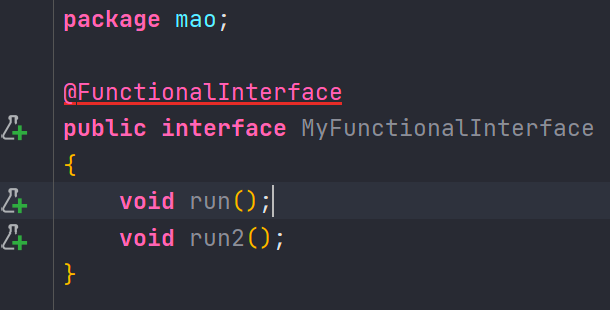


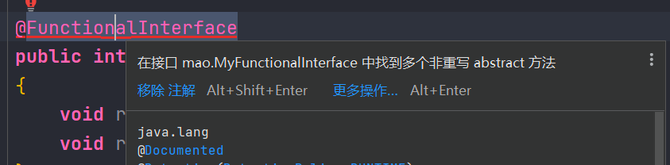


### 对比

Lambda和匿名内部类在使用上的区别：

* 所需的类型不一样
  * 匿名内部类，需要的类型可以是类、抽象类、接口
  * Lambda表达式，需要的类型必须是接口
* 抽象方法的数量不一样
  * 匿名内部类所需的接口中抽象方法的数量随意
  * Lambda表达式所需的接口只能有一个抽象方法
* 实现原理不同
  * 匿名内部类是在编译后会形成class
  * Lambda表达式是在程序运行的时候动态生成class


## 接口默认方法

### 概述

JDK 8以前的接口：

```
interface 接口名 {
    静态常量;
    抽象方法;
}
```


JDK 8对接口的增强，接口还可以有默认方法和静态方法


```
interface 接口名 {
    静态常量;
    抽象方法;
    默认方法;
    静态方法;
}
```


### 背景

在JDK 8以前接口中只能有抽象方法。存在以下问题：

```java
package mao;

public interface MyFunctionalInterface
{
    void run();
}

class Test5 implements MyFunctionalInterface
{

    @Override
    public void run()
    {

    }
}

class Test6 implements MyFunctionalInterface
{

    @Override
    public void run()
    {

    }
}

```


如果给接口新增抽象方法，所有实现类都必须重写这个抽象方法。不利于接口的扩展

```java
package mao;

public interface MyFunctionalInterface
{
    void run();

    void run2();
}

class Test5 implements MyFunctionalInterface
{

    @Override
    public void run()
    {

    }

    @Override
    public void run2()
    {
        
    }
}

class Test6 implements MyFunctionalInterface
{

    @Override
    public void run()
    {

    }
}

```


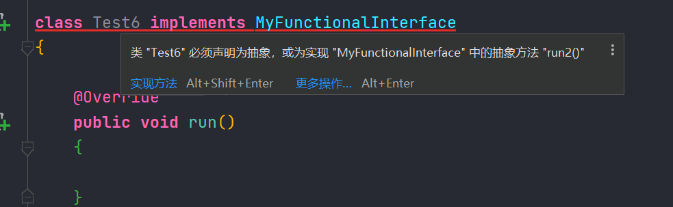


因此，在JDK 8时为接口新增了默认方法


### 定义格式

```
interface 接口名 { 
    修饰符 default 返回值类型 方法名() { 
        代码; 
    } 
} 
```


### 使用

* 方式一：实现类直接调用接口默认方法
* 方式二：实现类重写接口默认方法


#### 方式一

```java
package mao;

/**
 * Project name(项目名称)：JDK8-Lambda
 * Package(包名): mao
 * Interface(接口名): MyFunctionalInterface2
 * Author(作者）: mao
 * Author QQ：1296193245
 * GitHub：https://github.com/maomao124/
 * Date(创建日期)： 2023/10/20
 * Time(创建时间)： 17:22
 * Version(版本): 1.0
 * Description(描述)： 接口默认方法-实现类直接调用接口默认方法
 */

public interface MyFunctionalInterface2
{
    void run();

    default void run2()
    {
        System.out.println("执行MyFunctionalInterface2.run2");
    }

}

class Test7 implements MyFunctionalInterface2
{

    @Override
    public void run()
    {

    }

    public static void main(String[] args)
    {
        Test7 test7=new Test7();
        test7.run2();
    }
}
```


#### 方式二

```java
package mao;

/**
 * Project name(项目名称)：JDK8-Lambda
 * Package(包名): mao
 * Interface(接口名): MyFunctionalInterface3
 * Author(作者）: mao
 * Author QQ：1296193245
 * GitHub：https://github.com/maomao124/
 * Date(创建日期)： 2023/10/20
 * Time(创建时间)： 17:29
 * Version(版本): 1.0
 * Description(描述)： 无
 */

public interface MyFunctionalInterface3
{
    void run();

    default void run2()
    {
        System.out.println("执行MyFunctionalInterface3.run2");
    }
}


class Test8 implements MyFunctionalInterface3
{

    @Override
    public void run()
    {

    }

    @Override
    public void run2()
    {
        System.out.println("执行Test8.run2");
    }

    public static void main(String[] args)
    {
        Test8 test8 = new Test8();
        test8.run2();
    }
}
```


```sh
执行Test8.run2
```


## 接口静态方法

### 定义格式

```
interface 接口名 {
    修饰符 static 返回值类型 方法名() {
        代码;
    }
}
```


### 使用

接口名.静态方法名()

```java
package mao;

/**
 * Project name(项目名称)：JDK8-Lambda
 * Package(包名): mao
 * Interface(接口名): MyFunctionalInterface4
 * Author(作者）: mao
 * Author QQ：1296193245
 * GitHub：https://github.com/maomao124/
 * Date(创建日期)： 2023/10/20
 * Time(创建时间)： 17:52
 * Version(版本): 1.0
 * Description(描述)： 无
 */

public interface MyFunctionalInterface4
{
    static void run3()
    {
        System.out.println("MyFunctionalInterface4静态方法run3");
    }
}

class Test9 implements MyFunctionalInterface4
{
    public static void main(String[] args)
    {
        MyFunctionalInterface4.run3();
    }
}
```


### 默认方法和静态方法的区别

* 默认方法通过实例调用，静态方法通过接口名调用
*  默认方法可以被继承，实现类可以直接使用接口默认方法，也可以重写接口默认方法
* 静态方法不能被继承，实现类不能重写接口静态方法，只能使用接口名调用


## 常用内置函数式接口

### 概述

使用Lambda表达式的前提是需要有函数式接口，而Lambda使用时不关心接口名，抽象方法名，只关心抽 象方法的参数列表和返回值类型。因此为了让我们使用Lambda方便，JDK提供了大量常用的函数式接口


它们主要在 java.util.function包

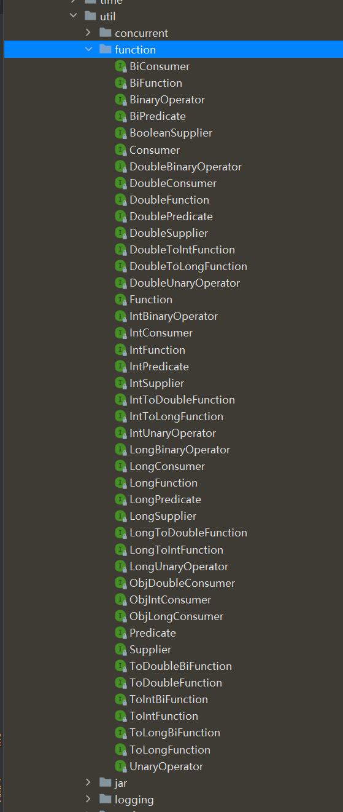


常用接口：

* Supplier接口
* Consumer接口
* Function接口
* Predicate接口


### Supplier接口

对应的Lambda表达式需要“对外提供”一个符合泛型类型的对象数据

供给型接口，通过Supplier接口中的get方法可以得到一个值，无参有返回的接口

```java
/*
 * Copyright (c) 2012, 2013, Oracle and/or its affiliates. All rights reserved.
 * DO NOT ALTER OR REMOVE COPYRIGHT NOTICES OR THIS FILE HEADER.
 *
 * This code is free software; you can redistribute it and/or modify it
 * under the terms of the GNU General Public License version 2 only, as
 * published by the Free Software Foundation.  Oracle designates this
 * particular file as subject to the "Classpath" exception as provided
 * by Oracle in the LICENSE file that accompanied this code.
 *
 * This code is distributed in the hope that it will be useful, but WITHOUT
 * ANY WARRANTY; without even the implied warranty of MERCHANTABILITY or
 * FITNESS FOR A PARTICULAR PURPOSE.  See the GNU General Public License
 * version 2 for more details (a copy is included in the LICENSE file that
 * accompanied this code).
 *
 * You should have received a copy of the GNU General Public License version
 * 2 along with this work; if not, write to the Free Software Foundation,
 * Inc., 51 Franklin St, Fifth Floor, Boston, MA 02110-1301 USA.
 *
 * Please contact Oracle, 500 Oracle Parkway, Redwood Shores, CA 94065 USA
 * or visit www.oracle.com if you need additional information or have any
 * questions.
 */
package java.util.function;

/**
 * Represents a supplier of results.
 *
 * <p>There is no requirement that a new or distinct result be returned each
 * time the supplier is invoked.
 *
 * <p>This is a <a href="package-summary.html">functional interface</a>
 * whose functional method is {@link #get()}.
 *
 * @param <T> the type of results supplied by this supplier
 *
 * @since 1.8
 */
@FunctionalInterface
public interface Supplier<T> {

    /**
     * Gets a result.
     *
     * @return a result
     */
    T get();
}
```


使用Lambda表达式返回数组元素最大值

```java
package mao;

import java.util.Arrays;
import java.util.function.Supplier;

/**
 * Project name(项目名称)：JDK8_FunctionalInterface
 * Package(包名): mao
 * Class(类名): Test1
 * Author(作者）: mao
 * Author QQ：1296193245
 * GitHub：https://github.com/maomao124/
 * Date(创建日期)： 2023/10/20
 * Time(创建时间)： 18:03
 * Version(版本): 1.0
 * Description(描述)： Supplier
 */

public class Test1
{
    public static void main(String[] args)
    {
        printMax(() ->
        {
            int[] arr = {10, 20, 100, 30, 40, 50};
            Arrays.sort(arr);
            return arr[arr.length - 1];
        });
    }

    private static void printMax(Supplier<Integer> supplier)
    {
        int max = supplier.get();
        System.out.println("max = " + max);
    }
}
```


### Consumer接口

消费一个数据，其数据类型由泛型参数决定

```java
/*
 * Copyright (c) 2010, 2013, Oracle and/or its affiliates. All rights reserved.
 * DO NOT ALTER OR REMOVE COPYRIGHT NOTICES OR THIS FILE HEADER.
 *
 * This code is free software; you can redistribute it and/or modify it
 * under the terms of the GNU General Public License version 2 only, as
 * published by the Free Software Foundation.  Oracle designates this
 * particular file as subject to the "Classpath" exception as provided
 * by Oracle in the LICENSE file that accompanied this code.
 *
 * This code is distributed in the hope that it will be useful, but WITHOUT
 * ANY WARRANTY; without even the implied warranty of MERCHANTABILITY or
 * FITNESS FOR A PARTICULAR PURPOSE.  See the GNU General Public License
 * version 2 for more details (a copy is included in the LICENSE file that
 * accompanied this code).
 *
 * You should have received a copy of the GNU General Public License version
 * 2 along with this work; if not, write to the Free Software Foundation,
 * Inc., 51 Franklin St, Fifth Floor, Boston, MA 02110-1301 USA.
 *
 * Please contact Oracle, 500 Oracle Parkway, Redwood Shores, CA 94065 USA
 * or visit www.oracle.com if you need additional information or have any
 * questions.
 */
package java.util.function;

import java.util.Objects;

/**
 * Represents an operation that accepts a single input argument and returns no
 * result. Unlike most other functional interfaces, {@code Consumer} is expected
 * to operate via side-effects.
 *
 * <p>This is a <a href="package-summary.html">functional interface</a>
 * whose functional method is {@link #accept(Object)}.
 *
 * @param <T> the type of the input to the operation
 *
 * @since 1.8
 */
@FunctionalInterface
public interface Consumer<T> {

    /**
     * Performs this operation on the given argument.
     *
     * @param t the input argument
     */
    void accept(T t);

    /**
     * Returns a composed {@code Consumer} that performs, in sequence, this
     * operation followed by the {@code after} operation. If performing either
     * operation throws an exception, it is relayed to the caller of the
     * composed operation.  If performing this operation throws an exception,
     * the {@code after} operation will not be performed.
     *
     * @param after the operation to perform after this operation
     * @return a composed {@code Consumer} that performs in sequence this
     * operation followed by the {@code after} operation
     * @throws NullPointerException if {@code after} is null
     */
    default Consumer<T> andThen(Consumer<? super T> after) {
        Objects.requireNonNull(after);
        return (T t) -> { accept(t); after.accept(t); };
    }
}
```


使用Lambda表达式将一个字符串转成大写和小写的字符串

```java
package mao;

import java.util.Locale;
import java.util.function.Consumer;

/**
 * Project name(项目名称)：JDK8_FunctionalInterface
 * Package(包名): mao
 * Class(类名): Test2
 * Author(作者）: mao
 * Author QQ：1296193245
 * GitHub：https://github.com/maomao124/
 * Date(创建日期)： 2023/10/20
 * Time(创建时间)： 18:29
 * Version(版本): 1.0
 * Description(描述)： 无
 */

public class Test2
{
    public static void main(String[] args)
    {
        test(s -> System.out.println(s.toUpperCase(Locale.ROOT)));
    }

    private static void test(Consumer<String> consumer)
    {
        consumer.accept("hello");
    }
}

```


**andThen**：如果一个方法的参数和返回值全都是 Consumer 类型，那么就可以实现效果：消费一个数据的时候，首先做一个操作，然后再做一个操作，实现组合

```java
package mao;

import java.util.Locale;
import java.util.function.Consumer;

/**
 * Project name(项目名称)：JDK8_FunctionalInterface
 * Package(包名): mao
 * Class(类名): Test3
 * Author(作者）: mao
 * Author QQ：1296193245
 * GitHub：https://github.com/maomao124/
 * Date(创建日期)： 2023/10/20
 * Time(创建时间)： 18:35
 * Version(版本): 1.0
 * Description(描述)： 无
 */

public class Test3
{
    public static void main(String[] args)
    {
        test(s -> System.out.println(s.toUpperCase(Locale.ROOT)),
                s -> System.out.println(s.length()));
    }

    private static void test(Consumer<String> consumer1,Consumer<String> consumer2)
    {
        //consumer1.accept("hello");
        //consumer2.accept("world");
        consumer2.andThen(consumer1).accept("world");
        consumer1.andThen(consumer2).accept("world");
    }
}

```


```sh
5
WORLD
WORLD
5
```


### Function接口

Function接口用来根据一个类型的数据得到另一个类型的数据，前者称为前置条件，后者称为后置条件。有参数有返回值

```java
/*
 * Copyright (c) 2010, 2013, Oracle and/or its affiliates. All rights reserved.
 * DO NOT ALTER OR REMOVE COPYRIGHT NOTICES OR THIS FILE HEADER.
 *
 * This code is free software; you can redistribute it and/or modify it
 * under the terms of the GNU General Public License version 2 only, as
 * published by the Free Software Foundation.  Oracle designates this
 * particular file as subject to the "Classpath" exception as provided
 * by Oracle in the LICENSE file that accompanied this code.
 *
 * This code is distributed in the hope that it will be useful, but WITHOUT
 * ANY WARRANTY; without even the implied warranty of MERCHANTABILITY or
 * FITNESS FOR A PARTICULAR PURPOSE.  See the GNU General Public License
 * version 2 for more details (a copy is included in the LICENSE file that
 * accompanied this code).
 *
 * You should have received a copy of the GNU General Public License version
 * 2 along with this work; if not, write to the Free Software Foundation,
 * Inc., 51 Franklin St, Fifth Floor, Boston, MA 02110-1301 USA.
 *
 * Please contact Oracle, 500 Oracle Parkway, Redwood Shores, CA 94065 USA
 * or visit www.oracle.com if you need additional information or have any
 * questions.
 */
package java.util.function;

import java.util.Objects;

/**
 * Represents a function that accepts one argument and produces a result.
 *
 * <p>This is a <a href="package-summary.html">functional interface</a>
 * whose functional method is {@link #apply(Object)}.
 *
 * @param <T> the type of the input to the function
 * @param <R> the type of the result of the function
 *
 * @since 1.8
 */
@FunctionalInterface
public interface Function<T, R> {

    /**
     * Applies this function to the given argument.
     *
     * @param t the function argument
     * @return the function result
     */
    R apply(T t);

    /**
     * Returns a composed function that first applies the {@code before}
     * function to its input, and then applies this function to the result.
     * If evaluation of either function throws an exception, it is relayed to
     * the caller of the composed function.
     *
     * @param <V> the type of input to the {@code before} function, and to the
     *           composed function
     * @param before the function to apply before this function is applied
     * @return a composed function that first applies the {@code before}
     * function and then applies this function
     * @throws NullPointerException if before is null
     *
     * @see #andThen(Function)
     */
    default <V> Function<V, R> compose(Function<? super V, ? extends T> before) {
        Objects.requireNonNull(before);
        return (V v) -> apply(before.apply(v));
    }

    /**
     * Returns a composed function that first applies this function to
     * its input, and then applies the {@code after} function to the result.
     * If evaluation of either function throws an exception, it is relayed to
     * the caller of the composed function.
     *
     * @param <V> the type of output of the {@code after} function, and of the
     *           composed function
     * @param after the function to apply after this function is applied
     * @return a composed function that first applies this function and then
     * applies the {@code after} function
     * @throws NullPointerException if after is null
     *
     * @see #compose(Function)
     */
    default <V> Function<T, V> andThen(Function<? super R, ? extends V> after) {
        Objects.requireNonNull(after);
        return (T t) -> after.apply(apply(t));
    }

    /**
     * Returns a function that always returns its input argument.
     *
     * @param <T> the type of the input and output objects to the function
     * @return a function that always returns its input argument
     */
    static <T> Function<T, T> identity() {
        return t -> t;
    }
}
```


使用Lambda表达式将字符串转成数字

```java
package mao;

import java.util.function.Function;

/**
 * Project name(项目名称)：JDK8_FunctionalInterface
 * Package(包名): mao
 * Class(类名): Test4
 * Author(作者）: mao
 * Author QQ：1296193245
 * GitHub：https://github.com/maomao124/
 * Date(创建日期)： 2023/10/20
 * Time(创建时间)： 18:42
 * Version(版本): 1.0
 * Description(描述)： 无
 */

public class Test4
{
    public static void main(String[] args)
    {
        test(s -> Integer.parseInt(s));
    }

    private static void test(Function<String, Integer> function)
    {
        Integer integer = function.apply("112");
        System.out.println(integer);
    }
}
```


### Predicate接口

有时候我们需要对某种类型的数据进行判断，从而得到一个boolean值结果。这时可以使用Predicate接口

```java
/*
 * Copyright (c) 2010, 2013, Oracle and/or its affiliates. All rights reserved.
 * DO NOT ALTER OR REMOVE COPYRIGHT NOTICES OR THIS FILE HEADER.
 *
 * This code is free software; you can redistribute it and/or modify it
 * under the terms of the GNU General Public License version 2 only, as
 * published by the Free Software Foundation.  Oracle designates this
 * particular file as subject to the "Classpath" exception as provided
 * by Oracle in the LICENSE file that accompanied this code.
 *
 * This code is distributed in the hope that it will be useful, but WITHOUT
 * ANY WARRANTY; without even the implied warranty of MERCHANTABILITY or
 * FITNESS FOR A PARTICULAR PURPOSE.  See the GNU General Public License
 * version 2 for more details (a copy is included in the LICENSE file that
 * accompanied this code).
 *
 * You should have received a copy of the GNU General Public License version
 * 2 along with this work; if not, write to the Free Software Foundation,
 * Inc., 51 Franklin St, Fifth Floor, Boston, MA 02110-1301 USA.
 *
 * Please contact Oracle, 500 Oracle Parkway, Redwood Shores, CA 94065 USA
 * or visit www.oracle.com if you need additional information or have any
 * questions.
 */
package java.util.function;

import java.util.Objects;

/**
 * Represents a predicate (boolean-valued function) of one argument.
 *
 * <p>This is a <a href="package-summary.html">functional interface</a>
 * whose functional method is {@link #test(Object)}.
 *
 * @param <T> the type of the input to the predicate
 *
 * @since 1.8
 */
@FunctionalInterface
public interface Predicate<T> {

    /**
     * Evaluates this predicate on the given argument.
     *
     * @param t the input argument
     * @return {@code true} if the input argument matches the predicate,
     * otherwise {@code false}
     */
    boolean test(T t);

    /**
     * Returns a composed predicate that represents a short-circuiting logical
     * AND of this predicate and another.  When evaluating the composed
     * predicate, if this predicate is {@code false}, then the {@code other}
     * predicate is not evaluated.
     *
     * <p>Any exceptions thrown during evaluation of either predicate are relayed
     * to the caller; if evaluation of this predicate throws an exception, the
     * {@code other} predicate will not be evaluated.
     *
     * @param other a predicate that will be logically-ANDed with this
     *              predicate
     * @return a composed predicate that represents the short-circuiting logical
     * AND of this predicate and the {@code other} predicate
     * @throws NullPointerException if other is null
     */
    default Predicate<T> and(Predicate<? super T> other) {
        Objects.requireNonNull(other);
        return (t) -> test(t) && other.test(t);
    }

    /**
     * Returns a predicate that represents the logical negation of this
     * predicate.
     *
     * @return a predicate that represents the logical negation of this
     * predicate
     */
    default Predicate<T> negate() {
        return (t) -> !test(t);
    }

    /**
     * Returns a composed predicate that represents a short-circuiting logical
     * OR of this predicate and another.  When evaluating the composed
     * predicate, if this predicate is {@code true}, then the {@code other}
     * predicate is not evaluated.
     *
     * <p>Any exceptions thrown during evaluation of either predicate are relayed
     * to the caller; if evaluation of this predicate throws an exception, the
     * {@code other} predicate will not be evaluated.
     *
     * @param other a predicate that will be logically-ORed with this
     *              predicate
     * @return a composed predicate that represents the short-circuiting logical
     * OR of this predicate and the {@code other} predicate
     * @throws NullPointerException if other is null
     */
    default Predicate<T> or(Predicate<? super T> other) {
        Objects.requireNonNull(other);
        return (t) -> test(t) || other.test(t);
    }

    /**
     * Returns a predicate that tests if two arguments are equal according
     * to {@link Objects#equals(Object, Object)}.
     *
     * @param <T> the type of arguments to the predicate
     * @param targetRef the object reference with which to compare for equality,
     *               which may be {@code null}
     * @return a predicate that tests if two arguments are equal according
     * to {@link Objects#equals(Object, Object)}
     */
    static <T> Predicate<T> isEqual(Object targetRef) {
        return (null == targetRef)
                ? Objects::isNull
                : object -> targetRef.equals(object);
    }
}
```


```java
package mao;

import java.util.function.Predicate;

/**
 * Project name(项目名称)：JDK8_FunctionalInterface
 * Package(包名): mao
 * Class(类名): Test5
 * Author(作者）: mao
 * Author QQ：1296193245
 * GitHub：https://github.com/maomao124/
 * Date(创建日期)： 2023/10/20
 * Time(创建时间)： 18:54
 * Version(版本): 1.0
 * Description(描述)： 无
 */

public class Test5
{
    public static void main(String[] args)
    {
        test(s -> s.equals("hello"));
        test(s -> s.contains("c"));
    }

    private static void test(Predicate<String> predicate)
    {
        boolean b = predicate.test("hello");
        System.out.println(b);
    }
}
```


默认方法and、or、negate：既然是条件判断，就会存在与、或、非三种常见的逻辑关系。其中将两个Predicate条件使用“与”逻辑连接起来实现“并且”的效果时，可以使用default方法and，or、negate同理。


## 方法引用

### 传统写法

```java
package mao;

import java.util.ArrayList;
import java.util.List;
import java.util.function.Consumer;

/**
 * Project name(项目名称)：JDK8_method_reference
 * Package(包名): mao
 * Class(类名): Test1
 * Author(作者）: mao
 * Author QQ：1296193245
 * GitHub：https://github.com/maomao124/
 * Date(创建日期)： 2023/10/23
 * Time(创建时间)： 15:30
 * Version(版本): 1.0
 * Description(描述)： 无
 */

public class Test1
{
    public static void main(String[] args)
    {
        List<Student> studentList = new ArrayList<>(4);
        studentList.add(new Student()
                .setId(1L)
                .setName("测试1")
                .setAge(13));
        studentList.add(new Student()
                .setId(2L)
                .setName("测试2")
                .setAge(12));
        studentList.add(new Student()
                .setId(3L)
                .setName("测试3")
                .setAge(19));
        studentList.add(new Student()
                .setId(4L)
                .setName("测试4")
                .setAge(8));
        studentList.sort((o1, o2) -> o1.getAge() - o2.getAge());
        System.out.println(studentList);
    }

}
```


### 方法引用

```java
package mao;

import java.util.ArrayList;
import java.util.Comparator;
import java.util.List;

/**
 * Project name(项目名称)：JDK8_method_reference
 * Package(包名): mao
 * Class(类名): Test2
 * Author(作者）: mao
 * Author QQ：1296193245
 * GitHub：https://github.com/maomao124/
 * Date(创建日期)： 2023/10/23
 * Time(创建时间)： 15:40
 * Version(版本): 1.0
 * Description(描述)： 无
 */

public class Test2
{
    public static void main(String[] args)
    {
        List<Student> studentList = new ArrayList<>(4);
        studentList.add(new Student()
                .setId(1L)
                .setName("测试1")
                .setAge(13));
        studentList.add(new Student()
                .setId(2L)
                .setName("测试2")
                .setAge(12));
        studentList.add(new Student()
                .setId(3L)
                .setName("测试3")
                .setAge(19));
        studentList.add(new Student()
                .setId(4L)
                .setName("测试4")
                .setAge(8));
        studentList.sort(Comparator.comparingInt(Student::getAge));
        System.out.println(studentList);
    }
}
```


也可以更改成：

```java
package mao;

import java.util.ArrayList;
import java.util.Comparator;
import java.util.List;

/**
 * Project name(项目名称)：JDK8_method_reference
 * Package(包名): mao
 * Class(类名): Test3
 * Author(作者）: mao
 * Author QQ：1296193245
 * GitHub：https://github.com/maomao124/
 * Date(创建日期)： 2023/10/23
 * Time(创建时间)： 15:41
 * Version(版本): 1.0
 * Description(描述)： 无
 */

public class Test3
{
    public static void main(String[] args)
    {
        List<Student> studentList = new ArrayList<>(4);
        studentList.add(new Student()
                .setId(1L)
                .setName("测试1")
                .setAge(13));
        studentList.add(new Student()
                .setId(2L)
                .setName("测试2")
                .setAge(12));
        studentList.add(new Student()
                .setId(3L)
                .setName("测试3")
                .setAge(19));
        studentList.add(new Student()
                .setId(4L)
                .setName("测试4")
                .setAge(8));
        studentList.sort(Test3::compare);
        System.out.println(studentList);
    }

    private static int compare(Student o1, Student o2)
    {
        return o1.getAge() - o2.getAge();
    }
}
```


双冒号::写法，这被称为**方法引用**


### 格式

* 符号表示 : **::**
* 符号说明 : 双冒号为方法引用运算符，而它所在的表达式被称为方法引用
* 应用场景 : 如果Lambda所要实现的方案 , 已经有其他方法存在相同方案，那么则可以使用方法引用


### 引用方式

有以下几种形式：

* **instanceName::methodName**  ：对象::方法名
* **ClassName::staticMethodName**  ：类名::静态方法
* **ClassName::methodName**  ： 类名::普通方法
* **ClassName::new**  ： 类名::new 调用的构造器
* **TypeName[]::new**  ： String[]::new 调用数组的构造器


### 对象名::方法名

```java
package mao;

import java.util.Date;
import java.util.function.Supplier;

/**
 * Project name(项目名称)：JDK8_method_reference
 * Package(包名): mao
 * Class(类名): Test4
 * Author(作者）: mao
 * Author QQ：1296193245
 * GitHub：https://github.com/maomao124/
 * Date(创建日期)： 2023/10/23
 * Time(创建时间)： 15:48
 * Version(版本): 1.0
 * Description(描述)： 无
 */

public class Test4
{
    public static void main(String[] args)
    {
        Date now = new Date();
        Supplier<Long> supplier = now::getTime;
        System.out.println(supplier.get());
    }
}
```


* 被引用的方法，参数要和接口中抽象方法的参数一样
* 当接口抽象方法有返回值时，被引用的方法也必须有返回值


### 类名::静态方法

```java
package mao;

import java.util.Date;
import java.util.function.Supplier;

/**
 * Project name(项目名称)：JDK8_method_reference
 * Package(包名): mao
 * Class(类名): Test5
 * Author(作者）: mao
 * Author QQ：1296193245
 * GitHub：https://github.com/maomao124/
 * Date(创建日期)： 2023/10/23
 * Time(创建时间)： 15:53
 * Version(版本): 1.0
 * Description(描述)： 无
 */

public class Test5
{
    public static void main(String[] args)
    {
        Supplier<Long> supplier = System::currentTimeMillis;
        System.out.println(supplier.get());
    }
}
```


### 类名::普通方法

类名只能调用静态方法，类名引用实例方法是有前提的，实际上是拿第一个参数作为方法的调用者

```java
package mao;

import java.util.function.BiFunction;
import java.util.function.Function;

/**
 * Project name(项目名称)：JDK8_method_reference
 * Package(包名): mao
 * Class(类名): Test6
 * Author(作者）: mao
 * Author QQ：1296193245
 * GitHub：https://github.com/maomao124/
 * Date(创建日期)： 2023/10/23
 * Time(创建时间)： 15:56
 * Version(版本): 1.0
 * Description(描述)： 无
 */

public class Test6
{
    public static void main(String[] args)
    {
        Function<String, Integer> f1 = (s) ->
        {
            return s.length();
        };
        System.out.println(f1.apply("abc"));
        Function<String, Integer> f2 = String::length;
        System.out.println(f2.apply("abc"));
        BiFunction<String, Integer, String> bif = String::substring;
        String hello = bif.apply("hello", 2);
        System.out.println("hello = " + hello);
    }
}
```


### 类名::new引用构造器

```java
package mao;

import java.util.function.Supplier;

/**
 * Project name(项目名称)：JDK8_method_reference
 * Package(包名): mao
 * Class(类名): Test7
 * Author(作者）: mao
 * Author QQ：1296193245
 * GitHub：https://github.com/maomao124/
 * Date(创建日期)： 2023/10/23
 * Time(创建时间)： 15:59
 * Version(版本): 1.0
 * Description(描述)： 无
 */

public class Test7
{
    public static void main(String[] args)
    {
        Supplier<Test7> supplier = Test7::new;
        supplier.get().hello();
    }

    public void hello()
    {
        System.out.println("hello!");
    }
}
```


### 数组::new引用数组构造器

```java
package mao;

import java.util.Arrays;
import java.util.function.Function;

/**
 * Project name(项目名称)：JDK8_method_reference
 * Package(包名): mao
 * Class(类名): Test8
 * Author(作者）: mao
 * Author QQ：1296193245
 * GitHub：https://github.com/maomao124/
 * Date(创建日期)： 2023/10/23
 * Time(创建时间)： 16:03
 * Version(版本): 1.0
 * Description(描述)： 无
 */

public class Test8
{
    public static void main(String[] args)
    {
        Function<Integer, String[]> fun = (len) ->
        {
            return new String[len];
        };
        String[] arr1 = fun.apply(10);
        System.out.println(Arrays.toString(arr1) + ", " + arr1.length);
        Function<Integer, String[]> fun2 = String[]::new;
        String[] arr2 = fun.apply(5);
        System.out.println(Arrays.toString(arr2) + ", " + arr2.length);
    }
}
```


## Stream流

### 概述

Stream流式思想类似于工厂车间的“**生产流水线**”，Stream流不是一种数据结构，不保存数据，而是对数据进行加工处理。Stream可以看作是流水线上的一个工序。在流水线上，通过多个工序让一个原材料加工成一个商品

Stream API能让我们快速完成许多复杂的操作，如筛选、切片、映射、查找、去除重复，统计，匹配和归约


### 集合处理数据的弊端

当我们需要对集合中的元素进行操作的时候，除了必需的添加、删除、获取外，最典型的就是集合遍历。我们来体验集合操作数据的弊端


需求如下：

* 一个 ArrayList集合中存储有以下数据:张无忌,周芷若,赵敏,张强,张三丰
* 拿到所有姓张的
* 拿到名字长度为3个字的
* 打印这些数据


```java
package mao;

import java.util.ArrayList;
import java.util.Collections;

/**
 * Project name(项目名称)：JDK8_Stream
 * Package(包名): mao
 * Class(类名): Test1
 * Author(作者）: mao
 * Author QQ：1296193245
 * GitHub：https://github.com/maomao124/
 * Date(创建日期)： 2023/10/23
 * Time(创建时间)： 18:31
 * Version(版本): 1.0
 * Description(描述)： 无
 */

public class Test1
{
    public static void main(String[] args)
    {
        ArrayList<String> list = new ArrayList<>();
        Collections.addAll(list, "张无忌", "周芷若", "赵敏", "张强", "张三丰");
        //拿到所有姓张的
        ArrayList<String> zhangList = new ArrayList<>();
        for (String name : list)
        {
            if (name.startsWith("张"))
            {
                zhangList.add(name);
            }
        }

        //拿到名字长度为3个字的
        ArrayList<String> threeList = new ArrayList<>();
        for (String name : zhangList)
        {
            if (name.length() == 3)
            {
                threeList.add(name);
            }
        }
        //打印这些数据
        for (String name : threeList)
        {
            System.out.println(name);
        }
    }
}

```


### Stream写法

```java
package mao;

import java.util.ArrayList;
import java.util.Collections;

/**
 * Project name(项目名称)：JDK8_Stream
 * Package(包名): mao
 * Class(类名): Test2
 * Author(作者）: mao
 * Author QQ：1296193245
 * GitHub：https://github.com/maomao124/
 * Date(创建日期)： 2023/10/25
 * Time(创建时间)： 15:24
 * Version(版本): 1.0
 * Description(描述)： 无
 */

public class Test2
{
    public static void main(String[] args)
    {
        ArrayList<String> list = new ArrayList<>();
        Collections.addAll(list, "张无忌", "周芷若", "赵敏", "张强", "张三丰");
        list.stream()
                .filter(s -> s.startsWith("张"))
                .filter(s -> s.length() == 3)
                .forEach(System.out::println);
    }
}
```


### 获取Stream流

两种方式：

* **方式1** : 根据Collection获取流
* **方式2** : Stream中的静态方法of获取流


#### 方式1

java.util.Collection 接口中加入了default方法stream 用来获取流，所以其所有实现类均可获取流

Map接口不是Collection的子接口，所以获取对应的流需要分key、value或entry等情况

```java
public interface Collection<E> extends Iterable<E> {
    /**
     * Returns a sequential {@code Stream} with this collection as its source.
     *
     * <p>This method should be overridden when the {@link #spliterator()}
     * method cannot return a spliterator that is {@code IMMUTABLE},
     * {@code CONCURRENT}, or <em>late-binding</em>. (See {@link #spliterator()}
     * for details.)
     *
     * @implSpec
     * The default implementation creates a sequential {@code Stream} from the
     * collection's {@code Spliterator}.
     *
     * @return a sequential {@code Stream} over the elements in this collection
     * @since 1.8
     */
    default Stream<E> stream() {
        return StreamSupport.stream(spliterator(), false);
    }
}
```


```java
package mao;

import java.util.*;
import java.util.stream.Stream;

/**
 * Project name(项目名称)：JDK8_Stream
 * Package(包名): mao
 * Class(类名): Test3
 * Author(作者）: mao
 * Author QQ：1296193245
 * GitHub：https://github.com/maomao124/
 * Date(创建日期)： 2023/10/25
 * Time(创建时间)： 15:34
 * Version(版本): 1.0
 * Description(描述)： 无
 */

public class Test3
{
    public static void main(String[] args)
    {
        List<String> list = new ArrayList<>();
        Stream<String> stream = list.stream();
        List<Long> longList = new LinkedList<>();
        Stream<Long> longStream = longList.stream();
        Set<String> stringSet = new HashSet<>();
        Stream<String> stringStream = stringSet.stream();
        //Map接口不是Collection的子接口，所以获取对应的流需要分key、value或entry等情况
        Map<String, Long> map = new HashMap<>();
        Stream<String> stream1 = map.keySet().stream();
        Stream<Long> stream2 = map.values().stream();
        Stream<Map.Entry<String, Long>> stream3 = map.entrySet().stream();
    }
}
```


#### 方式2

由于数组对象不可能添加默认方法，所以Stream接口中提供了静态方法of

```java
public interface Stream<T> extends BaseStream<T, Stream<T>> {
    /**
     * Returns a sequential {@code Stream} containing a single element.
     *
     * @param t the single element
     * @param <T> the type of stream elements
     * @return a singleton sequential stream
     */
    public static<T> Stream<T> of(T t) {
        return StreamSupport.stream(new Streams.StreamBuilderImpl<>(t), false);
    }

    /**
     * Returns a sequential ordered stream whose elements are the specified values.
     *
     * @param <T> the type of stream elements
     * @param values the elements of the new stream
     * @return the new stream
     */
    @SafeVarargs
    @SuppressWarnings("varargs") // Creating a stream from an array is safe
    public static<T> Stream<T> of(T... values) {
        return Arrays.stream(values);
    }
}
```


```java
package mao;

import java.util.stream.Stream;

/**
 * Project name(项目名称)：JDK8_Stream
 * Package(包名): mao
 * Class(类名): Test4
 * Author(作者）: mao
 * Author QQ：1296193245
 * GitHub：https://github.com/maomao124/
 * Date(创建日期)： 2023/10/25
 * Time(创建时间)： 15:40
 * Version(版本): 1.0
 * Description(描述)： 无
 */

public class Test4
{
    public static void main(String[] args)
    {
        Stream<String> stringStream = Stream.of("1", "2", "3");
    }
}
```


### Stream常用方法

* count：统计个数
* forEach：逐一处理
* filter：过滤
* limit：取用前几个
* skip：跳过前几个
* map：映射
* concat：组合


### forEach方法

forEach 用来遍历流中的数据

```java

    /**
     * Performs an action for each element of this stream.
     *
     * <p>This is a <a href="package-summary.html#StreamOps">terminal
     * operation</a>.
     *
     * <p>The behavior of this operation is explicitly nondeterministic.
     * For parallel stream pipelines, this operation does <em>not</em>
     * guarantee to respect the encounter order of the stream, as doing so
     * would sacrifice the benefit of parallelism.  For any given element, the
     * action may be performed at whatever time and in whatever thread the
     * library chooses.  If the action accesses shared state, it is
     * responsible for providing the required synchronization.
     *
     * @param action a <a href="package-summary.html#NonInterference">
     *               non-interfering</a> action to perform on the elements
     */
    void forEach(Consumer<? super T> action);
```


该方法接收一个Consumer接口函数，会将每一个流元素交给该函数进行处理


```java
package mao;

import java.util.ArrayList;
import java.util.List;
import java.util.function.Consumer;

/**
 * Project name(项目名称)：JDK8_Stream
 * Package(包名): mao
 * Class(类名): Test5
 * Author(作者）: mao
 * Author QQ：1296193245
 * GitHub：https://github.com/maomao124/
 * Date(创建日期)： 2023/10/25
 * Time(创建时间)： 15:49
 * Version(版本): 1.0
 * Description(描述)： 无
 */

public class Test5
{
    public static void main(String[] args)
    {
        List<String> list=new ArrayList<>(5);
        list.add("1");
        list.add("2");
        list.add("3");
        list.add("4");
        list.add("5");
        list.stream().forEach(System.out::println);
        //list.forEach(System.out::println);

        list.stream().forEach(new Consumer<String>()
        {
            @Override
            public void accept(String s)
            {
                System.out.println(s);
            }
        });
    }
}

```


### count方法

统计其中的元素个数

```java
    /**
     * Returns the count of elements in this stream.  This is a special case of
     * a <a href="package-summary.html#Reduction">reduction</a> and is
     * equivalent to:
     * <pre>{@code
     *     return mapToLong(e -> 1L).sum();
     * }</pre>
     *
     * <p>This is a <a href="package-summary.html#StreamOps">terminal operation</a>.
     *
     * @return the count of elements in this stream
     */
    long count();
```


该方法返回一个long值代表元素个数

```java
package mao;

import java.util.ArrayList;
import java.util.List;
import java.util.stream.Stream;

/**
 * Project name(项目名称)：JDK8_Stream
 * Package(包名): mao
 * Class(类名): Test6
 * Author(作者）: mao
 * Author QQ：1296193245
 * GitHub：https://github.com/maomao124/
 * Date(创建日期)： 2023/10/25
 * Time(创建时间)： 15:55
 * Version(版本): 1.0
 * Description(描述)： 无
 */

public class Test6
{
    public static void main(String[] args)
    {
        List<String> list = new ArrayList<>(5);
        list.add("1");
        list.add("2");
        list.add("3");
        list.add("4");
        list.add("5");
        System.out.println(list.stream().count());
        System.out.println(list.size());
        list.add("6");
        System.out.println(list.stream().count());
        System.out.println(list.size());
        Stream<String> stream = list.stream();
        list.add("7");
        System.out.println(stream.count());
    }
}
```


```sh
5
5
6
6
7
```


### filter方法

filter用于过滤数据，返回符合过滤条件的数据，可以通过filter方法将一个流转换成另一个子集流

```java

    /**
     * Returns a stream consisting of the elements of this stream that match
     * the given predicate.
     *
     * <p>This is an <a href="package-summary.html#StreamOps">intermediate
     * operation</a>.
     *
     * @param predicate a <a href="package-summary.html#NonInterference">non-interfering</a>,
     *                  <a href="package-summary.html#Statelessness">stateless</a>
     *                  predicate to apply to each element to determine if it
     *                  should be included
     * @return the new stream
     */
    Stream<T> filter(Predicate<? super T> predicate);
```


```java
package mao;

import java.util.ArrayList;
import java.util.List;
import java.util.function.Predicate;
import java.util.stream.Stream;

/**
 * Project name(项目名称)：JDK8_Stream
 * Package(包名): mao
 * Class(类名): Test7
 * Author(作者）: mao
 * Author QQ：1296193245
 * GitHub：https://github.com/maomao124/
 * Date(创建日期)： 2023/10/25
 * Time(创建时间)： 16:01
 * Version(版本): 1.0
 * Description(描述)： 无
 */

public class Test7
{
    public static void main(String[] args)
    {
        List<String> list = new ArrayList<>(5);
        list.add("1");
        list.add("2");
        list.add("3");
        list.add("4");
        list.add("5");
        //只要2和5
        Stream<String> stream = list.stream().filter(new Predicate<String>()
        {
            @Override
            public boolean test(String s)
            {
                if (s.equals("2") || s.equals("5"))
                {
                    return true;
                }
                return false;
            }
        });
        stream.forEach(System.out::println);
    }
}
```


```sh
2
5
```


```java
package mao;

import java.util.ArrayList;
import java.util.List;
import java.util.stream.Collectors;

/**
 * Project name(项目名称)：JDK8_Stream
 * Package(包名): mao
 * Class(类名): Test8
 * Author(作者）: mao
 * Author QQ：1296193245
 * GitHub：https://github.com/maomao124/
 * Date(创建日期)： 2023/10/25
 * Time(创建时间)： 16:04
 * Version(版本): 1.0
 * Description(描述)： 无
 */

public class Test8
{
    public static void main(String[] args)
    {
        List<String> list = new ArrayList<>();
        List<String> collect = list.stream().filter(s -> s.length() >= 3)
                .filter(s -> s.length() <= 10)
                .filter(s -> s.endsWith("]"))
                .filter(s -> s.startsWith("["))
                .collect(Collectors.toList());
    }
}
```


### limit方法

limit 方法可以对流进行截取，只取用前n个

```java
/**
 * Returns a stream consisting of the elements of this stream, truncated
 * to be no longer than {@code maxSize} in length.
 *
 * <p>This is a <a href="package-summary.html#StreamOps">short-circuiting
 * stateful intermediate operation</a>.
 *
 * @apiNote
 * While {@code limit()} is generally a cheap operation on sequential
 * stream pipelines, it can be quite expensive on ordered parallel pipelines,
 * especially for large values of {@code maxSize}, since {@code limit(n)}
 * is constrained to return not just any <em>n</em> elements, but the
 * <em>first n</em> elements in the encounter order.  Using an unordered
 * stream source (such as {@link #generate(Supplier)}) or removing the
 * ordering constraint with {@link #unordered()} may result in significant
 * speedups of {@code limit()} in parallel pipelines, if the semantics of
 * your situation permit.  If consistency with encounter order is required,
 * and you are experiencing poor performance or memory utilization with
 * {@code limit()} in parallel pipelines, switching to sequential execution
 * with {@link #sequential()} may improve performance.
 *
 * @param maxSize the number of elements the stream should be limited to
 * @return the new stream
 * @throws IllegalArgumentException if {@code maxSize} is negative
 */
Stream<T> limit(long maxSize);
```


```java
package mao;

import java.util.ArrayList;
import java.util.List;
import java.util.stream.Collectors;

/**
 * Project name(项目名称)：JDK8_Stream
 * Package(包名): mao
 * Class(类名): Test9
 * Author(作者）: mao
 * Author QQ：1296193245
 * GitHub：https://github.com/maomao124/
 * Date(创建日期)： 2023/10/25
 * Time(创建时间)： 16:09
 * Version(版本): 1.0
 * Description(描述)： 无
 */

public class Test9
{
    public static void main(String[] args)
    {
        List<Integer> list = new ArrayList<>(100);
        for (int i = 0; i < 100; i++)
        {
            list.add(i);
        }
        System.out.println(list.stream().limit(5).collect(Collectors.toList()));
        System.out.println(list.stream().limit(10).collect(Collectors.toList()));
        System.out.println(list.stream().limit(20).collect(Collectors.toList()));
        System.out.println(list.stream().limit(1).collect(Collectors.toList()));
        System.out.println(list.stream().limit(0).collect(Collectors.toList()));
        System.out.println(list.stream().limit(300).collect(Collectors.toList()));
    }
}
```


```sh
[0, 1, 2, 3, 4]
[0, 1, 2, 3, 4, 5, 6, 7, 8, 9]
[0, 1, 2, 3, 4, 5, 6, 7, 8, 9, 10, 11, 12, 13, 14, 15, 16, 17, 18, 19]
[0]
[]
[0, 1, 2, 3, 4, 5, 6, 7, 8, 9, 10, 11, 12, 13, 14, 15, 16, 17, 18, 19, 20, 21, 22, 23, 24, 25, 26, 27, 28, 29, 30, 31, 32, 33, 34, 35, 36, 37, 38, 39, 40, 41, 42, 43, 44, 45, 46, 47, 48, 49, 50, 51, 52, 53, 54, 55, 56, 57, 58, 59, 60, 61, 62, 63, 64, 65, 66, 67, 68, 69, 70, 71, 72, 73, 74, 75, 76, 77, 78, 79, 80, 81, 82, 83, 84, 85, 86, 87, 88, 89, 90, 91, 92, 93, 94, 95, 96, 97, 98, 99]
```


### skip方法

如果希望跳过前几个元素，可以使用此方法获取一个截取之后的新流

```java
    /**
     * Returns a stream consisting of the remaining elements of this stream
     * after discarding the first {@code n} elements of the stream.
     * If this stream contains fewer than {@code n} elements then an
     * empty stream will be returned.
     *
     * <p>This is a <a href="package-summary.html#StreamOps">stateful
     * intermediate operation</a>.
     *
     * @apiNote
     * While {@code skip()} is generally a cheap operation on sequential
     * stream pipelines, it can be quite expensive on ordered parallel pipelines,
     * especially for large values of {@code n}, since {@code skip(n)}
     * is constrained to skip not just any <em>n</em> elements, but the
     * <em>first n</em> elements in the encounter order.  Using an unordered
     * stream source (such as {@link #generate(Supplier)}) or removing the
     * ordering constraint with {@link #unordered()} may result in significant
     * speedups of {@code skip()} in parallel pipelines, if the semantics of
     * your situation permit.  If consistency with encounter order is required,
     * and you are experiencing poor performance or memory utilization with
     * {@code skip()} in parallel pipelines, switching to sequential execution
     * with {@link #sequential()} may improve performance.
     *
     * @param n the number of leading elements to skip
     * @return the new stream
     * @throws IllegalArgumentException if {@code n} is negative
     */
    Stream<T> skip(long n);
```


```java
package mao;

import java.util.ArrayList;
import java.util.List;
import java.util.stream.Collectors;

/**
 * Project name(项目名称)：JDK8_Stream
 * Package(包名): mao
 * Class(类名): Test10
 * Author(作者）: mao
 * Author QQ：1296193245
 * GitHub：https://github.com/maomao124/
 * Date(创建日期)： 2023/10/25
 * Time(创建时间)： 16:13
 * Version(版本): 1.0
 * Description(描述)： 无
 */

public class Test10
{
    public static void main(String[] args)
    {
        List<Integer> list = new ArrayList<>(100);
        for (int i = 0; i < 100; i++)
        {
            list.add(i);
        }
        System.out.println(list.stream().skip(80).collect(Collectors.toList()));
        System.out.println(list.stream().skip(95).collect(Collectors.toList()));
        System.out.println(list.stream().skip(100).collect(Collectors.toList()));
        System.out.println(list.stream().skip(99).collect(Collectors.toList()));
        System.out.println(list.stream().skip(101).collect(Collectors.toList()));
        System.out.println(list.stream().skip(0).collect(Collectors.toList()));
    }
}
```


```sh
[80, 81, 82, 83, 84, 85, 86, 87, 88, 89, 90, 91, 92, 93, 94, 95, 96, 97, 98, 99]
[95, 96, 97, 98, 99]
[]
[99]
[]
[0, 1, 2, 3, 4, 5, 6, 7, 8, 9, 10, 11, 12, 13, 14, 15, 16, 17, 18, 19, 20, 21, 22, 23, 24, 25, 26, 27, 28, 29, 30, 31, 32, 33, 34, 35, 36, 37, 38, 39, 40, 41, 42, 43, 44, 45, 46, 47, 48, 49, 50, 51, 52, 53, 54, 55, 56, 57, 58, 59, 60, 61, 62, 63, 64, 65, 66, 67, 68, 69, 70, 71, 72, 73, 74, 75, 76, 77, 78, 79, 80, 81, 82, 83, 84, 85, 86, 87, 88, 89, 90, 91, 92, 93, 94, 95, 96, 97, 98, 99]
```


### map方法

如果需要将流中的元素映射到另一个流中，可以使用 map 方法

```java
/**
     * Returns a stream consisting of the results of applying the given
     * function to the elements of this stream.
     *
     * <p>This is an <a href="package-summary.html#StreamOps">intermediate
     * operation</a>.
     *
     * @param <R> The element type of the new stream
     * @param mapper a <a href="package-summary.html#NonInterference">non-interfering</a>,
     *               <a href="package-summary.html#Statelessness">stateless</a>
     *               function to apply to each element
     * @return the new stream
     */
    <R> Stream<R> map(Function<? super T, ? extends R> mapper);
```


可以将当前流中的T类型数据转换为另一种R类型的流


```java
package mao;

import java.util.ArrayList;
import java.util.List;
import java.util.Map;
import java.util.function.Consumer;
import java.util.function.Function;
import java.util.stream.Collectors;

/**
 * Project name(项目名称)：JDK8_Stream
 * Package(包名): mao
 * Class(类名): Test11
 * Author(作者）: mao
 * Author QQ：1296193245
 * GitHub：https://github.com/maomao124/
 * Date(创建日期)： 2023/10/26
 * Time(创建时间)： 10:33
 * Version(版本): 1.0
 * Description(描述)： 无
 */

public class Test11
{
    public static void main(String[] args)
    {
        List<String> list = new ArrayList<>();
        list.add("3");
        list.add("2");
        list.add("9");
        List<Long> longList = list.stream().map(new Function<String, Long>()
        {
            @Override
            public Long apply(String s)
            {
                return Long.parseLong(s);
            }
        }).collect(Collectors.toList());
        System.out.println(longList);
        list.stream().map(Long::parseLong).forEach(System.out::println);
    }
}
```


```sh
[3, 2, 9]
3
2
9
```


### sorted方法

如果需要将数据排序，可以使用sorted方法

```java
    /**
     * Returns a stream consisting of the elements of this stream, sorted
     * according to natural order.  If the elements of this stream are not
     * {@code Comparable}, a {@code java.lang.ClassCastException} may be thrown
     * when the terminal operation is executed.
     *
     * <p>For ordered streams, the sort is stable.  For unordered streams, no
     * stability guarantees are made.
     *
     * <p>This is a <a href="package-summary.html#StreamOps">stateful
     * intermediate operation</a>.
     *
     * @return the new stream
     */
    Stream<T> sorted();

    /**
     * Returns a stream consisting of the elements of this stream, sorted
     * according to the provided {@code Comparator}.
     *
     * <p>For ordered streams, the sort is stable.  For unordered streams, no
     * stability guarantees are made.
     *
     * <p>This is a <a href="package-summary.html#StreamOps">stateful
     * intermediate operation</a>.
     *
     * @param comparator a <a href="package-summary.html#NonInterference">non-interfering</a>,
     *                   <a href="package-summary.html#Statelessness">stateless</a>
     *                   {@code Comparator} to be used to compare stream elements
     * @return the new stream
     */
    Stream<T> sorted(Comparator<? super T> comparator);
```


```java
package mao;

import java.util.ArrayList;
import java.util.Comparator;
import java.util.List;
import java.util.stream.Collectors;

/**
 * Project name(项目名称)：JDK8_Stream
 * Package(包名): mao
 * Class(类名): Test12
 * Author(作者）: mao
 * Author QQ：1296193245
 * GitHub：https://github.com/maomao124/
 * Date(创建日期)： 2023/10/26
 * Time(创建时间)： 10:42
 * Version(版本): 1.0
 * Description(描述)： 无
 */

public class Test12
{
    public static void main(String[] args)
    {
        List<String> list = new ArrayList<>();
        list.add("3");
        list.add("2");
        list.add("9");
        list.add("4");
        System.out.println(list.stream().sorted().collect(Collectors.toList()));
        System.out.println(list.stream().sorted(new Comparator<String>()
        {
            @Override
            public int compare(String o1, String o2)
            {
                return o2.compareTo(o1);
            }
        }).collect(Collectors.toList()));
        System.out.println(list.stream().sorted(Comparator.reverseOrder()).collect(Collectors.toList()));
    }
}
```


```sh
[2, 3, 4, 9]
[9, 4, 3, 2]
[9, 4, 3, 2]
```


### distinct方法

如果需要去除重复数据，可以使用 distinct 方法

```java
    /**
     * Returns a stream consisting of the distinct elements (according to
     * {@link Object#equals(Object)}) of this stream.
     *
     * <p>For ordered streams, the selection of distinct elements is stable
     * (for duplicated elements, the element appearing first in the encounter
     * order is preserved.)  For unordered streams, no stability guarantees
     * are made.
     *
     * <p>This is a <a href="package-summary.html#StreamOps">stateful
     * intermediate operation</a>.
     *
     * @apiNote
     * Preserving stability for {@code distinct()} in parallel pipelines is
     * relatively expensive (requires that the operation act as a full barrier,
     * with substantial buffering overhead), and stability is often not needed.
     * Using an unordered stream source (such as {@link #generate(Supplier)})
     * or removing the ordering constraint with {@link #unordered()} may result
     * in significantly more efficient execution for {@code distinct()} in parallel
     * pipelines, if the semantics of your situation permit.  If consistency
     * with encounter order is required, and you are experiencing poor performance
     * or memory utilization with {@code distinct()} in parallel pipelines,
     * switching to sequential execution with {@link #sequential()} may improve
     * performance.
     *
     * @return the new stream
     */
    Stream<T> distinct();
```


```java
package mao;

import java.util.ArrayList;
import java.util.List;
import java.util.stream.Collectors;

/**
 * Project name(项目名称)：JDK8_Stream
 * Package(包名): mao
 * Class(类名): Test13
 * Author(作者）: mao
 * Author QQ：1296193245
 * GitHub：https://github.com/maomao124/
 * Date(创建日期)： 2023/10/26
 * Time(创建时间)： 10:47
 * Version(版本): 1.0
 * Description(描述)： 无
 */

public class Test13
{
    public static void main(String[] args)
    {
        List<String> list = new ArrayList<>();
        list.add("3");
        list.add("2");
        list.add("9");
        list.add("9");
        list.add("2");
        System.out.println(list.stream().distinct().collect(Collectors.toList()));
    }
}
```


```sh
[3, 2, 9]
```


自定义类型是根据对象的hashCode和equals来去除重复元素的


### match方法

如果需要判断数据是否匹配指定的条件，可以使用 Match 相关方法

```java
/**
     * Returns whether any elements of this stream match the provided
     * predicate.  May not evaluate the predicate on all elements if not
     * necessary for determining the result.  If the stream is empty then
     * {@code false} is returned and the predicate is not evaluated.
     *
     * <p>This is a <a href="package-summary.html#StreamOps">short-circuiting
     * terminal operation</a>.
     *
     * @apiNote
     * This method evaluates the <em>existential quantification</em> of the
     * predicate over the elements of the stream (for some x P(x)).
     *
     * @param predicate a <a href="package-summary.html#NonInterference">non-interfering</a>,
     *                  <a href="package-summary.html#Statelessness">stateless</a>
     *                  predicate to apply to elements of this stream
     * @return {@code true} if any elements of the stream match the provided
     * predicate, otherwise {@code false}
     */
    boolean anyMatch(Predicate<? super T> predicate);

    /**
     * Returns whether all elements of this stream match the provided predicate.
     * May not evaluate the predicate on all elements if not necessary for
     * determining the result.  If the stream is empty then {@code true} is
     * returned and the predicate is not evaluated.
     *
     * <p>This is a <a href="package-summary.html#StreamOps">short-circuiting
     * terminal operation</a>.
     *
     * @apiNote
     * This method evaluates the <em>universal quantification</em> of the
     * predicate over the elements of the stream (for all x P(x)).  If the
     * stream is empty, the quantification is said to be <em>vacuously
     * satisfied</em> and is always {@code true} (regardless of P(x)).
     *
     * @param predicate a <a href="package-summary.html#NonInterference">non-interfering</a>,
     *                  <a href="package-summary.html#Statelessness">stateless</a>
     *                  predicate to apply to elements of this stream
     * @return {@code true} if either all elements of the stream match the
     * provided predicate or the stream is empty, otherwise {@code false}
     */
    boolean allMatch(Predicate<? super T> predicate);

    /**
     * Returns whether no elements of this stream match the provided predicate.
     * May not evaluate the predicate on all elements if not necessary for
     * determining the result.  If the stream is empty then {@code true} is
     * returned and the predicate is not evaluated.
     *
     * <p>This is a <a href="package-summary.html#StreamOps">short-circuiting
     * terminal operation</a>.
     *
     * @apiNote
     * This method evaluates the <em>universal quantification</em> of the
     * negated predicate over the elements of the stream (for all x ~P(x)).  If
     * the stream is empty, the quantification is said to be vacuously satisfied
     * and is always {@code true}, regardless of P(x).
     *
     * @param predicate a <a href="package-summary.html#NonInterference">non-interfering</a>,
     *                  <a href="package-summary.html#Statelessness">stateless</a>
     *                  predicate to apply to elements of this stream
     * @return {@code true} if either no elements of the stream match the
     * provided predicate or the stream is empty, otherwise {@code false}
     */
    boolean noneMatch(Predicate<? super T> predicate);
```


* allMatch: 元素是否全部满足条件
* anyMatch: 元素是否任意有一个满足条件
* noneMatch: 元素是否全部不满足条件


```java
package mao;

import java.util.ArrayList;
import java.util.List;
import java.util.function.Predicate;

/**
 * Project name(项目名称)：JDK8_Stream
 * Package(包名): mao
 * Class(类名): Test14
 * Author(作者）: mao
 * Author QQ：1296193245
 * GitHub：https://github.com/maomao124/
 * Date(创建日期)： 2023/10/26
 * Time(创建时间)： 11:45
 * Version(版本): 1.0
 * Description(描述)： 无
 */

public class Test14
{
    public static void main(String[] args)
    {
        List<Integer> list = new ArrayList<>(100);
        for (int i = 0; i < 100; i++)
        {
            list.add(i);
        }
        System.out.println(list.stream().allMatch(new Predicate<Integer>()
        {
            @Override
            public boolean test(Integer integer)
            {
                return integer > 20;
            }
        }));
        System.out.println(list.stream().allMatch(integer -> integer > -2));
        System.out.println(list.stream().anyMatch(integer -> integer > 60));
        System.out.println(list.stream().anyMatch(integer -> integer > -3));
        System.out.println(list.stream().anyMatch(integer -> integer > 120));
        System.out.println(list.stream().noneMatch(integer -> integer > 60));
        System.out.println(list.stream().noneMatch(integer -> integer > -3));
        System.out.println(list.stream().noneMatch(integer -> integer > 120));
    }
}
```


```sh
false
true
true
true
false
false
false
true
```


### find方法

如果需要找到某些数据，可以使用 find方法

```java

    /**
     * Returns an {@link Optional} describing the first element of this stream,
     * or an empty {@code Optional} if the stream is empty.  If the stream has
     * no encounter order, then any element may be returned.
     *
     * <p>This is a <a href="package-summary.html#StreamOps">short-circuiting
     * terminal operation</a>.
     *
     * @return an {@code Optional} describing the first element of this stream,
     * or an empty {@code Optional} if the stream is empty
     * @throws NullPointerException if the element selected is null
     */
    Optional<T> findFirst();

    /**
     * Returns an {@link Optional} describing some element of the stream, or an
     * empty {@code Optional} if the stream is empty.
     *
     * <p>This is a <a href="package-summary.html#StreamOps">short-circuiting
     * terminal operation</a>.
     *
     * <p>The behavior of this operation is explicitly nondeterministic; it is
     * free to select any element in the stream.  This is to allow for maximal
     * performance in parallel operations; the cost is that multiple invocations
     * on the same source may not return the same result.  (If a stable result
     * is desired, use {@link #findFirst()} instead.)
     *
     * @return an {@code Optional} describing some element of this stream, or an
     * empty {@code Optional} if the stream is empty
     * @throws NullPointerException if the element selected is null
     * @see #findFirst()
     */
    Optional<T> findAny();
```


### max和min方法

如果需要获取最大和最小值，可以使用 max 和min 方法

```java

    /**
     * Returns the minimum element of this stream according to the provided
     * {@code Comparator}.  This is a special case of a
     * <a href="package-summary.html#Reduction">reduction</a>.
     *
     * <p>This is a <a href="package-summary.html#StreamOps">terminal operation</a>.
     *
     * @param comparator a <a href="package-summary.html#NonInterference">non-interfering</a>,
     *                   <a href="package-summary.html#Statelessness">stateless</a>
     *                   {@code Comparator} to compare elements of this stream
     * @return an {@code Optional} describing the minimum element of this stream,
     * or an empty {@code Optional} if the stream is empty
     * @throws NullPointerException if the minimum element is null
     */
    Optional<T> min(Comparator<? super T> comparator);

    /**
     * Returns the maximum element of this stream according to the provided
     * {@code Comparator}.  This is a special case of a
     * <a href="package-summary.html#Reduction">reduction</a>.
     *
     * <p>This is a <a href="package-summary.html#StreamOps">terminal
     * operation</a>.
     *
     * @param comparator a <a href="package-summary.html#NonInterference">non-interfering</a>,
     *                   <a href="package-summary.html#Statelessness">stateless</a>
     *                   {@code Comparator} to compare elements of this stream
     * @return an {@code Optional} describing the maximum element of this stream,
     * or an empty {@code Optional} if the stream is empty
     * @throws NullPointerException if the maximum element is null
     */
    Optional<T> max(Comparator<? super T> comparator);
```


```java
package mao;

import java.util.*;

/**
 * Project name(项目名称)：JDK8_Stream
 * Package(包名): mao
 * Class(类名): Test16
 * Author(作者）: mao
 * Author QQ：1296193245
 * GitHub：https://github.com/maomao124/
 * Date(创建日期)： 2023/10/26
 * Time(创建时间)： 12:02
 * Version(版本): 1.0
 * Description(描述)： 无
 */

public class Test16
{
    public static void main(String[] args)
    {
        List<Integer> list = new ArrayList<>(100);
        for (int i = 1000; i < 1100; i++)
        {
            list.add(i);
        }
        Collections.shuffle(list);
        System.out.println(list);
        System.out.println(list.stream().max(new Comparator<Integer>()
        {
            @Override
            public int compare(Integer o1, Integer o2)
            {
                return o1-o2;
            }
        }).get());
        System.out.println(list.stream().min(new Comparator<Integer>()
        {
            @Override
            public int compare(Integer o1, Integer o2)
            {
                return o1-o2;
            }
        }).get());
    }
}
```


```sh
[1046, 1052, 1042, 1036, 1099, 1041, 1027, 1007, 1092, 1047, 1093, 1040, 1054, 1075, 1003, 1016, 1008, 1070, 1051, 1056, 1095, 1065, 1029, 1096, 1017, 1067, 1073, 1038, 1055, 1000, 1062, 1071, 1044, 1066, 1002, 1085, 1079, 1020, 1048, 1053, 1023, 1068, 1082, 1035, 1022, 1045, 1012, 1034, 1050, 1074, 1009, 1043, 1057, 1024, 1059, 1086, 1049, 1037, 1089, 1063, 1013, 1077, 1090, 1058, 1001, 1033, 1097, 1010, 1011, 1069, 1061, 1088, 1026, 1018, 1091, 1094, 1028, 1014, 1019, 1084, 1031, 1004, 1083, 1006, 1081, 1025, 1030, 1064, 1039, 1060, 1072, 1098, 1015, 1005, 1078, 1032, 1080, 1021, 1087, 1076]
1099
1000
```


### reduce方法

如果需要将所有数据归纳得到一个数据，可以使用reduce方法

```java

    /**
     * Performs a <a href="package-summary.html#Reduction">reduction</a> on the
     * elements of this stream, using the provided identity value and an
     * <a href="package-summary.html#Associativity">associative</a>
     * accumulation function, and returns the reduced value.  This is equivalent
     * to:
     * <pre>{@code
     *     T result = identity;
     *     for (T element : this stream)
     *         result = accumulator.apply(result, element)
     *     return result;
     * }</pre>
     *
     * but is not constrained to execute sequentially.
     *
     * <p>The {@code identity} value must be an identity for the accumulator
     * function. This means that for all {@code t},
     * {@code accumulator.apply(identity, t)} is equal to {@code t}.
     * The {@code accumulator} function must be an
     * <a href="package-summary.html#Associativity">associative</a> function.
     *
     * <p>This is a <a href="package-summary.html#StreamOps">terminal
     * operation</a>.
     *
     * @apiNote Sum, min, max, average, and string concatenation are all special
     * cases of reduction. Summing a stream of numbers can be expressed as:
     *
     * <pre>{@code
     *     Integer sum = integers.reduce(0, (a, b) -> a+b);
     * }</pre>
     *
     * or:
     *
     * <pre>{@code
     *     Integer sum = integers.reduce(0, Integer::sum);
     * }</pre>
     *
     * <p>While this may seem a more roundabout way to perform an aggregation
     * compared to simply mutating a running total in a loop, reduction
     * operations parallelize more gracefully, without needing additional
     * synchronization and with greatly reduced risk of data races.
     *
     * @param identity the identity value for the accumulating function
     * @param accumulator an <a href="package-summary.html#Associativity">associative</a>,
     *                    <a href="package-summary.html#NonInterference">non-interfering</a>,
     *                    <a href="package-summary.html#Statelessness">stateless</a>
     *                    function for combining two values
     * @return the result of the reduction
     */
    T reduce(T identity, BinaryOperator<T> accumulator);

    /**
     * Performs a <a href="package-summary.html#Reduction">reduction</a> on the
     * elements of this stream, using an
     * <a href="package-summary.html#Associativity">associative</a> accumulation
     * function, and returns an {@code Optional} describing the reduced value,
     * if any. This is equivalent to:
     * <pre>{@code
     *     boolean foundAny = false;
     *     T result = null;
     *     for (T element : this stream) {
     *         if (!foundAny) {
     *             foundAny = true;
     *             result = element;
     *         }
     *         else
     *             result = accumulator.apply(result, element);
     *     }
     *     return foundAny ? Optional.of(result) : Optional.empty();
     * }</pre>
     *
     * but is not constrained to execute sequentially.
     *
     * <p>The {@code accumulator} function must be an
     * <a href="package-summary.html#Associativity">associative</a> function.
     *
     * <p>This is a <a href="package-summary.html#StreamOps">terminal
     * operation</a>.
     *
     * @param accumulator an <a href="package-summary.html#Associativity">associative</a>,
     *                    <a href="package-summary.html#NonInterference">non-interfering</a>,
     *                    <a href="package-summary.html#Statelessness">stateless</a>
     *                    function for combining two values
     * @return an {@link Optional} describing the result of the reduction
     * @throws NullPointerException if the result of the reduction is null
     * @see #reduce(Object, BinaryOperator)
     * @see #min(Comparator)
     * @see #max(Comparator)
     */
    Optional<T> reduce(BinaryOperator<T> accumulator);

    /**
     * Performs a <a href="package-summary.html#Reduction">reduction</a> on the
     * elements of this stream, using the provided identity, accumulation and
     * combining functions.  This is equivalent to:
     * <pre>{@code
     *     U result = identity;
     *     for (T element : this stream)
     *         result = accumulator.apply(result, element)
     *     return result;
     * }</pre>
     *
     * but is not constrained to execute sequentially.
     *
     * <p>The {@code identity} value must be an identity for the combiner
     * function.  This means that for all {@code u}, {@code combiner(identity, u)}
     * is equal to {@code u}.  Additionally, the {@code combiner} function
     * must be compatible with the {@code accumulator} function; for all
     * {@code u} and {@code t}, the following must hold:
     * <pre>{@code
     *     combiner.apply(u, accumulator.apply(identity, t)) == accumulator.apply(u, t)
     * }</pre>
     *
     * <p>This is a <a href="package-summary.html#StreamOps">terminal
     * operation</a>.
     *
     * @apiNote Many reductions using this form can be represented more simply
     * by an explicit combination of {@code map} and {@code reduce} operations.
     * The {@code accumulator} function acts as a fused mapper and accumulator,
     * which can sometimes be more efficient than separate mapping and reduction,
     * such as when knowing the previously reduced value allows you to avoid
     * some computation.
     *
     * @param <U> The type of the result
     * @param identity the identity value for the combiner function
     * @param accumulator an <a href="package-summary.html#Associativity">associative</a>,
     *                    <a href="package-summary.html#NonInterference">non-interfering</a>,
     *                    <a href="package-summary.html#Statelessness">stateless</a>
     *                    function for incorporating an additional element into a result
     * @param combiner an <a href="package-summary.html#Associativity">associative</a>,
     *                    <a href="package-summary.html#NonInterference">non-interfering</a>,
     *                    <a href="package-summary.html#Statelessness">stateless</a>
     *                    function for combining two values, which must be
     *                    compatible with the accumulator function
     * @return the result of the reduction
     * @see #reduce(BinaryOperator)
     * @see #reduce(Object, BinaryOperator)
     */
    <U> U reduce(U identity,
                 BiFunction<U, ? super T, U> accumulator,
                 BinaryOperator<U> combiner);
```


```java
package mao;

import java.util.function.BinaryOperator;
import java.util.stream.Stream;

/**
 * Project name(项目名称)：JDK8_Stream
 * Package(包名): mao
 * Class(类名): Test17
 * Author(作者）: mao
 * Author QQ：1296193245
 * GitHub：https://github.com/maomao124/
 * Date(创建日期)： 2023/10/26
 * Time(创建时间)： 16:26
 * Version(版本): 1.0
 * Description(描述)： 无
 */

public class Test17
{
    public static void main(String[] args)
    {
        int reduce = Stream.of(4, 5, 3, 9)
                .reduce(0, (a, b) ->
                {
                    System.out.println("a = " + a + ", b = " + b);
                    return a + b;
                });
        int reduce2 = Stream.of(4, 5, 3, 9)
                .reduce(0, Integer::sum);
        int max = Stream.of(4, 5, 3, 9)
                .reduce(0, (x, y) -> x > y ? x : y);
        System.out.println(reduce);
        System.out.println(reduce2);
        System.out.println(max);
    }
}
```


```sh
a = 0, b = 4
a = 4, b = 5
a = 9, b = 3
a = 12, b = 9
21
21
9
```


### mapToInt方法

如果需要将Stream中的Integer类型数据转成int类型，可以使用mapToInt方法

```java

    /**
     * Returns an {@code IntStream} consisting of the results of applying the
     * given function to the elements of this stream.
     *
     * <p>This is an <a href="package-summary.html#StreamOps">
     *     intermediate operation</a>.
     *
     * @param mapper a <a href="package-summary.html#NonInterference">non-interfering</a>,
     *               <a href="package-summary.html#Statelessness">stateless</a>
     *               function to apply to each element
     * @return the new stream
     */
    IntStream mapToInt(ToIntFunction<? super T> mapper);
```


```java
package mao;

import java.util.ArrayList;
import java.util.List;
import java.util.function.IntConsumer;
import java.util.function.ToIntFunction;

/**
 * Project name(项目名称)：JDK8_Stream
 * Package(包名): mao
 * Class(类名): Test18
 * Author(作者）: mao
 * Author QQ：1296193245
 * GitHub：https://github.com/maomao124/
 * Date(创建日期)： 2023/10/26
 * Time(创建时间)： 16:35
 * Version(版本): 1.0
 * Description(描述)： 无
 */

public class Test18
{
    public static void main(String[] args)
    {
        List<Integer> list = new ArrayList<>();
        for (int i = 1000; i < 1005; i++)
        {
            list.add(i);
        }
        list.stream().mapToInt(new ToIntFunction<Integer>()
        {
            @Override
            public int applyAsInt(Integer value)
            {
                return value;
            }
        }).forEach(new IntConsumer()
        {
            @Override
            public void accept(int value)
            {
                System.out.println(value);
            }
        });
        list.stream().mapToInt(value -> value).forEach(System.out::println);
    }
}
```


```sh
1000
1001
1002
1003
1004
1000
1001
1002
1003
1004
```


### concat方法

如果有两个流，希望合并成为一个流，那么可以使用Stream接口的静态方法concat

```java

    /**
     * Creates a lazily concatenated stream whose elements are all the
     * elements of the first stream followed by all the elements of the
     * second stream.  The resulting stream is ordered if both
     * of the input streams are ordered, and parallel if either of the input
     * streams is parallel.  When the resulting stream is closed, the close
     * handlers for both input streams are invoked.
     *
     * @implNote
     * Use caution when constructing streams from repeated concatenation.
     * Accessing an element of a deeply concatenated stream can result in deep
     * call chains, or even {@code StackOverflowException}.
     *
     * @param <T> The type of stream elements
     * @param a the first stream
     * @param b the second stream
     * @return the concatenation of the two input streams
     */
    public static <T> Stream<T> concat(Stream<? extends T> a, Stream<? extends T> b) {
        Objects.requireNonNull(a);
        Objects.requireNonNull(b);

        @SuppressWarnings("unchecked")
        Spliterator<T> split = new Streams.ConcatSpliterator.OfRef<>(
                (Spliterator<T>) a.spliterator(), (Spliterator<T>) b.spliterator());
        Stream<T> stream = StreamSupport.stream(split, a.isParallel() || b.isParallel());
        return stream.onClose(Streams.composedClose(a, b));
    }
```


```java
package mao;

import java.util.ArrayList;
import java.util.List;
import java.util.stream.Collectors;
import java.util.stream.Stream;

/**
 * Project name(项目名称)：JDK8_Stream
 * Package(包名): mao
 * Class(类名): Test19
 * Author(作者）: mao
 * Author QQ：1296193245
 * GitHub：https://github.com/maomao124/
 * Date(创建日期)： 2023/10/26
 * Time(创建时间)： 16:50
 * Version(版本): 1.0
 * Description(描述)： 无
 */

public class Test19
{
    public static void main(String[] args)
    {
        List<Integer> list1 = new ArrayList<>();
        for (int i = 1000; i < 1005; i++)
        {
            list1.add(i);
        }
        List<Integer> list2 = new ArrayList<>();
        for (int i = 2000; i < 2005; i++)
        {
            list2.add(i);
        }
        Stream<Integer> stream = Stream.concat(list1.stream(), list2.stream());
        System.out.println(stream.collect(Collectors.toList()));
    }
}
```


```sh
[1000, 1001, 1002, 1003, 1004, 2000, 2001, 2002, 2003, 2004]
```


### Stream流中的结果到集合中

Stream流提供collect方法，其参数需要一个java.util.stream.Collector接口对象来指定收集到哪 种集合中。java.util.stream.Collectors类提供一些方法，可以作为Collector接口的实例

* public static  Collector> toList()：转换为List集合
* public static  Collector> toSet()：转换为Set集合


```java
    /**
     * Performs a <a href="package-summary.html#MutableReduction">mutable
     * reduction</a> operation on the elements of this stream.  A mutable
     * reduction is one in which the reduced value is a mutable result container,
     * such as an {@code ArrayList}, and elements are incorporated by updating
     * the state of the result rather than by replacing the result.  This
     * produces a result equivalent to:
     * <pre>{@code
     *     R result = supplier.get();
     *     for (T element : this stream)
     *         accumulator.accept(result, element);
     *     return result;
     * }</pre>
     *
     * <p>Like {@link #reduce(Object, BinaryOperator)}, {@code collect} operations
     * can be parallelized without requiring additional synchronization.
     *
     * <p>This is a <a href="package-summary.html#StreamOps">terminal
     * operation</a>.
     *
     * @apiNote There are many existing classes in the JDK whose signatures are
     * well-suited for use with method references as arguments to {@code collect()}.
     * For example, the following will accumulate strings into an {@code ArrayList}:
     * <pre>{@code
     *     List<String> asList = stringStream.collect(ArrayList::new, ArrayList::add,
     *                                                ArrayList::addAll);
     * }</pre>
     *
     * <p>The following will take a stream of strings and concatenates them into a
     * single string:
     * <pre>{@code
     *     String concat = stringStream.collect(StringBuilder::new, StringBuilder::append,
     *                                          StringBuilder::append)
     *                                 .toString();
     * }</pre>
     *
     * @param <R> type of the result
     * @param supplier a function that creates a new result container. For a
     *                 parallel execution, this function may be called
     *                 multiple times and must return a fresh value each time.
     * @param accumulator an <a href="package-summary.html#Associativity">associative</a>,
     *                    <a href="package-summary.html#NonInterference">non-interfering</a>,
     *                    <a href="package-summary.html#Statelessness">stateless</a>
     *                    function for incorporating an additional element into a result
     * @param combiner an <a href="package-summary.html#Associativity">associative</a>,
     *                    <a href="package-summary.html#NonInterference">non-interfering</a>,
     *                    <a href="package-summary.html#Statelessness">stateless</a>
     *                    function for combining two values, which must be
     *                    compatible with the accumulator function
     * @return the result of the reduction
     */
    <R> R collect(Supplier<R> supplier,
                  BiConsumer<R, ? super T> accumulator,
                  BiConsumer<R, R> combiner);

    /**
     * Performs a <a href="package-summary.html#MutableReduction">mutable
     * reduction</a> operation on the elements of this stream using a
     * {@code Collector}.  A {@code Collector}
     * encapsulates the functions used as arguments to
     * {@link #collect(Supplier, BiConsumer, BiConsumer)}, allowing for reuse of
     * collection strategies and composition of collect operations such as
     * multiple-level grouping or partitioning.
     *
     * <p>If the stream is parallel, and the {@code Collector}
     * is {@link Collector.Characteristics#CONCURRENT concurrent}, and
     * either the stream is unordered or the collector is
     * {@link Collector.Characteristics#UNORDERED unordered},
     * then a concurrent reduction will be performed (see {@link Collector} for
     * details on concurrent reduction.)
     *
     * <p>This is a <a href="package-summary.html#StreamOps">terminal
     * operation</a>.
     *
     * <p>When executed in parallel, multiple intermediate results may be
     * instantiated, populated, and merged so as to maintain isolation of
     * mutable data structures.  Therefore, even when executed in parallel
     * with non-thread-safe data structures (such as {@code ArrayList}), no
     * additional synchronization is needed for a parallel reduction.
     *
     * @apiNote
     * The following will accumulate strings into an ArrayList:
     * <pre>{@code
     *     List<String> asList = stringStream.collect(Collectors.toList());
     * }</pre>
     *
     * <p>The following will classify {@code Person} objects by city:
     * <pre>{@code
     *     Map<String, List<Person>> peopleByCity
     *         = personStream.collect(Collectors.groupingBy(Person::getCity));
     * }</pre>
     *
     * <p>The following will classify {@code Person} objects by state and city,
     * cascading two {@code Collector}s together:
     * <pre>{@code
     *     Map<String, Map<String, List<Person>>> peopleByStateAndCity
     *         = personStream.collect(Collectors.groupingBy(Person::getState,
     *                                                      Collectors.groupingBy(Person::getCity)));
     * }</pre>
     *
     * @param <R> the type of the result
     * @param <A> the intermediate accumulation type of the {@code Collector}
     * @param collector the {@code Collector} describing the reduction
     * @return the result of the reduction
     * @see #collect(Supplier, BiConsumer, BiConsumer)
     * @see Collectors
     */
    <R, A> R collect(Collector<? super T, A, R> collector);
```


```java
package mao;

import java.util.ArrayList;
import java.util.Collections;
import java.util.List;
import java.util.Set;
import java.util.stream.Collectors;

/**
 * Project name(项目名称)：JDK8_Stream
 * Package(包名): mao
 * Class(类名): Test20
 * Author(作者）: mao
 * Author QQ：1296193245
 * GitHub：https://github.com/maomao124/
 * Date(创建日期)： 2023/10/26
 * Time(创建时间)： 17:02
 * Version(版本): 1.0
 * Description(描述)： 无
 */

public class Test20
{
    public static void main(String[] args)
    {
        List<Integer> list = new ArrayList<>();
        for (int i = 1000; i < 1010; i++)
        {
            list.add(i);
        }
        Collections.shuffle(list);
        System.out.println(list);
        List<Integer> collect = list.stream().collect(Collectors.toList());
        System.out.println(collect);
        Set<Integer> collect1 = list.stream().collect(Collectors.toSet());
        System.out.println(collect1);
    }
}
```


```sh
[1009, 1004, 1007, 1001, 1000, 1003, 1002, 1008, 1006, 1005]
[1009, 1004, 1007, 1001, 1000, 1003, 1002, 1008, 1006, 1005]
[1008, 1009, 1000, 1001, 1002, 1003, 1004, 1005, 1006, 1007]
```


### Stream流中的结果到数组中

Stream提供toArray方法来将结果放到一个数组中，返回值类型是Object[]的

```java

    /**
     * Returns an array containing the elements of this stream.
     *
     * <p>This is a <a href="package-summary.html#StreamOps">terminal
     * operation</a>.
     *
     * @return an array containing the elements of this stream
     */
    Object[] toArray();
```


```java
package mao;

import java.util.ArrayList;
import java.util.List;

/**
 * Project name(项目名称)：JDK8_Stream
 * Package(包名): mao
 * Class(类名): Test21
 * Author(作者）: mao
 * Author QQ：1296193245
 * GitHub：https://github.com/maomao124/
 * Date(创建日期)： 2023/10/26
 * Time(创建时间)： 17:06
 * Version(版本): 1.0
 * Description(描述)： 无
 */

public class Test21
{
    public static void main(String[] args)
    {
        List<Integer> list = new ArrayList<>();
        for (int i = 1000; i < 1010; i++)
        {
            list.add(i);
        }
        Object[] array = list.stream().toArray();
        System.out.println(array);
        for (Object o : array)
        {
            System.out.print(o + ",");
        }
    }
}
```


```sh
[Ljava.lang.Object;@7ba4f24f
1000,1001,1002,1003,1004,1005,1006,1007,1008,1009,
```


### 对流中数据进行聚合计算

当我们使用Stream流处理数据后，可以像数据库的聚合函数一样对某个字段进行操作。比如获取最大值，获取最小 值，求总和，平均值，统计数量

```java
package mao;

import java.util.ArrayList;
import java.util.Comparator;
import java.util.List;
import java.util.function.ToIntFunction;
import java.util.stream.Collectors;
import java.util.stream.Stream;

/**
 * Project name(项目名称)：JDK8_Stream
 * Package(包名): mao
 * Class(类名): Test22
 * Author(作者）: mao
 * Author QQ：1296193245
 * GitHub：https://github.com/maomao124/
 * Date(创建日期)： 2023/10/26
 * Time(创建时间)： 17:09
 * Version(版本): 1.0
 * Description(描述)： 无
 */

public class Test22
{
    public static void main(String[] args)
    {
        List<Integer> list = new ArrayList<>();
        for (int i = 1000; i < 1010; i++)
        {
            list.add(i);
        }
        // 获取最大值
        Integer integer = list.stream().collect(Collectors.maxBy(new Comparator<Integer>()
        {
            @Override
            public int compare(Integer o1, Integer o2)
            {
                return o1 - o2;
            }
        })).get();
        System.out.println(integer);

        // 获取最小值
        integer = list.stream().collect(Collectors.minBy(new Comparator<Integer>()
        {
            @Override
            public int compare(Integer o1, Integer o2)
            {
                return o1 - o2;
            }
        })).get();
        System.out.println(integer);

        // 求总和
        integer = list.stream().collect(Collectors.summingInt(new ToIntFunction<Integer>()
        {
            @Override
            public int applyAsInt(Integer value)
            {
                return value;
            }
        }));
        System.out.println(integer);

        // 平均值
        Double aDouble = list.stream().collect(Collectors.averagingInt(new ToIntFunction<Integer>()
        {
            @Override
            public int applyAsInt(Integer value)
            {
                return value;
            }
        }));
        System.out.println(aDouble);


        // 统计数量
        Long aLong = list.stream().collect(Collectors.counting());
        System.out.println(aLong);
    }
}
```


### 对流中数据进行分组

当我们使用Stream流处理数据后，可以根据某个属性将数据分组


```java
package mao;

import java.util.ArrayList;
import java.util.List;
import java.util.Map;
import java.util.function.Function;
import java.util.stream.Collectors;

/**
 * Project name(项目名称)：JDK8_Stream
 * Package(包名): mao
 * Class(类名): Test24
 * Author(作者）: mao
 * Author QQ：1296193245
 * GitHub：https://github.com/maomao124/
 * Date(创建日期)： 2023/10/26
 * Time(创建时间)： 17:26
 * Version(版本): 1.0
 * Description(描述)： 无
 */

public class Test24
{
    public static void main(String[] args)
    {
        List<Integer> list = new ArrayList<>();
        for (int i = 1000; i < 1010; i++)
        {
            list.add(i);
        }
        Map<String, List<Integer>> collect = list.stream().collect(Collectors.groupingBy(new Function<Integer, String>()
        {
            @Override
            public String apply(Integer integer)
            {
                if (integer > 1005)
                {
                    return "大于1005";
                }
                else
                {
                    return "小于等于1005";
                }
            }
        }));
        System.out.println(collect);
    }
}
```


```sh
{小于等于1005=[1000, 1001, 1002, 1003, 1004, 1005], 大于1005=[1006, 1007, 1008, 1009]}
```


### 对流中数据进行多级分组

```java
package mao;

import java.util.ArrayList;
import java.util.List;
import java.util.Map;
import java.util.function.Function;
import java.util.stream.Collectors;

/**
 * Project name(项目名称)：JDK8_Stream
 * Package(包名): mao
 * Class(类名): Test25
 * Author(作者）: mao
 * Author QQ：1296193245
 * GitHub：https://github.com/maomao124/
 * Date(创建日期)： 2023/10/27
 * Time(创建时间)： 15:55
 * Version(版本): 1.0
 * Description(描述)： 无
 */

public class Test25
{
    public static void main(String[] args)
    {
        List<Integer> list = new ArrayList<>();
        for (int i = 1000; i < 1030; i++)
        {
            list.add(i);
        }
        Map<String, Map<String, List<Integer>>> mapMap = list.stream().collect(Collectors.groupingBy(new Function<Integer, String>()
        {
            @Override
            public String apply(Integer integer)
            {
                if (integer % 2 == 0)
                {
                    return "双数";
                }
                else
                {
                    return "单数";
                }
            }
        }, Collectors.groupingBy(new Function<Integer, String>()
        {
            @Override
            public String apply(Integer integer)
            {
                if (integer > 1010)
                {
                    return "大于1010";
                }
                else
                {
                    return "小于等于1010";
                }
            }
        })));
        System.out.println(mapMap);
    }
}
```


```sh
{单数={大于1010=[1011, 1013, 1015, 1017, 1019, 1021, 1023, 1025, 1027, 1029], 小于等于1010=[1001, 1003, 1005, 1007, 1009]}, 双数={大于1010=[1012, 1014, 1016, 1018, 1020, 1022, 1024, 1026, 1028], 小于等于1010=[1000, 1002, 1004, 1006, 1008, 1010]}}
```


### 对流中数据进行分区

Collectors.partitioningBy 会根据值是否为true，把集合分割为两个列表，一个true列表，一个false列表


```java
package mao;

import java.util.ArrayList;
import java.util.List;
import java.util.Map;
import java.util.function.Predicate;
import java.util.stream.Collectors;

/**
 * Project name(项目名称)：JDK8_Stream
 * Package(包名): mao
 * Class(类名): Test26
 * Author(作者）: mao
 * Author QQ：1296193245
 * GitHub：https://github.com/maomao124/
 * Date(创建日期)： 2023/10/27
 * Time(创建时间)： 16:02
 * Version(版本): 1.0
 * Description(描述)： 无
 */

public class Test26
{
    public static void main(String[] args)
    {
        List<Integer> list = new ArrayList<>();
        for (int i = 1000; i < 1030; i++)
        {
            list.add(i);
        }
        Map<Boolean, List<Integer>> collect = list.stream().collect(Collectors.partitioningBy(integer -> integer % 2 == 0));
        System.out.println(collect);
        collect = list.stream().collect(Collectors.partitioningBy(integer -> integer % 2 == 1));
        System.out.println(collect);
        collect = list.stream().collect(Collectors.partitioningBy(integer -> integer > 1015));
        System.out.println(collect);
    }
}
```


```sh
{false=[1001, 1003, 1005, 1007, 1009, 1011, 1013, 1015, 1017, 1019, 1021, 1023, 1025, 1027, 1029], true=[1000, 1002, 1004, 1006, 1008, 1010, 1012, 1014, 1016, 1018, 1020, 1022, 1024, 1026, 1028]}
{false=[1000, 1002, 1004, 1006, 1008, 1010, 1012, 1014, 1016, 1018, 1020, 1022, 1024, 1026, 1028], true=[1001, 1003, 1005, 1007, 1009, 1011, 1013, 1015, 1017, 1019, 1021, 1023, 1025, 1027, 1029]}
{false=[1000, 1001, 1002, 1003, 1004, 1005, 1006, 1007, 1008, 1009, 1010, 1011, 1012, 1013, 1014, 1015], true=[1016, 1017, 1018, 1019, 1020, 1021, 1022, 1023, 1024, 1025, 1026, 1027, 1028, 1029]}
```


### 对流中数据进行拼接

```java
package mao;

import java.util.ArrayList;
import java.util.List;
import java.util.function.Function;
import java.util.stream.Collectors;

/**
 * Project name(项目名称)：JDK8_Stream
 * Package(包名): mao
 * Class(类名): Test27
 * Author(作者）: mao
 * Author QQ：1296193245
 * GitHub：https://github.com/maomao124/
 * Date(创建日期)： 2023/10/27
 * Time(创建时间)： 16:06
 * Version(版本): 1.0
 * Description(描述)： 无
 */

public class Test27
{
    public static void main(String[] args)
    {
        List<Integer> list = new ArrayList<>();
        for (int i = 1000; i < 1030; i++)
        {
            list.add(i);
        }
        String collect = list.stream()
                .map(Object::toString)
                .collect(Collectors.joining(",,"));
        System.out.println(collect);
         collect = list.stream()
                .map(Object::toString)
                .collect(Collectors.joining(",","[","]"));
        System.out.println(collect);
    }
}
```


```sh
1000,,1001,,1002,,1003,,1004,,1005,,1006,,1007,,1008,,1009,,1010,,1011,,1012,,1013,,1014,,1015,,1016,,1017,,1018,,1019,,1020,,1021,,1022,,1023,,1024,,1025,,1026,,1027,,1028,,1029
[1000,1001,1002,1003,1004,1005,1006,1007,1008,1009,1010,1011,1012,1013,1014,1015,1016,1017,1018,1019,1020,1021,1022,1023,1024,1025,1026,1027,1028,1029]
```


## 并行的Stream流

### 概述

parallelStream其实就是一个并行执行的流。它通过默认的ForkJoinPool，可能提高多线程任务的速度


获取并行Stream流的两种方式：

* 直接获取并行的流
* 将串行流转成并行流


### 直接获取并行的流

```java
package mao;

import java.util.ArrayList;
import java.util.List;
import java.util.stream.Stream;

/**
 * Project name(项目名称)：JDK8_Stream
 * Package(包名): mao
 * Class(类名): Test28
 * Author(作者）: mao
 * Author QQ：1296193245
 * GitHub：https://github.com/maomao124/
 * Date(创建日期)： 2023/10/27
 * Time(创建时间)： 16:18
 * Version(版本): 1.0
 * Description(描述)： 无
 */

public class Test28
{
    public static void main(String[] args)
    {
        List<Integer> list = new ArrayList<>();
        for (int i = 1000; i < 1030; i++)
        {
            list.add(i);
        }
        Stream<Integer> stream = list.parallelStream();
        
    }
}
```


### 将串行流转成并行流

```java
package mao;

import java.util.ArrayList;
import java.util.List;
import java.util.function.Function;

/**
 * Project name(项目名称)：JDK8_Stream
 * Package(包名): mao
 * Class(类名): Test29
 * Author(作者）: mao
 * Author QQ：1296193245
 * GitHub：https://github.com/maomao124/
 * Date(创建日期)： 2023/10/27
 * Time(创建时间)： 16:21
 * Version(版本): 1.0
 * Description(描述)： 无
 */

public class Test29
{
    public static void main(String[] args)
    {
        List<Integer> list = new ArrayList<>();
        for (int i = 1000; i < 1030; i++)
        {
            list.add(i);
        }
        list.stream().map(Object::toString).parallel()
                .forEach(s -> System.out.println(Thread.currentThread().getName() + "  " + s));
    }
}
```


```sh
main  1019
main  1018
main  1021
main  1020
ForkJoinPool.commonPool-worker-8  1003
ForkJoinPool.commonPool-worker-8  1000
ForkJoinPool.commonPool-worker-30  1007
ForkJoinPool.commonPool-worker-29  1013
ForkJoinPool.commonPool-worker-8  1029
ForkJoinPool.commonPool-worker-26  1014
ForkJoinPool.commonPool-worker-26  1022
ForkJoinPool.commonPool-worker-29  1015
ForkJoinPool.commonPool-worker-8  1028
ForkJoinPool.commonPool-worker-9  1026
ForkJoinPool.commonPool-worker-26  1017
ForkJoinPool.commonPool-worker-11  1004
ForkJoinPool.commonPool-worker-26  1002
ForkJoinPool.commonPool-worker-25  1009
ForkJoinPool.commonPool-worker-20  1010
ForkJoinPool.commonPool-worker-22  1001
ForkJoinPool.commonPool-worker-15  1006
ForkJoinPool.commonPool-worker-1  1023
main  1016
ForkJoinPool.commonPool-worker-19  1008
ForkJoinPool.commonPool-worker-9  1005
ForkJoinPool.commonPool-worker-4  1024
ForkJoinPool.commonPool-worker-9  1025
ForkJoinPool.commonPool-worker-4  1011
ForkJoinPool.commonPool-worker-18  1027
ForkJoinPool.commonPool-worker-30  1012
```


### 效率对比

使用for循环，串行Stream流，并行Stream流来对5亿个数字求和

```java
package mao;

import java.util.stream.LongStream;

/**
 * Project name(项目名称)：JDK_parallelStream
 * Package(包名): mao
 * Class(类名): Test3
 * Author(作者）: mao
 * Author QQ：1296193245
 * GitHub：https://github.com/maomao124/
 * Date(创建日期)： 2023/10/27
 * Time(创建时间)： 16:29
 * Version(版本): 1.0
 * Description(描述)： 无
 */

public class Test3
{
    private static long times = 50000000000L;


    public static void main(String[] args)
    {
        testSerialStream();
        testStream();
        testFor();
    }

    private static void testSerialStream()
    {
        System.out.println("serialStream");
        long start = System.currentTimeMillis();
        LongStream.rangeClosed(0, times)
                .parallel()
                .reduce(0, Long::sum);
        long end = System.currentTimeMillis();
        System.out.println("时间：" + (end - start));
    }

    private static void testStream()
    {
        System.out.println("stream");
        long start = System.currentTimeMillis();
        LongStream.rangeClosed(0, times)
                .reduce(0, Long::sum);
        long end = System.currentTimeMillis();
        System.out.println("时间：" + (end - start));
    }

    private static void testFor()
    {
        System.out.println("for");
        long start = System.currentTimeMillis();
        long result = 0L;
        for (long i = 1L; i < times; i++)
        {
            result += i;
        }
        long end = System.currentTimeMillis();
        System.out.println("时间：" + (end - start));
    }
}

```


```sh
serialStream
时间：1259
stream
时间：50593
for
时间：10068
```


**parallelStream是线程不安全的**


## Optional类

### 概述

以前对null的处理方式：

```java
package mao;

import java.util.ArrayList;
import java.util.List;

/**
 * Project name(项目名称)：JDK8_Optional
 * Package(包名): mao
 * Class(类名): Test1
 * Author(作者）: mao
 * Author QQ：1296193245
 * GitHub：https://github.com/maomao124/
 * Date(创建日期)： 2023/10/27
 * Time(创建时间)： 16:50
 * Version(版本): 1.0
 * Description(描述)： 无
 */

public class Test1
{
    public static void main(String[] args)
    {
        List<String> list = new ArrayList<>();
        if (list == null)
        {
            System.out.println("null");
        }
        else
        {
            System.out.println("todo");
        }
    }
}
```


Optional是一个没有子类的工具类，Optional是一个可以为null的容器对象。它的作用主要就是为了解决避免Null检 查，防止NullPointerException


### 常用方法

* Optional.of(T t) :  创建一个 Optional 实例
* Optional.empty() : 创建一个空的 Optional 实例
* Optional.ofNullable(T t):若 t 不为 null,创建 Optional 实例,否则创建空实例


常用方法：

* isPresent() :  判断是否包含值,包含值返回true，不包含值返回false
* get() : 如果Optional有值则将其返回，否则抛出NoSuchElementException
* orElse(T t) :  如果调用对象包含值，返回该值，否则返回参数t
* orElseGet(Supplier s) :如果调用对象包含值，返回该值，否则返回 s 获取的值
* map(Function f): 如果有值对其处理，并返回处理后的Optional，否则返回 Optional.empty()


```java
/*
 * Copyright (c) 2012, 2013, Oracle and/or its affiliates. All rights reserved.
 * DO NOT ALTER OR REMOVE COPYRIGHT NOTICES OR THIS FILE HEADER.
 *
 * This code is free software; you can redistribute it and/or modify it
 * under the terms of the GNU General Public License version 2 only, as
 * published by the Free Software Foundation.  Oracle designates this
 * particular file as subject to the "Classpath" exception as provided
 * by Oracle in the LICENSE file that accompanied this code.
 *
 * This code is distributed in the hope that it will be useful, but WITHOUT
 * ANY WARRANTY; without even the implied warranty of MERCHANTABILITY or
 * FITNESS FOR A PARTICULAR PURPOSE.  See the GNU General Public License
 * version 2 for more details (a copy is included in the LICENSE file that
 * accompanied this code).
 *
 * You should have received a copy of the GNU General Public License version
 * 2 along with this work; if not, write to the Free Software Foundation,
 * Inc., 51 Franklin St, Fifth Floor, Boston, MA 02110-1301 USA.
 *
 * Please contact Oracle, 500 Oracle Parkway, Redwood Shores, CA 94065 USA
 * or visit www.oracle.com if you need additional information or have any
 * questions.
 */
package java.util;

import java.util.function.Consumer;
import java.util.function.Function;
import java.util.function.Predicate;
import java.util.function.Supplier;

/**
 * A container object which may or may not contain a non-null value.
 * If a value is present, {@code isPresent()} will return {@code true} and
 * {@code get()} will return the value.
 *
 * <p>Additional methods that depend on the presence or absence of a contained
 * value are provided, such as {@link #orElse(java.lang.Object) orElse()}
 * (return a default value if value not present) and
 * {@link #ifPresent(java.util.function.Consumer) ifPresent()} (execute a block
 * of code if the value is present).
 *
 * <p>This is a <a href="../lang/doc-files/ValueBased.html">value-based</a>
 * class; use of identity-sensitive operations (including reference equality
 * ({@code ==}), identity hash code, or synchronization) on instances of
 * {@code Optional} may have unpredictable results and should be avoided.
 *
 * @since 1.8
 */
public final class Optional<T> {
    /**
     * Common instance for {@code empty()}.
     */
    private static final Optional<?> EMPTY = new Optional<>();

    /**
     * If non-null, the value; if null, indicates no value is present
     */
    private final T value;

    /**
     * Constructs an empty instance.
     *
     * @implNote Generally only one empty instance, {@link Optional#EMPTY},
     * should exist per VM.
     */
    private Optional() {
        this.value = null;
    }

    /**
     * Returns an empty {@code Optional} instance.  No value is present for this
     * Optional.
     *
     * @apiNote Though it may be tempting to do so, avoid testing if an object
     * is empty by comparing with {@code ==} against instances returned by
     * {@code Option.empty()}. There is no guarantee that it is a singleton.
     * Instead, use {@link #isPresent()}.
     *
     * @param <T> Type of the non-existent value
     * @return an empty {@code Optional}
     */
    public static<T> Optional<T> empty() {
        @SuppressWarnings("unchecked")
        Optional<T> t = (Optional<T>) EMPTY;
        return t;
    }

    /**
     * Constructs an instance with the value present.
     *
     * @param value the non-null value to be present
     * @throws NullPointerException if value is null
     */
    private Optional(T value) {
        this.value = Objects.requireNonNull(value);
    }

    /**
     * Returns an {@code Optional} with the specified present non-null value.
     *
     * @param <T> the class of the value
     * @param value the value to be present, which must be non-null
     * @return an {@code Optional} with the value present
     * @throws NullPointerException if value is null
     */
    public static <T> Optional<T> of(T value) {
        return new Optional<>(value);
    }

    /**
     * Returns an {@code Optional} describing the specified value, if non-null,
     * otherwise returns an empty {@code Optional}.
     *
     * @param <T> the class of the value
     * @param value the possibly-null value to describe
     * @return an {@code Optional} with a present value if the specified value
     * is non-null, otherwise an empty {@code Optional}
     */
    public static <T> Optional<T> ofNullable(T value) {
        return value == null ? empty() : of(value);
    }

    /**
     * If a value is present in this {@code Optional}, returns the value,
     * otherwise throws {@code NoSuchElementException}.
     *
     * @return the non-null value held by this {@code Optional}
     * @throws NoSuchElementException if there is no value present
     *
     * @see Optional#isPresent()
     */
    public T get() {
        if (value == null) {
            throw new NoSuchElementException("No value present");
        }
        return value;
    }

    /**
     * Return {@code true} if there is a value present, otherwise {@code false}.
     *
     * @return {@code true} if there is a value present, otherwise {@code false}
     */
    public boolean isPresent() {
        return value != null;
    }

    /**
     * If a value is present, invoke the specified consumer with the value,
     * otherwise do nothing.
     *
     * @param consumer block to be executed if a value is present
     * @throws NullPointerException if value is present and {@code consumer} is
     * null
     */
    public void ifPresent(Consumer<? super T> consumer) {
        if (value != null)
            consumer.accept(value);
    }

    /**
     * If a value is present, and the value matches the given predicate,
     * return an {@code Optional} describing the value, otherwise return an
     * empty {@code Optional}.
     *
     * @param predicate a predicate to apply to the value, if present
     * @return an {@code Optional} describing the value of this {@code Optional}
     * if a value is present and the value matches the given predicate,
     * otherwise an empty {@code Optional}
     * @throws NullPointerException if the predicate is null
     */
    public Optional<T> filter(Predicate<? super T> predicate) {
        Objects.requireNonNull(predicate);
        if (!isPresent())
            return this;
        else
            return predicate.test(value) ? this : empty();
    }

    /**
     * If a value is present, apply the provided mapping function to it,
     * and if the result is non-null, return an {@code Optional} describing the
     * result.  Otherwise return an empty {@code Optional}.
     *
     * @apiNote This method supports post-processing on optional values, without
     * the need to explicitly check for a return status.  For example, the
     * following code traverses a stream of file names, selects one that has
     * not yet been processed, and then opens that file, returning an
     * {@code Optional<FileInputStream>}:
     *
     * <pre>{@code
     *     Optional<FileInputStream> fis =
     *         names.stream().filter(name -> !isProcessedYet(name))
     *                       .findFirst()
     *                       .map(name -> new FileInputStream(name));
     * }</pre>
     *
     * Here, {@code findFirst} returns an {@code Optional<String>}, and then
     * {@code map} returns an {@code Optional<FileInputStream>} for the desired
     * file if one exists.
     *
     * @param <U> The type of the result of the mapping function
     * @param mapper a mapping function to apply to the value, if present
     * @return an {@code Optional} describing the result of applying a mapping
     * function to the value of this {@code Optional}, if a value is present,
     * otherwise an empty {@code Optional}
     * @throws NullPointerException if the mapping function is null
     */
    public<U> Optional<U> map(Function<? super T, ? extends U> mapper) {
        Objects.requireNonNull(mapper);
        if (!isPresent())
            return empty();
        else {
            return Optional.ofNullable(mapper.apply(value));
        }
    }

    /**
     * If a value is present, apply the provided {@code Optional}-bearing
     * mapping function to it, return that result, otherwise return an empty
     * {@code Optional}.  This method is similar to {@link #map(Function)},
     * but the provided mapper is one whose result is already an {@code Optional},
     * and if invoked, {@code flatMap} does not wrap it with an additional
     * {@code Optional}.
     *
     * @param <U> The type parameter to the {@code Optional} returned by
     * @param mapper a mapping function to apply to the value, if present
     *           the mapping function
     * @return the result of applying an {@code Optional}-bearing mapping
     * function to the value of this {@code Optional}, if a value is present,
     * otherwise an empty {@code Optional}
     * @throws NullPointerException if the mapping function is null or returns
     * a null result
     */
    public<U> Optional<U> flatMap(Function<? super T, Optional<U>> mapper) {
        Objects.requireNonNull(mapper);
        if (!isPresent())
            return empty();
        else {
            return Objects.requireNonNull(mapper.apply(value));
        }
    }

    /**
     * Return the value if present, otherwise return {@code other}.
     *
     * @param other the value to be returned if there is no value present, may
     * be null
     * @return the value, if present, otherwise {@code other}
     */
    public T orElse(T other) {
        return value != null ? value : other;
    }

    /**
     * Return the value if present, otherwise invoke {@code other} and return
     * the result of that invocation.
     *
     * @param other a {@code Supplier} whose result is returned if no value
     * is present
     * @return the value if present otherwise the result of {@code other.get()}
     * @throws NullPointerException if value is not present and {@code other} is
     * null
     */
    public T orElseGet(Supplier<? extends T> other) {
        return value != null ? value : other.get();
    }

    /**
     * Return the contained value, if present, otherwise throw an exception
     * to be created by the provided supplier.
     *
     * @apiNote A method reference to the exception constructor with an empty
     * argument list can be used as the supplier. For example,
     * {@code IllegalStateException::new}
     *
     * @param <X> Type of the exception to be thrown
     * @param exceptionSupplier The supplier which will return the exception to
     * be thrown
     * @return the present value
     * @throws X if there is no value present
     * @throws NullPointerException if no value is present and
     * {@code exceptionSupplier} is null
     */
    public <X extends Throwable> T orElseThrow(Supplier<? extends X> exceptionSupplier) throws X {
        if (value != null) {
            return value;
        } else {
            throw exceptionSupplier.get();
        }
    }

    /**
     * Indicates whether some other object is "equal to" this Optional. The
     * other object is considered equal if:
     * <ul>
     * <li>it is also an {@code Optional} and;
     * <li>both instances have no value present or;
     * <li>the present values are "equal to" each other via {@code equals()}.
     * </ul>
     *
     * @param obj an object to be tested for equality
     * @return {code true} if the other object is "equal to" this object
     * otherwise {@code false}
     */
    @Override
    public boolean equals(Object obj) {
        if (this == obj) {
            return true;
        }

        if (!(obj instanceof Optional)) {
            return false;
        }

        Optional<?> other = (Optional<?>) obj;
        return Objects.equals(value, other.value);
    }

    /**
     * Returns the hash code value of the present value, if any, or 0 (zero) if
     * no value is present.
     *
     * @return hash code value of the present value or 0 if no value is present
     */
    @Override
    public int hashCode() {
        return Objects.hashCode(value);
    }

    /**
     * Returns a non-empty string representation of this Optional suitable for
     * debugging. The exact presentation format is unspecified and may vary
     * between implementations and versions.
     *
     * @implSpec If a value is present the result must include its string
     * representation in the result. Empty and present Optionals must be
     * unambiguously differentiable.
     *
     * @return the string representation of this instance
     */
    @Override
    public String toString() {
        return value != null
            ? String.format("Optional[%s]", value)
            : "Optional.empty";
    }
}
```


### 基本使用

```java
package mao;

import java.util.Optional;

/**
 * Project name(项目名称)：JDK8_Optional
 * Package(包名): mao
 * Class(类名): Test2
 * Author(作者）: mao
 * Author QQ：1296193245
 * GitHub：https://github.com/maomao124/
 * Date(创建日期)： 2023/10/27
 * Time(创建时间)： 16:58
 * Version(版本): 1.0
 * Description(描述)： 无
 */

public class Test2
{
    public static void main(String[] args)
    {
        System.out.println(Optional.of("123").get());
        System.out.println(Optional.of("22").isPresent());
        System.out.println(Optional.of(null).isPresent());
        Optional.of(null).get();
    }
}
```


## 新日期和时间API

### 旧版日期时间API问题

* 设计很差： 在java.util和java.sql的包中都有日期类，java.util.Date同时包含日期和时间，而java.sql.Date仅包含日期。此外用于格式化和解析的类在java.text包中定义
* 非线程安全：java.util.Date 是非线程安全的，所有的日期类都是可变的，这是Java日期类最大的问题之一
* 时区处理麻烦：日期类并不提供国际化，没有时区支持，因此Java引入了java.util.Calendar和 java.util.TimeZone类，但他们同样存在上述所有的问题


### 概述

JDK8中增加了一套全新的日期时间API，这套API设计合理，是线程安全的。新的日期及时间API位于java.time包中


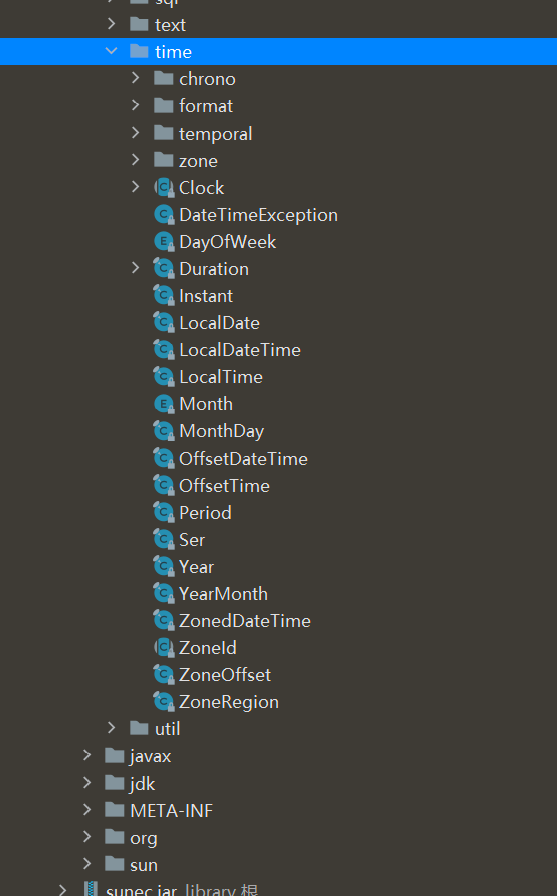


* LocalDate ：表示日期，包含年月日，格式为 2019-10-16
*  LocalTime ：表示时间，包含时分秒，格式为 16:38:54.158549300
*  LocalDateTime ：表示日期时间，包含年月日，时分秒
*  DateTimeFormatter ：日期时间格式化类
* Instant：时间戳，表示一个特定的时间瞬间
* Duration：用于计算2个时间(LocalTime，时分秒)的距离
* Period：用于计算2个日期(LocalDate，年月日)的距离
* ZonedDateTime ：包含时区的时间


 Java中使用的历法是ISO 8601日历系统，它是世界民用历法，也就是我们所说的公历。平年有365天，闰年是366 天。此外Java 8还提供了4套其他历法：

* ThaiBuddhistDate ：泰国佛教历
* MinguoDate ：中华民国历
* JapaneseDate：日本历
*  HijrahDate：伊斯兰历


优势：

* 新版的日期和时间API中，日期和时间对象是不可变的。操纵的日期不会影响老值，而是新生成一个实例
* 新的API提供了两种不同的时间表示方式，有效地区分了人和机器的不同需求
* TemporalAdjuster可以更精确的操纵日期，还可以自定义日期调整器
* 是线程安全的


```java
package mao;

import java.time.LocalDate;
import java.time.chrono.HijrahDate;
import java.time.chrono.JapaneseDate;
import java.time.chrono.MinguoDate;
import java.time.chrono.ThaiBuddhistDate;

/**
 * Project name(项目名称)：JDK8_data_time_API
 * Package(包名): mao
 * Class(类名): Test1
 * Author(作者）: mao
 * Author QQ：1296193245
 * GitHub：https://github.com/maomao124/
 * Date(创建日期)： 2023/10/27
 * Time(创建时间)： 17:14
 * Version(版本): 1.0
 * Description(描述)： 无
 */

public class Test1
{
    public static void main(String[] args)
    {
        MinguoDate now = MinguoDate.now();
        System.out.println(now);
        System.out.println(JapaneseDate.now());
        LocalDate localDate = LocalDate.now();
        System.out.println(localDate);
        HijrahDate hijrahDate = HijrahDate.now();
        System.out.println(hijrahDate);
        ThaiBuddhistDate thaiBuddhistDate = ThaiBuddhistDate.now();
        System.out.println(thaiBuddhistDate);
    }
}
```


```sh
Minguo ROC 112-10-27
Japanese Reiwa 5-10-27
2023-10-27
Hijrah-umalqura AH 1445-04-12
ThaiBuddhist BE 2566-10-27
```


### LocalDate

```java
package mao;

import java.time.LocalDate;

/**
 * Project name(项目名称)：JDK8_data_time_API
 * Package(包名): mao
 * Class(类名): Test2
 * Author(作者）: mao
 * Author QQ：1296193245
 * GitHub：https://github.com/maomao124/
 * Date(创建日期)： 2023/10/27
 * Time(创建时间)： 17:23
 * Version(版本): 1.0
 * Description(描述)： 无
 */

public class Test2
{
    public static void main(String[] args)
    {
        //创建指定日期
        LocalDate fj = LocalDate.of(1985, 9, 23);
        System.out.println("fj = " + fj); // 1985-09-23
        //得到当前日期
        LocalDate nowDate = LocalDate.now();
        System.out.println("nowDate = " + nowDate);
        //获取日期信息
        System.out.println("年: " + nowDate.getYear());
        System.out.println("月: " + nowDate.getMonthValue());
        System.out.println("日: " + nowDate.getDayOfMonth());
        System.out.println("星期: " + nowDate.getDayOfWeek());
    }
}
```


```sh
fj = 1985-09-23
nowDate = 2023-10-28
年: 2023
月: 10
日: 28
星期: SATURDAY
```


### LocalTime

```java
package mao;

import java.time.LocalTime;

/**
 * Project name(项目名称)：JDK8_data_time_API
 * Package(包名): mao
 * Class(类名): Test3
 * Author(作者）: mao
 * Author QQ：1296193245
 * GitHub：https://github.com/maomao124/
 * Date(创建日期)： 2023/10/28
 * Time(创建时间)： 17:56
 * Version(版本): 1.0
 * Description(描述)： 无
 */

public class Test3
{
    public static void main(String[] args)
    {
        // 得到指定的时间
        LocalTime time = LocalTime.of(12, 15, 28, 129_900_000);
        System.out.println("time = " + time);
        // 得到当前时间
        LocalTime nowTime = LocalTime.now();
        System.out.println("nowTime = " + nowTime);
        // 获取时间信息
        System.out.println("小时: " + nowTime.getHour());
        System.out.println("分钟: " + nowTime.getMinute());
        System.out.println("秒: " + nowTime.getSecond());
        System.out.println("纳秒: " + nowTime.getNano());
    }
}
```


```sh
time = 12:15:28.129900
nowTime = 17:58:30.571
小时: 17
分钟: 58
秒: 30
纳秒: 571000000
```


### LocalDateTime

```java
package mao;

import java.time.LocalDateTime;

/**
 * Project name(项目名称)：JDK8_data_time_API
 * Package(包名): mao
 * Class(类名): Test4
 * Author(作者）: mao
 * Author QQ：1296193245
 * GitHub：https://github.com/maomao124/
 * Date(创建日期)： 2023/10/28
 * Time(创建时间)： 17:59
 * Version(版本): 1.0
 * Description(描述)： 无
 */

public class Test4
{
    public static void main(String[] args)
    {
        LocalDateTime fj = LocalDateTime.of(1985, 9, 23, 9, 10, 20);
        System.out.println("fj = " + fj);
        // 得到当前日期时间
        LocalDateTime now = LocalDateTime.now();
        System.out.println("now = " + now);
        System.out.println(now.getYear());
        System.out.println(now.getMonthValue());
        System.out.println(now.getDayOfMonth());
        System.out.println(now.getHour());
        System.out.println(now.getMinute());
        System.out.println(now.getSecond());
        System.out.println(now.getNano());
    }
}
```


```sh
fj = 1985-09-23T09:10:20
now = 2023-10-28T17:59:41.449
2023
10
28
17
59
41
449000000
```


### 日期时间的修改

对日期时间的修改，对已存在的LocalDate对象，创建它的修改版，最简单的方式是使用withAttribute方法

withAttribute方法会创建对象的一个副本，并按照需要修改它的属性。以下所有的方法都返回了一个修改属性的对 象，他们不会影响原来的对象

```java
package mao;

import java.time.LocalDateTime;

/**
 * Project name(项目名称)：JDK8_data_time_API
 * Package(包名): mao
 * Class(类名): Test5
 * Author(作者）: mao
 * Author QQ：1296193245
 * GitHub：https://github.com/maomao124/
 * Date(创建日期)： 2023/10/28
 * Time(创建时间)： 18:05
 * Version(版本): 1.0
 * Description(描述)： 无
 */

public class Test5
{
    public static void main(String[] args)
    {
        LocalDateTime now = LocalDateTime.now();
        System.out.println("now = " + now);
        LocalDateTime localDateTime = now.withYear(2021);
        System.out.println(localDateTime);
        System.out.println(now == localDateTime);
        System.out.println("修改月份: " + now.withMonth(8));
        System.out.println("修改小时: " + now.withHour(2));
        System.out.println("修改分钟: " + now.withMinute(13));

        LocalDateTime localDateTime1 = now.plusYears(3);
        System.out.println(localDateTime1);
        System.out.println(localDateTime1 == now);
        System.out.println("20月后: " + now.plusMonths(20));
        System.out.println("20年前: " + now.minusYears(20));
        System.out.println("5月前: " + now.minusMonths(5));
        System.out.println("100天前: " + now.minusDays(100));
        System.out.println("3周前: " + now.minusWeeks(3));
    }
}
```


```sh
now = 2023-10-28T18:10:08.748
2021-10-28T18:10:08.748
false
修改月份: 2023-08-28T18:10:08.748
修改小时: 2023-10-28T02:10:08.748
修改分钟: 2023-10-28T18:13:08.748
2026-10-28T18:10:08.748
false
20月后: 2025-06-28T18:10:08.748
20年前: 2003-10-28T18:10:08.748
5月前: 2023-05-28T18:10:08.748
100天前: 2023-07-20T18:10:08.748
3周前: 2023-10-07T18:10:08.748
```


### 日期时间的比较

在JDK8中，LocalDate类中使用isBefore()、isAfter()、equals()方法来比较两个日期，可直接进行比较


```java
package mao;

import java.time.LocalDate;

/**
 * Project name(项目名称)：JDK8_data_time_API
 * Package(包名): mao
 * Class(类名): Test6
 * Author(作者）: mao
 * Author QQ：1296193245
 * GitHub：https://github.com/maomao124/
 * Date(创建日期)： 2023/10/28
 * Time(创建时间)： 18:12
 * Version(版本): 1.0
 * Description(描述)： 无
 */

public class Test6
{
    public static void main(String[] args)
    {
        LocalDate now = LocalDate.now();
        LocalDate date = LocalDate.of(2022, 3, 14);
        System.out.println(now.isAfter(date));
        System.out.println(now.isBefore(date));
        System.out.println(now.equals(date));
        date = LocalDate.of(2029, 12, 19);
        System.out.println(now.isAfter(date));
        System.out.println(now.isBefore(date));
        System.out.println(now.equals(date));
        LocalDate date2 = LocalDate.of(2029, 12, 19);
        System.out.println(date.isAfter(date2));
        System.out.println(date.isBefore(date2));
        System.out.println(date.equals(date2));
        System.out.println(date.isEqual(date2));
    }
}
```


```sh
true
false
false
false
true
false
false
false
true
true
```


### 时间格式化与解析

通过 java.time.format.DateTimeFormatter类可以进行日期时间解析与格式化


```java
package mao;

import java.time.LocalDate;
import java.time.LocalDateTime;
import java.time.format.DateTimeFormatter;

/**
 * Project name(项目名称)：JDK8_data_time_API
 * Package(包名): mao
 * Class(类名): Test7
 * Author(作者）: mao
 * Author QQ：1296193245
 * GitHub：https://github.com/maomao124/
 * Date(创建日期)： 2023/10/28
 * Time(创建时间)： 18:18
 * Version(版本): 1.0
 * Description(描述)： 无
 */

public class Test7
{
    public static void main(String[] args)
    {
        LocalDateTime now = LocalDateTime.now();
        String format = now.format(DateTimeFormatter.ISO_LOCAL_DATE);
        System.out.println(format);
        format = now.format(DateTimeFormatter.ISO_DATE_TIME);
        System.out.println(format);
        format = now.format(DateTimeFormatter.ISO_LOCAL_DATE_TIME);
        System.out.println(format);
        format = now.format(DateTimeFormatter.ISO_TIME);
        System.out.println(format);
        format = now.format(DateTimeFormatter.ofPattern("yyyy-MM-dd HH:mm:ss"));
        System.out.println(format);
        format = now.format(DateTimeFormatter.ofPattern("yyyy/MM/dd HH:mm:ss"));
        System.out.println(format);
        LocalDateTime parse = LocalDateTime.parse("2023-10-28 18:22:18", DateTimeFormatter.ofPattern("yyyy-MM-dd HH:mm:ss"));
        System.out.println(parse);
        LocalDate parse1 = LocalDate.parse("2023-10-28");
        System.out.println(parse1);
    }
}
```


```sh
2023-10-28
2023-10-28T18:26:15.294
2023-10-28T18:26:15.294
18:26:15.294
2023-10-28 18:26:15
2023/10/28 18:26:15
2023-10-28T18:22:18
2023-10-28
```


### Instant类

Instant 时间戳/时间线，内部保存了从1970年1月1日 00:00:00以来的秒和纳秒

```java
package mao;

import java.time.Instant;

/**
 * Project name(项目名称)：JDK8_data_time_API
 * Package(包名): mao
 * Class(类名): Test8
 * Author(作者）: mao
 * Author QQ：1296193245
 * GitHub：https://github.com/maomao124/
 * Date(创建日期)： 2023/10/28
 * Time(创建时间)： 18:27
 * Version(版本): 1.0
 * Description(描述)： 无
 */

public class Test8
{
    public static void main(String[] args)
    {
        Instant now = Instant.now();
        System.out.println(now);
        System.out.println(now.getNano());
        System.out.println(now.getEpochSecond());
        System.out.println(now.toEpochMilli());
        System.out.println(System.currentTimeMillis());
        Instant instant = Instant.ofEpochSecond(5);
        System.out.println(instant);
    }
}
```


```sh
2023-10-28T10:28:41.977Z
977000000
1698488921
1698488921977
1698488922008
1970-01-01T00:00:05Z
```


### 计算日期时间差

Duration/Period类：计算日期时间差

* Duration：用于计算2个时间(LocalTime，时分秒)的距离
* Period：用于计算2个日期(LocalDate，年月日)的距离


```java
package mao;

import java.time.Duration;
import java.time.LocalDate;
import java.time.LocalDateTime;
import java.time.Period;

/**
 * Project name(项目名称)：JDK8_data_time_API
 * Package(包名): mao
 * Class(类名): Test9
 * Author(作者）: mao
 * Author QQ：1296193245
 * GitHub：https://github.com/maomao124/
 * Date(创建日期)： 2023/10/28
 * Time(创建时间)： 18:30
 * Version(版本): 1.0
 * Description(描述)： 无
 */

public class Test9
{
    public static void main(String[] args)
    {
        LocalDateTime now = LocalDateTime.now();
        LocalDateTime localDateTime = now.plusMinutes(32);
        Duration duration = Duration.between(now, localDateTime);
        System.out.println("相差的天数:" + duration.toDays());
        System.out.println("相差的小时数:" + duration.toHours());
        System.out.println("相差的分钟数:" + duration.toMinutes());
        duration = Duration.between(localDateTime, now);
        System.out.println("相差的天数:" + duration.toDays());
        System.out.println("相差的小时数:" + duration.toHours());
        System.out.println("相差的分钟数:" + duration.toMinutes());
        duration = Duration.between(now, LocalDateTime.of(2034, 10, 16, 23, 11, 14));
        System.out.println("相差的天数:" + duration.toDays());
        System.out.println("相差的小时数:" + duration.toHours());
        System.out.println("相差的分钟数:" + duration.toMinutes());
        LocalDate nowDate = LocalDate.now();
        LocalDate date = LocalDate.of(1993, 2, 3);
        Period period = Period.between(date, nowDate);
        System.out.println("相差的年:" + period.getYears());
        System.out.println("相差的月:" + period.getMonths());
        System.out.println("相差的天:" + period.getDays());
    }
}
```


```sh
相差的天数:0
相差的小时数:0
相差的分钟数:32
相差的天数:0
相差的小时数:0
相差的分钟数:-32
相差的天数:4006
相差的小时数:96147
相差的分钟数:5768861
相差的年:30
相差的月:8
相差的天:25
```


### 时间校正器

有时我们可能需要获取例如：将日期调整到“下一个月的第一天”等操作。可以通过时间校正器来进行

* TemporalAdjuster :  时间校正器
* TemporalAdjusters :  该类通过静态方法提供了大量的常用TemporalAdjuster的实现


```java
package mao;

import java.time.LocalDate;
import java.time.LocalDateTime;
import java.time.temporal.Temporal;
import java.time.temporal.TemporalAdjuster;

/**
 * Project name(项目名称)：JDK8_data_time_API
 * Package(包名): mao
 * Class(类名): Test10
 * Author(作者）: mao
 * Author QQ：1296193245
 * GitHub：https://github.com/maomao124/
 * Date(创建日期)： 2023/10/28
 * Time(创建时间)： 19:31
 * Version(版本): 1.0
 * Description(描述)： 无
 */

public class Test10
{
    public static void main(String[] args)
    {
        LocalDateTime now = LocalDateTime.now();
        TemporalAdjuster temporalAdjuster = new TemporalAdjuster()
        {
            @Override
            public Temporal adjustInto(Temporal temporal)
            {
                LocalDateTime dateTime = (LocalDateTime) temporal;
                LocalDateTime nextMonth = dateTime.plusMonths(1).withDayOfMonth(1);
                System.out.println("nextMonth = " + nextMonth);
                return nextMonth;
            }
        };
        LocalDateTime nextMonth = now.with(temporalAdjuster);
        System.out.println("nextMonth = " + nextMonth);
        nextMonth = LocalDateTime.of(2034, 10, 16, 23, 11, 14).with(temporalAdjuster);
        System.out.println("nextMonth = " + nextMonth);
    }
}
```


```sh
nextMonth = 2023-11-01T19:35:12.744
nextMonth = 2023-11-01T19:35:12.744
nextMonth = 2034-11-01T23:11:14
nextMonth = 2034-11-01T23:11:14
```


### 设置日期时间的时区

Java8 中加入了对时区的支持，LocalDate、LocalTime、LocalDateTime是不带时区的，带时区的日期时间类分别为：ZonedDate、ZonedTime、ZonedDateTime

其中每个时区都对应着 ID，ID的格式为 “区域/城市” 。例如 ：Asia/Shanghai等

ZoneId：该类中包含了所有的时区信息

```java
package mao;

import java.time.Clock;
import java.time.ZoneId;
import java.time.ZonedDateTime;
import java.util.Iterator;
import java.util.Set;

/**
 * Project name(项目名称)：JDK8_data_time_API
 * Package(包名): mao
 * Class(类名): Test11
 * Author(作者）: mao
 * Author QQ：1296193245
 * GitHub：https://github.com/maomao124/
 * Date(创建日期)： 2023/10/28
 * Time(创建时间)： 19:37
 * Version(版本): 1.0
 * Description(描述)： 无
 */

public class Test11
{
    public static void main(String[] args)
    {
        Set<String> availableZoneIds = ZoneId.getAvailableZoneIds();
        Iterator<String> iterator = availableZoneIds.iterator();
        for (int i = 0; i < availableZoneIds.size(); i++)
        {
            if (i % 5 == 0 && i != 0)
            {
                System.out.println(iterator.next());
                continue;
            }
            System.out.print(iterator.next() + "\t");
        }
        ZonedDateTime bz = ZonedDateTime.now(Clock.systemUTC());
        System.out.println("bz = " + bz);
        ZonedDateTime now1 = ZonedDateTime.now();
        System.out.println("now1 = " + now1);
        ZonedDateTime now2 = ZonedDateTime.now(ZoneId.of("America/Atka"));
        System.out.println("now2 = " + now2);
    }
}
```


```sh
Asia/Aden	America/Cuiaba	Etc/GMT+9	Etc/GMT+8	Africa/Nairobi	America/Marigot
Asia/Aqtau	Pacific/Kwajalein	America/El_Salvador	Asia/Pontianak	Africa/Cairo
Pacific/Pago_Pago	Africa/Mbabane	Asia/Kuching	Pacific/Honolulu	Pacific/Rarotonga
America/Guatemala	Australia/Hobart	Europe/London	America/Belize	America/Panama
Asia/Chungking	America/Managua	America/Indiana/Petersburg	Asia/Yerevan	Europe/Brussels
GMT	Europe/Warsaw	America/Chicago	Asia/Kashgar	Chile/Continental
Pacific/Yap	CET	Etc/GMT-1	Etc/GMT-0	Europe/Jersey
America/Tegucigalpa	Etc/GMT-5	Europe/Istanbul	America/Eirunepe	Etc/GMT-4
America/Miquelon	Etc/GMT-3	Europe/Luxembourg	Etc/GMT-2	Etc/GMT-9
America/Argentina/Catamarca	Etc/GMT-8	Etc/GMT-7	Etc/GMT-6	Europe/Zaporozhye
Canada/Yukon	Canada/Atlantic	Atlantic/St_Helena	Australia/Tasmania	Libya
Europe/Guernsey	America/Grand_Turk	Asia/Samarkand	America/Argentina/Cordoba	Asia/Phnom_Penh
Africa/Kigali	Asia/Almaty	US/Alaska	Asia/Dubai	Europe/Isle_of_Man
America/Araguaina	Cuba	Asia/Novosibirsk	America/Argentina/Salta	Etc/GMT+3
Africa/Tunis	Etc/GMT+2	Etc/GMT+1	Pacific/Fakaofo	Africa/Tripoli
Etc/GMT+0	Israel	Africa/Banjul	Etc/GMT+7	Indian/Comoro
Etc/GMT+6	Etc/GMT+5	Etc/GMT+4	Pacific/Port_Moresby	US/Arizona
Antarctica/Syowa	Indian/Reunion	Pacific/Palau	Europe/Kaliningrad	America/Montevideo
Africa/Windhoek	Asia/Karachi	Africa/Mogadishu	Australia/Perth	Brazil/East
Etc/GMT	Asia/Chita	Pacific/Easter	Antarctica/Davis	Antarctica/McMurdo
Asia/Macao	America/Manaus	Africa/Freetown	Europe/Bucharest	Asia/Tomsk
America/Argentina/Mendoza	Asia/Macau	Europe/Malta	Mexico/BajaSur	Pacific/Tahiti
Africa/Asmera	Europe/Busingen	America/Argentina/Rio_Gallegos	Africa/Malabo	Europe/Skopje
America/Catamarca	America/Godthab	Europe/Sarajevo	Australia/ACT	GB-Eire
Africa/Lagos	America/Cordoba	Europe/Rome	Asia/Dacca	Indian/Mauritius
Pacific/Samoa	America/Regina	America/Fort_Wayne	America/Dawson_Creek	Africa/Algiers
Europe/Mariehamn	America/St_Johns	America/St_Thomas	Europe/Zurich	America/Anguilla
Asia/Dili	America/Denver	Africa/Bamako	Europe/Saratov	GB
Mexico/General	Pacific/Wallis	Europe/Gibraltar	Africa/Conakry	Africa/Lubumbashi
Asia/Istanbul	America/Havana	NZ-CHAT	Asia/Choibalsan	America/Porto_Acre
Asia/Omsk	Europe/Vaduz	US/Michigan	Asia/Dhaka	America/Barbados
Europe/Tiraspol	Atlantic/Cape_Verde	Asia/Yekaterinburg	America/Louisville	Pacific/Johnston
Pacific/Chatham	Europe/Ljubljana	America/Sao_Paulo	Asia/Jayapura	America/Curacao
Asia/Dushanbe	America/Guyana	America/Guayaquil	America/Martinique	Portugal
Europe/Berlin	Europe/Moscow	Europe/Chisinau	America/Puerto_Rico	America/Rankin_Inlet
Pacific/Ponape	Europe/Stockholm	Europe/Budapest	America/Argentina/Jujuy	Australia/Eucla
Asia/Shanghai	Universal	Europe/Zagreb	America/Port_of_Spain	Europe/Helsinki
Asia/Beirut	Asia/Tel_Aviv	Pacific/Bougainville	US/Central	Africa/Sao_Tome
Indian/Chagos	America/Cayenne	Asia/Yakutsk	Pacific/Galapagos	Australia/North
Europe/Paris	Africa/Ndjamena	Pacific/Fiji	America/Rainy_River	Indian/Maldives
Australia/Yancowinna	SystemV/AST4	Asia/Oral	America/Yellowknife	Pacific/Enderbury
America/Juneau	Australia/Victoria	America/Indiana/Vevay	Asia/Tashkent	Asia/Jakarta
Africa/Ceuta	Asia/Barnaul	America/Recife	America/Buenos_Aires	America/Noronha
America/Swift_Current	Australia/Adelaide	America/Metlakatla	Africa/Djibouti	America/Paramaribo
Asia/Qostanay	Europe/Simferopol	Europe/Sofia	Africa/Nouakchott	Europe/Prague
America/Indiana/Vincennes	Antarctica/Mawson	America/Kralendijk	Antarctica/Troll	Europe/Samara
Indian/Christmas	America/Antigua	Pacific/Gambier	America/Indianapolis	America/Inuvik
America/Iqaluit	Pacific/Funafuti	UTC	Antarctica/Macquarie	Canada/Pacific
America/Moncton	Africa/Gaborone	Pacific/Chuuk	Asia/Pyongyang	America/St_Vincent
Asia/Gaza	Etc/Universal	PST8PDT	Atlantic/Faeroe	Asia/Qyzylorda
Canada/Newfoundland	America/Kentucky/Louisville	America/Yakutat	Asia/Ho_Chi_Minh	Antarctica/Casey
Europe/Copenhagen	Africa/Asmara	Atlantic/Azores	Europe/Vienna	ROK
Pacific/Pitcairn	America/Mazatlan	Australia/Queensland	Pacific/Nauru	Europe/Tirane
Asia/Kolkata	SystemV/MST7	Australia/Canberra	MET	Australia/Broken_Hill
Europe/Riga	America/Dominica	Africa/Abidjan	America/Mendoza	America/Santarem
Kwajalein	America/Asuncion	Asia/Ulan_Bator	NZ	America/Boise
Australia/Currie	EST5EDT	Pacific/Guam	Pacific/Wake	Atlantic/Bermuda
America/Costa_Rica	America/Dawson	Asia/Chongqing	Eire	Europe/Amsterdam
America/Indiana/Knox	America/North_Dakota/Beulah	Africa/Accra	Atlantic/Faroe	Mexico/BajaNorte
America/Maceio	Etc/UCT	Pacific/Apia	GMT0	America/Atka
Pacific/Niue	Australia/Lord_Howe	Europe/Dublin	Pacific/Truk	MST7MDT
America/Monterrey	America/Nassau	America/Jamaica	Asia/Bishkek	America/Atikokan
Atlantic/Stanley	Australia/NSW	US/Hawaii	SystemV/CST6	Indian/Mahe
Asia/Aqtobe	America/Sitka	Asia/Vladivostok	Africa/Libreville	Africa/Maputo
Zulu	America/Kentucky/Monticello	Africa/El_Aaiun	Africa/Ouagadougou	America/Coral_Harbour
Pacific/Marquesas	Brazil/West	America/Aruba	America/North_Dakota/Center	America/Cayman
Asia/Ulaanbaatar	Asia/Baghdad	Europe/San_Marino	America/Indiana/Tell_City	America/Tijuana
Pacific/Saipan	SystemV/YST9	Africa/Douala	America/Chihuahua	America/Ojinaga
Asia/Hovd	America/Anchorage	Chile/EasterIsland	America/Halifax	Antarctica/Rothera
America/Indiana/Indianapolis	US/Mountain	Asia/Damascus	America/Argentina/San_Luis	America/Santiago
Asia/Baku	America/Argentina/Ushuaia	Atlantic/Reykjavik	Africa/Brazzaville	Africa/Porto-Novo
America/La_Paz	Antarctica/DumontDUrville	Asia/Taipei	Antarctica/South_Pole	Asia/Manila
Asia/Bangkok	Africa/Dar_es_Salaam	Poland	Atlantic/Madeira	Antarctica/Palmer
America/Thunder_Bay	Africa/Addis_Ababa	Asia/Yangon	Europe/Uzhgorod	Brazil/DeNoronha
Asia/Ashkhabad	Etc/Zulu	America/Indiana/Marengo	America/Creston	America/Punta_Arenas
America/Mexico_City	Antarctica/Vostok	Asia/Jerusalem	Europe/Andorra	US/Samoa
PRC	Asia/Vientiane	Pacific/Kiritimati	America/Matamoros	America/Blanc-Sablon
Asia/Riyadh	Iceland	Pacific/Pohnpei	Asia/Ujung_Pandang	Atlantic/South_Georgia
Europe/Lisbon	Asia/Harbin	Europe/Oslo	Asia/Novokuznetsk	CST6CDT
Atlantic/Canary	America/Knox_IN	Asia/Kuwait	SystemV/HST10	Pacific/Efate
Africa/Lome	America/Bogota	America/Menominee	America/Adak	Pacific/Norfolk
Europe/Kirov	America/Resolute	Pacific/Kanton	Pacific/Tarawa	Africa/Kampala
Asia/Krasnoyarsk	Greenwich	SystemV/EST5	America/Edmonton	Europe/Podgorica
Australia/South	Canada/Central	Africa/Bujumbura	America/Santo_Domingo	US/Eastern
Europe/Minsk	Pacific/Auckland	Africa/Casablanca	America/Glace_Bay	Canada/Eastern
Asia/Qatar	Europe/Kiev	Singapore	Asia/Magadan	SystemV/PST8
America/Port-au-Prince	Europe/Belfast	America/St_Barthelemy	Asia/Ashgabat	Africa/Luanda
America/Nipigon	Atlantic/Jan_Mayen	Brazil/Acre	Asia/Muscat	Asia/Bahrain
Europe/Vilnius	America/Fortaleza	Etc/GMT0	US/East-Indiana	America/Hermosillo
America/Cancun	Africa/Maseru	Pacific/Kosrae	Africa/Kinshasa	Asia/Kathmandu
Asia/Seoul	Australia/Sydney	America/Lima	Australia/LHI	America/St_Lucia
Europe/Madrid	America/Bahia_Banderas	America/Montserrat	Asia/Brunei	America/Santa_Isabel
Canada/Mountain	America/Cambridge_Bay	Asia/Colombo	Australia/West	Indian/Antananarivo
Australia/Brisbane	Indian/Mayotte	US/Indiana-Starke	Asia/Urumqi	US/Aleutian
Europe/Volgograd	America/Lower_Princes	America/Vancouver	Africa/Blantyre	America/Rio_Branco
America/Danmarkshavn	America/Detroit	America/Thule	Africa/Lusaka	Asia/Hong_Kong
Iran	America/Argentina/La_Rioja	Africa/Dakar	SystemV/CST6CDT	America/Tortola
America/Porto_Velho	Asia/Sakhalin	Etc/GMT+10	America/Scoresbysund	Asia/Kamchatka
Asia/Thimbu	Africa/Harare	Etc/GMT+12	Etc/GMT+11	Navajo
America/Nome	Europe/Tallinn	Turkey	Africa/Khartoum	Africa/Johannesburg
Africa/Bangui	Europe/Belgrade	Jamaica	Africa/Bissau	Asia/Tehran
WET	Europe/Astrakhan	Africa/Juba	America/Campo_Grande	America/Belem
Etc/Greenwich	Asia/Saigon	America/Ensenada	Pacific/Midway	America/Jujuy
Africa/Timbuktu	America/Bahia	America/Goose_Bay	America/Virgin	America/Pangnirtung
Asia/Katmandu	America/Phoenix	Africa/Niamey	America/Whitehorse	Pacific/Noumea
Asia/Tbilisi	America/Montreal	Asia/Makassar	America/Argentina/San_Juan	Hongkong
UCT	Asia/Nicosia	America/Indiana/Winamac	SystemV/MST7MDT	America/Argentina/ComodRivadavia
America/Boa_Vista	America/Grenada	Asia/Atyrau	Australia/Darwin	Asia/Khandyga
Asia/Kuala_Lumpur	Asia/Famagusta	Asia/Thimphu	Asia/Rangoon	Europe/Bratislava
Asia/Calcutta	America/Argentina/Tucuman	Asia/Kabul	Indian/Cocos	Japan
Pacific/Tongatapu	America/New_York	Etc/GMT-12	Etc/GMT-11	America/Nuuk
Etc/GMT-10	SystemV/YST9YDT	Europe/Ulyanovsk	Etc/GMT-14	Etc/GMT-13
W-SU	America/Merida	EET	America/Rosario	Canada/Saskatchewan
America/St_Kitts	Arctic/Longyearbyen	America/Fort_Nelson	America/Caracas	America/Guadeloupe
Asia/Hebron	Indian/Kerguelen	SystemV/PST8PDT	Africa/Monrovia	Asia/Ust-Nera
Egypt	Asia/Srednekolymsk	America/North_Dakota/New_Salem	Asia/Anadyr	Australia/Melbourne
Asia/Irkutsk	America/Shiprock	America/Winnipeg	Europe/Vatican	Asia/Amman
Etc/UTC	SystemV/AST4ADT	Asia/Tokyo	America/Toronto	Asia/Singapore
Australia/Lindeman	America/Los_Angeles	SystemV/EST5EDT	Pacific/Majuro	America/Argentina/Buenos_Aires
Europe/Nicosia	Pacific/Guadalcanal	Europe/Athens	US/Pacific	Europe/Monaco
bz = 2023-10-28T11:43:25.523Z
now1 = 2023-10-28T19:43:25.551+08:00[Asia/Shanghai]
now2 = 2023-10-28T02:43:25.552-09:00[America/Atka]
```


## 重复注解

### 概述

自从Java 5中引入注解以来，注解开始变得非常流行，并在各个框架和项目中被广泛使用。不过注解有一个很大的限制是：在同一个地方不能多次使用同一个注解。JDK8引入了重复注解的概念，允许在同一个地方多次使用同一个注解。在JDK 8中使用@Repeatable注解定义重复注解


### 使用

定义重复的注解容器注解

```java
package mao;

import java.lang.annotation.Retention;
import java.lang.annotation.RetentionPolicy;

@Retention(RetentionPolicy.RUNTIME)
public @interface MyAnnos
{
    MyAnno[] value();
}
```


定义一个可以重复的注解

```java
package mao;

import java.lang.annotation.Repeatable;
import java.lang.annotation.Retention;
import java.lang.annotation.RetentionPolicy;

@Retention(RetentionPolicy.RUNTIME)
@Repeatable(MyAnnos.class)
public @interface MyAnno
{
    String value();
}

```


配置多个重复的注解

```java
package mao;

/**
 * Project name(项目名称)：JDK8_duplicate_annotations_and_type_annotations
 * Package(包名): mao
 * Class(类名): Test1
 * Author(作者）: mao
 * Author QQ：1296193245
 * GitHub：https://github.com/maomao124/
 * Date(创建日期)： 2023/10/29
 * Time(创建时间)： 13:27
 * Version(版本): 1.0
 * Description(描述)： 无
 */

@MyAnno("123")
@MyAnno("456")
public class Test1
{
    @MyAnno("789")
    @MyAnno("10")
    public void test()
    {
        System.out.println("hello");
    }
}
```


解析得到指定注解

```java
package mao;

/**
 * Project name(项目名称)：JDK8_duplicate_annotations_and_type_annotations
 * Package(包名): mao
 * Class(类名): Test2
 * Author(作者）: mao
 * Author QQ：1296193245
 * GitHub：https://github.com/maomao124/
 * Date(创建日期)： 2023/10/29
 * Time(创建时间)： 13:35
 * Version(版本): 1.0
 * Description(描述)： 无
 */

public class Test2
{
    public static void main(String[] args) throws NoSuchMethodException
    {
        MyAnno[] myAnnos = Test1.class.getAnnotationsByType(MyAnno.class);
        for (MyAnno myAnno : myAnnos)
        {
            System.out.println(myAnno.value());
        }
        MyAnno[] myAnnos1 = Test1.class.getMethod("test").getAnnotationsByType(MyAnno.class);
        for (MyAnno myAnno : myAnnos1)
        {
            System.out.println(myAnno.value());
        }
    }
}
```


## 类型注解

### 概述

JDK 8为@Target元注解新增了两种类型：

* TYPE_PARAMETER：表示该注解能写在类型参数的声明语句中。 类型参数声明如： \<T>
* TYPE_USE：表示注解可以再任何用到类型的地方使用


### 使用

```java
package mao;

import java.lang.annotation.ElementType;
import java.lang.annotation.Target;

@Target(ElementType.TYPE_PARAMETER)
public @interface TyptParam
{

}
```


```java
package mao;

/**
 * Project name(项目名称)：JDK8_duplicate_annotations_and_type_annotations
 * Package(包名): mao
 * Class(类名): Test3
 * Author(作者）: mao
 * Author QQ：1296193245
 * GitHub：https://github.com/maomao124/
 * Date(创建日期)： 2023/10/29
 * Time(创建时间)： 13:45
 * Version(版本): 1.0
 * Description(描述)： 无
 */

public class Test3<@TyptParam T>
{
    public static void main(String[] args)
    {

    }

    public <@TyptParam E> void test(String a)
    {

    }
}
```


```java
package mao;

import java.lang.annotation.ElementType;
import java.lang.annotation.Target;

@Target(ElementType.TYPE_USE)
public @interface NotNull
{
}
```

```java
package mao;

/**
 * Project name(项目名称)：JDK8_duplicate_annotations_and_type_annotations
 * Package(包名): mao
 * Class(类名): Test4
 * Author(作者）: mao
 * Author QQ：1296193245
 * GitHub：https://github.com/maomao124/
 * Date(创建日期)： 2023/10/29
 * Time(创建时间)： 13:52
 * Version(版本): 1.0
 * Description(描述)： 无
 */

public class Test4<@TyptParam T extends String>
{
    private @NotNull int a = 10;

    public static void main(@NotNull String[] args)
    {
        @NotNull int x = 1;
        @NotNull String s = new @NotNull String();
    }

    public <@TyptParam E> void test(String a)
    {
    }
}
```


通过@Repeatable元注解可以定义可重复注解，TYPE_PARAMETER可以让注解放在泛型上。TYPE_USE 可以让注解放在类型的前面


## Base64编码

### 概述

Base64是网络上最常见的用于传输8Bit字节码的编码方式之一，Base64就是一种基于64个可打印字符来表示二进制数据的方法

它实际上是一种“二进制转换到文本”的编码方式

Base64一般用于在HTTP协议下传输二进制数据，由于HTTP协议是文本协议，所以在HTTP协议下传输二进制数据需要将二进制数据转换为字符数据。然而直接转换是不行的。因为网络传输只能传输可打印字符。什么是可打印字符？在ASCII码中规定，0-31和127这33个字符属于控制字符，32-126这95个字符属于可打印字符，也就是说网络传输只能传输这95个字符，不在这个范围内的字符无法传输。那么该怎么才能传输其他字符呢？其中一种方式就是使用Base64


### 使用

```java
package mao;

import java.nio.charset.StandardCharsets;
import java.util.Base64;

/**
 * Project name(项目名称)：JDK8_Base64
 * Package(包名): mao
 * Class(类名): Test1
 * Author(作者）: mao
 * Author QQ：1296193245
 * GitHub：https://github.com/maomao124/
 * Date(创建日期)： 2023/10/29
 * Time(创建时间)： 14:09
 * Version(版本): 1.0
 * Description(描述)： 无
 */

public class Test1
{
    public static void main(String[] args)
    {
        String str = "hello";
        byte[] bytes = str.getBytes(StandardCharsets.UTF_8);
        String encode = Base64.getEncoder().encodeToString(bytes);
        System.out.println(encode);
        str = "world";
        bytes = str.getBytes(StandardCharsets.UTF_8);
        encode = Base64.getEncoder().encodeToString(bytes);
        System.out.println(encode);
        str = "hello world 123456";
        bytes = str.getBytes(StandardCharsets.UTF_8);
        encode = Base64.getEncoder().encodeToString(bytes);
        System.out.println(encode);
        //aGVsbG8=
        //d29ybGQ=
        //aGVsbG8gd29ybGQgMTIzNDU2

        System.out.println(new String(Base64.getDecoder().decode(encode.getBytes(StandardCharsets.UTF_8))));
        System.out.println(new String(Base64.getUrlDecoder().decode(encode.getBytes(StandardCharsets.UTF_8))));
        System.out.println(new String(Base64.getDecoder().decode("aGVsbG8=".getBytes(StandardCharsets.UTF_8))));
    }
}
```


```sh
aGVsbG8=
d29ybGQ=
aGVsbG8gd29ybGQgMTIzNDU2
hello world 123456
hello world 123456
hello
```


## 链式编程

### 概述

链式编程的原理是返回一个this对象，也就是返回对象本身，从而达到链式效果


### 使用

```java
package mao;

/**
 * Project name(项目名称)：JDK8_chain_programming
 * Package(包名): mao
 * Class(类名): Test1
 * Author(作者）: mao
 * Author QQ：1296193245
 * GitHub：https://github.com/maomao124/
 * Date(创建日期)： 2023/10/30
 * Time(创建时间)： 17:50
 * Version(版本): 1.0
 * Description(描述)： 无
 */

public class Test1
{
    public static void main(String[] args)
    {
        System.out.println(new StringBuilder()
                .append(1)
                .append("123")
                .append("456")
                .append("789")
                .append(3.4).toString());
    }
}
```


实体类的使用

```java
package mao;

import java.util.StringJoiner;

/**
 * Project name(项目名称)：JDK8_chain_programming
 * Package(包名): mao
 * Class(类名): Student
 * Author(作者）: mao
 * Author QQ：1296193245
 * GitHub：https://github.com/maomao124/
 * Date(创建日期)： 2023/10/30
 * Time(创建时间)： 17:53
 * Version(版本): 1.0
 * Description(描述)： 无
 */

public class Student
{
    private Long id;
    private String name;
    private String sex;
    private Integer age;

    public Long getId()
    {
        return id;
    }

    public Student setId(Long id)
    {
        this.id = id;
        return this;
    }

    public String getName()
    {
        return name;
    }

    public Student setName(String name)
    {
        this.name = name;
        return this;
    }

    public String getSex()
    {
        return sex;
    }

    public Student setSex(String sex)
    {
        this.sex = sex;
        return this;
    }

    public Integer getAge()
    {
        return age;
    }

    public Student setAge(Integer age)
    {
        this.age = age;
        return this;
    }

    @Override
    public String toString()
    {
        return new StringJoiner(", ", Student.class.getSimpleName() + "[", "]")
                .add("id=" + id)
                .add("name='" + name + "'")
                .add("sex='" + sex + "'")
                .add("age=" + age)
                .toString();
    }
}
```


```java
package mao;

/**
 * Project name(项目名称)：JDK8_chain_programming
 * Package(包名): mao
 * Class(类名): Test2
 * Author(作者）: mao
 * Author QQ：1296193245
 * GitHub：https://github.com/maomao124/
 * Date(创建日期)： 2023/10/30
 * Time(创建时间)： 17:54
 * Version(版本): 1.0
 * Description(描述)： 无
 */

public class Test2
{
    public static void main(String[] args)
    {
        System.out.println(new Student().setId(1000L).setName("张三")
                .setSex("男").setAge(18));
    }
}
```


```sh
Student[id=1000, name='张三', sex='男', age=18]
```


## 释放资源代码优化

### 以前的代码

```java
package mao;

import java.io.BufferedWriter;
import java.io.FileOutputStream;
import java.io.IOException;
import java.io.OutputStreamWriter;
import java.nio.charset.StandardCharsets;

/**
 * Project name(项目名称)：JDK8_release_resources_optimization
 * Package(包名): mao
 * Class(类名): Test1
 * Author(作者）: mao
 * Author QQ：1296193245
 * GitHub：https://github.com/maomao124/
 * Date(创建日期)： 2023/10/30
 * Time(创建时间)： 18:03
 * Version(版本): 1.0
 * Description(描述)： 无
 */

public class Test1
{
    public static void main(String[] args)
    {
        FileOutputStream fileOutputStream = null;
        OutputStreamWriter outputStreamWriter = null;
        BufferedWriter bufferedWriter = null;
        try
        {
            fileOutputStream = new FileOutputStream("a.txt");
            outputStreamWriter = new OutputStreamWriter(fileOutputStream, StandardCharsets.UTF_8);
            bufferedWriter = new BufferedWriter(outputStreamWriter);
            bufferedWriter.write("hello");
            bufferedWriter.write(" world");
            bufferedWriter.flush();
        }
        catch (Exception e)
        {
            e.printStackTrace();
        }
        finally
        {
            try
            {
                if (bufferedWriter != null)
                {
                    bufferedWriter.close();
                }
            }
            catch (IOException e)
            {
                e.printStackTrace();
            }
            try
            {
                if (outputStreamWriter != null)
                {
                    outputStreamWriter.close();
                }
            }
            catch (IOException e)
            {
                e.printStackTrace();
            }
            try
            {
                if (fileOutputStream != null)
                {
                    fileOutputStream.close();
                }
            }
            catch (IOException e)
            {
                e.printStackTrace();
            }
        }

    }
}
```


### 现在的代码

```java
package mao;

import java.io.BufferedWriter;
import java.io.FileOutputStream;
import java.io.IOException;
import java.io.OutputStreamWriter;
import java.nio.charset.StandardCharsets;

/**
 * Project name(项目名称)：JDK8_release_resources_optimization
 * Package(包名): mao
 * Class(类名): Test2
 * Author(作者）: mao
 * Author QQ：1296193245
 * GitHub：https://github.com/maomao124/
 * Date(创建日期)： 2023/10/30
 * Time(创建时间)： 18:09
 * Version(版本): 1.0
 * Description(描述)： 无
 */

public class Test2
{
    public static void main(String[] args)
    {
        try(FileOutputStream fileOutputStream = new FileOutputStream("b.txt");
            OutputStreamWriter outputStreamWriter = new OutputStreamWriter(fileOutputStream, StandardCharsets.UTF_8);
            BufferedWriter bufferedWriter = new BufferedWriter(outputStreamWriter))
        {
            bufferedWriter.write("hello");
            bufferedWriter.write(" world");
            bufferedWriter.flush();
        }
        catch (Exception e)
        {
            e.printStackTrace();
        }
    }
}
```


# JDK9

## 模块化系统

### 概述

jdk9之前没有解决的问题：

* **java运行环境代码臃肿、效率低**。Java9之前，每一个runtime自带开箱即用的所有编译好的平台类，这些类被一起打包到一个JRE文件叫做rt.jar。你只需将你的应用的类放到classpath中，这样runtime就可以找到，而其它的平台类它就简单粗暴的从rt.jar文件中去找。尽管你的应用只用到了这个庞大的rt.jar的一部分，这对JVM管理来说不仅增加了非必要类的体积，还增加了性能负载。 Java9模块化可以按需自定义runtime!这也就是jdk9文件夹下没有了jre目录的原因
* **无法隐藏内部API和类型**。很难真正地对代码进行封装,系统对于不同部分的代码无法分离。 在早期我们实现封装都是需要依赖一下权限修饰符, 而权限修饰符只能修饰类、成员变量、成员方法。 权限修饰符我们没法对包进行隐藏，JDK9我们通过隐藏包从而隐藏包中里面的所有类


模块化的目标：

* 减少内存的开销，提高效率
* 强封装： 每一个模块都声明了哪些包是公开的哪些包是内部的，java编译和运行时就可以实施这些规则来确保外部模块无法使用内部类型


### 使用

创建两个包：

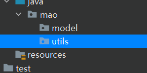


在utils新建一个工具类

```java
package mao.utils;

import java.util.Comparator;
import java.util.List;

/**
 * Project name(项目名称)：JDK9_modular
 * Package(包名): mao.utils
 * Class(类名): MaxUtils
 * Author(作者）: mao
 * Author QQ：1296193245
 * GitHub：https://github.com/maomao124/
 * Date(创建日期)： 2023/10/31
 * Time(创建时间)： 9:24
 * Version(版本): 1.0
 * Description(描述)： 无
 */

public class MaxUtils
{
    /**
     * 得到最大值
     *
     * @param list 列表
     * @return {@link Integer} 最大值
     */
    public Integer getMax(List<Integer> list)
    {
        return list.stream().max(Comparator.comparingInt(o -> o)).get();
    }
}
```


在modle包中创建一个Student类

```java
package mao.model;

/**
 * Project name(项目名称)：JDK9_modular
 * Package(包名): mao.model
 * Class(类名): Student
 * Author(作者）: mao
 * Author QQ：1296193245
 * GitHub：https://github.com/maomao124/
 * Date(创建日期)： 2023/10/31
 * Time(创建时间)： 9:31
 * Version(版本): 1.0
 * Description(描述)： 无
 */

public class Student
{
    private Long id;
    private String name;
    private Integer age;

    public Long getId()
    {
        return id;
    }

    public Student setId(Long id)
    {
        this.id = id;
        return this;
    }

    public String getName()
    {
        return name;
    }

    public Student setName(String name)
    {
        this.name = name;
        return this;
    }

    public Integer getAge()
    {
        return age;
    }

    public Student setAge(Integer age)
    {
        this.age = age;
        return this;
    }
}
```


java目录下新建一个输出模块信息，只是输出utils包，model包对外隐藏

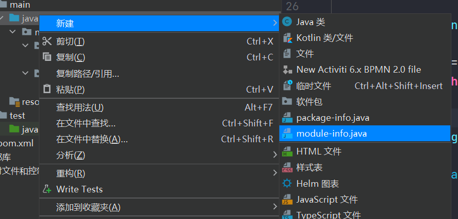


```java
module m {
    exports mao.utils;
}
```


创建一个新模块

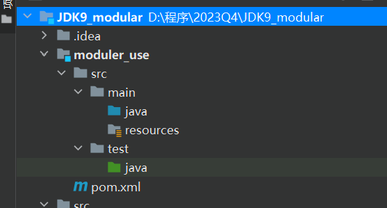


创建一个M1

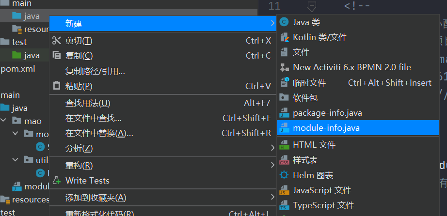


```java
module m1 {
    requires m;
}
```


添加依赖

```xml
    <dependencies>

        <dependency>
            <groupId>mao</groupId>
            <artifactId>JDK9_modular</artifactId>
            <version>1.0-SNAPSHOT</version>
            <scope>compile</scope>
        </dependency>

    </dependencies>
```


创建测试

```java
package mao;

import mao.utils.MaxUtils;

import java.util.ArrayList;
import java.util.Collections;
import java.util.List;

/**
 * Project name(项目名称)：JDK9_modular
 * Package(包名): mao
 * Class(类名): Test1
 * Author(作者）: mao
 * Author QQ：1296193245
 * GitHub：https://github.com/maomao124/
 * Date(创建日期)： 2023/10/31
 * Time(创建时间)： 9:43
 * Version(版本): 1.0
 * Description(描述)： 无
 */

public class Test1
{
    public static void main(String[] args)
    {
        List<Integer> list = new ArrayList<>();
        list.add(2);
        list.add(9);
        list.add(4);
        list.add(1);
        Integer integer = new MaxUtils().getMax(list);
        System.out.println(integer);
        //Student student=new Student();
    }
}
```


不能使用Student类

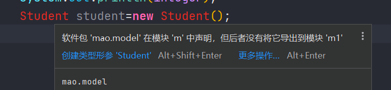


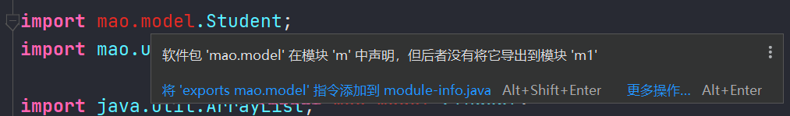


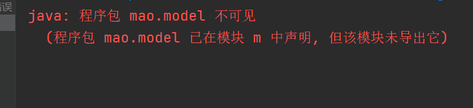


## jshell工具

### 概述

java的编程模式是：**编辑，保存，编译，运行和调试**。 

有时候我们需要快速看到某个语句的结果的时候，还需要写上public static void main(String[] args)这些无谓的语句，减低我们的开发效率。 JDK9引 入了交互式编程，通过jshell工具即可实现，交互式编程就是指我们不需要编写类我们即可直接声明变 量，方法，执行语句，不需要编译即可马上看到效果。 

交互式编程的作用：**即时反馈**


### 使用

打开jshell工具

```sh
jshell
```


```sh
PS C:\Users\mao> jshell
|  欢迎使用 JShell -- 版本 17.0.8.1
|  要大致了解该版本, 请键入: /help intro

jshell>
```


帮助信息

```sh
jshell> /help intro
|
|                                   intro
|                                   =====
|
|  使用 jshell 工具可以执行 Java 代码，从而立即获取结果。
|  您可以输入 Java 定义（变量、方法、类等等），例如：int x = 8
|  或 Java 表达式，例如：x + x
|  或 Java 语句或导入。
|  这些小块的 Java 代码称为“片段”。
|
|  这些 jshell 工具命令还可以让您了解和
|  控制您正在执行的操作，例如：/list
|
|  有关命令的列表，请执行：/help

jshell> /help
|  键入 Java 语言表达式, 语句或声明。
|  或者键入以下命令之一:
|  /list [<名称或 id>|-all|-start]
|       列出您键入的源
|  /edit <名称或 id>
|       编辑源条目
|  /drop <名称或 id>
|       删除源条目
|  /save [-all|-history|-start] <文件>
|       将片段源保存到文件
|  /open <file>
|       打开文件作为源输入
|  /vars [<名称或 id>|-all|-start]
|       列出已声明变量及其值
|  /methods [<名称或 id>|-all|-start]
|       列出已声明方法及其签名
|  /types [<名称或 id>|-all|-start]
|       列出类型声明
|  /imports
|       列出导入的项
|  /exit [<integer-expression-snippet>]
|       退出 jshell 工具
|  /env [-class-path <路径>] [-module-path <路径>] [-add-modules <模块>] ...
|       查看或更改评估上下文
|  /reset [-class-path <路径>] [-module-path <路径>] [-add-modules <模块>]...
|       重置 jshell 工具
|  /reload [-restore] [-quiet] [-class-path <路径>] [-module-path <路径>]...
|       重置和重放相关历史记录 -- 当前历史记录或上一个历史记录 (-restore)
|  /history [-all]
|       您键入的内容的历史记录
|  /help [<command>|<subject>]
|       获取有关使用 jshell 工具的信息
|  /set editor|start|feedback|mode|prompt|truncation|format ...
|       设置配置信息
|  /? [<command>|<subject>]
|       获取有关使用 jshell 工具的信息
|  /!
|       重新运行上一个片段 -- 请参阅 /help rerun
|  /<id>
|       按 ID 或 ID 范围重新运行片段 -- 参见 /help rerun
|  /-<n>
|       重新运行以前的第 n 个片段 -- 请参阅 /help rerun
|
|  有关详细信息, 请键入 '/help', 后跟
|  命令或主题的名称。
|  例如 '/help /list' 或 '/help intro'。主题:
|
|  intro
|       jshell 工具的简介
|  keys
|       类似 readline 的输入编辑的说明
|  id
|       片段 ID 以及如何使用它们的说明
|  shortcuts
|       片段和命令输入提示, 信息访问以及
|       自动代码生成的按键说明
|  context
|       /env /reload 和 /reset 的评估上下文选项的说明
|  rerun
|       重新评估以前输入片段的方法的说明

jshell>
```


直接声明变量、方法

```sh
jshell> int a=100;
a ==> 100

jshell> int b=200;
b ==> 200

jshell> String str="hello";
str ==> "hello"

jshell>
```


```sh
jshell> public void test(){System.out.println("abc");}
|  已创建 方法 test()

jshell> test();
abc

jshell>
```


查看当前所有的代码

```sh
jshell> /list

   1 : int a=100;
   2 : int b=200;
   3 : String str="hello";
   4 : public void test(){System.out.println("abc");}
   5 : test();

jshell>
```


查看所有的方法

```sh
jshell> /methods
|    void test()

jshell>
```


打开编辑器

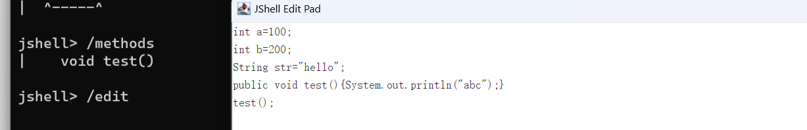


执行外部的代码

```sh
jshell> /open f:./hello.java
|  找不到 '/open' 的文件 'f:./hello.java'。

jshell>
```


查看默认导入的包

```sh
jshell> /imports
|    import java.io.*
|    import java.math.*
|    import java.net.*
|    import java.nio.file.*
|    import java.util.*
|    import java.util.concurrent.*
|    import java.util.function.*
|    import java.util.prefs.*
|    import java.util.regex.*
|    import java.util.stream.*

jshell>
```


退出jshell工具

```sh
jshell> /exit
|  再见
PS C:\Users\mao>
```


## 多版本兼用jar

### 概述

多版本JAR（MR JAR）可能包含同一类的多个变体,每个变体都针对特定的Java版本。 在运行时，类的正确变体将被自动加载，这取决于所使用的Java版本。这允许库作者在早期利用新的Java版本，同时保持与旧版本的兼容性


### 应用场景

比如某个架构师开发了一个工具类MyUtils,该工具类里面使用了jdk9的新特性，这时候该工具在推广的时候会遇到很大的阻力，因为很多用户还没有升级jdk版本，JDK9推出了多版本兼用jar的特性就允许该架构师编写一个同类名的工具MyUtils,并在该工具类中不使用jdk9的新特性，然后两个同类名的类一起打包成为一个jar，提供给用户去使用,这时候即可根据用户当前使用的jdk版本而选择不同的工具类了


### 使用

创建相同名称的类

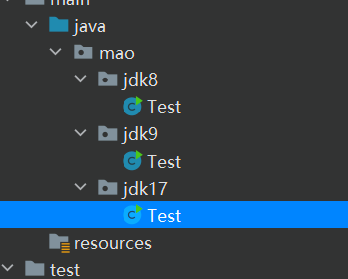


```java
package mao.jdk8;


public class Test
{
    public static void main(String[] args)
    {
        System.out.println("jdk8");
    }
}
```


```java
package mao.jdk9;


public class Test
{
    public static void main(String[] args)
    {
        System.out.println("jdk9");
    }
}
```


```java
package mao.jdk17;


public class Test
{
    public static void main(String[] args)
    {
        System.out.println("jdk17");
    }
}
```


在src目录下编译成class文件：

```sh
javac -d out8 --release 8 main/java/mao/jdk8/Test.java
javac -d out9 --release 9 main/java/mao/jdk9/Test.java
javac -d out17 --release 17 main/java/mao/jdk17/Test.java
```


在src目录下把两个版本的class文件打成jar包

```sh
jar --create --file util.jar -C out9 ./ --release 9 -C out9 .
```


## 接口方法私有化

### 概述

当我们在一个接口里写多个默认方法或者静态方法的时候，可能会遇到程序重复的问题。我们可以把这些重复的程序提取出来，创建一个新的方法，用private进行修饰，这样就创造了一个只有接口可以调用的私有方法


### 使用

以前写法：

```java
package mao;

/**
 * Project name(项目名称)：JDK9_interface_method_privatization
 * Package(包名): mao
 * Interface(接口名): A
 * Author(作者）: mao
 * Author QQ：1296193245
 * GitHub：https://github.com/maomao124/
 * Date(创建日期)： 2023/10/31
 * Time(创建时间)： 12:29
 * Version(版本): 1.0
 * Description(描述)： 无
 */

public interface A
{
    default void methodA()
    {
        System.out.println("methodA...");
        System.out.println("A....");
        System.out.println("B....");
        System.out.println("C....");
    }

    default void methodB()
    {
        System.out.println("methodB...");
        System.out.println("A....");
        System.out.println("B....");
        System.out.println("C....");
    }
}
```


```java
package mao;

/**
 * Project name(项目名称)：JDK9_interface_method_privatization
 * Package(包名): mao
 * Class(类名): Test1
 * Author(作者）: mao
 * Author QQ：1296193245
 * GitHub：https://github.com/maomao124/
 * Date(创建日期)： 2023/10/31
 * Time(创建时间)： 12:38
 * Version(版本): 1.0
 * Description(描述)： 无
 */

public class Test1 implements A
{
    public static void main(String[] args)
    {
        Test1 test1=new Test1();
        test1.methodA();
        test1.methodB();
    }
}
```


```sh
methodA...
A....
B....
C....
methodB...
A....
B....
C....
```


现在的写法

```java
package mao;

/**
 * Project name(项目名称)：JDK9_interface_method_privatization
 * Package(包名): mao
 * Interface(接口名): B
 * Author(作者）: mao
 * Author QQ：1296193245
 * GitHub：https://github.com/maomao124/
 * Date(创建日期)： 2023/10/31
 * Time(创建时间)： 12:33
 * Version(版本): 1.0
 * Description(描述)： 无
 */

public interface B
{
    default void methodA()
    {
        System.out.println("methodA...");
        commons();
    }

    default void methodB()
    {
        System.out.println("methodB...");
        commons();
    }

    /**
     * 定一个私有的方法，把重复部分的代码抽离出来。然后在methodA与methodB方法内部去调用
     * 私有方法只能在本类中调用，这里包括接口的实现类也不能调用
     */
    private void commons()
    {
        System.out.println("A....");
        System.out.println("B....");
        System.out.println("C....");
    }
}
```


```java
package mao;

/**
 * Project name(项目名称)：JDK9_interface_method_privatization
 * Package(包名): mao
 * Class(类名): Test2
 * Author(作者）: mao
 * Author QQ：1296193245
 * GitHub：https://github.com/maomao124/
 * Date(创建日期)： 2023/10/31
 * Time(创建时间)： 12:40
 * Version(版本): 1.0
 * Description(描述)： 无
 */

public class Test2 implements B
{
    public static void main(String[] args)
    {
        Test2 test2=new Test2();
        test2.methodA();
        test2.methodB();
        //test2.commons();
    }
}
```


```sh
methodA...
A....
B....
C....
methodB...
A....
B....
C....
```


调用私有方法：

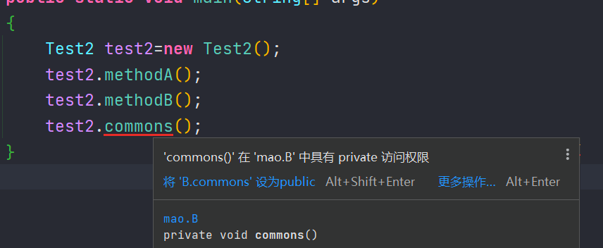


## 释放资源代码优化

### 概述

JDK8以前释放资源代码非常累赘， 如果释放资源较多的时候，很容易就会出现释放资源代码超过了正常业务的代码. 对此随着jdk版本的不断更新迭代，也对释放资源代码做了很大幅度的优化

JDK8开始已经不需要我们再手动关闭资源，只需要把要关闭资源的代码放入try语句中即可，但是要求初始化资源的语句必须位于try语句中

JDK9不要求初始化资源的语句必须位于try语句中


### 使用

jdk8以前：

```java
package mao;

import java.io.BufferedWriter;
import java.io.FileOutputStream;
import java.io.IOException;
import java.io.OutputStreamWriter;
import java.nio.charset.StandardCharsets;

/**
 * Project name(项目名称)：JDK9_release_resources_optimization
 * Package(包名): mao
 * Class(类名): Test1
 * Author(作者）: mao
 * Author QQ：1296193245
 * GitHub：https://github.com/maomao124/
 * Date(创建日期)： 2023/10/31
 * Time(创建时间)： 16:14
 * Version(版本): 1.0
 * Description(描述)： 无
 */

public class Test1
{
    public static void main(String[] args)
    {
        FileOutputStream fileOutputStream = null;
        OutputStreamWriter outputStreamWriter = null;
        BufferedWriter bufferedWriter = null;
        try
        {
            fileOutputStream = new FileOutputStream("a.txt");
            outputStreamWriter = new OutputStreamWriter(fileOutputStream, StandardCharsets.UTF_8);
            bufferedWriter = new BufferedWriter(outputStreamWriter);
            bufferedWriter.write("hello");
            bufferedWriter.write(" world");
            bufferedWriter.flush();
        }
        catch (Exception e)
        {
            e.printStackTrace();
        }
        finally
        {
            try
            {
                if (bufferedWriter != null)
                {
                    bufferedWriter.close();
                }
            }
            catch (IOException e)
            {
                e.printStackTrace();
            }
            try
            {
                if (outputStreamWriter != null)
                {
                    outputStreamWriter.close();
                }
            }
            catch (IOException e)
            {
                e.printStackTrace();
            }
            try
            {
                if (fileOutputStream != null)
                {
                    fileOutputStream.close();
                }
            }
            catch (IOException e)
            {
                e.printStackTrace();
            }
        }

    }
}
```


jdk8：

```java
package mao;

import java.io.BufferedWriter;
import java.io.FileOutputStream;
import java.io.OutputStreamWriter;
import java.nio.charset.StandardCharsets;

/**
 * Project name(项目名称)：JDK9_release_resources_optimization
 * Package(包名): mao
 * Class(类名): Test2
 * Author(作者）: mao
 * Author QQ：1296193245
 * GitHub：https://github.com/maomao124/
 * Date(创建日期)： 2023/10/31
 * Time(创建时间)： 16:15
 * Version(版本): 1.0
 * Description(描述)： 无
 */

public class Test2
{
    public static void main(String[] args)
    {
        try (FileOutputStream fileOutputStream = new FileOutputStream("b.txt");
             OutputStreamWriter outputStreamWriter = new OutputStreamWriter(fileOutputStream, StandardCharsets.UTF_8);
             BufferedWriter bufferedWriter = new BufferedWriter(outputStreamWriter))
        {
            bufferedWriter.write("hello");
            bufferedWriter.write(" world");
            bufferedWriter.flush();
        }
        catch (Exception e)
        {
            e.printStackTrace();
        }
    }
}
```


jdk9：

```java
package mao;

import java.io.BufferedWriter;
import java.io.FileNotFoundException;
import java.io.FileOutputStream;
import java.io.OutputStreamWriter;
import java.nio.charset.StandardCharsets;

/**
 * Project name(项目名称)：JDK9_release_resources_optimization
 * Package(包名): mao
 * Class(类名): Test3
 * Author(作者）: mao
 * Author QQ：1296193245
 * GitHub：https://github.com/maomao124/
 * Date(创建日期)： 2023/10/31
 * Time(创建时间)： 16:15
 * Version(版本): 1.0
 * Description(描述)： 无
 */

public class Test3
{
    public static void main(String[] args) throws FileNotFoundException
    {
        FileOutputStream fileOutputStream = new FileOutputStream("c.txt");
        OutputStreamWriter outputStreamWriter = new OutputStreamWriter(fileOutputStream, StandardCharsets.UTF_8);
        BufferedWriter bufferedWriter = new BufferedWriter(outputStreamWriter);
        try (fileOutputStream; outputStreamWriter; bufferedWriter)
        {
            bufferedWriter.write("hello");
            bufferedWriter.write(" world");
            bufferedWriter.flush();
        }
        catch (Exception e)
        {
            e.printStackTrace();
        }
    }
}
```


## 标识符优化

jdk9之前：

```java
String _ = "hello";
System.out.println(_);
```


以上代码不会报错，允许_作为标识符


JDK9开始：

```java
String _ = "hello";
System.out.println(_);
```


以上代码报错，jdk9开始不允许_作为标识符


## String底层结构的变化

string类的当前实现将字符存储在char数组中，每个字符使用两个字节（16位）。从许多不同的应用程 序收集的数据表明，字符串是堆使用的主要组成部分，而且，大多数字符串对象只包含拉丁-1字符。这 样的字符只需要一个字节的存储空间，因此这样的字符串对象的内部字符数组中的一半空间将被闲置


jdk8：

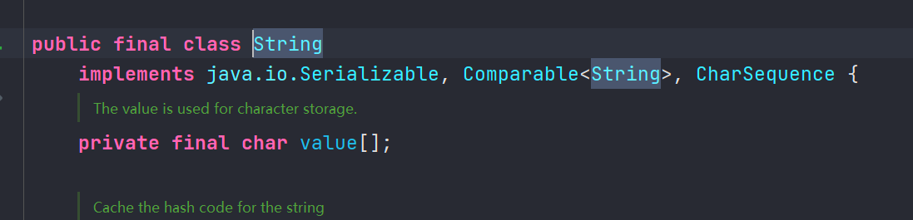


jdk9：

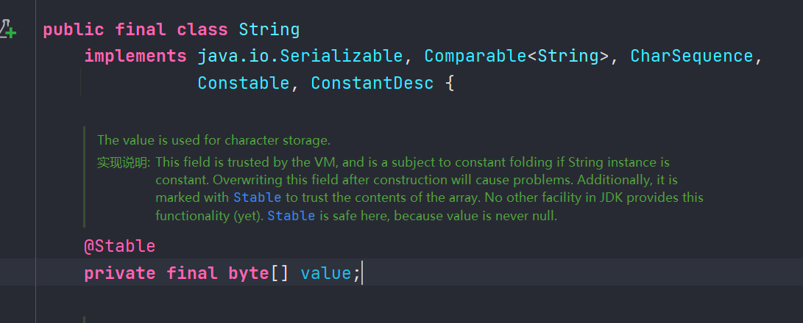


## StringBuffer与StringBuilder底层变化

由于String类底层已经发生变化，所以StringBuilder与StringBuffer底层也相应的发生了改变


jdk8：

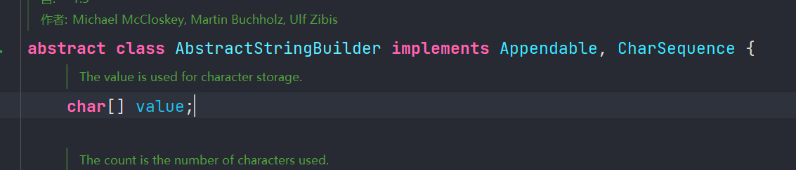


jdk9：

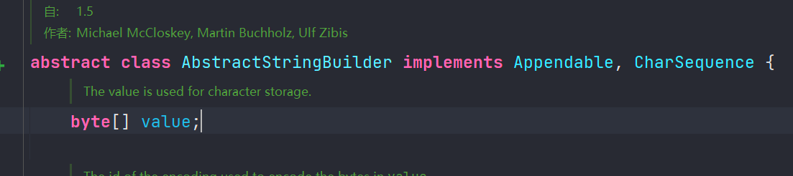


## 快速创建只读集合

### 概述

调用集合中静态方法 of()，可以将不同数量的参数传输到此工厂方法中。此功能可用于 Set 和 List，也可用于 Map 的类似形式。此时得到 的集合，是不可变的

* List.of
* Set.of
* Map.of


### 使用

```java
package mao;

import java.util.List;

/**
 * Project name(项目名称)：JDK9_quickly_create_read_only_collection
 * Package(包名): mao
 * Class(类名): Test1
 * Author(作者）: mao
 * Author QQ：1296193245
 * GitHub：https://github.com/maomao124/
 * Date(创建日期)： 2023/10/31
 * Time(创建时间)： 16:33
 * Version(版本): 1.0
 * Description(描述)： 无
 */

public class Test1
{
    public static void main(String[] args)
    {
        List<String> list = List.of("1", "2", "3", "4", "5", "6");
        System.out.println(list);
        //list.add("7");
    }
}
```


尝试更改：

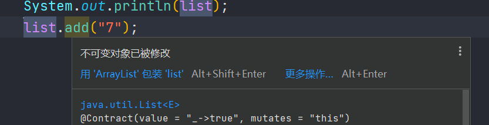


```sh
[1, 2, 3, 4, 5, 6]
Exception in thread "main" java.lang.UnsupportedOperationException
	at java.base/java.util.ImmutableCollections.uoe(ImmutableCollections.java:142)
	at java.base/java.util.ImmutableCollections$AbstractImmutableCollection.add(ImmutableCollections.java:147)
	at mao.Test1.main(Test1.java:24)
```


```java
package mao;

import java.util.Set;


public class Test2
{
    public static void main(String[] args)
    {
        Set<String> set = Set.of("1", "3", "2");
        System.out.println(set);
    }
}
```


```sh
[3, 2, 1]
```


```java
package mao;

import java.util.Map;


public class Test3
{
    public static void main(String[] args)
    {
        Map<String, String> map = Map.of("a1", "b1", "a2", "b2", "a3", "b3");
        System.out.println(map);
    }
}
```


```sh
{a3=b3, a2=b2, a1=b1}
```


## Stream流新增的方法

### 新增方法

* **takeWhile()** ：从Stream中依次获取满足条件的元素，直到不满足条件为止结束获取，只要遇到第一个不满足的条件元素马上停止获取
* **dropWhile()**：从Stream中依次删除满足条件的元素，直到不满足条件为止结束删除
* **ofNullable()**：Java 8中Stream不能完全为 null（一个元素不能为 null 多个元素是可以存在 null ），否则会报空指针异常。而 Java 9 中的 ofNullable 方法允许我们创建一个单元素 Stream，可以包含一个非空元素，也可以创建一个空 Stream


### 使用


```java
package mao;

import java.util.ArrayList;
import java.util.List;
import java.util.function.Predicate;
import java.util.stream.Collectors;

/**
 * Project name(项目名称)：JDK9_Stream
 * Package(包名): mao
 * Class(类名): Test1
 * Author(作者）: mao
 * Author QQ：1296193245
 * GitHub：https://github.com/maomao124/
 * Date(创建日期)： 2023/10/31
 * Time(创建时间)： 16:45
 * Version(版本): 1.0
 * Description(描述)： 无
 */

public class Test1
{
    public static void main(String[] args)
    {
        List<Integer> list = new ArrayList<>();
        for (int i = 0; i < 20; i++)
        {
            list.add(i);
        }
        List<Integer> list1 = list.stream().takeWhile(new Predicate<Integer>()
        {
            @Override
            public boolean test(Integer integer)
            {
                return integer < 10;
            }
        }).collect(Collectors.toList());
        System.out.println(list1);
        List<Integer> list2 = list.stream().takeWhile(integer -> integer % 4 != 3).collect(Collectors.toList());
        System.out.println(list2);
    }
}
```


```sh
[0, 1, 2, 3, 4, 5, 6, 7, 8, 9]
[0, 1, 2]
```


```java
package mao;

import java.util.ArrayList;
import java.util.List;
import java.util.function.Predicate;
import java.util.stream.Collectors;

/**
 * Project name(项目名称)：JDK9_Stream
 * Package(包名): mao
 * Class(类名): Test2
 * Author(作者）: mao
 * Author QQ：1296193245
 * GitHub：https://github.com/maomao124/
 * Date(创建日期)： 2023/10/31
 * Time(创建时间)： 16:54
 * Version(版本): 1.0
 * Description(描述)： 无
 */

public class Test2
{
    public static void main(String[] args)
    {
        List<Integer> list = new ArrayList<>();
        for (int i = 0; i < 20; i++)
        {
            list.add(i);
        }
        List<Integer> list1 = list.stream().dropWhile(new Predicate<Integer>()
        {
            @Override
            public boolean test(Integer integer)
            {
                return integer < 10;
            }
        }).collect(Collectors.toList());
        System.out.println(list1);
        List<Integer> list2 = list.stream().dropWhile(integer -> integer > 10).collect(Collectors.toList());
        System.out.println(list2);
        List<Integer> list3 = list.stream().dropWhile(integer -> integer % 5 != 3).collect(Collectors.toList());
        System.out.println(list3);
    }
}
```


```sh
[10, 11, 12, 13, 14, 15, 16, 17, 18, 19]
[0, 1, 2, 3, 4, 5, 6, 7, 8, 9, 10, 11, 12, 13, 14, 15, 16, 17, 18, 19]
[3, 4, 5, 6, 7, 8, 9, 10, 11, 12, 13, 14, 15, 16, 17, 18, 19]
```


```java
package mao;

import java.util.stream.Stream;

/**
 * Project name(项目名称)：JDK9_Stream
 * Package(包名): mao
 * Class(类名): Test3
 * Author(作者）: mao
 * Author QQ：1296193245
 * GitHub：https://github.com/maomao124/
 * Date(创建日期)： 2023/10/31
 * Time(创建时间)： 16:57
 * Version(版本): 1.0
 * Description(描述)： 无
 */

public class Test3
{
    public static void main(String[] args)
    {
        Stream<Object> stream = Stream.ofNullable(null);
        System.out.println(stream.count());
        System.out.println(stream);
    }
}
```


```sh
0
java.util.stream.ReferencePipeline$Head@4eec7777
```


## 全新的HTTPClinet

### 概述

httpClient的作用就是用于获取网络资源的，Java 9中有新的方式来处理HTTP调用。它提供了一个新的 HTTP 客户端（HttpClient ）， 它将替代仅适用于 blocking模式的HttpURLConnection （HttpURLConnection是在HTTP 1.0的时代创建的， 并使用了协议无关的方法），并提供对 WebSocket 和 HTTP/2 的支持


### 使用

全新的HTTP客户端API可以从jdk.incubator.httpclient模块中获取。 因为在默认情况下，这个模块是不能根据 classpath 获取的，需要使用 add modules 命令选项配置这个模块，将这个模块添加到 classpath 中


```java
package mao;

import java.io.IOException;
import java.net.URI;
import java.net.http.HttpClient;
import java.net.http.HttpRequest;
import java.net.http.HttpResponse;

/**
 * Project name(项目名称)：JDK9_HttpClient
 * Package(包名): mao
 * Class(类名): Test1
 * Author(作者）: mao
 * Author QQ：1296193245
 * GitHub：https://github.com/maomao124/
 * Date(创建日期)： 2023/10/31
 * Time(创建时间)： 17:09
 * Version(版本): 1.0
 * Description(描述)： 无
 */

public class Test1
{
    public static void main(String[] args) throws IOException, InterruptedException
    {
        HttpClient httpClient = HttpClient.newHttpClient();
        HttpRequest httpRequest = HttpRequest.newBuilder(URI
                        .create("https://fanyi.baidu.com/?aldtype=16047#zh/en/"))
                .GET().build();
        HttpResponse<String> httpResponse = httpClient.send(httpRequest, HttpResponse.BodyHandlers.ofString());

        System.out.println(httpResponse.statusCode());
        System.out.println(httpResponse.headers());
        System.out.println(httpResponse.body());
    }
}
```


## G1成为默认垃圾回收器

在 Java 8 的时候，默认垃圾回收器是 Parallel Scavenge（新生代）+Parallel Old（老年代）。到了 Java 9, CMS 垃圾回收器被废弃了，**G1（Garbage-First Garbage Collector）**  成为了默认垃圾回收器。

G1 还是在 Java 7 中被引入的，经过两个版本优异的表现成为成为默认垃圾回收器。


## 进程API

### 概述

Java 9 增加了 `java.lang.ProcessHandle` 接口来实现对原生进程进行管理，尤其适合于管理长时间运行的进程


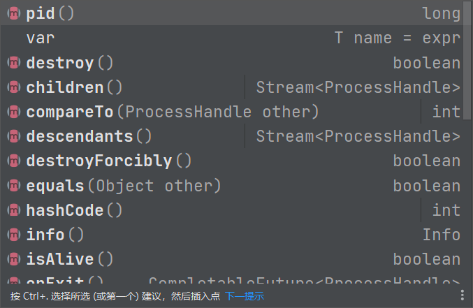


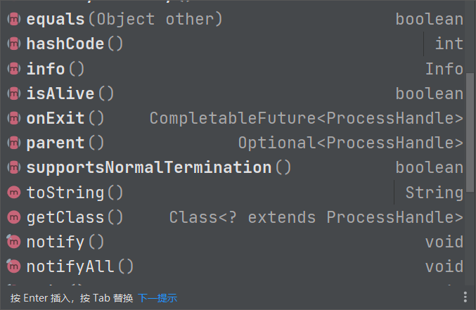


### 使用

```java
package mao;

/**
 * Project name(项目名称)：JDK9_ProcessHandle_API
 * Package(包名): mao
 * Class(类名): Test1
 * Author(作者）: mao
 * Author QQ：1296193245
 * GitHub：https://github.com/maomao124/
 * Date(创建日期)： 2023/10/31
 * Time(创建时间)： 17:31
 * Version(版本): 1.0
 * Description(描述)： 无
 */

public class Test1
{
    public static void main(String[] args)
    {
        ProcessHandle current = ProcessHandle.current();
        System.out.println(current.pid());
        System.out.println(current.supportsNormalTermination());
        System.out.println(current.isAlive());
        System.out.println(current.info());
    }
}
```


```sh
30848
false
true
[user: Optional[MAO\mao], cmd: D:\java\corretto-17.0.8.1\bin\java.exe, startTime: Optional[2023-10-31T09:41:10.388Z], totalTime: Optional[PT0S]]
```


```java
package mao;

import java.util.function.Consumer;
import java.util.stream.Stream;

/**
 * Project name(项目名称)：JDK9_ProcessHandle_API
 * Package(包名): mao
 * Class(类名): Test2
 * Author(作者）: mao
 * Author QQ：1296193245
 * GitHub：https://github.com/maomao124/
 * Date(创建日期)： 2023/10/31
 * Time(创建时间)： 17:41
 * Version(版本): 1.0
 * Description(描述)： 无
 */

public class Test2
{
    public static void main(String[] args)
    {
        Stream<ProcessHandle> processes = ProcessHandle.allProcesses();
        processes.forEach(new Consumer<ProcessHandle>()
        {
            @Override
            public void accept(ProcessHandle processHandle)
            {
                if (processHandle.info().command().isPresent())
                {
                    System.out.println(processHandle.pid() + " -> " +
                            processHandle.info().totalCpuDuration().get() + " -> "
                            + processHandle.info().command().get());
                }
            }
        });
    }
}
```


```sh
36784 -> PT1.890625S -> C:\Program Files\NVIDIA Corporation\NvContainer\nvcontainer.exe
14360 -> PT48.859375S -> C:\Program Files\NVIDIA Corporation\NvContainer\nvcontainer.exe
28768 -> PT1.96875S -> C:\Windows\System32\sihost.exe
35136 -> PT0.015625S -> C:\Windows\System32\svchost.exe
38952 -> PT1.640625S -> C:\Windows\System32\svchost.exe
33404 -> PT0S -> C:\Windows\System32\svchost.exe
35620 -> PT1.328125S -> C:\Windows\System32\svchost.exe
38760 -> PT0.296875S -> C:\Windows\System32\taskhostw.exe
32388 -> PT55.21875S -> C:\Windows\explorer.exe
32160 -> PT1.671875S -> C:\Windows\System32\svchost.exe
17780 -> PT0.234375S -> C:\Windows\SystemApps\MicrosoftWindows.Client.CBS_cw5n1h2txyewy\SearchHost.exe
39152 -> PT0.546875S -> C:\Windows\SystemApps\Microsoft.Windows.StartMenuExperienceHost_cw5n1h2txyewy\StartMenuExperienceHost.exe
30856 -> PT0.75S -> C:\Program Files\WindowsApps\MicrosoftWindows.Client.WebExperience_423.23500.0.0_x64__cw5n1h2txyewy\Dashboard\Widgets.exe
37496 -> PT0.015625S -> C:\Windows\System32\RuntimeBroker.exe
23656 -> PT0.109375S -> C:\Windows\System32\RuntimeBroker.exe
23532 -> PT0S -> C:\Windows\System32\svchost.exe
10616 -> PT0.84375S -> C:\Program Files (x86)\NVIDIA Corporation\NvNode\NVIDIA Web Helper.exe
38168 -> PT0S -> C:\Windows\System32\dllhost.exe
40276 -> PT0.015625S -> C:\Windows\System32\conhost.exe
27600 -> PT0.0625S -> C:\Windows\System32\svchost.exe
16704 -> PT26.09375S -> C:\Program Files\WindowsApps\Microsoft.YourPhone_1.23082.131.0_x64__8wekyb3d8bbwe\PhoneExperienceHost.exe
9524 -> PT0.0625S -> C:\Program Files\WindowsApps\MicrosoftWindows.Client.WebExperience_423.23500.0.0_x64__cw5n1h2txyewy\Dashboard\WidgetService.exe
40448 -> PT0.09375S -> C:\Windows\System32\RuntimeBroker.exe
21944 -> PT0S -> C:\Windows\System32\SecurityHealthSystray.exe
19288 -> PT28.140625S -> C:\Program Files\NVIDIA Corporation\NVIDIA GeForce Experience\NVIDIA Share.exe
19256 -> PT0.046875S -> C:\Windows\System32\DriverStore\FileRepository\realtekservice.inf_amd64_917a88f607017da2\RtkAudUService64.exe
30092 -> PT0.0625S -> C:\Program Files\NVIDIA Corporation\NVIDIA GeForce Experience\NVIDIA Share.exe
20888 -> PT1.390625S -> C:\Program Files\NVIDIA Corporation\NVIDIA GeForce Experience\NVIDIA Share.exe
31428 -> PT1.875S -> D:\Program Files\Oray\SunLogin\SunloginClient\SunloginClient.exe
35216 -> PT4.15625S -> C:\Windows\SystemApps\MicrosoftWindows.Client.CBS_cw5n1h2txyewy\TextInputHost.exe
34024 -> PT1M28.25S -> D:\Program Files (x86)\Steam\steam.exe
35004 -> PT0.421875S -> C:\Windows\System32\NahimicSvc64.exe
30512 -> PT4.609375S -> C:\Windows\SysWOW64\NahimicSvc32.exe
6728 -> PT6.53125S -> C:\Windows\System32\DriverStore\FileRepository\ipf_cpu.inf_amd64_cf5beef3831571d4\ipf_helper.exe
20720 -> PT0.71875S -> D:\Program Files (x86)\SogouInput\13.7.0.8141\SGTool.exe
19612 -> PT37.859375S -> D:\Program Files (x86)\Steam\steamapps\common\wallpaper_engine\wallpaper32.exe
12688 -> PT23.953125S -> D:\Program Files (x86)\Steam\bin\cef\cef.win7x64\steamwebhelper.exe
23716 -> PT0.03125S -> D:\Program Files (x86)\Steam\bin\cef\cef.win7x64\steamwebhelper.exe
37364 -> PT0.625S -> D:\Program Files (x86)\Steam\bin\cef\cef.win7x64\steamwebhelper.exe
32372 -> PT0.703125S -> D:\Program Files (x86)\Steam\bin\cef\cef.win7x64\steamwebhelper.exe
27416 -> PT30.015625S -> D:\Program Files (x86)\Tencent\QQ\Bin\QQ.exe
19020 -> PT3S -> D:\Program Files (x86)\Steam\bin\cef\cef.win7x64\steamwebhelper.exe
14916 -> PT0S -> C:\Windows\System32\RuntimeBroker.exe
32960 -> PT1.1875S -> C:\Program Files\WindowsApps\ControlCenter3_5.17.49.6_x64__h329z55cwnj8g\Win32\SystrayComponent.exe
4184 -> PT0S -> D:\Program Files (x86)\Tencent\QQ\Bin\TXPlatform.exe
10584 -> PT0.296875S -> C:\Program Files\WindowsApps\AppUp.IntelGraphicsExperience_1.100.5185.0_x64__8j3eq9eme6ctt\GCP.ML.BackgroundSysTray\IGCCTray.exe
7000 -> PT0.03125S -> C:\Program Files\WindowsApps\AppUp.IntelGraphicsExperience_1.100.5185.0_x64__8j3eq9eme6ctt\IGCC.exe
1916 -> PT0S -> C:\Windows\System32\RuntimeBroker.exe
36420 -> PT0.03125S -> D:\Program Files (x86)\Steam\bin\cef\cef.win7x64\steamwebhelper.exe
23584 -> PT0.25S -> C:\Windows\SystemApps\ShellExperienceHost_cw5n1h2txyewy\ShellExperienceHost.exe
38540 -> PT0.15625S -> C:\Windows\System32\RuntimeBroker.exe
6140 -> PT0.015625S -> D:\Program Files (x86)\Adobe\Acrobat DC\Acrobat\acrotray.exe
20408 -> PT0.015625S -> C:\Windows\System32\ApplicationFrameHost.exe
21800 -> PT0.09375S -> C:\Program Files\WindowsApps\A-Volute.Nahimic_1.9.22.0_x64__w2gh52qy24etm\Nahimic3.exe
35584 -> PT0.0625S -> C:\Windows\System32\RuntimeBroker.exe
31040 -> PT1.171875S -> C:\Windows\System32\SystemSettingsBroker.exe
7776 -> PT0S -> C:\Windows\System32\svchost.exe
12372 -> PT16.296875S -> D:\Program Files (x86)\Tencent\QQ\Bin\QQ.exe
19620 -> PT1M18.4375S -> D:\soft\sts-bundle\sts-3.9.6.RELEASE\STS.exe
36080 -> PT24.0625S -> C:\Users\mao\AppData\Local\Tencent\QQGuild\9.7.13-296\QQGuild.exe
22388 -> PT0.078125S -> C:\Users\mao\AppData\Local\Tencent\QQGuild\9.7.13-296\QQGuild.exe
31168 -> PT0.25S -> C:\Users\mao\AppData\Local\Tencent\QQGuild\9.7.13-296\QQGuild.exe
17160 -> PT24.59375S -> C:\Users\mao\AppData\Local\Tencent\QQGuild\9.7.13-296\QQGuild.exe
40068 -> PT0.03125S -> C:\Users\mao\AppData\Local\Tencent\QQGuild\9.7.13-296\QQGuild.exe
37868 -> PT0.28125S -> C:\Users\mao\AppData\Local\Tencent\QQGuild\9.7.13-296\QQGuild.exe
18420 -> PT0.28125S -> C:\Users\mao\AppData\Local\Tencent\QQGuild\9.7.13-296\QQGuild.exe
20080 -> PT38M46.59375S -> D:\Program Files\JetBrains\IntelliJ IDEA 2021.2.2\bin\idea64.exe
26748 -> PT0.09375S -> C:\Users\mao\AppData\Local\Tencent\QQGuild\9.7.13-296\QQGuild.exe
24048 -> PT0.203125S -> C:\Users\mao\AppData\Local\Tencent\QQGuild\9.7.13-296\QQGuild.exe
20304 -> PT0.21875S -> C:\Users\mao\AppData\Local\Tencent\QQGuild\9.7.13-296\QQGuild.exe
37136 -> PT1.609375S -> D:\Program Files\JetBrains\IntelliJ IDEA 2021.2.2\bin\fsnotifier.exe
36440 -> PT0S -> C:\Windows\System32\conhost.exe
2984 -> PT0.015625S -> C:\Windows\System32\backgroundTaskHost.exe
23720 -> PT0.140625S -> C:\Windows\System32\svchost.exe
17732 -> PT26M38.015625S -> D:\java\corretto-1.8.0_332\jre\bin\javaw.exe
18900 -> PT1M11.03125S -> C:\Program Files (x86)\Microsoft\Edge\Application\msedge.exe
27048 -> PT0.015625S -> C:\Program Files (x86)\Microsoft\Edge\Application\msedge.exe
20352 -> PT55.0625S -> C:\Program Files (x86)\Microsoft\Edge\Application\msedge.exe
7980 -> PT6.15625S -> C:\Program Files (x86)\Microsoft\Edge\Application\msedge.exe
4004 -> PT0.09375S -> C:\Program Files (x86)\Microsoft\Edge\Application\msedge.exe
10576 -> PT3.609375S -> C:\Program Files (x86)\Microsoft\Edge\Application\msedge.exe
27376 -> PT0.53125S -> C:\Program Files (x86)\Microsoft\Edge\Application\msedge.exe
14056 -> PT0.15625S -> C:\Program Files (x86)\Microsoft\Edge\Application\msedge.exe
15192 -> PT0.390625S -> C:\Program Files (x86)\Microsoft\Edge\Application\msedge.exe
9012 -> PT0.015625S -> C:\Windows\System32\LocationNotificationWindows.exe
14616 -> PT18.296875S -> C:\Program Files (x86)\Microsoft\Edge\Application\msedge.exe
19896 -> PT0.03125S -> C:\Program Files (x86)\Microsoft\Edge\Application\msedge.exe
39528 -> PT0.140625S -> C:\Windows\System32\RuntimeBroker.exe
16960 -> PT0.03125S -> C:\Windows\ImmersiveControlPanel\SystemSettings.exe
41564 -> PT0S -> C:\Windows\System32\oobe\UserOOBEBroker.exe
4936 -> PT1.875S -> D:\Program Files (x86)\SogouInput\13.7.0.8141\SGTool.exe
40320 -> PT13.953125S -> D:\Program Files (x86)\SogouInput\13.7.0.8141\SogouCloud.exe
30964 -> PT1.328125S -> C:\Program Files\Microsoft Office\root\Office16\SDXHelper.exe
30680 -> PT0.25S -> C:\Program Files (x86)\Microsoft\Edge\Application\msedge.exe
5076 -> PT0S -> C:\Windows\SysWOW64\IME\SogouPY\SogouImeBroker.exe
24428 -> PT23.328125S -> D:\Program Files (x86)\Tencent\WeChat\WeChat.exe
16820 -> PT0.015625S -> D:\Program Files (x86)\Tencent\WeChat\[3.9.7.29]\mmcrashpad_handler64.exe
25472 -> PT18.5625S -> C:\Users\mao\AppData\Roaming\Tencent\WeChat\XPlugin\Plugins\RadiumWMPF\8461\extracted\runtime\WeChatAppEx.exe
33952 -> PT0.140625S -> C:\Users\mao\AppData\Roaming\Tencent\WeChat\XPlugin\Plugins\RadiumWMPF\8461\extracted\runtime\WeChatAppEx.exe
28404 -> PT0.296875S -> C:\Users\mao\AppData\Roaming\Tencent\WeChat\XPlugin\Plugins\RadiumWMPF\8461\extracted\runtime\WeChatAppEx.exe
36656 -> PT1.65625S -> C:\Users\mao\AppData\Roaming\Tencent\WeChat\XPlugin\Plugins\RadiumWMPF\8461\extracted\runtime\WeChatAppEx.exe
12332 -> PT0.015625S -> C:\Users\mao\AppData\Roaming\Tencent\WeChat\XPlugin\Plugins\ThumbPlayer\4063\extracted\WeChatPlayer.exe
38468 -> PT0.0625S -> C:\Users\mao\AppData\Roaming\Tencent\WeChat\XPlugin\Plugins\WeChatUtility\8077\extracted\WeChatUtility.exe
40216 -> PT0.03125S -> C:\Users\mao\AppData\Roaming\Tencent\WeChat\XPlugin\Plugins\WeChatOCR\7057\extracted\WeChatOCR.exe
26164 -> PT0.1875S -> C:\Users\mao\AppData\Roaming\Tencent\WeChat\XPlugin\Plugins\RadiumWMPF\8461\extracted\runtime\WeChatAppEx.exe
6700 -> PT1.296875S -> C:\Users\mao\AppData\Roaming\Tencent\WeChat\XPlugin\Plugins\RadiumWMPF\8461\extracted\runtime\WeChatAppEx.exe
33472 -> PT0.046875S -> C:\Users\mao\AppData\Roaming\Tencent\WeChat\XPlugin\Plugins\RadiumWMPF\8461\extracted\runtime\WeChatAppEx.exe
25112 -> PT0.265625S -> C:\Users\mao\AppData\Roaming\Tencent\WeChat\XPlugin\Plugins\RadiumWMPF\8461\extracted\runtime\WeChatAppEx.exe
25096 -> PT48.3125S -> D:\soft\Typora\Typora.exe
2616 -> PT14.4375S -> D:\soft\Typora\Typora.exe
40192 -> PT0.53125S -> D:\soft\Typora\Typora.exe
24548 -> PT2M7.671875S -> D:\soft\Typora\Typora.exe
41360 -> PT0.625S -> D:\Program Files\JetBrains\IntelliJ IDEA 2021.2.2\jbr\bin\jcef_helper.exe
9540 -> PT0.28125S -> D:\Program Files\JetBrains\IntelliJ IDEA 2021.2.2\jbr\bin\jcef_helper.exe
8408 -> PT46.625S -> C:\Program Files (x86)\Microsoft\Edge\Application\msedge.exe
16780 -> PT49.703125S -> C:\Program Files (x86)\Microsoft\Edge\Application\msedge.exe
1552 -> PT1.015625S -> D:\Program Files\TortoiseSVN\bin\TSVNCache.exe
37528 -> PT1M31.34375S -> D:\Program Files\PremiumSoft\Navicat 15 for MySQL\navicat.exe
31172 -> PT0.015625S -> C:\Windows\System32\dllhost.exe
38060 -> PT0.03125S -> C:\Program Files (x86)\Microsoft\Edge\Application\msedge.exe
33668 -> PT0S -> C:\Program Files (x86)\Microsoft\Edge\Application\msedge.exe
24032 -> PT0.359375S -> C:\Program Files\OEM\机械革命电竞控制台\UniwillService\MyControlCenter\OSDTpDetect.exe
2096 -> PT1.203125S -> C:\Program Files (x86)\Microsoft\Edge\Application\msedge.exe
24820 -> PT0.015625S -> C:\Program Files (x86)\Microsoft\Edge\Application\msedge.exe
17288 -> PT0.984375S -> D:\soft\Typora\Typora.exe
37948 -> PT9.71875S -> D:\soft\Typora\Typora.exe
27732 -> PT0.671875S -> D:\Program Files\JetBrains\IntelliJ IDEA 2021.2.2\jbr\bin\java.exe
37288 -> PT0S -> C:\Windows\System32\conhost.exe
21088 -> PT0S -> C:\Users\mao\AppData\Roaming\Tencent\WeChat\XPlugin\Plugins\RadiumWMPF\8461\extracted\runtime\WeChatAppEx.exe
24848 -> PT0S -> C:\Users\mao\AppData\Local\Tencent\QQGuild\9.7.13-296\QQGuild.exe
28328 -> PT0.015625S -> C:\Users\mao\AppData\Local\Tencent\QQGuild\9.7.13-296\QQGuild.exe
26220 -> PT0S -> C:\Program Files (x86)\Microsoft\Edge\Application\msedge.exe
12692 -> PT0.015625S -> D:\soft\Typora\Typora.exe
9660 -> PT0S -> D:\Program Files (x86)\Steam\bin\cef\cef.win7x64\steamwebhelper.exe
11164 -> PT0.046875S -> D:\java\corretto-17.0.8.1\bin\java.exe
41244 -> PT0S -> C:\Windows\System32\conhost.exe
31604 -> PT0.03125S -> D:\java\corretto-17.0.8.1\bin\java.exe
32176 -> PT0S -> C:\Windows\System32\conhost.exe
```


```java
package mao;

import java.util.Optional;

/**
 * Project name(项目名称)：JDK9_ProcessHandle_API
 * Package(包名): mao
 * Class(类名): Test3
 * Author(作者）: mao
 * Author QQ：1296193245
 * GitHub：https://github.com/maomao124/
 * Date(创建日期)： 2023/10/31
 * Time(创建时间)： 17:53
 * Version(版本): 1.0
 * Description(描述)： 无
 */

public class Test3
{
    public static void main(String[] args)
    {
        Optional<ProcessHandle> optional = ProcessHandle.of(24428);
        if (optional.isPresent())
        {
            ProcessHandle processHandle = optional.get();
            System.out.println(processHandle.info());
            System.out.println(processHandle.isAlive());
            //结束
            System.out.println(processHandle.destroy());
            System.out.println(processHandle.isAlive());
        }

    }
}
```


```sh
[user: Optional[MAO\mao], cmd: D:\Program Files (x86)\Tencent\WeChat\WeChat.exe, startTime: Optional[2023-10-31T01:00:47.987Z], totalTime: Optional[PT25.28125S]]
true
true
false
```


结束全部进程：

```java
package mao;

import java.util.function.Consumer;
import java.util.stream.Stream;

/**
 * Project name(项目名称)：JDK9_ProcessHandle_API
 * Package(包名): mao
 * Class(类名): Test4
 * Author(作者）: mao
 * Author QQ：1296193245
 * GitHub：https://github.com/maomao124/
 * Date(创建日期)： 2023/10/31
 * Time(创建时间)： 17:58
 * Version(版本): 1.0
 * Description(描述)： 无
 */

public class Test4
{
    public static void main(String[] args)
    {
        Stream<ProcessHandle> processes = ProcessHandle.allProcesses();
        processes.forEach(new Consumer<ProcessHandle>()
        {
            @Override
            public void accept(ProcessHandle processHandle)
            {
                try
                {
                    boolean destroy = processHandle.destroy();
                    System.out.println(destroy);
                }
                catch (Exception e)
                {
                    System.out.println(e.getMessage());
                }
            }
        });
    }
}

```


## 响应式流


## 变量句柄

