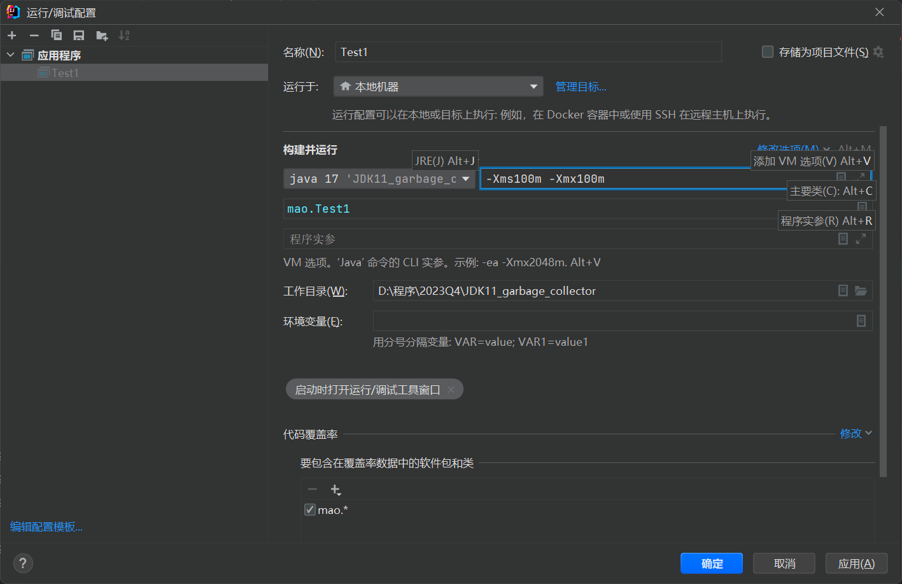
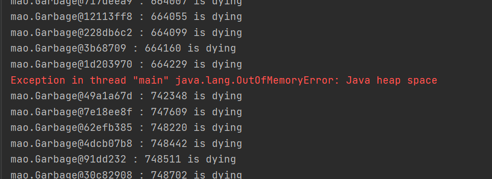
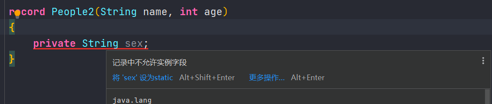
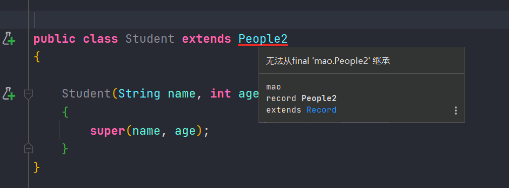

<h1 style="font-size:3.3em;color:skyblue;text-align:center">JDK新特性学习笔记</h1>

[toc]

---


# 概述

JDK是 Java 语言的软件开发工具包，主要用于移动设备、嵌入式设备上的java应用程序。JDK是整个java开发的核心，它包含了JAVA的运行环境（JVM+Java系统类库）和JAVA工具


## 发布日期

|        版本         |                名称                 |  发行日期  |
| :-----------------: | :---------------------------------: | :--------: |
|      JDK 1.1.4      |          Sparkler（宝石）           | 1997-09-12 |
|      JDK 1.1.5      |           Pumpkin（南瓜）           | 1997-12-13 |
|      JDK 1.1.6      |     Abigail（阿比盖尔–女子名）      | 1998-04-24 |
|      JDK 1.1.7      | Brutus（布鲁图–古罗马政治家和将军） | 1998-09-28 |
|      JDK 1.1.8      |      Chelsea（切尔西–城市名）       | 1999-04-08 |
|      J2SE 1.2       |        Playground（运动场）         | 1998-12-04 |
|     J2SE 1.2.1      |             none（无）              | 1999-03-30 |
|     J2SE 1.2.2      |           Cricket（蟋蟀）           | 1999-07-08 |
|      J2SE 1.3       |         Kestrel（美洲红隼）         | 2000-05-08 |
|     J2SE 1.3.1      |          Ladybird（瓢虫）           | 2001-05-17 |
|     J2SE 1.4.0      |          Merlin（灰背隼）           | 2002-02-13 |
|     J2SE 1.4.1      |         grasshopper（蚱蜢）         | 2002-09-16 |
|     J2SE 1.4.2      |           Mantis（螳螂）            | 2003-06-26 |
|      J2SE 5.0       |                                     |  2004-09   |
| Java SE 5.0 (1.5.0) |            Tiger（老虎）            | 2004-09-30 |
| Java SE 6.0 (1.6.0) |           Mustang（野马）           |  2006-04   |
| Java SE 7.0 (1.7.0) |           Dolphin（海豚）           | 2011-07-28 |
| Java SE 8.0 (1.8.0) |           Spider（蜘蛛）            | 2014-03-18 |
|      Java SE 9      |                                     | 2017-09-21 |
|     Java SE 10      |                                     | 2018-03-14 |
|     Java SE 11      |                                     | 2018-09-26 |
|     Java SE 12      |                                     | 2019-03-20 |
|     Java SE 13      |                                     | 2019-09-17 |
|     Java SE 14      |                                     | 2020-03-17 |
|     Java SE 15      |                                     |  2020-09   |
|     Java SE 16      |                                     |  2021-03   |
|     Java SE 17      |                                     |  2021-09   |
|     Java SE 18      |                                     | 2022-03-22 |
|     Java SE 19      |                                     | 2022-09-20 |


## 特性概述

### JDK 1.0

***1996-01-23 Oak(橡树)***

* 初代版本，伟大的一个里程碑，但是是纯解释运行，使用外挂JIT，性能比较差，运行速度慢。


### JDK 1.1

*1997-02-19*

* JDBC(Java DataBase Connectivity);
* 支持内部类;
* RMI(Remote Method Invocation) ;
* 反射;
* Java Bean;


### JDK 1.2

* 集合框架;
* JIT(Just In Time)编译器;
* 对打包的Java文件进行数字签名;
* JFC(Java Foundation Classes), 包括Swing 1.0, 拖放和Java2D类库;
* Java插件;
* JDBC中引入可滚动结果集,BLOB,CLOB,批量更新和用户自定义类型;
* Applet中添加声音支持.
* 同时，Sun发布了 JSP/Servlet、EJB规范，以及将Java分成了 J2EE、J2SE和J2ME。 这表明了 Java开始向企业、桌面
* 应用和移动设备应用3大领域挺进。


### JDK 1.3

2000-05-08 Kestrel(红隼)

* Java Sound API;
* jar文件索引;
* 对Java的各个方面都做了大量优化和增强;


### JDK 1.4

2004-02-06 Merlin(隼)

* XML处理;
* Java打印服务;
* Logging API;
* Java Web Start;
* JDBC 3.0 API;
* 断言;
* Preferences API;
* 链式异常处理;
* 支持IPV6;
* 支持正则表达式;
* 引入Imgae I/O API.


### JAVA 5

2004-09-30 Tiger(老虎)

* 泛型;
* 增强循环,可以使用迭代方式;
* 自动装箱与自动拆箱;
* 类型安全的枚举;
* 可变参数;
* 静态引入;
* 元数据(注解);
* Instrumentation;


### JAVA 6

2006-12-11 Mustang(野马)

* 支持脚本语言;
* JDBC 4.0API;
* Java Compiler API;
* 可插拔注解;
* 增加对Native PKI(Public Key Infrastructure), Java GSS(Generic Security Service),Kerberos和LDAP(Lightweight Directory Access Protocol)支持;
* 继承Web Services;


### JAVA 7

2011-07-28 Dolphin(海豚)

* switch语句块中允许以字符串作为分支条件;
* 在创建泛型对象时应用类型推断;
* 在一个语句块中捕获多种异常;
* 支持动态语言;
* 支持try-with-resources(在一个语句块中捕获多种异常);
* 引入Java NIO.2开发包;
* 数值类型可以用二进制字符串表示,并且可以在字符串表示中添加下划线;
  钻石型语法(在创建泛型对象时应用类型推断);
* null值得自动处理;


### JAVA 8

**2014-03-18** 

* Lambda 表达式 − Lambda允许把函数作为一个方法的参数（函数作为参数传递进方法中。
* 方法引用 − 方法引用提供了非常有用的语法，可以直接引用已有Java类或对象（实例）的方法或构造器。与lambda联合使用，方法引用可以使语言的构造更紧凑简洁，减少冗余代码。
* 默认方法 − 默认方法就是一个在接口里面有了一个实现的方法。
* 新工具 − 新的编译工具，如：Nashorn引擎 jjs、 类依赖分析器jdeps。
* Stream API −新添加的Stream API（java.util.stream） 把真正的函数式编程风格引入到Java中。
* Date Time API − 加强对日期与时间的处理。
* Optional 类 − Optional 类已经成为 Java 8 类库的一部分，用来解决空指针异常。
* Nashorn, JavaScript 引擎 − Java 8提供了一个新的Nashorn javascript引擎，它允许我们在JVM上运行特定的javascript应用。


### JAVA 9

2017-09-22

* 模块系统：模块是一个包的容器，Java 9 最大的变化之一是引入了模块系统（Jigsaw 项目）。
  REPL (JShell)：交互式编程环境。
* HTTP 2 客户端：HTTP/2标准是HTTP协议的最新版本，新的 HTTPClient API 支持 WebSocket 和 HTTP2 流以及服务器推送特性。
* 改进的 Javadoc：Javadoc 现在支持在 API 文档中的进行搜索。另外，Javadoc 的输出现在符合兼容 HTML5 标准。
* 多版本兼容 JAR 包：多版本兼容 JAR 功能能让你创建仅在特定版本的 Java 环境中运行库程序时选择使用的 class 版本。
* 集合工厂方法：List，Set 和 Map 接口中，新的静态工厂方法可以创建这些集合的不可变实例。
* 私有接口方法：在接口中使用private私有方法。我们可以使用 private 访问修饰符在接口中编写私有方法。
* 进程 API: 改进的 API 来控制和管理操作系统进程。引进 java.lang.ProcessHandle 及其嵌套接口 Info 来让开发者逃离时常因为要获取一个本地进程的 PID 而不得不使用本地代码的窘境。
* 改进的 Stream API：改进的 Stream API 添加了一些便利的方法，使流处理更容易，并使用收集器编写复杂的查询。
* 改进 try-with-resources：如果你已经有一个资源是 final 或等效于 final 变量,您可以在 try-with-resources 语句中使用该变量，而无需在 try-with-resources 语句中声明一个新变量。
* 改进的弃用注解 @Deprecated：注解 @Deprecated 可以标记 Java API 状态，可以表示被标记的 API 将会被移除，或者已经破坏。
* 改进钻石操作符(Diamond Operator) ：匿名类可以使用钻石操作符(Diamond Operator)。
  改进 Optional 类：java.util.Optional 添加了很多新的有用方法，Optional 可以直接转为 stream。
* 多分辨率图像 API：定义多分辨率图像API，开发者可以很容易的操作和展示不同分辨率的图像了。
  改进的 CompletableFuture API ： CompletableFuture 类的异步机制可以在 ProcessHandle.onExit 方法退出时执行操作。
* 轻量级的 JSON API：内置了一个轻量级的JSON API
* 响应式流（Reactive Streams) API: Java 9中引入了新的响应式流 API 来支持 Java 9 中的响应式编程。


### JAVA 10

2018-03-21

根据官网的公开资料，共有12个重要特性，如下：

* JEP286，var 局部变量类型推断。
* JEP296，将原来用 Mercurial 管理的众多 JDK 仓库代码，合并到一个仓库中，简化开发和管理过程
* JEP304，统一的垃圾回收接口。
* JEP307，G1 垃圾回收器的并行完整垃圾回收，实现并行性来改善最坏情况下的延迟。
* JEP310，应用程序类数据 (AppCDS) 共享，通过跨进程共享通用类元数据来减少内存占用空间，和减少启动时间。
* JEP312，ThreadLocal 握手交互。在不进入到全局 JVM 安全点 (Safepoint) 的情况下，对线程执行回调。优化可以只停止单个线程，而不是停全部线程或一个都不停。
* JEP313，移除 JDK 中附带的 javah 工具。可以使用 javac -h 代替。
* JEP314，使用附加的 Unicode 语言标记扩展。
* JEP317，能将堆内存占用分配给用户指定的备用内存设备。
* JEP317，使用 Graal 基于 Java 的编译器，可以预先把 Java 代码编译成本地代码来提升效能。
* JEP318，在 OpenJDK 中提供一组默认的根证书颁发机构证书。开源目前 Oracle 提供的的 Java SE 的根证书，这样 OpenJDK 对开发人员使用起来更方便。
* JEP322，基于时间定义的发布版本，即上述提到的发布周期。版本号为\$FEATURE.\$INTERIM.\$UPDATE.\$PATCH，分j别是大版本，中间版本，升级包和补丁版本。


### JAVA 11

2018-09-25 

翻译后的新特性有：

* 181:Nest-Based访问控制
* 309:动态类文件常量
* 315:改善Aarch64 intrinsic
* 318:无操作垃圾收集器
* 320:消除Java EE和CORBA模块
* 321:HTTP客户端(标准)
* 323:局部变量的语法λ参数
* 324:Curve25519和Curve448关键协议
* 327:Unicode 10
* 328:飞行记录器
* 329:ChaCha20和Poly1305加密算法
* 330:发射一列纵队源代码程序
* 331:低开销堆分析
* 332:传输层安全性(Transport Layer Security,TLS)1.3
* 333:动作:一个可伸缩的低延迟垃圾收集器 (实验)
* 335:反对Nashorn JavaScript引擎
* 336:反对Pack200工具和API


### JAVA 12

2018-09-25 

翻译后的新特性有：

* 189: Shenandoah: A Low-Pause-Time Garbage Collector (Experimental) ：新增一个名为 Shenandoah 的垃圾回收器，它通过在 Java 线程运行的同时进行疏散 (evacuation) 工作来减少停顿时间。
* 230: Microbenchmark Suite：新增一套微基准测试，使开发者能够基于现有的 Java Microbenchmark Harness（JMH）轻松测试 JDK 的性能，并创建新的基准测试。
* 325: Switch Expressions (Preview) ：对 switch 语句进行扩展，使其可以用作语句或表达式，简化日常代码。
* 334: JVM Constants API ：引入一个 API 来对关键类文件 (key class-file) 和运行时工件的名义描述（nominal descriptions）进行建模，特别是那些可从常量池加载的常量。
* 340: One AArch64 Port, Not Two ：删除与 arm64 端口相关的所有源码，保留 32 位 ARM 移植和 64 位 aarch64 移植。
* 341: Default CDS Archives ：默认生成类数据共享（CDS）存档。
* 344: Abortable Mixed Collections for G1 ：当 G1 垃圾回收器的回收超过暂停目标，则能中止垃圾回收过程.
* 346: Promptly Return Unused Committed Memory from G1 ：改进 G1 垃圾回收器，以便在空闲时自动将 Java 堆内存返回给操作系统。


# JDK8

## Lambda表达式

### 传统写法

```java
package mao;

/**
 * Project name(项目名称)：JDK8-Lambda
 * Package(包名): mao
 * Class(类名): Test1
 * Author(作者）: mao
 * Author QQ：1296193245
 * GitHub：https://github.com/maomao124/
 * Date(创建日期)： 2023/10/19
 * Time(创建时间)： 16:55
 * Version(版本): 1.0
 * Description(描述)： 无
 */

public class Test1
{
    public static void main(String[] args)
    {
        new Thread(new Runnable()
        {
            @Override
            public void run()
            {
                System.out.println("线程运行");
            }
        }).start();
    }
}

```


### Lambda表达式写法

```java
package mao;

/**
 * Project name(项目名称)：JDK8-Lambda
 * Package(包名): mao
 * Class(类名): Test2
 * Author(作者）: mao
 * Author QQ：1296193245
 * GitHub：https://github.com/maomao124/
 * Date(创建日期)： 2023/10/19
 * Time(创建时间)： 16:59
 * Version(版本): 1.0
 * Description(描述)： 无
 */

public class Test2
{
    public static void main(String[] args)
    {
        new Thread(() -> System.out.println("线程运行")).start();
    }
}

```


### 分析

对于Runnable接口的匿名内部类用法，可以分析出几点内容：

* Thread 类需要 Runnable 接口作为参数，其中的抽象 run 方法是用来指定线程任务内容的核心
* 为了指定 run 的方法体，需要Runnable 接口的实现类
* 为了省去定义一个 Runnable实现类的麻烦，使用匿名内部类
* 必须覆盖重写抽象run方法，所以方法名称、方法参数、方法返回值不得不再写一遍，且不能写错


Lambda是一个匿名函数，可以理解为一段可以传递的代码


Lambda语法和传统语法执行效果是完全一样的，可以在JDK 8或更高的编译级别下通过。从代码的语义中可以看出：我们 启动了一个线程，而线程任务的内容以一种更加简洁的形式被指定

我们只需要将要执行的代码放到一个Lambda表达式中，不需要定义类，不需要创建对象


### 优点

* 简化匿名内部类的使用

* 语法更加简单


### 标准格式

```sh
(参数类型 参数名称) -> {
    代码体;
 }
```


格式：

* (参数类型 参数名称)：参数列表
* {代码体;}：方法体
* -> ：箭头，分隔参数列表和方法体


### 有返回值的Lambda

#### 传统写法

使用传统的代码对ArrayList集合进行排序


实体类：

```java
package mao;

import java.util.StringJoiner;

/**
 * Project name(项目名称)：JDK8-Lambda
 * Package(包名): mao
 * Class(类名): Student
 * Author(作者）: mao
 * Author QQ：1296193245
 * GitHub：https://github.com/maomao124/
 * Date(创建日期)： 2023/10/20
 * Time(创建时间)： 16:38
 * Version(版本): 1.0
 * Description(描述)： 无
 */

public class Student
{
    private Long id;
    private String name;
    private int age;

    public Long getId()
    {
        return id;
    }

    public Student setId(Long id)
    {
        this.id = id;
        return this;
    }

    public String getName()
    {
        return name;
    }

    public Student setName(String name)
    {
        this.name = name;
        return this;
    }

    public int getAge()
    {
        return age;
    }

    public Student setAge(int age)
    {
        this.age = age;
        return this;
    }

    @Override
    public String toString()
    {
        return new StringJoiner(", ", Student.class.getSimpleName() + "[", "]")
                .add("id=" + id)
                .add("name='" + name + "'")
                .add("age=" + age)
                .toString();
    }
}
```


传统写法：

```java
package mao;

import java.util.ArrayList;
import java.util.Comparator;
import java.util.List;

/**
 * Project name(项目名称)：JDK8-Lambda
 * Package(包名): mao
 * Class(类名): Test3
 * Author(作者）: mao
 * Author QQ：1296193245
 * GitHub：https://github.com/maomao124/
 * Date(创建日期)： 2023/10/20
 * Time(创建时间)： 16:40
 * Version(版本): 1.0
 * Description(描述)： 无
 */

public class Test3
{
    public static void main(String[] args)
    {
        List<Student> studentList = new ArrayList<>(4);
        studentList.add(new Student()
                .setId(1L)
                .setName("测试1")
                .setAge(13));
        studentList.add(new Student()
                .setId(2L)
                .setName("测试2")
                .setAge(12));
        studentList.add(new Student()
                .setId(3L)
                .setName("测试3")
                .setAge(19));
        studentList.add(new Student()
                .setId(4L)
                .setName("测试4")
                .setAge(8));
        studentList.sort(new Comparator<Student>()
        {
            @Override
            public int compare(Student o1, Student o2)
            {
                return o1.getAge() - o2.getAge();
            }
        });
        System.out.println(studentList);
    }
}
```


```sh
[Student[id=4, name='测试4', age=8], Student[id=2, name='测试2', age=12], Student[id=1, name='测试1', age=13], Student[id=3, name='测试3', age=19]]
```


#### Lambda写法

```java
package mao;

import java.util.ArrayList;
import java.util.Comparator;
import java.util.List;

/**
 * Project name(项目名称)：JDK8-Lambda
 * Package(包名): mao
 * Class(类名): Test4
 * Author(作者）: mao
 * Author QQ：1296193245
 * GitHub：https://github.com/maomao124/
 * Date(创建日期)： 2023/10/20
 * Time(创建时间)： 16:45
 * Version(版本): 1.0
 * Description(描述)： 无
 */

public class Test4
{
    public static void main(String[] args)
    {
        List<Student> studentList = new ArrayList<>(4);
        studentList.add(new Student()
                .setId(1L)
                .setName("测试1")
                .setAge(13));
        studentList.add(new Student()
                .setId(2L)
                .setName("测试2")
                .setAge(12));
        studentList.add(new Student()
                .setId(3L)
                .setName("测试3")
                .setAge(19));
        studentList.add(new Student()
                .setId(4L)
                .setName("测试4")
                .setAge(8));
        studentList.sort((o1, o2) -> o1.getAge() - o2.getAge());
        System.out.println(studentList);
    }
}
```


```sh
[Student[id=4, name='测试4', age=8], Student[id=2, name='测试2', age=12], Student[id=1, name='测试1', age=13], Student[id=3, name='测试3', age=19]]
```


### 实现原理

匿名内部类在编译的时候会一个class文件

Lambda在程序运行的时候形成一个类


### Lambda省略格式

在Lambda标准格式的基础上，使用省略写法的规则为：

* 小括号内参数的类型可以省略
* 如果小括号内有且仅有一个参数，则小括号可以省略
* 如果大括号内有且仅有一个语句，可以同时省略大括号、return关键字及语句分号


### 前提条件

Lambda的语法非常简洁，但是Lambda表达式不是随便使用的，使用时有几个条件：

* 方法的参数或局部变量类型必须为接口才能使用Lambda
* 接口中有且仅有一个抽象方法


### 函数式接口

函数式接口在Java中是指：有且仅有一个抽象方法的接口

函数式接口，即适用于函数式编程场景的接口。而Java中的函数式编程体现就是Lambda

函数式接口就是可以 适用于Lambda使用的接口。只有确保接口中有且仅有一个抽象方法，Java中的Lambda才能顺利地进行推导


**@FunctionalInterface注解**：一旦使用该注解来定义接口，编译器将会强制检查该接口是否确实有且仅有一个抽象方法，否则将会报错。不过，即 使不使用该注解，只要满足函数式接口的定义，这仍然是一个函数式接口，使用起来都一样


```java
package mao;

@FunctionalInterface
public interface MyFunctionalInterface
{
    void run();
}
```


### 对比

Lambda和匿名内部类在使用上的区别：

* 所需的类型不一样
  * 匿名内部类，需要的类型可以是类、抽象类、接口
  * Lambda表达式，需要的类型必须是接口
* 抽象方法的数量不一样
  * 匿名内部类所需的接口中抽象方法的数量随意
  * Lambda表达式所需的接口只能有一个抽象方法
* 实现原理不同
  * 匿名内部类是在编译后会形成class
  * Lambda表达式是在程序运行的时候动态生成class


## 接口默认方法

### 概述

JDK 8以前的接口：

```
interface 接口名 {
    静态常量;
    抽象方法;
}
```


JDK 8对接口的增强，接口还可以有默认方法和静态方法


```
interface 接口名 {
    静态常量;
    抽象方法;
    默认方法;
    静态方法;
}
```


### 背景

在JDK 8以前接口中只能有抽象方法。存在以下问题：

```java
package mao;

public interface MyFunctionalInterface
{
    void run();
}

class Test5 implements MyFunctionalInterface
{

    @Override
    public void run()
    {

    }
}

class Test6 implements MyFunctionalInterface
{

    @Override
    public void run()
    {

    }
}

```


如果给接口新增抽象方法，所有实现类都必须重写这个抽象方法。不利于接口的扩展

```java
package mao;

public interface MyFunctionalInterface
{
    void run();

    void run2();
}

class Test5 implements MyFunctionalInterface
{

    @Override
    public void run()
    {

    }

    @Override
    public void run2()
    {
        
    }
}

class Test6 implements MyFunctionalInterface
{

    @Override
    public void run()
    {

    }
}

```


因此，在JDK 8时为接口新增了默认方法


### 定义格式

```
interface 接口名 { 
    修饰符 default 返回值类型 方法名() { 
        代码; 
    } 
} 
```


### 使用

* 方式一：实现类直接调用接口默认方法
* 方式二：实现类重写接口默认方法


#### 方式一

```java
package mao;

/**
 * Project name(项目名称)：JDK8-Lambda
 * Package(包名): mao
 * Interface(接口名): MyFunctionalInterface2
 * Author(作者）: mao
 * Author QQ：1296193245
 * GitHub：https://github.com/maomao124/
 * Date(创建日期)： 2023/10/20
 * Time(创建时间)： 17:22
 * Version(版本): 1.0
 * Description(描述)： 接口默认方法-实现类直接调用接口默认方法
 */

public interface MyFunctionalInterface2
{
    void run();

    default void run2()
    {
        System.out.println("执行MyFunctionalInterface2.run2");
    }

}

class Test7 implements MyFunctionalInterface2
{

    @Override
    public void run()
    {

    }

    public static void main(String[] args)
    {
        Test7 test7=new Test7();
        test7.run2();
    }
}
```


#### 方式二

```java
package mao;

/**
 * Project name(项目名称)：JDK8-Lambda
 * Package(包名): mao
 * Interface(接口名): MyFunctionalInterface3
 * Author(作者）: mao
 * Author QQ：1296193245
 * GitHub：https://github.com/maomao124/
 * Date(创建日期)： 2023/10/20
 * Time(创建时间)： 17:29
 * Version(版本): 1.0
 * Description(描述)： 无
 */

public interface MyFunctionalInterface3
{
    void run();

    default void run2()
    {
        System.out.println("执行MyFunctionalInterface3.run2");
    }
}


class Test8 implements MyFunctionalInterface3
{

    @Override
    public void run()
    {

    }

    @Override
    public void run2()
    {
        System.out.println("执行Test8.run2");
    }

    public static void main(String[] args)
    {
        Test8 test8 = new Test8();
        test8.run2();
    }
}
```


```sh
执行Test8.run2
```


## 接口静态方法

### 定义格式

```
interface 接口名 {
    修饰符 static 返回值类型 方法名() {
        代码;
    }
}
```


### 使用

接口名.静态方法名()

```java
package mao;

/**
 * Project name(项目名称)：JDK8-Lambda
 * Package(包名): mao
 * Interface(接口名): MyFunctionalInterface4
 * Author(作者）: mao
 * Author QQ：1296193245
 * GitHub：https://github.com/maomao124/
 * Date(创建日期)： 2023/10/20
 * Time(创建时间)： 17:52
 * Version(版本): 1.0
 * Description(描述)： 无
 */

public interface MyFunctionalInterface4
{
    static void run3()
    {
        System.out.println("MyFunctionalInterface4静态方法run3");
    }
}

class Test9 implements MyFunctionalInterface4
{
    public static void main(String[] args)
    {
        MyFunctionalInterface4.run3();
    }
}
```


### 默认方法和静态方法的区别

* 默认方法通过实例调用，静态方法通过接口名调用
*  默认方法可以被继承，实现类可以直接使用接口默认方法，也可以重写接口默认方法
* 静态方法不能被继承，实现类不能重写接口静态方法，只能使用接口名调用


## 常用内置函数式接口

### 概述

使用Lambda表达式的前提是需要有函数式接口，而Lambda使用时不关心接口名，抽象方法名，只关心抽 象方法的参数列表和返回值类型。因此为了让我们使用Lambda方便，JDK提供了大量常用的函数式接口


它们主要在 java.util.function包


常用接口：

* Supplier接口
* Consumer接口
* Function接口
* Predicate接口


### Supplier接口

对应的Lambda表达式需要“对外提供”一个符合泛型类型的对象数据

供给型接口，通过Supplier接口中的get方法可以得到一个值，无参有返回的接口

```java
/*
 * Copyright (c) 2012, 2013, Oracle and/or its affiliates. All rights reserved.
 * DO NOT ALTER OR REMOVE COPYRIGHT NOTICES OR THIS FILE HEADER.
 *
 * This code is free software; you can redistribute it and/or modify it
 * under the terms of the GNU General Public License version 2 only, as
 * published by the Free Software Foundation.  Oracle designates this
 * particular file as subject to the "Classpath" exception as provided
 * by Oracle in the LICENSE file that accompanied this code.
 *
 * This code is distributed in the hope that it will be useful, but WITHOUT
 * ANY WARRANTY; without even the implied warranty of MERCHANTABILITY or
 * FITNESS FOR A PARTICULAR PURPOSE.  See the GNU General Public License
 * version 2 for more details (a copy is included in the LICENSE file that
 * accompanied this code).
 *
 * You should have received a copy of the GNU General Public License version
 * 2 along with this work; if not, write to the Free Software Foundation,
 * Inc., 51 Franklin St, Fifth Floor, Boston, MA 02110-1301 USA.
 *
 * Please contact Oracle, 500 Oracle Parkway, Redwood Shores, CA 94065 USA
 * or visit www.oracle.com if you need additional information or have any
 * questions.
 */
package java.util.function;

/**
 * Represents a supplier of results.
 *
 * <p>There is no requirement that a new or distinct result be returned each
 * time the supplier is invoked.
 *
 * <p>This is a <a href="package-summary.html">functional interface</a>
 * whose functional method is {@link #get()}.
 *
 * @param <T> the type of results supplied by this supplier
 *
 * @since 1.8
 */
@FunctionalInterface
public interface Supplier<T> {

    /**
     * Gets a result.
     *
     * @return a result
     */
    T get();
}
```


使用Lambda表达式返回数组元素最大值

```java
package mao;

import java.util.Arrays;
import java.util.function.Supplier;

/**
 * Project name(项目名称)：JDK8_FunctionalInterface
 * Package(包名): mao
 * Class(类名): Test1
 * Author(作者）: mao
 * Author QQ：1296193245
 * GitHub：https://github.com/maomao124/
 * Date(创建日期)： 2023/10/20
 * Time(创建时间)： 18:03
 * Version(版本): 1.0
 * Description(描述)： Supplier
 */

public class Test1
{
    public static void main(String[] args)
    {
        printMax(() ->
        {
            int[] arr = {10, 20, 100, 30, 40, 50};
            Arrays.sort(arr);
            return arr[arr.length - 1];
        });
    }

    private static void printMax(Supplier<Integer> supplier)
    {
        int max = supplier.get();
        System.out.println("max = " + max);
    }
}
```


### Consumer接口

消费一个数据，其数据类型由泛型参数决定

```java
/*
 * Copyright (c) 2010, 2013, Oracle and/or its affiliates. All rights reserved.
 * DO NOT ALTER OR REMOVE COPYRIGHT NOTICES OR THIS FILE HEADER.
 *
 * This code is free software; you can redistribute it and/or modify it
 * under the terms of the GNU General Public License version 2 only, as
 * published by the Free Software Foundation.  Oracle designates this
 * particular file as subject to the "Classpath" exception as provided
 * by Oracle in the LICENSE file that accompanied this code.
 *
 * This code is distributed in the hope that it will be useful, but WITHOUT
 * ANY WARRANTY; without even the implied warranty of MERCHANTABILITY or
 * FITNESS FOR A PARTICULAR PURPOSE.  See the GNU General Public License
 * version 2 for more details (a copy is included in the LICENSE file that
 * accompanied this code).
 *
 * You should have received a copy of the GNU General Public License version
 * 2 along with this work; if not, write to the Free Software Foundation,
 * Inc., 51 Franklin St, Fifth Floor, Boston, MA 02110-1301 USA.
 *
 * Please contact Oracle, 500 Oracle Parkway, Redwood Shores, CA 94065 USA
 * or visit www.oracle.com if you need additional information or have any
 * questions.
 */
package java.util.function;

import java.util.Objects;

/**
 * Represents an operation that accepts a single input argument and returns no
 * result. Unlike most other functional interfaces, {@code Consumer} is expected
 * to operate via side-effects.
 *
 * <p>This is a <a href="package-summary.html">functional interface</a>
 * whose functional method is {@link #accept(Object)}.
 *
 * @param <T> the type of the input to the operation
 *
 * @since 1.8
 */
@FunctionalInterface
public interface Consumer<T> {

    /**
     * Performs this operation on the given argument.
     *
     * @param t the input argument
     */
    void accept(T t);

    /**
     * Returns a composed {@code Consumer} that performs, in sequence, this
     * operation followed by the {@code after} operation. If performing either
     * operation throws an exception, it is relayed to the caller of the
     * composed operation.  If performing this operation throws an exception,
     * the {@code after} operation will not be performed.
     *
     * @param after the operation to perform after this operation
     * @return a composed {@code Consumer} that performs in sequence this
     * operation followed by the {@code after} operation
     * @throws NullPointerException if {@code after} is null
     */
    default Consumer<T> andThen(Consumer<? super T> after) {
        Objects.requireNonNull(after);
        return (T t) -> { accept(t); after.accept(t); };
    }
}
```


使用Lambda表达式将一个字符串转成大写和小写的字符串

```java
package mao;

import java.util.Locale;
import java.util.function.Consumer;

/**
 * Project name(项目名称)：JDK8_FunctionalInterface
 * Package(包名): mao
 * Class(类名): Test2
 * Author(作者）: mao
 * Author QQ：1296193245
 * GitHub：https://github.com/maomao124/
 * Date(创建日期)： 2023/10/20
 * Time(创建时间)： 18:29
 * Version(版本): 1.0
 * Description(描述)： 无
 */

public class Test2
{
    public static void main(String[] args)
    {
        test(s -> System.out.println(s.toUpperCase(Locale.ROOT)));
    }

    private static void test(Consumer<String> consumer)
    {
        consumer.accept("hello");
    }
}

```


**andThen**：如果一个方法的参数和返回值全都是 Consumer 类型，那么就可以实现效果：消费一个数据的时候，首先做一个操作，然后再做一个操作，实现组合

```java
package mao;

import java.util.Locale;
import java.util.function.Consumer;

/**
 * Project name(项目名称)：JDK8_FunctionalInterface
 * Package(包名): mao
 * Class(类名): Test3
 * Author(作者）: mao
 * Author QQ：1296193245
 * GitHub：https://github.com/maomao124/
 * Date(创建日期)： 2023/10/20
 * Time(创建时间)： 18:35
 * Version(版本): 1.0
 * Description(描述)： 无
 */

public class Test3
{
    public static void main(String[] args)
    {
        test(s -> System.out.println(s.toUpperCase(Locale.ROOT)),
                s -> System.out.println(s.length()));
    }

    private static void test(Consumer<String> consumer1,Consumer<String> consumer2)
    {
        //consumer1.accept("hello");
        //consumer2.accept("world");
        consumer2.andThen(consumer1).accept("world");
        consumer1.andThen(consumer2).accept("world");
    }
}

```


```sh
5
WORLD
WORLD
5
```


### Function接口

Function接口用来根据一个类型的数据得到另一个类型的数据，前者称为前置条件，后者称为后置条件。有参数有返回值

```java
/*
 * Copyright (c) 2010, 2013, Oracle and/or its affiliates. All rights reserved.
 * DO NOT ALTER OR REMOVE COPYRIGHT NOTICES OR THIS FILE HEADER.
 *
 * This code is free software; you can redistribute it and/or modify it
 * under the terms of the GNU General Public License version 2 only, as
 * published by the Free Software Foundation.  Oracle designates this
 * particular file as subject to the "Classpath" exception as provided
 * by Oracle in the LICENSE file that accompanied this code.
 *
 * This code is distributed in the hope that it will be useful, but WITHOUT
 * ANY WARRANTY; without even the implied warranty of MERCHANTABILITY or
 * FITNESS FOR A PARTICULAR PURPOSE.  See the GNU General Public License
 * version 2 for more details (a copy is included in the LICENSE file that
 * accompanied this code).
 *
 * You should have received a copy of the GNU General Public License version
 * 2 along with this work; if not, write to the Free Software Foundation,
 * Inc., 51 Franklin St, Fifth Floor, Boston, MA 02110-1301 USA.
 *
 * Please contact Oracle, 500 Oracle Parkway, Redwood Shores, CA 94065 USA
 * or visit www.oracle.com if you need additional information or have any
 * questions.
 */
package java.util.function;

import java.util.Objects;

/**
 * Represents a function that accepts one argument and produces a result.
 *
 * <p>This is a <a href="package-summary.html">functional interface</a>
 * whose functional method is {@link #apply(Object)}.
 *
 * @param <T> the type of the input to the function
 * @param <R> the type of the result of the function
 *
 * @since 1.8
 */
@FunctionalInterface
public interface Function<T, R> {

    /**
     * Applies this function to the given argument.
     *
     * @param t the function argument
     * @return the function result
     */
    R apply(T t);

    /**
     * Returns a composed function that first applies the {@code before}
     * function to its input, and then applies this function to the result.
     * If evaluation of either function throws an exception, it is relayed to
     * the caller of the composed function.
     *
     * @param <V> the type of input to the {@code before} function, and to the
     *           composed function
     * @param before the function to apply before this function is applied
     * @return a composed function that first applies the {@code before}
     * function and then applies this function
     * @throws NullPointerException if before is null
     *
     * @see #andThen(Function)
     */
    default <V> Function<V, R> compose(Function<? super V, ? extends T> before) {
        Objects.requireNonNull(before);
        return (V v) -> apply(before.apply(v));
    }

    /**
     * Returns a composed function that first applies this function to
     * its input, and then applies the {@code after} function to the result.
     * If evaluation of either function throws an exception, it is relayed to
     * the caller of the composed function.
     *
     * @param <V> the type of output of the {@code after} function, and of the
     *           composed function
     * @param after the function to apply after this function is applied
     * @return a composed function that first applies this function and then
     * applies the {@code after} function
     * @throws NullPointerException if after is null
     *
     * @see #compose(Function)
     */
    default <V> Function<T, V> andThen(Function<? super R, ? extends V> after) {
        Objects.requireNonNull(after);
        return (T t) -> after.apply(apply(t));
    }

    /**
     * Returns a function that always returns its input argument.
     *
     * @param <T> the type of the input and output objects to the function
     * @return a function that always returns its input argument
     */
    static <T> Function<T, T> identity() {
        return t -> t;
    }
}
```


使用Lambda表达式将字符串转成数字

```java
package mao;

import java.util.function.Function;

/**
 * Project name(项目名称)：JDK8_FunctionalInterface
 * Package(包名): mao
 * Class(类名): Test4
 * Author(作者）: mao
 * Author QQ：1296193245
 * GitHub：https://github.com/maomao124/
 * Date(创建日期)： 2023/10/20
 * Time(创建时间)： 18:42
 * Version(版本): 1.0
 * Description(描述)： 无
 */

public class Test4
{
    public static void main(String[] args)
    {
        test(s -> Integer.parseInt(s));
    }

    private static void test(Function<String, Integer> function)
    {
        Integer integer = function.apply("112");
        System.out.println(integer);
    }
}
```


### Predicate接口

有时候我们需要对某种类型的数据进行判断，从而得到一个boolean值结果。这时可以使用Predicate接口

```java
/*
 * Copyright (c) 2010, 2013, Oracle and/or its affiliates. All rights reserved.
 * DO NOT ALTER OR REMOVE COPYRIGHT NOTICES OR THIS FILE HEADER.
 *
 * This code is free software; you can redistribute it and/or modify it
 * under the terms of the GNU General Public License version 2 only, as
 * published by the Free Software Foundation.  Oracle designates this
 * particular file as subject to the "Classpath" exception as provided
 * by Oracle in the LICENSE file that accompanied this code.
 *
 * This code is distributed in the hope that it will be useful, but WITHOUT
 * ANY WARRANTY; without even the implied warranty of MERCHANTABILITY or
 * FITNESS FOR A PARTICULAR PURPOSE.  See the GNU General Public License
 * version 2 for more details (a copy is included in the LICENSE file that
 * accompanied this code).
 *
 * You should have received a copy of the GNU General Public License version
 * 2 along with this work; if not, write to the Free Software Foundation,
 * Inc., 51 Franklin St, Fifth Floor, Boston, MA 02110-1301 USA.
 *
 * Please contact Oracle, 500 Oracle Parkway, Redwood Shores, CA 94065 USA
 * or visit www.oracle.com if you need additional information or have any
 * questions.
 */
package java.util.function;

import java.util.Objects;

/**
 * Represents a predicate (boolean-valued function) of one argument.
 *
 * <p>This is a <a href="package-summary.html">functional interface</a>
 * whose functional method is {@link #test(Object)}.
 *
 * @param <T> the type of the input to the predicate
 *
 * @since 1.8
 */
@FunctionalInterface
public interface Predicate<T> {

    /**
     * Evaluates this predicate on the given argument.
     *
     * @param t the input argument
     * @return {@code true} if the input argument matches the predicate,
     * otherwise {@code false}
     */
    boolean test(T t);

    /**
     * Returns a composed predicate that represents a short-circuiting logical
     * AND of this predicate and another.  When evaluating the composed
     * predicate, if this predicate is {@code false}, then the {@code other}
     * predicate is not evaluated.
     *
     * <p>Any exceptions thrown during evaluation of either predicate are relayed
     * to the caller; if evaluation of this predicate throws an exception, the
     * {@code other} predicate will not be evaluated.
     *
     * @param other a predicate that will be logically-ANDed with this
     *              predicate
     * @return a composed predicate that represents the short-circuiting logical
     * AND of this predicate and the {@code other} predicate
     * @throws NullPointerException if other is null
     */
    default Predicate<T> and(Predicate<? super T> other) {
        Objects.requireNonNull(other);
        return (t) -> test(t) && other.test(t);
    }

    /**
     * Returns a predicate that represents the logical negation of this
     * predicate.
     *
     * @return a predicate that represents the logical negation of this
     * predicate
     */
    default Predicate<T> negate() {
        return (t) -> !test(t);
    }

    /**
     * Returns a composed predicate that represents a short-circuiting logical
     * OR of this predicate and another.  When evaluating the composed
     * predicate, if this predicate is {@code true}, then the {@code other}
     * predicate is not evaluated.
     *
     * <p>Any exceptions thrown during evaluation of either predicate are relayed
     * to the caller; if evaluation of this predicate throws an exception, the
     * {@code other} predicate will not be evaluated.
     *
     * @param other a predicate that will be logically-ORed with this
     *              predicate
     * @return a composed predicate that represents the short-circuiting logical
     * OR of this predicate and the {@code other} predicate
     * @throws NullPointerException if other is null
     */
    default Predicate<T> or(Predicate<? super T> other) {
        Objects.requireNonNull(other);
        return (t) -> test(t) || other.test(t);
    }

    /**
     * Returns a predicate that tests if two arguments are equal according
     * to {@link Objects#equals(Object, Object)}.
     *
     * @param <T> the type of arguments to the predicate
     * @param targetRef the object reference with which to compare for equality,
     *               which may be {@code null}
     * @return a predicate that tests if two arguments are equal according
     * to {@link Objects#equals(Object, Object)}
     */
    static <T> Predicate<T> isEqual(Object targetRef) {
        return (null == targetRef)
                ? Objects::isNull
                : object -> targetRef.equals(object);
    }
}
```


```java
package mao;

import java.util.function.Predicate;

/**
 * Project name(项目名称)：JDK8_FunctionalInterface
 * Package(包名): mao
 * Class(类名): Test5
 * Author(作者）: mao
 * Author QQ：1296193245
 * GitHub：https://github.com/maomao124/
 * Date(创建日期)： 2023/10/20
 * Time(创建时间)： 18:54
 * Version(版本): 1.0
 * Description(描述)： 无
 */

public class Test5
{
    public static void main(String[] args)
    {
        test(s -> s.equals("hello"));
        test(s -> s.contains("c"));
    }

    private static void test(Predicate<String> predicate)
    {
        boolean b = predicate.test("hello");
        System.out.println(b);
    }
}
```


默认方法and、or、negate：既然是条件判断，就会存在与、或、非三种常见的逻辑关系。其中将两个Predicate条件使用“与”逻辑连接起来实现“并且”的效果时，可以使用default方法and，or、negate同理。


## 方法引用

### 传统写法

```java
package mao;

import java.util.ArrayList;
import java.util.List;
import java.util.function.Consumer;

/**
 * Project name(项目名称)：JDK8_method_reference
 * Package(包名): mao
 * Class(类名): Test1
 * Author(作者）: mao
 * Author QQ：1296193245
 * GitHub：https://github.com/maomao124/
 * Date(创建日期)： 2023/10/23
 * Time(创建时间)： 15:30
 * Version(版本): 1.0
 * Description(描述)： 无
 */

public class Test1
{
    public static void main(String[] args)
    {
        List<Student> studentList = new ArrayList<>(4);
        studentList.add(new Student()
                .setId(1L)
                .setName("测试1")
                .setAge(13));
        studentList.add(new Student()
                .setId(2L)
                .setName("测试2")
                .setAge(12));
        studentList.add(new Student()
                .setId(3L)
                .setName("测试3")
                .setAge(19));
        studentList.add(new Student()
                .setId(4L)
                .setName("测试4")
                .setAge(8));
        studentList.sort((o1, o2) -> o1.getAge() - o2.getAge());
        System.out.println(studentList);
    }

}
```


### 方法引用

```java
package mao;

import java.util.ArrayList;
import java.util.Comparator;
import java.util.List;

/**
 * Project name(项目名称)：JDK8_method_reference
 * Package(包名): mao
 * Class(类名): Test2
 * Author(作者）: mao
 * Author QQ：1296193245
 * GitHub：https://github.com/maomao124/
 * Date(创建日期)： 2023/10/23
 * Time(创建时间)： 15:40
 * Version(版本): 1.0
 * Description(描述)： 无
 */

public class Test2
{
    public static void main(String[] args)
    {
        List<Student> studentList = new ArrayList<>(4);
        studentList.add(new Student()
                .setId(1L)
                .setName("测试1")
                .setAge(13));
        studentList.add(new Student()
                .setId(2L)
                .setName("测试2")
                .setAge(12));
        studentList.add(new Student()
                .setId(3L)
                .setName("测试3")
                .setAge(19));
        studentList.add(new Student()
                .setId(4L)
                .setName("测试4")
                .setAge(8));
        studentList.sort(Comparator.comparingInt(Student::getAge));
        System.out.println(studentList);
    }
}
```


也可以更改成：

```java
package mao;

import java.util.ArrayList;
import java.util.Comparator;
import java.util.List;

/**
 * Project name(项目名称)：JDK8_method_reference
 * Package(包名): mao
 * Class(类名): Test3
 * Author(作者）: mao
 * Author QQ：1296193245
 * GitHub：https://github.com/maomao124/
 * Date(创建日期)： 2023/10/23
 * Time(创建时间)： 15:41
 * Version(版本): 1.0
 * Description(描述)： 无
 */

public class Test3
{
    public static void main(String[] args)
    {
        List<Student> studentList = new ArrayList<>(4);
        studentList.add(new Student()
                .setId(1L)
                .setName("测试1")
                .setAge(13));
        studentList.add(new Student()
                .setId(2L)
                .setName("测试2")
                .setAge(12));
        studentList.add(new Student()
                .setId(3L)
                .setName("测试3")
                .setAge(19));
        studentList.add(new Student()
                .setId(4L)
                .setName("测试4")
                .setAge(8));
        studentList.sort(Test3::compare);
        System.out.println(studentList);
    }

    private static int compare(Student o1, Student o2)
    {
        return o1.getAge() - o2.getAge();
    }
}
```


双冒号::写法，这被称为**方法引用**


### 格式

* 符号表示 : **::**
* 符号说明 : 双冒号为方法引用运算符，而它所在的表达式被称为方法引用
* 应用场景 : 如果Lambda所要实现的方案 , 已经有其他方法存在相同方案，那么则可以使用方法引用


### 引用方式

有以下几种形式：

* **instanceName::methodName**  ：对象::方法名
* **ClassName::staticMethodName**  ：类名::静态方法
* **ClassName::methodName**  ： 类名::普通方法
* **ClassName::new**  ： 类名::new 调用的构造器
* **TypeName[]::new**  ： String[]::new 调用数组的构造器


### 对象名::方法名

```java
package mao;

import java.util.Date;
import java.util.function.Supplier;

/**
 * Project name(项目名称)：JDK8_method_reference
 * Package(包名): mao
 * Class(类名): Test4
 * Author(作者）: mao
 * Author QQ：1296193245
 * GitHub：https://github.com/maomao124/
 * Date(创建日期)： 2023/10/23
 * Time(创建时间)： 15:48
 * Version(版本): 1.0
 * Description(描述)： 无
 */

public class Test4
{
    public static void main(String[] args)
    {
        Date now = new Date();
        Supplier<Long> supplier = now::getTime;
        System.out.println(supplier.get());
    }
}
```


* 被引用的方法，参数要和接口中抽象方法的参数一样
* 当接口抽象方法有返回值时，被引用的方法也必须有返回值


### 类名::静态方法

```java
package mao;

import java.util.Date;
import java.util.function.Supplier;

/**
 * Project name(项目名称)：JDK8_method_reference
 * Package(包名): mao
 * Class(类名): Test5
 * Author(作者）: mao
 * Author QQ：1296193245
 * GitHub：https://github.com/maomao124/
 * Date(创建日期)： 2023/10/23
 * Time(创建时间)： 15:53
 * Version(版本): 1.0
 * Description(描述)： 无
 */

public class Test5
{
    public static void main(String[] args)
    {
        Supplier<Long> supplier = System::currentTimeMillis;
        System.out.println(supplier.get());
    }
}
```


### 类名::普通方法

类名只能调用静态方法，类名引用实例方法是有前提的，实际上是拿第一个参数作为方法的调用者

```java
package mao;

import java.util.function.BiFunction;
import java.util.function.Function;

/**
 * Project name(项目名称)：JDK8_method_reference
 * Package(包名): mao
 * Class(类名): Test6
 * Author(作者）: mao
 * Author QQ：1296193245
 * GitHub：https://github.com/maomao124/
 * Date(创建日期)： 2023/10/23
 * Time(创建时间)： 15:56
 * Version(版本): 1.0
 * Description(描述)： 无
 */

public class Test6
{
    public static void main(String[] args)
    {
        Function<String, Integer> f1 = (s) ->
        {
            return s.length();
        };
        System.out.println(f1.apply("abc"));
        Function<String, Integer> f2 = String::length;
        System.out.println(f2.apply("abc"));
        BiFunction<String, Integer, String> bif = String::substring;
        String hello = bif.apply("hello", 2);
        System.out.println("hello = " + hello);
    }
}
```


### 类名::new引用构造器

```java
package mao;

import java.util.function.Supplier;

/**
 * Project name(项目名称)：JDK8_method_reference
 * Package(包名): mao
 * Class(类名): Test7
 * Author(作者）: mao
 * Author QQ：1296193245
 * GitHub：https://github.com/maomao124/
 * Date(创建日期)： 2023/10/23
 * Time(创建时间)： 15:59
 * Version(版本): 1.0
 * Description(描述)： 无
 */

public class Test7
{
    public static void main(String[] args)
    {
        Supplier<Test7> supplier = Test7::new;
        supplier.get().hello();
    }

    public void hello()
    {
        System.out.println("hello!");
    }
}
```


### 数组::new引用数组构造器

```java
package mao;

import java.util.Arrays;
import java.util.function.Function;

/**
 * Project name(项目名称)：JDK8_method_reference
 * Package(包名): mao
 * Class(类名): Test8
 * Author(作者）: mao
 * Author QQ：1296193245
 * GitHub：https://github.com/maomao124/
 * Date(创建日期)： 2023/10/23
 * Time(创建时间)： 16:03
 * Version(版本): 1.0
 * Description(描述)： 无
 */

public class Test8
{
    public static void main(String[] args)
    {
        Function<Integer, String[]> fun = (len) ->
        {
            return new String[len];
        };
        String[] arr1 = fun.apply(10);
        System.out.println(Arrays.toString(arr1) + ", " + arr1.length);
        Function<Integer, String[]> fun2 = String[]::new;
        String[] arr2 = fun.apply(5);
        System.out.println(Arrays.toString(arr2) + ", " + arr2.length);
    }
}
```


## Stream流

### 概述

Stream流式思想类似于工厂车间的“**生产流水线**”，Stream流不是一种数据结构，不保存数据，而是对数据进行加工处理。Stream可以看作是流水线上的一个工序。在流水线上，通过多个工序让一个原材料加工成一个商品

Stream API能让我们快速完成许多复杂的操作，如筛选、切片、映射、查找、去除重复，统计，匹配和归约


### 集合处理数据的弊端

当我们需要对集合中的元素进行操作的时候，除了必需的添加、删除、获取外，最典型的就是集合遍历。我们来体验集合操作数据的弊端


需求如下：

* 一个 ArrayList集合中存储有以下数据:张无忌,周芷若,赵敏,张强,张三丰
* 拿到所有姓张的
* 拿到名字长度为3个字的
* 打印这些数据


```java
package mao;

import java.util.ArrayList;
import java.util.Collections;

/**
 * Project name(项目名称)：JDK8_Stream
 * Package(包名): mao
 * Class(类名): Test1
 * Author(作者）: mao
 * Author QQ：1296193245
 * GitHub：https://github.com/maomao124/
 * Date(创建日期)： 2023/10/23
 * Time(创建时间)： 18:31
 * Version(版本): 1.0
 * Description(描述)： 无
 */

public class Test1
{
    public static void main(String[] args)
    {
        ArrayList<String> list = new ArrayList<>();
        Collections.addAll(list, "张无忌", "周芷若", "赵敏", "张强", "张三丰");
        //拿到所有姓张的
        ArrayList<String> zhangList = new ArrayList<>();
        for (String name : list)
        {
            if (name.startsWith("张"))
            {
                zhangList.add(name);
            }
        }

        //拿到名字长度为3个字的
        ArrayList<String> threeList = new ArrayList<>();
        for (String name : zhangList)
        {
            if (name.length() == 3)
            {
                threeList.add(name);
            }
        }
        //打印这些数据
        for (String name : threeList)
        {
            System.out.println(name);
        }
    }
}

```


### Stream写法

```java
package mao;

import java.util.ArrayList;
import java.util.Collections;

/**
 * Project name(项目名称)：JDK8_Stream
 * Package(包名): mao
 * Class(类名): Test2
 * Author(作者）: mao
 * Author QQ：1296193245
 * GitHub：https://github.com/maomao124/
 * Date(创建日期)： 2023/10/25
 * Time(创建时间)： 15:24
 * Version(版本): 1.0
 * Description(描述)： 无
 */

public class Test2
{
    public static void main(String[] args)
    {
        ArrayList<String> list = new ArrayList<>();
        Collections.addAll(list, "张无忌", "周芷若", "赵敏", "张强", "张三丰");
        list.stream()
                .filter(s -> s.startsWith("张"))
                .filter(s -> s.length() == 3)
                .forEach(System.out::println);
    }
}
```


### 获取Stream流

两种方式：

* **方式1** : 根据Collection获取流
* **方式2** : Stream中的静态方法of获取流


#### 方式1

java.util.Collection 接口中加入了default方法stream 用来获取流，所以其所有实现类均可获取流

Map接口不是Collection的子接口，所以获取对应的流需要分key、value或entry等情况

```java
public interface Collection<E> extends Iterable<E> {
    /**
     * Returns a sequential {@code Stream} with this collection as its source.
     *
     * <p>This method should be overridden when the {@link #spliterator()}
     * method cannot return a spliterator that is {@code IMMUTABLE},
     * {@code CONCURRENT}, or <em>late-binding</em>. (See {@link #spliterator()}
     * for details.)
     *
     * @implSpec
     * The default implementation creates a sequential {@code Stream} from the
     * collection's {@code Spliterator}.
     *
     * @return a sequential {@code Stream} over the elements in this collection
     * @since 1.8
     */
    default Stream<E> stream() {
        return StreamSupport.stream(spliterator(), false);
    }
}
```


```java
package mao;

import java.util.*;
import java.util.stream.Stream;

/**
 * Project name(项目名称)：JDK8_Stream
 * Package(包名): mao
 * Class(类名): Test3
 * Author(作者）: mao
 * Author QQ：1296193245
 * GitHub：https://github.com/maomao124/
 * Date(创建日期)： 2023/10/25
 * Time(创建时间)： 15:34
 * Version(版本): 1.0
 * Description(描述)： 无
 */

public class Test3
{
    public static void main(String[] args)
    {
        List<String> list = new ArrayList<>();
        Stream<String> stream = list.stream();
        List<Long> longList = new LinkedList<>();
        Stream<Long> longStream = longList.stream();
        Set<String> stringSet = new HashSet<>();
        Stream<String> stringStream = stringSet.stream();
        //Map接口不是Collection的子接口，所以获取对应的流需要分key、value或entry等情况
        Map<String, Long> map = new HashMap<>();
        Stream<String> stream1 = map.keySet().stream();
        Stream<Long> stream2 = map.values().stream();
        Stream<Map.Entry<String, Long>> stream3 = map.entrySet().stream();
    }
}
```


#### 方式2

由于数组对象不可能添加默认方法，所以Stream接口中提供了静态方法of

```java
public interface Stream<T> extends BaseStream<T, Stream<T>> {
    /**
     * Returns a sequential {@code Stream} containing a single element.
     *
     * @param t the single element
     * @param <T> the type of stream elements
     * @return a singleton sequential stream
     */
    public static<T> Stream<T> of(T t) {
        return StreamSupport.stream(new Streams.StreamBuilderImpl<>(t), false);
    }

    /**
     * Returns a sequential ordered stream whose elements are the specified values.
     *
     * @param <T> the type of stream elements
     * @param values the elements of the new stream
     * @return the new stream
     */
    @SafeVarargs
    @SuppressWarnings("varargs") // Creating a stream from an array is safe
    public static<T> Stream<T> of(T... values) {
        return Arrays.stream(values);
    }
}
```


```java
package mao;

import java.util.stream.Stream;

/**
 * Project name(项目名称)：JDK8_Stream
 * Package(包名): mao
 * Class(类名): Test4
 * Author(作者）: mao
 * Author QQ：1296193245
 * GitHub：https://github.com/maomao124/
 * Date(创建日期)： 2023/10/25
 * Time(创建时间)： 15:40
 * Version(版本): 1.0
 * Description(描述)： 无
 */

public class Test4
{
    public static void main(String[] args)
    {
        Stream<String> stringStream = Stream.of("1", "2", "3");
    }
}
```


### Stream常用方法

* count：统计个数
* forEach：逐一处理
* filter：过滤
* limit：取用前几个
* skip：跳过前几个
* map：映射
* concat：组合


### forEach方法

forEach 用来遍历流中的数据

```java

    /**
     * Performs an action for each element of this stream.
     *
     * <p>This is a <a href="package-summary.html#StreamOps">terminal
     * operation</a>.
     *
     * <p>The behavior of this operation is explicitly nondeterministic.
     * For parallel stream pipelines, this operation does <em>not</em>
     * guarantee to respect the encounter order of the stream, as doing so
     * would sacrifice the benefit of parallelism.  For any given element, the
     * action may be performed at whatever time and in whatever thread the
     * library chooses.  If the action accesses shared state, it is
     * responsible for providing the required synchronization.
     *
     * @param action a <a href="package-summary.html#NonInterference">
     *               non-interfering</a> action to perform on the elements
     */
    void forEach(Consumer<? super T> action);
```


该方法接收一个Consumer接口函数，会将每一个流元素交给该函数进行处理


```java
package mao;

import java.util.ArrayList;
import java.util.List;
import java.util.function.Consumer;

/**
 * Project name(项目名称)：JDK8_Stream
 * Package(包名): mao
 * Class(类名): Test5
 * Author(作者）: mao
 * Author QQ：1296193245
 * GitHub：https://github.com/maomao124/
 * Date(创建日期)： 2023/10/25
 * Time(创建时间)： 15:49
 * Version(版本): 1.0
 * Description(描述)： 无
 */

public class Test5
{
    public static void main(String[] args)
    {
        List<String> list=new ArrayList<>(5);
        list.add("1");
        list.add("2");
        list.add("3");
        list.add("4");
        list.add("5");
        list.stream().forEach(System.out::println);
        //list.forEach(System.out::println);

        list.stream().forEach(new Consumer<String>()
        {
            @Override
            public void accept(String s)
            {
                System.out.println(s);
            }
        });
    }
}

```


### count方法

统计其中的元素个数

```java
    /**
     * Returns the count of elements in this stream.  This is a special case of
     * a <a href="package-summary.html#Reduction">reduction</a> and is
     * equivalent to:
     * <pre>{@code
     *     return mapToLong(e -> 1L).sum();
     * }</pre>
     *
     * <p>This is a <a href="package-summary.html#StreamOps">terminal operation</a>.
     *
     * @return the count of elements in this stream
     */
    long count();
```


该方法返回一个long值代表元素个数

```java
package mao;

import java.util.ArrayList;
import java.util.List;
import java.util.stream.Stream;

/**
 * Project name(项目名称)：JDK8_Stream
 * Package(包名): mao
 * Class(类名): Test6
 * Author(作者）: mao
 * Author QQ：1296193245
 * GitHub：https://github.com/maomao124/
 * Date(创建日期)： 2023/10/25
 * Time(创建时间)： 15:55
 * Version(版本): 1.0
 * Description(描述)： 无
 */

public class Test6
{
    public static void main(String[] args)
    {
        List<String> list = new ArrayList<>(5);
        list.add("1");
        list.add("2");
        list.add("3");
        list.add("4");
        list.add("5");
        System.out.println(list.stream().count());
        System.out.println(list.size());
        list.add("6");
        System.out.println(list.stream().count());
        System.out.println(list.size());
        Stream<String> stream = list.stream();
        list.add("7");
        System.out.println(stream.count());
    }
}
```


```sh
5
5
6
6
7
```


### filter方法

filter用于过滤数据，返回符合过滤条件的数据，可以通过filter方法将一个流转换成另一个子集流

```java

    /**
     * Returns a stream consisting of the elements of this stream that match
     * the given predicate.
     *
     * <p>This is an <a href="package-summary.html#StreamOps">intermediate
     * operation</a>.
     *
     * @param predicate a <a href="package-summary.html#NonInterference">non-interfering</a>,
     *                  <a href="package-summary.html#Statelessness">stateless</a>
     *                  predicate to apply to each element to determine if it
     *                  should be included
     * @return the new stream
     */
    Stream<T> filter(Predicate<? super T> predicate);
```


```java
package mao;

import java.util.ArrayList;
import java.util.List;
import java.util.function.Predicate;
import java.util.stream.Stream;

/**
 * Project name(项目名称)：JDK8_Stream
 * Package(包名): mao
 * Class(类名): Test7
 * Author(作者）: mao
 * Author QQ：1296193245
 * GitHub：https://github.com/maomao124/
 * Date(创建日期)： 2023/10/25
 * Time(创建时间)： 16:01
 * Version(版本): 1.0
 * Description(描述)： 无
 */

public class Test7
{
    public static void main(String[] args)
    {
        List<String> list = new ArrayList<>(5);
        list.add("1");
        list.add("2");
        list.add("3");
        list.add("4");
        list.add("5");
        //只要2和5
        Stream<String> stream = list.stream().filter(new Predicate<String>()
        {
            @Override
            public boolean test(String s)
            {
                if (s.equals("2") || s.equals("5"))
                {
                    return true;
                }
                return false;
            }
        });
        stream.forEach(System.out::println);
    }
}
```


```sh
2
5
```


```java
package mao;

import java.util.ArrayList;
import java.util.List;
import java.util.stream.Collectors;

/**
 * Project name(项目名称)：JDK8_Stream
 * Package(包名): mao
 * Class(类名): Test8
 * Author(作者）: mao
 * Author QQ：1296193245
 * GitHub：https://github.com/maomao124/
 * Date(创建日期)： 2023/10/25
 * Time(创建时间)： 16:04
 * Version(版本): 1.0
 * Description(描述)： 无
 */

public class Test8
{
    public static void main(String[] args)
    {
        List<String> list = new ArrayList<>();
        List<String> collect = list.stream().filter(s -> s.length() >= 3)
                .filter(s -> s.length() <= 10)
                .filter(s -> s.endsWith("]"))
                .filter(s -> s.startsWith("["))
                .collect(Collectors.toList());
    }
}
```


### limit方法

limit 方法可以对流进行截取，只取用前n个

```java
/**
 * Returns a stream consisting of the elements of this stream, truncated
 * to be no longer than {@code maxSize} in length.
 *
 * <p>This is a <a href="package-summary.html#StreamOps">short-circuiting
 * stateful intermediate operation</a>.
 *
 * @apiNote
 * While {@code limit()} is generally a cheap operation on sequential
 * stream pipelines, it can be quite expensive on ordered parallel pipelines,
 * especially for large values of {@code maxSize}, since {@code limit(n)}
 * is constrained to return not just any <em>n</em> elements, but the
 * <em>first n</em> elements in the encounter order.  Using an unordered
 * stream source (such as {@link #generate(Supplier)}) or removing the
 * ordering constraint with {@link #unordered()} may result in significant
 * speedups of {@code limit()} in parallel pipelines, if the semantics of
 * your situation permit.  If consistency with encounter order is required,
 * and you are experiencing poor performance or memory utilization with
 * {@code limit()} in parallel pipelines, switching to sequential execution
 * with {@link #sequential()} may improve performance.
 *
 * @param maxSize the number of elements the stream should be limited to
 * @return the new stream
 * @throws IllegalArgumentException if {@code maxSize} is negative
 */
Stream<T> limit(long maxSize);
```


```java
package mao;

import java.util.ArrayList;
import java.util.List;
import java.util.stream.Collectors;

/**
 * Project name(项目名称)：JDK8_Stream
 * Package(包名): mao
 * Class(类名): Test9
 * Author(作者）: mao
 * Author QQ：1296193245
 * GitHub：https://github.com/maomao124/
 * Date(创建日期)： 2023/10/25
 * Time(创建时间)： 16:09
 * Version(版本): 1.0
 * Description(描述)： 无
 */

public class Test9
{
    public static void main(String[] args)
    {
        List<Integer> list = new ArrayList<>(100);
        for (int i = 0; i < 100; i++)
        {
            list.add(i);
        }
        System.out.println(list.stream().limit(5).collect(Collectors.toList()));
        System.out.println(list.stream().limit(10).collect(Collectors.toList()));
        System.out.println(list.stream().limit(20).collect(Collectors.toList()));
        System.out.println(list.stream().limit(1).collect(Collectors.toList()));
        System.out.println(list.stream().limit(0).collect(Collectors.toList()));
        System.out.println(list.stream().limit(300).collect(Collectors.toList()));
    }
}
```


```sh
[0, 1, 2, 3, 4]
[0, 1, 2, 3, 4, 5, 6, 7, 8, 9]
[0, 1, 2, 3, 4, 5, 6, 7, 8, 9, 10, 11, 12, 13, 14, 15, 16, 17, 18, 19]
[0]
[]
[0, 1, 2, 3, 4, 5, 6, 7, 8, 9, 10, 11, 12, 13, 14, 15, 16, 17, 18, 19, 20, 21, 22, 23, 24, 25, 26, 27, 28, 29, 30, 31, 32, 33, 34, 35, 36, 37, 38, 39, 40, 41, 42, 43, 44, 45, 46, 47, 48, 49, 50, 51, 52, 53, 54, 55, 56, 57, 58, 59, 60, 61, 62, 63, 64, 65, 66, 67, 68, 69, 70, 71, 72, 73, 74, 75, 76, 77, 78, 79, 80, 81, 82, 83, 84, 85, 86, 87, 88, 89, 90, 91, 92, 93, 94, 95, 96, 97, 98, 99]
```


### skip方法

如果希望跳过前几个元素，可以使用此方法获取一个截取之后的新流

```java
    /**
     * Returns a stream consisting of the remaining elements of this stream
     * after discarding the first {@code n} elements of the stream.
     * If this stream contains fewer than {@code n} elements then an
     * empty stream will be returned.
     *
     * <p>This is a <a href="package-summary.html#StreamOps">stateful
     * intermediate operation</a>.
     *
     * @apiNote
     * While {@code skip()} is generally a cheap operation on sequential
     * stream pipelines, it can be quite expensive on ordered parallel pipelines,
     * especially for large values of {@code n}, since {@code skip(n)}
     * is constrained to skip not just any <em>n</em> elements, but the
     * <em>first n</em> elements in the encounter order.  Using an unordered
     * stream source (such as {@link #generate(Supplier)}) or removing the
     * ordering constraint with {@link #unordered()} may result in significant
     * speedups of {@code skip()} in parallel pipelines, if the semantics of
     * your situation permit.  If consistency with encounter order is required,
     * and you are experiencing poor performance or memory utilization with
     * {@code skip()} in parallel pipelines, switching to sequential execution
     * with {@link #sequential()} may improve performance.
     *
     * @param n the number of leading elements to skip
     * @return the new stream
     * @throws IllegalArgumentException if {@code n} is negative
     */
    Stream<T> skip(long n);
```


```java
package mao;

import java.util.ArrayList;
import java.util.List;
import java.util.stream.Collectors;

/**
 * Project name(项目名称)：JDK8_Stream
 * Package(包名): mao
 * Class(类名): Test10
 * Author(作者）: mao
 * Author QQ：1296193245
 * GitHub：https://github.com/maomao124/
 * Date(创建日期)： 2023/10/25
 * Time(创建时间)： 16:13
 * Version(版本): 1.0
 * Description(描述)： 无
 */

public class Test10
{
    public static void main(String[] args)
    {
        List<Integer> list = new ArrayList<>(100);
        for (int i = 0; i < 100; i++)
        {
            list.add(i);
        }
        System.out.println(list.stream().skip(80).collect(Collectors.toList()));
        System.out.println(list.stream().skip(95).collect(Collectors.toList()));
        System.out.println(list.stream().skip(100).collect(Collectors.toList()));
        System.out.println(list.stream().skip(99).collect(Collectors.toList()));
        System.out.println(list.stream().skip(101).collect(Collectors.toList()));
        System.out.println(list.stream().skip(0).collect(Collectors.toList()));
    }
}
```


```sh
[80, 81, 82, 83, 84, 85, 86, 87, 88, 89, 90, 91, 92, 93, 94, 95, 96, 97, 98, 99]
[95, 96, 97, 98, 99]
[]
[99]
[]
[0, 1, 2, 3, 4, 5, 6, 7, 8, 9, 10, 11, 12, 13, 14, 15, 16, 17, 18, 19, 20, 21, 22, 23, 24, 25, 26, 27, 28, 29, 30, 31, 32, 33, 34, 35, 36, 37, 38, 39, 40, 41, 42, 43, 44, 45, 46, 47, 48, 49, 50, 51, 52, 53, 54, 55, 56, 57, 58, 59, 60, 61, 62, 63, 64, 65, 66, 67, 68, 69, 70, 71, 72, 73, 74, 75, 76, 77, 78, 79, 80, 81, 82, 83, 84, 85, 86, 87, 88, 89, 90, 91, 92, 93, 94, 95, 96, 97, 98, 99]
```


### map方法

如果需要将流中的元素映射到另一个流中，可以使用 map 方法

```java
/**
     * Returns a stream consisting of the results of applying the given
     * function to the elements of this stream.
     *
     * <p>This is an <a href="package-summary.html#StreamOps">intermediate
     * operation</a>.
     *
     * @param <R> The element type of the new stream
     * @param mapper a <a href="package-summary.html#NonInterference">non-interfering</a>,
     *               <a href="package-summary.html#Statelessness">stateless</a>
     *               function to apply to each element
     * @return the new stream
     */
    <R> Stream<R> map(Function<? super T, ? extends R> mapper);
```


可以将当前流中的T类型数据转换为另一种R类型的流


```java
package mao;

import java.util.ArrayList;
import java.util.List;
import java.util.Map;
import java.util.function.Consumer;
import java.util.function.Function;
import java.util.stream.Collectors;

/**
 * Project name(项目名称)：JDK8_Stream
 * Package(包名): mao
 * Class(类名): Test11
 * Author(作者）: mao
 * Author QQ：1296193245
 * GitHub：https://github.com/maomao124/
 * Date(创建日期)： 2023/10/26
 * Time(创建时间)： 10:33
 * Version(版本): 1.0
 * Description(描述)： 无
 */

public class Test11
{
    public static void main(String[] args)
    {
        List<String> list = new ArrayList<>();
        list.add("3");
        list.add("2");
        list.add("9");
        List<Long> longList = list.stream().map(new Function<String, Long>()
        {
            @Override
            public Long apply(String s)
            {
                return Long.parseLong(s);
            }
        }).collect(Collectors.toList());
        System.out.println(longList);
        list.stream().map(Long::parseLong).forEach(System.out::println);
    }
}
```


```sh
[3, 2, 9]
3
2
9
```


### sorted方法

如果需要将数据排序，可以使用sorted方法

```java
    /**
     * Returns a stream consisting of the elements of this stream, sorted
     * according to natural order.  If the elements of this stream are not
     * {@code Comparable}, a {@code java.lang.ClassCastException} may be thrown
     * when the terminal operation is executed.
     *
     * <p>For ordered streams, the sort is stable.  For unordered streams, no
     * stability guarantees are made.
     *
     * <p>This is a <a href="package-summary.html#StreamOps">stateful
     * intermediate operation</a>.
     *
     * @return the new stream
     */
    Stream<T> sorted();

    /**
     * Returns a stream consisting of the elements of this stream, sorted
     * according to the provided {@code Comparator}.
     *
     * <p>For ordered streams, the sort is stable.  For unordered streams, no
     * stability guarantees are made.
     *
     * <p>This is a <a href="package-summary.html#StreamOps">stateful
     * intermediate operation</a>.
     *
     * @param comparator a <a href="package-summary.html#NonInterference">non-interfering</a>,
     *                   <a href="package-summary.html#Statelessness">stateless</a>
     *                   {@code Comparator} to be used to compare stream elements
     * @return the new stream
     */
    Stream<T> sorted(Comparator<? super T> comparator);
```


```java
package mao;

import java.util.ArrayList;
import java.util.Comparator;
import java.util.List;
import java.util.stream.Collectors;

/**
 * Project name(项目名称)：JDK8_Stream
 * Package(包名): mao
 * Class(类名): Test12
 * Author(作者）: mao
 * Author QQ：1296193245
 * GitHub：https://github.com/maomao124/
 * Date(创建日期)： 2023/10/26
 * Time(创建时间)： 10:42
 * Version(版本): 1.0
 * Description(描述)： 无
 */

public class Test12
{
    public static void main(String[] args)
    {
        List<String> list = new ArrayList<>();
        list.add("3");
        list.add("2");
        list.add("9");
        list.add("4");
        System.out.println(list.stream().sorted().collect(Collectors.toList()));
        System.out.println(list.stream().sorted(new Comparator<String>()
        {
            @Override
            public int compare(String o1, String o2)
            {
                return o2.compareTo(o1);
            }
        }).collect(Collectors.toList()));
        System.out.println(list.stream().sorted(Comparator.reverseOrder()).collect(Collectors.toList()));
    }
}
```


```sh
[2, 3, 4, 9]
[9, 4, 3, 2]
[9, 4, 3, 2]
```


### distinct方法

如果需要去除重复数据，可以使用 distinct 方法

```java
    /**
     * Returns a stream consisting of the distinct elements (according to
     * {@link Object#equals(Object)}) of this stream.
     *
     * <p>For ordered streams, the selection of distinct elements is stable
     * (for duplicated elements, the element appearing first in the encounter
     * order is preserved.)  For unordered streams, no stability guarantees
     * are made.
     *
     * <p>This is a <a href="package-summary.html#StreamOps">stateful
     * intermediate operation</a>.
     *
     * @apiNote
     * Preserving stability for {@code distinct()} in parallel pipelines is
     * relatively expensive (requires that the operation act as a full barrier,
     * with substantial buffering overhead), and stability is often not needed.
     * Using an unordered stream source (such as {@link #generate(Supplier)})
     * or removing the ordering constraint with {@link #unordered()} may result
     * in significantly more efficient execution for {@code distinct()} in parallel
     * pipelines, if the semantics of your situation permit.  If consistency
     * with encounter order is required, and you are experiencing poor performance
     * or memory utilization with {@code distinct()} in parallel pipelines,
     * switching to sequential execution with {@link #sequential()} may improve
     * performance.
     *
     * @return the new stream
     */
    Stream<T> distinct();
```


```java
package mao;

import java.util.ArrayList;
import java.util.List;
import java.util.stream.Collectors;

/**
 * Project name(项目名称)：JDK8_Stream
 * Package(包名): mao
 * Class(类名): Test13
 * Author(作者）: mao
 * Author QQ：1296193245
 * GitHub：https://github.com/maomao124/
 * Date(创建日期)： 2023/10/26
 * Time(创建时间)： 10:47
 * Version(版本): 1.0
 * Description(描述)： 无
 */

public class Test13
{
    public static void main(String[] args)
    {
        List<String> list = new ArrayList<>();
        list.add("3");
        list.add("2");
        list.add("9");
        list.add("9");
        list.add("2");
        System.out.println(list.stream().distinct().collect(Collectors.toList()));
    }
}
```


```sh
[3, 2, 9]
```


自定义类型是根据对象的hashCode和equals来去除重复元素的


### match方法

如果需要判断数据是否匹配指定的条件，可以使用 Match 相关方法

```java
/**
     * Returns whether any elements of this stream match the provided
     * predicate.  May not evaluate the predicate on all elements if not
     * necessary for determining the result.  If the stream is empty then
     * {@code false} is returned and the predicate is not evaluated.
     *
     * <p>This is a <a href="package-summary.html#StreamOps">short-circuiting
     * terminal operation</a>.
     *
     * @apiNote
     * This method evaluates the <em>existential quantification</em> of the
     * predicate over the elements of the stream (for some x P(x)).
     *
     * @param predicate a <a href="package-summary.html#NonInterference">non-interfering</a>,
     *                  <a href="package-summary.html#Statelessness">stateless</a>
     *                  predicate to apply to elements of this stream
     * @return {@code true} if any elements of the stream match the provided
     * predicate, otherwise {@code false}
     */
    boolean anyMatch(Predicate<? super T> predicate);

    /**
     * Returns whether all elements of this stream match the provided predicate.
     * May not evaluate the predicate on all elements if not necessary for
     * determining the result.  If the stream is empty then {@code true} is
     * returned and the predicate is not evaluated.
     *
     * <p>This is a <a href="package-summary.html#StreamOps">short-circuiting
     * terminal operation</a>.
     *
     * @apiNote
     * This method evaluates the <em>universal quantification</em> of the
     * predicate over the elements of the stream (for all x P(x)).  If the
     * stream is empty, the quantification is said to be <em>vacuously
     * satisfied</em> and is always {@code true} (regardless of P(x)).
     *
     * @param predicate a <a href="package-summary.html#NonInterference">non-interfering</a>,
     *                  <a href="package-summary.html#Statelessness">stateless</a>
     *                  predicate to apply to elements of this stream
     * @return {@code true} if either all elements of the stream match the
     * provided predicate or the stream is empty, otherwise {@code false}
     */
    boolean allMatch(Predicate<? super T> predicate);

    /**
     * Returns whether no elements of this stream match the provided predicate.
     * May not evaluate the predicate on all elements if not necessary for
     * determining the result.  If the stream is empty then {@code true} is
     * returned and the predicate is not evaluated.
     *
     * <p>This is a <a href="package-summary.html#StreamOps">short-circuiting
     * terminal operation</a>.
     *
     * @apiNote
     * This method evaluates the <em>universal quantification</em> of the
     * negated predicate over the elements of the stream (for all x ~P(x)).  If
     * the stream is empty, the quantification is said to be vacuously satisfied
     * and is always {@code true}, regardless of P(x).
     *
     * @param predicate a <a href="package-summary.html#NonInterference">non-interfering</a>,
     *                  <a href="package-summary.html#Statelessness">stateless</a>
     *                  predicate to apply to elements of this stream
     * @return {@code true} if either no elements of the stream match the
     * provided predicate or the stream is empty, otherwise {@code false}
     */
    boolean noneMatch(Predicate<? super T> predicate);
```


* allMatch: 元素是否全部满足条件
* anyMatch: 元素是否任意有一个满足条件
* noneMatch: 元素是否全部不满足条件


```java
package mao;

import java.util.ArrayList;
import java.util.List;
import java.util.function.Predicate;

/**
 * Project name(项目名称)：JDK8_Stream
 * Package(包名): mao
 * Class(类名): Test14
 * Author(作者）: mao
 * Author QQ：1296193245
 * GitHub：https://github.com/maomao124/
 * Date(创建日期)： 2023/10/26
 * Time(创建时间)： 11:45
 * Version(版本): 1.0
 * Description(描述)： 无
 */

public class Test14
{
    public static void main(String[] args)
    {
        List<Integer> list = new ArrayList<>(100);
        for (int i = 0; i < 100; i++)
        {
            list.add(i);
        }
        System.out.println(list.stream().allMatch(new Predicate<Integer>()
        {
            @Override
            public boolean test(Integer integer)
            {
                return integer > 20;
            }
        }));
        System.out.println(list.stream().allMatch(integer -> integer > -2));
        System.out.println(list.stream().anyMatch(integer -> integer > 60));
        System.out.println(list.stream().anyMatch(integer -> integer > -3));
        System.out.println(list.stream().anyMatch(integer -> integer > 120));
        System.out.println(list.stream().noneMatch(integer -> integer > 60));
        System.out.println(list.stream().noneMatch(integer -> integer > -3));
        System.out.println(list.stream().noneMatch(integer -> integer > 120));
    }
}
```


```sh
false
true
true
true
false
false
false
true
```


### find方法

如果需要找到某些数据，可以使用 find方法

```java

    /**
     * Returns an {@link Optional} describing the first element of this stream,
     * or an empty {@code Optional} if the stream is empty.  If the stream has
     * no encounter order, then any element may be returned.
     *
     * <p>This is a <a href="package-summary.html#StreamOps">short-circuiting
     * terminal operation</a>.
     *
     * @return an {@code Optional} describing the first element of this stream,
     * or an empty {@code Optional} if the stream is empty
     * @throws NullPointerException if the element selected is null
     */
    Optional<T> findFirst();

    /**
     * Returns an {@link Optional} describing some element of the stream, or an
     * empty {@code Optional} if the stream is empty.
     *
     * <p>This is a <a href="package-summary.html#StreamOps">short-circuiting
     * terminal operation</a>.
     *
     * <p>The behavior of this operation is explicitly nondeterministic; it is
     * free to select any element in the stream.  This is to allow for maximal
     * performance in parallel operations; the cost is that multiple invocations
     * on the same source may not return the same result.  (If a stable result
     * is desired, use {@link #findFirst()} instead.)
     *
     * @return an {@code Optional} describing some element of this stream, or an
     * empty {@code Optional} if the stream is empty
     * @throws NullPointerException if the element selected is null
     * @see #findFirst()
     */
    Optional<T> findAny();
```


### max和min方法

如果需要获取最大和最小值，可以使用 max 和min 方法

```java

    /**
     * Returns the minimum element of this stream according to the provided
     * {@code Comparator}.  This is a special case of a
     * <a href="package-summary.html#Reduction">reduction</a>.
     *
     * <p>This is a <a href="package-summary.html#StreamOps">terminal operation</a>.
     *
     * @param comparator a <a href="package-summary.html#NonInterference">non-interfering</a>,
     *                   <a href="package-summary.html#Statelessness">stateless</a>
     *                   {@code Comparator} to compare elements of this stream
     * @return an {@code Optional} describing the minimum element of this stream,
     * or an empty {@code Optional} if the stream is empty
     * @throws NullPointerException if the minimum element is null
     */
    Optional<T> min(Comparator<? super T> comparator);

    /**
     * Returns the maximum element of this stream according to the provided
     * {@code Comparator}.  This is a special case of a
     * <a href="package-summary.html#Reduction">reduction</a>.
     *
     * <p>This is a <a href="package-summary.html#StreamOps">terminal
     * operation</a>.
     *
     * @param comparator a <a href="package-summary.html#NonInterference">non-interfering</a>,
     *                   <a href="package-summary.html#Statelessness">stateless</a>
     *                   {@code Comparator} to compare elements of this stream
     * @return an {@code Optional} describing the maximum element of this stream,
     * or an empty {@code Optional} if the stream is empty
     * @throws NullPointerException if the maximum element is null
     */
    Optional<T> max(Comparator<? super T> comparator);
```


```java
package mao;

import java.util.*;

/**
 * Project name(项目名称)：JDK8_Stream
 * Package(包名): mao
 * Class(类名): Test16
 * Author(作者）: mao
 * Author QQ：1296193245
 * GitHub：https://github.com/maomao124/
 * Date(创建日期)： 2023/10/26
 * Time(创建时间)： 12:02
 * Version(版本): 1.0
 * Description(描述)： 无
 */

public class Test16
{
    public static void main(String[] args)
    {
        List<Integer> list = new ArrayList<>(100);
        for (int i = 1000; i < 1100; i++)
        {
            list.add(i);
        }
        Collections.shuffle(list);
        System.out.println(list);
        System.out.println(list.stream().max(new Comparator<Integer>()
        {
            @Override
            public int compare(Integer o1, Integer o2)
            {
                return o1-o2;
            }
        }).get());
        System.out.println(list.stream().min(new Comparator<Integer>()
        {
            @Override
            public int compare(Integer o1, Integer o2)
            {
                return o1-o2;
            }
        }).get());
    }
}
```


```sh
[1046, 1052, 1042, 1036, 1099, 1041, 1027, 1007, 1092, 1047, 1093, 1040, 1054, 1075, 1003, 1016, 1008, 1070, 1051, 1056, 1095, 1065, 1029, 1096, 1017, 1067, 1073, 1038, 1055, 1000, 1062, 1071, 1044, 1066, 1002, 1085, 1079, 1020, 1048, 1053, 1023, 1068, 1082, 1035, 1022, 1045, 1012, 1034, 1050, 1074, 1009, 1043, 1057, 1024, 1059, 1086, 1049, 1037, 1089, 1063, 1013, 1077, 1090, 1058, 1001, 1033, 1097, 1010, 1011, 1069, 1061, 1088, 1026, 1018, 1091, 1094, 1028, 1014, 1019, 1084, 1031, 1004, 1083, 1006, 1081, 1025, 1030, 1064, 1039, 1060, 1072, 1098, 1015, 1005, 1078, 1032, 1080, 1021, 1087, 1076]
1099
1000
```


### reduce方法

如果需要将所有数据归纳得到一个数据，可以使用reduce方法

```java

    /**
     * Performs a <a href="package-summary.html#Reduction">reduction</a> on the
     * elements of this stream, using the provided identity value and an
     * <a href="package-summary.html#Associativity">associative</a>
     * accumulation function, and returns the reduced value.  This is equivalent
     * to:
     * <pre>{@code
     *     T result = identity;
     *     for (T element : this stream)
     *         result = accumulator.apply(result, element)
     *     return result;
     * }</pre>
     *
     * but is not constrained to execute sequentially.
     *
     * <p>The {@code identity} value must be an identity for the accumulator
     * function. This means that for all {@code t},
     * {@code accumulator.apply(identity, t)} is equal to {@code t}.
     * The {@code accumulator} function must be an
     * <a href="package-summary.html#Associativity">associative</a> function.
     *
     * <p>This is a <a href="package-summary.html#StreamOps">terminal
     * operation</a>.
     *
     * @apiNote Sum, min, max, average, and string concatenation are all special
     * cases of reduction. Summing a stream of numbers can be expressed as:
     *
     * <pre>{@code
     *     Integer sum = integers.reduce(0, (a, b) -> a+b);
     * }</pre>
     *
     * or:
     *
     * <pre>{@code
     *     Integer sum = integers.reduce(0, Integer::sum);
     * }</pre>
     *
     * <p>While this may seem a more roundabout way to perform an aggregation
     * compared to simply mutating a running total in a loop, reduction
     * operations parallelize more gracefully, without needing additional
     * synchronization and with greatly reduced risk of data races.
     *
     * @param identity the identity value for the accumulating function
     * @param accumulator an <a href="package-summary.html#Associativity">associative</a>,
     *                    <a href="package-summary.html#NonInterference">non-interfering</a>,
     *                    <a href="package-summary.html#Statelessness">stateless</a>
     *                    function for combining two values
     * @return the result of the reduction
     */
    T reduce(T identity, BinaryOperator<T> accumulator);

    /**
     * Performs a <a href="package-summary.html#Reduction">reduction</a> on the
     * elements of this stream, using an
     * <a href="package-summary.html#Associativity">associative</a> accumulation
     * function, and returns an {@code Optional} describing the reduced value,
     * if any. This is equivalent to:
     * <pre>{@code
     *     boolean foundAny = false;
     *     T result = null;
     *     for (T element : this stream) {
     *         if (!foundAny) {
     *             foundAny = true;
     *             result = element;
     *         }
     *         else
     *             result = accumulator.apply(result, element);
     *     }
     *     return foundAny ? Optional.of(result) : Optional.empty();
     * }</pre>
     *
     * but is not constrained to execute sequentially.
     *
     * <p>The {@code accumulator} function must be an
     * <a href="package-summary.html#Associativity">associative</a> function.
     *
     * <p>This is a <a href="package-summary.html#StreamOps">terminal
     * operation</a>.
     *
     * @param accumulator an <a href="package-summary.html#Associativity">associative</a>,
     *                    <a href="package-summary.html#NonInterference">non-interfering</a>,
     *                    <a href="package-summary.html#Statelessness">stateless</a>
     *                    function for combining two values
     * @return an {@link Optional} describing the result of the reduction
     * @throws NullPointerException if the result of the reduction is null
     * @see #reduce(Object, BinaryOperator)
     * @see #min(Comparator)
     * @see #max(Comparator)
     */
    Optional<T> reduce(BinaryOperator<T> accumulator);

    /**
     * Performs a <a href="package-summary.html#Reduction">reduction</a> on the
     * elements of this stream, using the provided identity, accumulation and
     * combining functions.  This is equivalent to:
     * <pre>{@code
     *     U result = identity;
     *     for (T element : this stream)
     *         result = accumulator.apply(result, element)
     *     return result;
     * }</pre>
     *
     * but is not constrained to execute sequentially.
     *
     * <p>The {@code identity} value must be an identity for the combiner
     * function.  This means that for all {@code u}, {@code combiner(identity, u)}
     * is equal to {@code u}.  Additionally, the {@code combiner} function
     * must be compatible with the {@code accumulator} function; for all
     * {@code u} and {@code t}, the following must hold:
     * <pre>{@code
     *     combiner.apply(u, accumulator.apply(identity, t)) == accumulator.apply(u, t)
     * }</pre>
     *
     * <p>This is a <a href="package-summary.html#StreamOps">terminal
     * operation</a>.
     *
     * @apiNote Many reductions using this form can be represented more simply
     * by an explicit combination of {@code map} and {@code reduce} operations.
     * The {@code accumulator} function acts as a fused mapper and accumulator,
     * which can sometimes be more efficient than separate mapping and reduction,
     * such as when knowing the previously reduced value allows you to avoid
     * some computation.
     *
     * @param <U> The type of the result
     * @param identity the identity value for the combiner function
     * @param accumulator an <a href="package-summary.html#Associativity">associative</a>,
     *                    <a href="package-summary.html#NonInterference">non-interfering</a>,
     *                    <a href="package-summary.html#Statelessness">stateless</a>
     *                    function for incorporating an additional element into a result
     * @param combiner an <a href="package-summary.html#Associativity">associative</a>,
     *                    <a href="package-summary.html#NonInterference">non-interfering</a>,
     *                    <a href="package-summary.html#Statelessness">stateless</a>
     *                    function for combining two values, which must be
     *                    compatible with the accumulator function
     * @return the result of the reduction
     * @see #reduce(BinaryOperator)
     * @see #reduce(Object, BinaryOperator)
     */
    <U> U reduce(U identity,
                 BiFunction<U, ? super T, U> accumulator,
                 BinaryOperator<U> combiner);
```


```java
package mao;

import java.util.function.BinaryOperator;
import java.util.stream.Stream;

/**
 * Project name(项目名称)：JDK8_Stream
 * Package(包名): mao
 * Class(类名): Test17
 * Author(作者）: mao
 * Author QQ：1296193245
 * GitHub：https://github.com/maomao124/
 * Date(创建日期)： 2023/10/26
 * Time(创建时间)： 16:26
 * Version(版本): 1.0
 * Description(描述)： 无
 */

public class Test17
{
    public static void main(String[] args)
    {
        int reduce = Stream.of(4, 5, 3, 9)
                .reduce(0, (a, b) ->
                {
                    System.out.println("a = " + a + ", b = " + b);
                    return a + b;
                });
        int reduce2 = Stream.of(4, 5, 3, 9)
                .reduce(0, Integer::sum);
        int max = Stream.of(4, 5, 3, 9)
                .reduce(0, (x, y) -> x > y ? x : y);
        System.out.println(reduce);
        System.out.println(reduce2);
        System.out.println(max);
    }
}
```


```sh
a = 0, b = 4
a = 4, b = 5
a = 9, b = 3
a = 12, b = 9
21
21
9
```


### mapToInt方法

如果需要将Stream中的Integer类型数据转成int类型，可以使用mapToInt方法

```java

    /**
     * Returns an {@code IntStream} consisting of the results of applying the
     * given function to the elements of this stream.
     *
     * <p>This is an <a href="package-summary.html#StreamOps">
     *     intermediate operation</a>.
     *
     * @param mapper a <a href="package-summary.html#NonInterference">non-interfering</a>,
     *               <a href="package-summary.html#Statelessness">stateless</a>
     *               function to apply to each element
     * @return the new stream
     */
    IntStream mapToInt(ToIntFunction<? super T> mapper);
```


```java
package mao;

import java.util.ArrayList;
import java.util.List;
import java.util.function.IntConsumer;
import java.util.function.ToIntFunction;

/**
 * Project name(项目名称)：JDK8_Stream
 * Package(包名): mao
 * Class(类名): Test18
 * Author(作者）: mao
 * Author QQ：1296193245
 * GitHub：https://github.com/maomao124/
 * Date(创建日期)： 2023/10/26
 * Time(创建时间)： 16:35
 * Version(版本): 1.0
 * Description(描述)： 无
 */

public class Test18
{
    public static void main(String[] args)
    {
        List<Integer> list = new ArrayList<>();
        for (int i = 1000; i < 1005; i++)
        {
            list.add(i);
        }
        list.stream().mapToInt(new ToIntFunction<Integer>()
        {
            @Override
            public int applyAsInt(Integer value)
            {
                return value;
            }
        }).forEach(new IntConsumer()
        {
            @Override
            public void accept(int value)
            {
                System.out.println(value);
            }
        });
        list.stream().mapToInt(value -> value).forEach(System.out::println);
    }
}
```


```sh
1000
1001
1002
1003
1004
1000
1001
1002
1003
1004
```


### concat方法

如果有两个流，希望合并成为一个流，那么可以使用Stream接口的静态方法concat

```java

    /**
     * Creates a lazily concatenated stream whose elements are all the
     * elements of the first stream followed by all the elements of the
     * second stream.  The resulting stream is ordered if both
     * of the input streams are ordered, and parallel if either of the input
     * streams is parallel.  When the resulting stream is closed, the close
     * handlers for both input streams are invoked.
     *
     * @implNote
     * Use caution when constructing streams from repeated concatenation.
     * Accessing an element of a deeply concatenated stream can result in deep
     * call chains, or even {@code StackOverflowException}.
     *
     * @param <T> The type of stream elements
     * @param a the first stream
     * @param b the second stream
     * @return the concatenation of the two input streams
     */
    public static <T> Stream<T> concat(Stream<? extends T> a, Stream<? extends T> b) {
        Objects.requireNonNull(a);
        Objects.requireNonNull(b);

        @SuppressWarnings("unchecked")
        Spliterator<T> split = new Streams.ConcatSpliterator.OfRef<>(
                (Spliterator<T>) a.spliterator(), (Spliterator<T>) b.spliterator());
        Stream<T> stream = StreamSupport.stream(split, a.isParallel() || b.isParallel());
        return stream.onClose(Streams.composedClose(a, b));
    }
```


```java
package mao;

import java.util.ArrayList;
import java.util.List;
import java.util.stream.Collectors;
import java.util.stream.Stream;

/**
 * Project name(项目名称)：JDK8_Stream
 * Package(包名): mao
 * Class(类名): Test19
 * Author(作者）: mao
 * Author QQ：1296193245
 * GitHub：https://github.com/maomao124/
 * Date(创建日期)： 2023/10/26
 * Time(创建时间)： 16:50
 * Version(版本): 1.0
 * Description(描述)： 无
 */

public class Test19
{
    public static void main(String[] args)
    {
        List<Integer> list1 = new ArrayList<>();
        for (int i = 1000; i < 1005; i++)
        {
            list1.add(i);
        }
        List<Integer> list2 = new ArrayList<>();
        for (int i = 2000; i < 2005; i++)
        {
            list2.add(i);
        }
        Stream<Integer> stream = Stream.concat(list1.stream(), list2.stream());
        System.out.println(stream.collect(Collectors.toList()));
    }
}
```


```sh
[1000, 1001, 1002, 1003, 1004, 2000, 2001, 2002, 2003, 2004]
```


### Stream流中的结果到集合中

Stream流提供collect方法，其参数需要一个java.util.stream.Collector接口对象来指定收集到哪 种集合中。java.util.stream.Collectors类提供一些方法，可以作为Collector接口的实例

* public static  Collector> toList()：转换为List集合
* public static  Collector> toSet()：转换为Set集合


```java
    /**
     * Performs a <a href="package-summary.html#MutableReduction">mutable
     * reduction</a> operation on the elements of this stream.  A mutable
     * reduction is one in which the reduced value is a mutable result container,
     * such as an {@code ArrayList}, and elements are incorporated by updating
     * the state of the result rather than by replacing the result.  This
     * produces a result equivalent to:
     * <pre>{@code
     *     R result = supplier.get();
     *     for (T element : this stream)
     *         accumulator.accept(result, element);
     *     return result;
     * }</pre>
     *
     * <p>Like {@link #reduce(Object, BinaryOperator)}, {@code collect} operations
     * can be parallelized without requiring additional synchronization.
     *
     * <p>This is a <a href="package-summary.html#StreamOps">terminal
     * operation</a>.
     *
     * @apiNote There are many existing classes in the JDK whose signatures are
     * well-suited for use with method references as arguments to {@code collect()}.
     * For example, the following will accumulate strings into an {@code ArrayList}:
     * <pre>{@code
     *     List<String> asList = stringStream.collect(ArrayList::new, ArrayList::add,
     *                                                ArrayList::addAll);
     * }</pre>
     *
     * <p>The following will take a stream of strings and concatenates them into a
     * single string:
     * <pre>{@code
     *     String concat = stringStream.collect(StringBuilder::new, StringBuilder::append,
     *                                          StringBuilder::append)
     *                                 .toString();
     * }</pre>
     *
     * @param <R> type of the result
     * @param supplier a function that creates a new result container. For a
     *                 parallel execution, this function may be called
     *                 multiple times and must return a fresh value each time.
     * @param accumulator an <a href="package-summary.html#Associativity">associative</a>,
     *                    <a href="package-summary.html#NonInterference">non-interfering</a>,
     *                    <a href="package-summary.html#Statelessness">stateless</a>
     *                    function for incorporating an additional element into a result
     * @param combiner an <a href="package-summary.html#Associativity">associative</a>,
     *                    <a href="package-summary.html#NonInterference">non-interfering</a>,
     *                    <a href="package-summary.html#Statelessness">stateless</a>
     *                    function for combining two values, which must be
     *                    compatible with the accumulator function
     * @return the result of the reduction
     */
    <R> R collect(Supplier<R> supplier,
                  BiConsumer<R, ? super T> accumulator,
                  BiConsumer<R, R> combiner);

    /**
     * Performs a <a href="package-summary.html#MutableReduction">mutable
     * reduction</a> operation on the elements of this stream using a
     * {@code Collector}.  A {@code Collector}
     * encapsulates the functions used as arguments to
     * {@link #collect(Supplier, BiConsumer, BiConsumer)}, allowing for reuse of
     * collection strategies and composition of collect operations such as
     * multiple-level grouping or partitioning.
     *
     * <p>If the stream is parallel, and the {@code Collector}
     * is {@link Collector.Characteristics#CONCURRENT concurrent}, and
     * either the stream is unordered or the collector is
     * {@link Collector.Characteristics#UNORDERED unordered},
     * then a concurrent reduction will be performed (see {@link Collector} for
     * details on concurrent reduction.)
     *
     * <p>This is a <a href="package-summary.html#StreamOps">terminal
     * operation</a>.
     *
     * <p>When executed in parallel, multiple intermediate results may be
     * instantiated, populated, and merged so as to maintain isolation of
     * mutable data structures.  Therefore, even when executed in parallel
     * with non-thread-safe data structures (such as {@code ArrayList}), no
     * additional synchronization is needed for a parallel reduction.
     *
     * @apiNote
     * The following will accumulate strings into an ArrayList:
     * <pre>{@code
     *     List<String> asList = stringStream.collect(Collectors.toList());
     * }</pre>
     *
     * <p>The following will classify {@code Person} objects by city:
     * <pre>{@code
     *     Map<String, List<Person>> peopleByCity
     *         = personStream.collect(Collectors.groupingBy(Person::getCity));
     * }</pre>
     *
     * <p>The following will classify {@code Person} objects by state and city,
     * cascading two {@code Collector}s together:
     * <pre>{@code
     *     Map<String, Map<String, List<Person>>> peopleByStateAndCity
     *         = personStream.collect(Collectors.groupingBy(Person::getState,
     *                                                      Collectors.groupingBy(Person::getCity)));
     * }</pre>
     *
     * @param <R> the type of the result
     * @param <A> the intermediate accumulation type of the {@code Collector}
     * @param collector the {@code Collector} describing the reduction
     * @return the result of the reduction
     * @see #collect(Supplier, BiConsumer, BiConsumer)
     * @see Collectors
     */
    <R, A> R collect(Collector<? super T, A, R> collector);
```


```java
package mao;

import java.util.ArrayList;
import java.util.Collections;
import java.util.List;
import java.util.Set;
import java.util.stream.Collectors;

/**
 * Project name(项目名称)：JDK8_Stream
 * Package(包名): mao
 * Class(类名): Test20
 * Author(作者）: mao
 * Author QQ：1296193245
 * GitHub：https://github.com/maomao124/
 * Date(创建日期)： 2023/10/26
 * Time(创建时间)： 17:02
 * Version(版本): 1.0
 * Description(描述)： 无
 */

public class Test20
{
    public static void main(String[] args)
    {
        List<Integer> list = new ArrayList<>();
        for (int i = 1000; i < 1010; i++)
        {
            list.add(i);
        }
        Collections.shuffle(list);
        System.out.println(list);
        List<Integer> collect = list.stream().collect(Collectors.toList());
        System.out.println(collect);
        Set<Integer> collect1 = list.stream().collect(Collectors.toSet());
        System.out.println(collect1);
    }
}
```


```sh
[1009, 1004, 1007, 1001, 1000, 1003, 1002, 1008, 1006, 1005]
[1009, 1004, 1007, 1001, 1000, 1003, 1002, 1008, 1006, 1005]
[1008, 1009, 1000, 1001, 1002, 1003, 1004, 1005, 1006, 1007]
```


### Stream流中的结果到数组中

Stream提供toArray方法来将结果放到一个数组中，返回值类型是Object[]的

```java

    /**
     * Returns an array containing the elements of this stream.
     *
     * <p>This is a <a href="package-summary.html#StreamOps">terminal
     * operation</a>.
     *
     * @return an array containing the elements of this stream
     */
    Object[] toArray();
```


```java
package mao;

import java.util.ArrayList;
import java.util.List;

/**
 * Project name(项目名称)：JDK8_Stream
 * Package(包名): mao
 * Class(类名): Test21
 * Author(作者）: mao
 * Author QQ：1296193245
 * GitHub：https://github.com/maomao124/
 * Date(创建日期)： 2023/10/26
 * Time(创建时间)： 17:06
 * Version(版本): 1.0
 * Description(描述)： 无
 */

public class Test21
{
    public static void main(String[] args)
    {
        List<Integer> list = new ArrayList<>();
        for (int i = 1000; i < 1010; i++)
        {
            list.add(i);
        }
        Object[] array = list.stream().toArray();
        System.out.println(array);
        for (Object o : array)
        {
            System.out.print(o + ",");
        }
    }
}
```


```sh
[Ljava.lang.Object;@7ba4f24f
1000,1001,1002,1003,1004,1005,1006,1007,1008,1009,
```


### 对流中数据进行聚合计算

当我们使用Stream流处理数据后，可以像数据库的聚合函数一样对某个字段进行操作。比如获取最大值，获取最小 值，求总和，平均值，统计数量

```java
package mao;

import java.util.ArrayList;
import java.util.Comparator;
import java.util.List;
import java.util.function.ToIntFunction;
import java.util.stream.Collectors;
import java.util.stream.Stream;

/**
 * Project name(项目名称)：JDK8_Stream
 * Package(包名): mao
 * Class(类名): Test22
 * Author(作者）: mao
 * Author QQ：1296193245
 * GitHub：https://github.com/maomao124/
 * Date(创建日期)： 2023/10/26
 * Time(创建时间)： 17:09
 * Version(版本): 1.0
 * Description(描述)： 无
 */

public class Test22
{
    public static void main(String[] args)
    {
        List<Integer> list = new ArrayList<>();
        for (int i = 1000; i < 1010; i++)
        {
            list.add(i);
        }
        // 获取最大值
        Integer integer = list.stream().collect(Collectors.maxBy(new Comparator<Integer>()
        {
            @Override
            public int compare(Integer o1, Integer o2)
            {
                return o1 - o2;
            }
        })).get();
        System.out.println(integer);

        // 获取最小值
        integer = list.stream().collect(Collectors.minBy(new Comparator<Integer>()
        {
            @Override
            public int compare(Integer o1, Integer o2)
            {
                return o1 - o2;
            }
        })).get();
        System.out.println(integer);

        // 求总和
        integer = list.stream().collect(Collectors.summingInt(new ToIntFunction<Integer>()
        {
            @Override
            public int applyAsInt(Integer value)
            {
                return value;
            }
        }));
        System.out.println(integer);

        // 平均值
        Double aDouble = list.stream().collect(Collectors.averagingInt(new ToIntFunction<Integer>()
        {
            @Override
            public int applyAsInt(Integer value)
            {
                return value;
            }
        }));
        System.out.println(aDouble);


        // 统计数量
        Long aLong = list.stream().collect(Collectors.counting());
        System.out.println(aLong);
    }
}
```


### 对流中数据进行分组

当我们使用Stream流处理数据后，可以根据某个属性将数据分组


```java
package mao;

import java.util.ArrayList;
import java.util.List;
import java.util.Map;
import java.util.function.Function;
import java.util.stream.Collectors;

/**
 * Project name(项目名称)：JDK8_Stream
 * Package(包名): mao
 * Class(类名): Test24
 * Author(作者）: mao
 * Author QQ：1296193245
 * GitHub：https://github.com/maomao124/
 * Date(创建日期)： 2023/10/26
 * Time(创建时间)： 17:26
 * Version(版本): 1.0
 * Description(描述)： 无
 */

public class Test24
{
    public static void main(String[] args)
    {
        List<Integer> list = new ArrayList<>();
        for (int i = 1000; i < 1010; i++)
        {
            list.add(i);
        }
        Map<String, List<Integer>> collect = list.stream().collect(Collectors.groupingBy(new Function<Integer, String>()
        {
            @Override
            public String apply(Integer integer)
            {
                if (integer > 1005)
                {
                    return "大于1005";
                }
                else
                {
                    return "小于等于1005";
                }
            }
        }));
        System.out.println(collect);
    }
}
```


```sh
{小于等于1005=[1000, 1001, 1002, 1003, 1004, 1005], 大于1005=[1006, 1007, 1008, 1009]}
```


### 对流中数据进行多级分组

```java
package mao;

import java.util.ArrayList;
import java.util.List;
import java.util.Map;
import java.util.function.Function;
import java.util.stream.Collectors;

/**
 * Project name(项目名称)：JDK8_Stream
 * Package(包名): mao
 * Class(类名): Test25
 * Author(作者）: mao
 * Author QQ：1296193245
 * GitHub：https://github.com/maomao124/
 * Date(创建日期)： 2023/10/27
 * Time(创建时间)： 15:55
 * Version(版本): 1.0
 * Description(描述)： 无
 */

public class Test25
{
    public static void main(String[] args)
    {
        List<Integer> list = new ArrayList<>();
        for (int i = 1000; i < 1030; i++)
        {
            list.add(i);
        }
        Map<String, Map<String, List<Integer>>> mapMap = list.stream().collect(Collectors.groupingBy(new Function<Integer, String>()
        {
            @Override
            public String apply(Integer integer)
            {
                if (integer % 2 == 0)
                {
                    return "双数";
                }
                else
                {
                    return "单数";
                }
            }
        }, Collectors.groupingBy(new Function<Integer, String>()
        {
            @Override
            public String apply(Integer integer)
            {
                if (integer > 1010)
                {
                    return "大于1010";
                }
                else
                {
                    return "小于等于1010";
                }
            }
        })));
        System.out.println(mapMap);
    }
}
```


```sh
{单数={大于1010=[1011, 1013, 1015, 1017, 1019, 1021, 1023, 1025, 1027, 1029], 小于等于1010=[1001, 1003, 1005, 1007, 1009]}, 双数={大于1010=[1012, 1014, 1016, 1018, 1020, 1022, 1024, 1026, 1028], 小于等于1010=[1000, 1002, 1004, 1006, 1008, 1010]}}
```


### 对流中数据进行分区

Collectors.partitioningBy 会根据值是否为true，把集合分割为两个列表，一个true列表，一个false列表


```java
package mao;

import java.util.ArrayList;
import java.util.List;
import java.util.Map;
import java.util.function.Predicate;
import java.util.stream.Collectors;

/**
 * Project name(项目名称)：JDK8_Stream
 * Package(包名): mao
 * Class(类名): Test26
 * Author(作者）: mao
 * Author QQ：1296193245
 * GitHub：https://github.com/maomao124/
 * Date(创建日期)： 2023/10/27
 * Time(创建时间)： 16:02
 * Version(版本): 1.0
 * Description(描述)： 无
 */

public class Test26
{
    public static void main(String[] args)
    {
        List<Integer> list = new ArrayList<>();
        for (int i = 1000; i < 1030; i++)
        {
            list.add(i);
        }
        Map<Boolean, List<Integer>> collect = list.stream().collect(Collectors.partitioningBy(integer -> integer % 2 == 0));
        System.out.println(collect);
        collect = list.stream().collect(Collectors.partitioningBy(integer -> integer % 2 == 1));
        System.out.println(collect);
        collect = list.stream().collect(Collectors.partitioningBy(integer -> integer > 1015));
        System.out.println(collect);
    }
}
```


```sh
{false=[1001, 1003, 1005, 1007, 1009, 1011, 1013, 1015, 1017, 1019, 1021, 1023, 1025, 1027, 1029], true=[1000, 1002, 1004, 1006, 1008, 1010, 1012, 1014, 1016, 1018, 1020, 1022, 1024, 1026, 1028]}
{false=[1000, 1002, 1004, 1006, 1008, 1010, 1012, 1014, 1016, 1018, 1020, 1022, 1024, 1026, 1028], true=[1001, 1003, 1005, 1007, 1009, 1011, 1013, 1015, 1017, 1019, 1021, 1023, 1025, 1027, 1029]}
{false=[1000, 1001, 1002, 1003, 1004, 1005, 1006, 1007, 1008, 1009, 1010, 1011, 1012, 1013, 1014, 1015], true=[1016, 1017, 1018, 1019, 1020, 1021, 1022, 1023, 1024, 1025, 1026, 1027, 1028, 1029]}
```


### 对流中数据进行拼接

```java
package mao;

import java.util.ArrayList;
import java.util.List;
import java.util.function.Function;
import java.util.stream.Collectors;

/**
 * Project name(项目名称)：JDK8_Stream
 * Package(包名): mao
 * Class(类名): Test27
 * Author(作者）: mao
 * Author QQ：1296193245
 * GitHub：https://github.com/maomao124/
 * Date(创建日期)： 2023/10/27
 * Time(创建时间)： 16:06
 * Version(版本): 1.0
 * Description(描述)： 无
 */

public class Test27
{
    public static void main(String[] args)
    {
        List<Integer> list = new ArrayList<>();
        for (int i = 1000; i < 1030; i++)
        {
            list.add(i);
        }
        String collect = list.stream()
                .map(Object::toString)
                .collect(Collectors.joining(",,"));
        System.out.println(collect);
         collect = list.stream()
                .map(Object::toString)
                .collect(Collectors.joining(",","[","]"));
        System.out.println(collect);
    }
}
```


```sh
1000,,1001,,1002,,1003,,1004,,1005,,1006,,1007,,1008,,1009,,1010,,1011,,1012,,1013,,1014,,1015,,1016,,1017,,1018,,1019,,1020,,1021,,1022,,1023,,1024,,1025,,1026,,1027,,1028,,1029
[1000,1001,1002,1003,1004,1005,1006,1007,1008,1009,1010,1011,1012,1013,1014,1015,1016,1017,1018,1019,1020,1021,1022,1023,1024,1025,1026,1027,1028,1029]
```


## 并行的Stream流

### 概述

parallelStream其实就是一个并行执行的流。它通过默认的ForkJoinPool，可能提高多线程任务的速度


获取并行Stream流的两种方式：

* 直接获取并行的流
* 将串行流转成并行流


### 直接获取并行的流

```java
package mao;

import java.util.ArrayList;
import java.util.List;
import java.util.stream.Stream;

/**
 * Project name(项目名称)：JDK8_Stream
 * Package(包名): mao
 * Class(类名): Test28
 * Author(作者）: mao
 * Author QQ：1296193245
 * GitHub：https://github.com/maomao124/
 * Date(创建日期)： 2023/10/27
 * Time(创建时间)： 16:18
 * Version(版本): 1.0
 * Description(描述)： 无
 */

public class Test28
{
    public static void main(String[] args)
    {
        List<Integer> list = new ArrayList<>();
        for (int i = 1000; i < 1030; i++)
        {
            list.add(i);
        }
        Stream<Integer> stream = list.parallelStream();
        
    }
}
```


### 将串行流转成并行流

```java
package mao;

import java.util.ArrayList;
import java.util.List;
import java.util.function.Function;

/**
 * Project name(项目名称)：JDK8_Stream
 * Package(包名): mao
 * Class(类名): Test29
 * Author(作者）: mao
 * Author QQ：1296193245
 * GitHub：https://github.com/maomao124/
 * Date(创建日期)： 2023/10/27
 * Time(创建时间)： 16:21
 * Version(版本): 1.0
 * Description(描述)： 无
 */

public class Test29
{
    public static void main(String[] args)
    {
        List<Integer> list = new ArrayList<>();
        for (int i = 1000; i < 1030; i++)
        {
            list.add(i);
        }
        list.stream().map(Object::toString).parallel()
                .forEach(s -> System.out.println(Thread.currentThread().getName() + "  " + s));
    }
}
```


```sh
main  1019
main  1018
main  1021
main  1020
ForkJoinPool.commonPool-worker-8  1003
ForkJoinPool.commonPool-worker-8  1000
ForkJoinPool.commonPool-worker-30  1007
ForkJoinPool.commonPool-worker-29  1013
ForkJoinPool.commonPool-worker-8  1029
ForkJoinPool.commonPool-worker-26  1014
ForkJoinPool.commonPool-worker-26  1022
ForkJoinPool.commonPool-worker-29  1015
ForkJoinPool.commonPool-worker-8  1028
ForkJoinPool.commonPool-worker-9  1026
ForkJoinPool.commonPool-worker-26  1017
ForkJoinPool.commonPool-worker-11  1004
ForkJoinPool.commonPool-worker-26  1002
ForkJoinPool.commonPool-worker-25  1009
ForkJoinPool.commonPool-worker-20  1010
ForkJoinPool.commonPool-worker-22  1001
ForkJoinPool.commonPool-worker-15  1006
ForkJoinPool.commonPool-worker-1  1023
main  1016
ForkJoinPool.commonPool-worker-19  1008
ForkJoinPool.commonPool-worker-9  1005
ForkJoinPool.commonPool-worker-4  1024
ForkJoinPool.commonPool-worker-9  1025
ForkJoinPool.commonPool-worker-4  1011
ForkJoinPool.commonPool-worker-18  1027
ForkJoinPool.commonPool-worker-30  1012
```


### 效率对比

使用for循环，串行Stream流，并行Stream流来对5亿个数字求和

```java
package mao;

import java.util.stream.LongStream;

/**
 * Project name(项目名称)：JDK_parallelStream
 * Package(包名): mao
 * Class(类名): Test3
 * Author(作者）: mao
 * Author QQ：1296193245
 * GitHub：https://github.com/maomao124/
 * Date(创建日期)： 2023/10/27
 * Time(创建时间)： 16:29
 * Version(版本): 1.0
 * Description(描述)： 无
 */

public class Test3
{
    private static long times = 50000000000L;


    public static void main(String[] args)
    {
        testSerialStream();
        testStream();
        testFor();
    }

    private static void testSerialStream()
    {
        System.out.println("serialStream");
        long start = System.currentTimeMillis();
        LongStream.rangeClosed(0, times)
                .parallel()
                .reduce(0, Long::sum);
        long end = System.currentTimeMillis();
        System.out.println("时间：" + (end - start));
    }

    private static void testStream()
    {
        System.out.println("stream");
        long start = System.currentTimeMillis();
        LongStream.rangeClosed(0, times)
                .reduce(0, Long::sum);
        long end = System.currentTimeMillis();
        System.out.println("时间：" + (end - start));
    }

    private static void testFor()
    {
        System.out.println("for");
        long start = System.currentTimeMillis();
        long result = 0L;
        for (long i = 1L; i < times; i++)
        {
            result += i;
        }
        long end = System.currentTimeMillis();
        System.out.println("时间：" + (end - start));
    }
}

```


```sh
serialStream
时间：1259
stream
时间：50593
for
时间：10068
```


**parallelStream是线程不安全的**


## Optional类

### 概述

以前对null的处理方式：

```java
package mao;

import java.util.ArrayList;
import java.util.List;

/**
 * Project name(项目名称)：JDK8_Optional
 * Package(包名): mao
 * Class(类名): Test1
 * Author(作者）: mao
 * Author QQ：1296193245
 * GitHub：https://github.com/maomao124/
 * Date(创建日期)： 2023/10/27
 * Time(创建时间)： 16:50
 * Version(版本): 1.0
 * Description(描述)： 无
 */

public class Test1
{
    public static void main(String[] args)
    {
        List<String> list = new ArrayList<>();
        if (list == null)
        {
            System.out.println("null");
        }
        else
        {
            System.out.println("todo");
        }
    }
}
```


Optional是一个没有子类的工具类，Optional是一个可以为null的容器对象。它的作用主要就是为了解决避免Null检 查，防止NullPointerException


### 常用方法

* Optional.of(T t) :  创建一个 Optional 实例
* Optional.empty() : 创建一个空的 Optional 实例
* Optional.ofNullable(T t):若 t 不为 null,创建 Optional 实例,否则创建空实例


常用方法：

* isPresent() :  判断是否包含值,包含值返回true，不包含值返回false
* get() : 如果Optional有值则将其返回，否则抛出NoSuchElementException
* orElse(T t) :  如果调用对象包含值，返回该值，否则返回参数t
* orElseGet(Supplier s) :如果调用对象包含值，返回该值，否则返回 s 获取的值
* map(Function f): 如果有值对其处理，并返回处理后的Optional，否则返回 Optional.empty()


```java
/*
 * Copyright (c) 2012, 2013, Oracle and/or its affiliates. All rights reserved.
 * DO NOT ALTER OR REMOVE COPYRIGHT NOTICES OR THIS FILE HEADER.
 *
 * This code is free software; you can redistribute it and/or modify it
 * under the terms of the GNU General Public License version 2 only, as
 * published by the Free Software Foundation.  Oracle designates this
 * particular file as subject to the "Classpath" exception as provided
 * by Oracle in the LICENSE file that accompanied this code.
 *
 * This code is distributed in the hope that it will be useful, but WITHOUT
 * ANY WARRANTY; without even the implied warranty of MERCHANTABILITY or
 * FITNESS FOR A PARTICULAR PURPOSE.  See the GNU General Public License
 * version 2 for more details (a copy is included in the LICENSE file that
 * accompanied this code).
 *
 * You should have received a copy of the GNU General Public License version
 * 2 along with this work; if not, write to the Free Software Foundation,
 * Inc., 51 Franklin St, Fifth Floor, Boston, MA 02110-1301 USA.
 *
 * Please contact Oracle, 500 Oracle Parkway, Redwood Shores, CA 94065 USA
 * or visit www.oracle.com if you need additional information or have any
 * questions.
 */
package java.util;

import java.util.function.Consumer;
import java.util.function.Function;
import java.util.function.Predicate;
import java.util.function.Supplier;

/**
 * A container object which may or may not contain a non-null value.
 * If a value is present, {@code isPresent()} will return {@code true} and
 * {@code get()} will return the value.
 *
 * <p>Additional methods that depend on the presence or absence of a contained
 * value are provided, such as {@link #orElse(java.lang.Object) orElse()}
 * (return a default value if value not present) and
 * {@link #ifPresent(java.util.function.Consumer) ifPresent()} (execute a block
 * of code if the value is present).
 *
 * <p>This is a <a href="../lang/doc-files/ValueBased.html">value-based</a>
 * class; use of identity-sensitive operations (including reference equality
 * ({@code ==}), identity hash code, or synchronization) on instances of
 * {@code Optional} may have unpredictable results and should be avoided.
 *
 * @since 1.8
 */
public final class Optional<T> {
    /**
     * Common instance for {@code empty()}.
     */
    private static final Optional<?> EMPTY = new Optional<>();

    /**
     * If non-null, the value; if null, indicates no value is present
     */
    private final T value;

    /**
     * Constructs an empty instance.
     *
     * @implNote Generally only one empty instance, {@link Optional#EMPTY},
     * should exist per VM.
     */
    private Optional() {
        this.value = null;
    }

    /**
     * Returns an empty {@code Optional} instance.  No value is present for this
     * Optional.
     *
     * @apiNote Though it may be tempting to do so, avoid testing if an object
     * is empty by comparing with {@code ==} against instances returned by
     * {@code Option.empty()}. There is no guarantee that it is a singleton.
     * Instead, use {@link #isPresent()}.
     *
     * @param <T> Type of the non-existent value
     * @return an empty {@code Optional}
     */
    public static<T> Optional<T> empty() {
        @SuppressWarnings("unchecked")
        Optional<T> t = (Optional<T>) EMPTY;
        return t;
    }

    /**
     * Constructs an instance with the value present.
     *
     * @param value the non-null value to be present
     * @throws NullPointerException if value is null
     */
    private Optional(T value) {
        this.value = Objects.requireNonNull(value);
    }

    /**
     * Returns an {@code Optional} with the specified present non-null value.
     *
     * @param <T> the class of the value
     * @param value the value to be present, which must be non-null
     * @return an {@code Optional} with the value present
     * @throws NullPointerException if value is null
     */
    public static <T> Optional<T> of(T value) {
        return new Optional<>(value);
    }

    /**
     * Returns an {@code Optional} describing the specified value, if non-null,
     * otherwise returns an empty {@code Optional}.
     *
     * @param <T> the class of the value
     * @param value the possibly-null value to describe
     * @return an {@code Optional} with a present value if the specified value
     * is non-null, otherwise an empty {@code Optional}
     */
    public static <T> Optional<T> ofNullable(T value) {
        return value == null ? empty() : of(value);
    }

    /**
     * If a value is present in this {@code Optional}, returns the value,
     * otherwise throws {@code NoSuchElementException}.
     *
     * @return the non-null value held by this {@code Optional}
     * @throws NoSuchElementException if there is no value present
     *
     * @see Optional#isPresent()
     */
    public T get() {
        if (value == null) {
            throw new NoSuchElementException("No value present");
        }
        return value;
    }

    /**
     * Return {@code true} if there is a value present, otherwise {@code false}.
     *
     * @return {@code true} if there is a value present, otherwise {@code false}
     */
    public boolean isPresent() {
        return value != null;
    }

    /**
     * If a value is present, invoke the specified consumer with the value,
     * otherwise do nothing.
     *
     * @param consumer block to be executed if a value is present
     * @throws NullPointerException if value is present and {@code consumer} is
     * null
     */
    public void ifPresent(Consumer<? super T> consumer) {
        if (value != null)
            consumer.accept(value);
    }

    /**
     * If a value is present, and the value matches the given predicate,
     * return an {@code Optional} describing the value, otherwise return an
     * empty {@code Optional}.
     *
     * @param predicate a predicate to apply to the value, if present
     * @return an {@code Optional} describing the value of this {@code Optional}
     * if a value is present and the value matches the given predicate,
     * otherwise an empty {@code Optional}
     * @throws NullPointerException if the predicate is null
     */
    public Optional<T> filter(Predicate<? super T> predicate) {
        Objects.requireNonNull(predicate);
        if (!isPresent())
            return this;
        else
            return predicate.test(value) ? this : empty();
    }

    /**
     * If a value is present, apply the provided mapping function to it,
     * and if the result is non-null, return an {@code Optional} describing the
     * result.  Otherwise return an empty {@code Optional}.
     *
     * @apiNote This method supports post-processing on optional values, without
     * the need to explicitly check for a return status.  For example, the
     * following code traverses a stream of file names, selects one that has
     * not yet been processed, and then opens that file, returning an
     * {@code Optional<FileInputStream>}:
     *
     * <pre>{@code
     *     Optional<FileInputStream> fis =
     *         names.stream().filter(name -> !isProcessedYet(name))
     *                       .findFirst()
     *                       .map(name -> new FileInputStream(name));
     * }</pre>
     *
     * Here, {@code findFirst} returns an {@code Optional<String>}, and then
     * {@code map} returns an {@code Optional<FileInputStream>} for the desired
     * file if one exists.
     *
     * @param <U> The type of the result of the mapping function
     * @param mapper a mapping function to apply to the value, if present
     * @return an {@code Optional} describing the result of applying a mapping
     * function to the value of this {@code Optional}, if a value is present,
     * otherwise an empty {@code Optional}
     * @throws NullPointerException if the mapping function is null
     */
    public<U> Optional<U> map(Function<? super T, ? extends U> mapper) {
        Objects.requireNonNull(mapper);
        if (!isPresent())
            return empty();
        else {
            return Optional.ofNullable(mapper.apply(value));
        }
    }

    /**
     * If a value is present, apply the provided {@code Optional}-bearing
     * mapping function to it, return that result, otherwise return an empty
     * {@code Optional}.  This method is similar to {@link #map(Function)},
     * but the provided mapper is one whose result is already an {@code Optional},
     * and if invoked, {@code flatMap} does not wrap it with an additional
     * {@code Optional}.
     *
     * @param <U> The type parameter to the {@code Optional} returned by
     * @param mapper a mapping function to apply to the value, if present
     *           the mapping function
     * @return the result of applying an {@code Optional}-bearing mapping
     * function to the value of this {@code Optional}, if a value is present,
     * otherwise an empty {@code Optional}
     * @throws NullPointerException if the mapping function is null or returns
     * a null result
     */
    public<U> Optional<U> flatMap(Function<? super T, Optional<U>> mapper) {
        Objects.requireNonNull(mapper);
        if (!isPresent())
            return empty();
        else {
            return Objects.requireNonNull(mapper.apply(value));
        }
    }

    /**
     * Return the value if present, otherwise return {@code other}.
     *
     * @param other the value to be returned if there is no value present, may
     * be null
     * @return the value, if present, otherwise {@code other}
     */
    public T orElse(T other) {
        return value != null ? value : other;
    }

    /**
     * Return the value if present, otherwise invoke {@code other} and return
     * the result of that invocation.
     *
     * @param other a {@code Supplier} whose result is returned if no value
     * is present
     * @return the value if present otherwise the result of {@code other.get()}
     * @throws NullPointerException if value is not present and {@code other} is
     * null
     */
    public T orElseGet(Supplier<? extends T> other) {
        return value != null ? value : other.get();
    }

    /**
     * Return the contained value, if present, otherwise throw an exception
     * to be created by the provided supplier.
     *
     * @apiNote A method reference to the exception constructor with an empty
     * argument list can be used as the supplier. For example,
     * {@code IllegalStateException::new}
     *
     * @param <X> Type of the exception to be thrown
     * @param exceptionSupplier The supplier which will return the exception to
     * be thrown
     * @return the present value
     * @throws X if there is no value present
     * @throws NullPointerException if no value is present and
     * {@code exceptionSupplier} is null
     */
    public <X extends Throwable> T orElseThrow(Supplier<? extends X> exceptionSupplier) throws X {
        if (value != null) {
            return value;
        } else {
            throw exceptionSupplier.get();
        }
    }

    /**
     * Indicates whether some other object is "equal to" this Optional. The
     * other object is considered equal if:
     * <ul>
     * <li>it is also an {@code Optional} and;
     * <li>both instances have no value present or;
     * <li>the present values are "equal to" each other via {@code equals()}.
     * </ul>
     *
     * @param obj an object to be tested for equality
     * @return {code true} if the other object is "equal to" this object
     * otherwise {@code false}
     */
    @Override
    public boolean equals(Object obj) {
        if (this == obj) {
            return true;
        }

        if (!(obj instanceof Optional)) {
            return false;
        }

        Optional<?> other = (Optional<?>) obj;
        return Objects.equals(value, other.value);
    }

    /**
     * Returns the hash code value of the present value, if any, or 0 (zero) if
     * no value is present.
     *
     * @return hash code value of the present value or 0 if no value is present
     */
    @Override
    public int hashCode() {
        return Objects.hashCode(value);
    }

    /**
     * Returns a non-empty string representation of this Optional suitable for
     * debugging. The exact presentation format is unspecified and may vary
     * between implementations and versions.
     *
     * @implSpec If a value is present the result must include its string
     * representation in the result. Empty and present Optionals must be
     * unambiguously differentiable.
     *
     * @return the string representation of this instance
     */
    @Override
    public String toString() {
        return value != null
            ? String.format("Optional[%s]", value)
            : "Optional.empty";
    }
}
```


### 基本使用

```java
package mao;

import java.util.Optional;

/**
 * Project name(项目名称)：JDK8_Optional
 * Package(包名): mao
 * Class(类名): Test2
 * Author(作者）: mao
 * Author QQ：1296193245
 * GitHub：https://github.com/maomao124/
 * Date(创建日期)： 2023/10/27
 * Time(创建时间)： 16:58
 * Version(版本): 1.0
 * Description(描述)： 无
 */

public class Test2
{
    public static void main(String[] args)
    {
        System.out.println(Optional.of("123").get());
        System.out.println(Optional.of("22").isPresent());
        System.out.println(Optional.of(null).isPresent());
        Optional.of(null).get();
    }
}
```


## 新日期和时间API

### 旧版日期时间API问题

* 设计很差： 在java.util和java.sql的包中都有日期类，java.util.Date同时包含日期和时间，而java.sql.Date仅包含日期。此外用于格式化和解析的类在java.text包中定义
* 非线程安全：java.util.Date 是非线程安全的，所有的日期类都是可变的，这是Java日期类最大的问题之一
* 时区处理麻烦：日期类并不提供国际化，没有时区支持，因此Java引入了java.util.Calendar和 java.util.TimeZone类，但他们同样存在上述所有的问题


### 概述

JDK8中增加了一套全新的日期时间API，这套API设计合理，是线程安全的。新的日期及时间API位于java.time包中


* LocalDate ：表示日期，包含年月日，格式为 2019-10-16
*  LocalTime ：表示时间，包含时分秒，格式为 16:38:54.158549300
*  LocalDateTime ：表示日期时间，包含年月日，时分秒
*  DateTimeFormatter ：日期时间格式化类
* Instant：时间戳，表示一个特定的时间瞬间
* Duration：用于计算2个时间(LocalTime，时分秒)的距离
* Period：用于计算2个日期(LocalDate，年月日)的距离
* ZonedDateTime ：包含时区的时间


 Java中使用的历法是ISO 8601日历系统，它是世界民用历法，也就是我们所说的公历。平年有365天，闰年是366 天。此外Java 8还提供了4套其他历法：

* ThaiBuddhistDate ：泰国佛教历
* MinguoDate ：中华民国历
* JapaneseDate：日本历
*  HijrahDate：伊斯兰历


优势：

* 新版的日期和时间API中，日期和时间对象是不可变的。操纵的日期不会影响老值，而是新生成一个实例
* 新的API提供了两种不同的时间表示方式，有效地区分了人和机器的不同需求
* TemporalAdjuster可以更精确的操纵日期，还可以自定义日期调整器
* 是线程安全的


```java
package mao;

import java.time.LocalDate;
import java.time.chrono.HijrahDate;
import java.time.chrono.JapaneseDate;
import java.time.chrono.MinguoDate;
import java.time.chrono.ThaiBuddhistDate;

/**
 * Project name(项目名称)：JDK8_data_time_API
 * Package(包名): mao
 * Class(类名): Test1
 * Author(作者）: mao
 * Author QQ：1296193245
 * GitHub：https://github.com/maomao124/
 * Date(创建日期)： 2023/10/27
 * Time(创建时间)： 17:14
 * Version(版本): 1.0
 * Description(描述)： 无
 */

public class Test1
{
    public static void main(String[] args)
    {
        MinguoDate now = MinguoDate.now();
        System.out.println(now);
        System.out.println(JapaneseDate.now());
        LocalDate localDate = LocalDate.now();
        System.out.println(localDate);
        HijrahDate hijrahDate = HijrahDate.now();
        System.out.println(hijrahDate);
        ThaiBuddhistDate thaiBuddhistDate = ThaiBuddhistDate.now();
        System.out.println(thaiBuddhistDate);
    }
}
```


```sh
Minguo ROC 112-10-27
Japanese Reiwa 5-10-27
2023-10-27
Hijrah-umalqura AH 1445-04-12
ThaiBuddhist BE 2566-10-27
```


### LocalDate

```java
package mao;

import java.time.LocalDate;

/**
 * Project name(项目名称)：JDK8_data_time_API
 * Package(包名): mao
 * Class(类名): Test2
 * Author(作者）: mao
 * Author QQ：1296193245
 * GitHub：https://github.com/maomao124/
 * Date(创建日期)： 2023/10/27
 * Time(创建时间)： 17:23
 * Version(版本): 1.0
 * Description(描述)： 无
 */

public class Test2
{
    public static void main(String[] args)
    {
        //创建指定日期
        LocalDate fj = LocalDate.of(1985, 9, 23);
        System.out.println("fj = " + fj); // 1985-09-23
        //得到当前日期
        LocalDate nowDate = LocalDate.now();
        System.out.println("nowDate = " + nowDate);
        //获取日期信息
        System.out.println("年: " + nowDate.getYear());
        System.out.println("月: " + nowDate.getMonthValue());
        System.out.println("日: " + nowDate.getDayOfMonth());
        System.out.println("星期: " + nowDate.getDayOfWeek());
    }
}
```


```sh
fj = 1985-09-23
nowDate = 2023-10-28
年: 2023
月: 10
日: 28
星期: SATURDAY
```


### LocalTime

```java
package mao;

import java.time.LocalTime;

/**
 * Project name(项目名称)：JDK8_data_time_API
 * Package(包名): mao
 * Class(类名): Test3
 * Author(作者）: mao
 * Author QQ：1296193245
 * GitHub：https://github.com/maomao124/
 * Date(创建日期)： 2023/10/28
 * Time(创建时间)： 17:56
 * Version(版本): 1.0
 * Description(描述)： 无
 */

public class Test3
{
    public static void main(String[] args)
    {
        // 得到指定的时间
        LocalTime time = LocalTime.of(12, 15, 28, 129_900_000);
        System.out.println("time = " + time);
        // 得到当前时间
        LocalTime nowTime = LocalTime.now();
        System.out.println("nowTime = " + nowTime);
        // 获取时间信息
        System.out.println("小时: " + nowTime.getHour());
        System.out.println("分钟: " + nowTime.getMinute());
        System.out.println("秒: " + nowTime.getSecond());
        System.out.println("纳秒: " + nowTime.getNano());
    }
}
```


```sh
time = 12:15:28.129900
nowTime = 17:58:30.571
小时: 17
分钟: 58
秒: 30
纳秒: 571000000
```


### LocalDateTime

```java
package mao;

import java.time.LocalDateTime;

/**
 * Project name(项目名称)：JDK8_data_time_API
 * Package(包名): mao
 * Class(类名): Test4
 * Author(作者）: mao
 * Author QQ：1296193245
 * GitHub：https://github.com/maomao124/
 * Date(创建日期)： 2023/10/28
 * Time(创建时间)： 17:59
 * Version(版本): 1.0
 * Description(描述)： 无
 */

public class Test4
{
    public static void main(String[] args)
    {
        LocalDateTime fj = LocalDateTime.of(1985, 9, 23, 9, 10, 20);
        System.out.println("fj = " + fj);
        // 得到当前日期时间
        LocalDateTime now = LocalDateTime.now();
        System.out.println("now = " + now);
        System.out.println(now.getYear());
        System.out.println(now.getMonthValue());
        System.out.println(now.getDayOfMonth());
        System.out.println(now.getHour());
        System.out.println(now.getMinute());
        System.out.println(now.getSecond());
        System.out.println(now.getNano());
    }
}
```


```sh
fj = 1985-09-23T09:10:20
now = 2023-10-28T17:59:41.449
2023
10
28
17
59
41
449000000
```


### 日期时间的修改

对日期时间的修改，对已存在的LocalDate对象，创建它的修改版，最简单的方式是使用withAttribute方法

withAttribute方法会创建对象的一个副本，并按照需要修改它的属性。以下所有的方法都返回了一个修改属性的对 象，他们不会影响原来的对象

```java
package mao;

import java.time.LocalDateTime;

/**
 * Project name(项目名称)：JDK8_data_time_API
 * Package(包名): mao
 * Class(类名): Test5
 * Author(作者）: mao
 * Author QQ：1296193245
 * GitHub：https://github.com/maomao124/
 * Date(创建日期)： 2023/10/28
 * Time(创建时间)： 18:05
 * Version(版本): 1.0
 * Description(描述)： 无
 */

public class Test5
{
    public static void main(String[] args)
    {
        LocalDateTime now = LocalDateTime.now();
        System.out.println("now = " + now);
        LocalDateTime localDateTime = now.withYear(2021);
        System.out.println(localDateTime);
        System.out.println(now == localDateTime);
        System.out.println("修改月份: " + now.withMonth(8));
        System.out.println("修改小时: " + now.withHour(2));
        System.out.println("修改分钟: " + now.withMinute(13));

        LocalDateTime localDateTime1 = now.plusYears(3);
        System.out.println(localDateTime1);
        System.out.println(localDateTime1 == now);
        System.out.println("20月后: " + now.plusMonths(20));
        System.out.println("20年前: " + now.minusYears(20));
        System.out.println("5月前: " + now.minusMonths(5));
        System.out.println("100天前: " + now.minusDays(100));
        System.out.println("3周前: " + now.minusWeeks(3));
    }
}
```


```sh
now = 2023-10-28T18:10:08.748
2021-10-28T18:10:08.748
false
修改月份: 2023-08-28T18:10:08.748
修改小时: 2023-10-28T02:10:08.748
修改分钟: 2023-10-28T18:13:08.748
2026-10-28T18:10:08.748
false
20月后: 2025-06-28T18:10:08.748
20年前: 2003-10-28T18:10:08.748
5月前: 2023-05-28T18:10:08.748
100天前: 2023-07-20T18:10:08.748
3周前: 2023-10-07T18:10:08.748
```


### 日期时间的比较

在JDK8中，LocalDate类中使用isBefore()、isAfter()、equals()方法来比较两个日期，可直接进行比较


```java
package mao;

import java.time.LocalDate;

/**
 * Project name(项目名称)：JDK8_data_time_API
 * Package(包名): mao
 * Class(类名): Test6
 * Author(作者）: mao
 * Author QQ：1296193245
 * GitHub：https://github.com/maomao124/
 * Date(创建日期)： 2023/10/28
 * Time(创建时间)： 18:12
 * Version(版本): 1.0
 * Description(描述)： 无
 */

public class Test6
{
    public static void main(String[] args)
    {
        LocalDate now = LocalDate.now();
        LocalDate date = LocalDate.of(2022, 3, 14);
        System.out.println(now.isAfter(date));
        System.out.println(now.isBefore(date));
        System.out.println(now.equals(date));
        date = LocalDate.of(2029, 12, 19);
        System.out.println(now.isAfter(date));
        System.out.println(now.isBefore(date));
        System.out.println(now.equals(date));
        LocalDate date2 = LocalDate.of(2029, 12, 19);
        System.out.println(date.isAfter(date2));
        System.out.println(date.isBefore(date2));
        System.out.println(date.equals(date2));
        System.out.println(date.isEqual(date2));
    }
}
```


```sh
true
false
false
false
true
false
false
false
true
true
```


### 时间格式化与解析

通过 java.time.format.DateTimeFormatter类可以进行日期时间解析与格式化


```java
package mao;

import java.time.LocalDate;
import java.time.LocalDateTime;
import java.time.format.DateTimeFormatter;

/**
 * Project name(项目名称)：JDK8_data_time_API
 * Package(包名): mao
 * Class(类名): Test7
 * Author(作者）: mao
 * Author QQ：1296193245
 * GitHub：https://github.com/maomao124/
 * Date(创建日期)： 2023/10/28
 * Time(创建时间)： 18:18
 * Version(版本): 1.0
 * Description(描述)： 无
 */

public class Test7
{
    public static void main(String[] args)
    {
        LocalDateTime now = LocalDateTime.now();
        String format = now.format(DateTimeFormatter.ISO_LOCAL_DATE);
        System.out.println(format);
        format = now.format(DateTimeFormatter.ISO_DATE_TIME);
        System.out.println(format);
        format = now.format(DateTimeFormatter.ISO_LOCAL_DATE_TIME);
        System.out.println(format);
        format = now.format(DateTimeFormatter.ISO_TIME);
        System.out.println(format);
        format = now.format(DateTimeFormatter.ofPattern("yyyy-MM-dd HH:mm:ss"));
        System.out.println(format);
        format = now.format(DateTimeFormatter.ofPattern("yyyy/MM/dd HH:mm:ss"));
        System.out.println(format);
        LocalDateTime parse = LocalDateTime.parse("2023-10-28 18:22:18", DateTimeFormatter.ofPattern("yyyy-MM-dd HH:mm:ss"));
        System.out.println(parse);
        LocalDate parse1 = LocalDate.parse("2023-10-28");
        System.out.println(parse1);
    }
}
```


```sh
2023-10-28
2023-10-28T18:26:15.294
2023-10-28T18:26:15.294
18:26:15.294
2023-10-28 18:26:15
2023/10/28 18:26:15
2023-10-28T18:22:18
2023-10-28
```


### Instant类

Instant 时间戳/时间线，内部保存了从1970年1月1日 00:00:00以来的秒和纳秒

```java
package mao;

import java.time.Instant;

/**
 * Project name(项目名称)：JDK8_data_time_API
 * Package(包名): mao
 * Class(类名): Test8
 * Author(作者）: mao
 * Author QQ：1296193245
 * GitHub：https://github.com/maomao124/
 * Date(创建日期)： 2023/10/28
 * Time(创建时间)： 18:27
 * Version(版本): 1.0
 * Description(描述)： 无
 */

public class Test8
{
    public static void main(String[] args)
    {
        Instant now = Instant.now();
        System.out.println(now);
        System.out.println(now.getNano());
        System.out.println(now.getEpochSecond());
        System.out.println(now.toEpochMilli());
        System.out.println(System.currentTimeMillis());
        Instant instant = Instant.ofEpochSecond(5);
        System.out.println(instant);
    }
}
```


```sh
2023-10-28T10:28:41.977Z
977000000
1698488921
1698488921977
1698488922008
1970-01-01T00:00:05Z
```


### 计算日期时间差

Duration/Period类：计算日期时间差

* Duration：用于计算2个时间(LocalTime，时分秒)的距离
* Period：用于计算2个日期(LocalDate，年月日)的距离


```java
package mao;

import java.time.Duration;
import java.time.LocalDate;
import java.time.LocalDateTime;
import java.time.Period;

/**
 * Project name(项目名称)：JDK8_data_time_API
 * Package(包名): mao
 * Class(类名): Test9
 * Author(作者）: mao
 * Author QQ：1296193245
 * GitHub：https://github.com/maomao124/
 * Date(创建日期)： 2023/10/28
 * Time(创建时间)： 18:30
 * Version(版本): 1.0
 * Description(描述)： 无
 */

public class Test9
{
    public static void main(String[] args)
    {
        LocalDateTime now = LocalDateTime.now();
        LocalDateTime localDateTime = now.plusMinutes(32);
        Duration duration = Duration.between(now, localDateTime);
        System.out.println("相差的天数:" + duration.toDays());
        System.out.println("相差的小时数:" + duration.toHours());
        System.out.println("相差的分钟数:" + duration.toMinutes());
        duration = Duration.between(localDateTime, now);
        System.out.println("相差的天数:" + duration.toDays());
        System.out.println("相差的小时数:" + duration.toHours());
        System.out.println("相差的分钟数:" + duration.toMinutes());
        duration = Duration.between(now, LocalDateTime.of(2034, 10, 16, 23, 11, 14));
        System.out.println("相差的天数:" + duration.toDays());
        System.out.println("相差的小时数:" + duration.toHours());
        System.out.println("相差的分钟数:" + duration.toMinutes());
        LocalDate nowDate = LocalDate.now();
        LocalDate date = LocalDate.of(1993, 2, 3);
        Period period = Period.between(date, nowDate);
        System.out.println("相差的年:" + period.getYears());
        System.out.println("相差的月:" + period.getMonths());
        System.out.println("相差的天:" + period.getDays());
    }
}
```


```sh
相差的天数:0
相差的小时数:0
相差的分钟数:32
相差的天数:0
相差的小时数:0
相差的分钟数:-32
相差的天数:4006
相差的小时数:96147
相差的分钟数:5768861
相差的年:30
相差的月:8
相差的天:25
```


### 时间校正器

有时我们可能需要获取例如：将日期调整到“下一个月的第一天”等操作。可以通过时间校正器来进行

* TemporalAdjuster :  时间校正器
* TemporalAdjusters :  该类通过静态方法提供了大量的常用TemporalAdjuster的实现


```java
package mao;

import java.time.LocalDate;
import java.time.LocalDateTime;
import java.time.temporal.Temporal;
import java.time.temporal.TemporalAdjuster;

/**
 * Project name(项目名称)：JDK8_data_time_API
 * Package(包名): mao
 * Class(类名): Test10
 * Author(作者）: mao
 * Author QQ：1296193245
 * GitHub：https://github.com/maomao124/
 * Date(创建日期)： 2023/10/28
 * Time(创建时间)： 19:31
 * Version(版本): 1.0
 * Description(描述)： 无
 */

public class Test10
{
    public static void main(String[] args)
    {
        LocalDateTime now = LocalDateTime.now();
        TemporalAdjuster temporalAdjuster = new TemporalAdjuster()
        {
            @Override
            public Temporal adjustInto(Temporal temporal)
            {
                LocalDateTime dateTime = (LocalDateTime) temporal;
                LocalDateTime nextMonth = dateTime.plusMonths(1).withDayOfMonth(1);
                System.out.println("nextMonth = " + nextMonth);
                return nextMonth;
            }
        };
        LocalDateTime nextMonth = now.with(temporalAdjuster);
        System.out.println("nextMonth = " + nextMonth);
        nextMonth = LocalDateTime.of(2034, 10, 16, 23, 11, 14).with(temporalAdjuster);
        System.out.println("nextMonth = " + nextMonth);
    }
}
```


```sh
nextMonth = 2023-11-01T19:35:12.744
nextMonth = 2023-11-01T19:35:12.744
nextMonth = 2034-11-01T23:11:14
nextMonth = 2034-11-01T23:11:14
```


### 设置日期时间的时区

Java8 中加入了对时区的支持，LocalDate、LocalTime、LocalDateTime是不带时区的，带时区的日期时间类分别为：ZonedDate、ZonedTime、ZonedDateTime

其中每个时区都对应着 ID，ID的格式为 “区域/城市” 。例如 ：Asia/Shanghai等

ZoneId：该类中包含了所有的时区信息

```java
package mao;

import java.time.Clock;
import java.time.ZoneId;
import java.time.ZonedDateTime;
import java.util.Iterator;
import java.util.Set;

/**
 * Project name(项目名称)：JDK8_data_time_API
 * Package(包名): mao
 * Class(类名): Test11
 * Author(作者）: mao
 * Author QQ：1296193245
 * GitHub：https://github.com/maomao124/
 * Date(创建日期)： 2023/10/28
 * Time(创建时间)： 19:37
 * Version(版本): 1.0
 * Description(描述)： 无
 */

public class Test11
{
    public static void main(String[] args)
    {
        Set<String> availableZoneIds = ZoneId.getAvailableZoneIds();
        Iterator<String> iterator = availableZoneIds.iterator();
        for (int i = 0; i < availableZoneIds.size(); i++)
        {
            if (i % 5 == 0 && i != 0)
            {
                System.out.println(iterator.next());
                continue;
            }
            System.out.print(iterator.next() + "\t");
        }
        ZonedDateTime bz = ZonedDateTime.now(Clock.systemUTC());
        System.out.println("bz = " + bz);
        ZonedDateTime now1 = ZonedDateTime.now();
        System.out.println("now1 = " + now1);
        ZonedDateTime now2 = ZonedDateTime.now(ZoneId.of("America/Atka"));
        System.out.println("now2 = " + now2);
    }
}
```


```sh
Asia/Aden	America/Cuiaba	Etc/GMT+9	Etc/GMT+8	Africa/Nairobi	America/Marigot
Asia/Aqtau	Pacific/Kwajalein	America/El_Salvador	Asia/Pontianak	Africa/Cairo
Pacific/Pago_Pago	Africa/Mbabane	Asia/Kuching	Pacific/Honolulu	Pacific/Rarotonga
America/Guatemala	Australia/Hobart	Europe/London	America/Belize	America/Panama
Asia/Chungking	America/Managua	America/Indiana/Petersburg	Asia/Yerevan	Europe/Brussels
GMT	Europe/Warsaw	America/Chicago	Asia/Kashgar	Chile/Continental
Pacific/Yap	CET	Etc/GMT-1	Etc/GMT-0	Europe/Jersey
America/Tegucigalpa	Etc/GMT-5	Europe/Istanbul	America/Eirunepe	Etc/GMT-4
America/Miquelon	Etc/GMT-3	Europe/Luxembourg	Etc/GMT-2	Etc/GMT-9
America/Argentina/Catamarca	Etc/GMT-8	Etc/GMT-7	Etc/GMT-6	Europe/Zaporozhye
Canada/Yukon	Canada/Atlantic	Atlantic/St_Helena	Australia/Tasmania	Libya
Europe/Guernsey	America/Grand_Turk	Asia/Samarkand	America/Argentina/Cordoba	Asia/Phnom_Penh
Africa/Kigali	Asia/Almaty	US/Alaska	Asia/Dubai	Europe/Isle_of_Man
America/Araguaina	Cuba	Asia/Novosibirsk	America/Argentina/Salta	Etc/GMT+3
Africa/Tunis	Etc/GMT+2	Etc/GMT+1	Pacific/Fakaofo	Africa/Tripoli
Etc/GMT+0	Israel	Africa/Banjul	Etc/GMT+7	Indian/Comoro
Etc/GMT+6	Etc/GMT+5	Etc/GMT+4	Pacific/Port_Moresby	US/Arizona
Antarctica/Syowa	Indian/Reunion	Pacific/Palau	Europe/Kaliningrad	America/Montevideo
Africa/Windhoek	Asia/Karachi	Africa/Mogadishu	Australia/Perth	Brazil/East
Etc/GMT	Asia/Chita	Pacific/Easter	Antarctica/Davis	Antarctica/McMurdo
Asia/Macao	America/Manaus	Africa/Freetown	Europe/Bucharest	Asia/Tomsk
America/Argentina/Mendoza	Asia/Macau	Europe/Malta	Mexico/BajaSur	Pacific/Tahiti
Africa/Asmera	Europe/Busingen	America/Argentina/Rio_Gallegos	Africa/Malabo	Europe/Skopje
America/Catamarca	America/Godthab	Europe/Sarajevo	Australia/ACT	GB-Eire
Africa/Lagos	America/Cordoba	Europe/Rome	Asia/Dacca	Indian/Mauritius
Pacific/Samoa	America/Regina	America/Fort_Wayne	America/Dawson_Creek	Africa/Algiers
Europe/Mariehamn	America/St_Johns	America/St_Thomas	Europe/Zurich	America/Anguilla
Asia/Dili	America/Denver	Africa/Bamako	Europe/Saratov	GB
Mexico/General	Pacific/Wallis	Europe/Gibraltar	Africa/Conakry	Africa/Lubumbashi
Asia/Istanbul	America/Havana	NZ-CHAT	Asia/Choibalsan	America/Porto_Acre
Asia/Omsk	Europe/Vaduz	US/Michigan	Asia/Dhaka	America/Barbados
Europe/Tiraspol	Atlantic/Cape_Verde	Asia/Yekaterinburg	America/Louisville	Pacific/Johnston
Pacific/Chatham	Europe/Ljubljana	America/Sao_Paulo	Asia/Jayapura	America/Curacao
Asia/Dushanbe	America/Guyana	America/Guayaquil	America/Martinique	Portugal
Europe/Berlin	Europe/Moscow	Europe/Chisinau	America/Puerto_Rico	America/Rankin_Inlet
Pacific/Ponape	Europe/Stockholm	Europe/Budapest	America/Argentina/Jujuy	Australia/Eucla
Asia/Shanghai	Universal	Europe/Zagreb	America/Port_of_Spain	Europe/Helsinki
Asia/Beirut	Asia/Tel_Aviv	Pacific/Bougainville	US/Central	Africa/Sao_Tome
Indian/Chagos	America/Cayenne	Asia/Yakutsk	Pacific/Galapagos	Australia/North
Europe/Paris	Africa/Ndjamena	Pacific/Fiji	America/Rainy_River	Indian/Maldives
Australia/Yancowinna	SystemV/AST4	Asia/Oral	America/Yellowknife	Pacific/Enderbury
America/Juneau	Australia/Victoria	America/Indiana/Vevay	Asia/Tashkent	Asia/Jakarta
Africa/Ceuta	Asia/Barnaul	America/Recife	America/Buenos_Aires	America/Noronha
America/Swift_Current	Australia/Adelaide	America/Metlakatla	Africa/Djibouti	America/Paramaribo
Asia/Qostanay	Europe/Simferopol	Europe/Sofia	Africa/Nouakchott	Europe/Prague
America/Indiana/Vincennes	Antarctica/Mawson	America/Kralendijk	Antarctica/Troll	Europe/Samara
Indian/Christmas	America/Antigua	Pacific/Gambier	America/Indianapolis	America/Inuvik
America/Iqaluit	Pacific/Funafuti	UTC	Antarctica/Macquarie	Canada/Pacific
America/Moncton	Africa/Gaborone	Pacific/Chuuk	Asia/Pyongyang	America/St_Vincent
Asia/Gaza	Etc/Universal	PST8PDT	Atlantic/Faeroe	Asia/Qyzylorda
Canada/Newfoundland	America/Kentucky/Louisville	America/Yakutat	Asia/Ho_Chi_Minh	Antarctica/Casey
Europe/Copenhagen	Africa/Asmara	Atlantic/Azores	Europe/Vienna	ROK
Pacific/Pitcairn	America/Mazatlan	Australia/Queensland	Pacific/Nauru	Europe/Tirane
Asia/Kolkata	SystemV/MST7	Australia/Canberra	MET	Australia/Broken_Hill
Europe/Riga	America/Dominica	Africa/Abidjan	America/Mendoza	America/Santarem
Kwajalein	America/Asuncion	Asia/Ulan_Bator	NZ	America/Boise
Australia/Currie	EST5EDT	Pacific/Guam	Pacific/Wake	Atlantic/Bermuda
America/Costa_Rica	America/Dawson	Asia/Chongqing	Eire	Europe/Amsterdam
America/Indiana/Knox	America/North_Dakota/Beulah	Africa/Accra	Atlantic/Faroe	Mexico/BajaNorte
America/Maceio	Etc/UCT	Pacific/Apia	GMT0	America/Atka
Pacific/Niue	Australia/Lord_Howe	Europe/Dublin	Pacific/Truk	MST7MDT
America/Monterrey	America/Nassau	America/Jamaica	Asia/Bishkek	America/Atikokan
Atlantic/Stanley	Australia/NSW	US/Hawaii	SystemV/CST6	Indian/Mahe
Asia/Aqtobe	America/Sitka	Asia/Vladivostok	Africa/Libreville	Africa/Maputo
Zulu	America/Kentucky/Monticello	Africa/El_Aaiun	Africa/Ouagadougou	America/Coral_Harbour
Pacific/Marquesas	Brazil/West	America/Aruba	America/North_Dakota/Center	America/Cayman
Asia/Ulaanbaatar	Asia/Baghdad	Europe/San_Marino	America/Indiana/Tell_City	America/Tijuana
Pacific/Saipan	SystemV/YST9	Africa/Douala	America/Chihuahua	America/Ojinaga
Asia/Hovd	America/Anchorage	Chile/EasterIsland	America/Halifax	Antarctica/Rothera
America/Indiana/Indianapolis	US/Mountain	Asia/Damascus	America/Argentina/San_Luis	America/Santiago
Asia/Baku	America/Argentina/Ushuaia	Atlantic/Reykjavik	Africa/Brazzaville	Africa/Porto-Novo
America/La_Paz	Antarctica/DumontDUrville	Asia/Taipei	Antarctica/South_Pole	Asia/Manila
Asia/Bangkok	Africa/Dar_es_Salaam	Poland	Atlantic/Madeira	Antarctica/Palmer
America/Thunder_Bay	Africa/Addis_Ababa	Asia/Yangon	Europe/Uzhgorod	Brazil/DeNoronha
Asia/Ashkhabad	Etc/Zulu	America/Indiana/Marengo	America/Creston	America/Punta_Arenas
America/Mexico_City	Antarctica/Vostok	Asia/Jerusalem	Europe/Andorra	US/Samoa
PRC	Asia/Vientiane	Pacific/Kiritimati	America/Matamoros	America/Blanc-Sablon
Asia/Riyadh	Iceland	Pacific/Pohnpei	Asia/Ujung_Pandang	Atlantic/South_Georgia
Europe/Lisbon	Asia/Harbin	Europe/Oslo	Asia/Novokuznetsk	CST6CDT
Atlantic/Canary	America/Knox_IN	Asia/Kuwait	SystemV/HST10	Pacific/Efate
Africa/Lome	America/Bogota	America/Menominee	America/Adak	Pacific/Norfolk
Europe/Kirov	America/Resolute	Pacific/Kanton	Pacific/Tarawa	Africa/Kampala
Asia/Krasnoyarsk	Greenwich	SystemV/EST5	America/Edmonton	Europe/Podgorica
Australia/South	Canada/Central	Africa/Bujumbura	America/Santo_Domingo	US/Eastern
Europe/Minsk	Pacific/Auckland	Africa/Casablanca	America/Glace_Bay	Canada/Eastern
Asia/Qatar	Europe/Kiev	Singapore	Asia/Magadan	SystemV/PST8
America/Port-au-Prince	Europe/Belfast	America/St_Barthelemy	Asia/Ashgabat	Africa/Luanda
America/Nipigon	Atlantic/Jan_Mayen	Brazil/Acre	Asia/Muscat	Asia/Bahrain
Europe/Vilnius	America/Fortaleza	Etc/GMT0	US/East-Indiana	America/Hermosillo
America/Cancun	Africa/Maseru	Pacific/Kosrae	Africa/Kinshasa	Asia/Kathmandu
Asia/Seoul	Australia/Sydney	America/Lima	Australia/LHI	America/St_Lucia
Europe/Madrid	America/Bahia_Banderas	America/Montserrat	Asia/Brunei	America/Santa_Isabel
Canada/Mountain	America/Cambridge_Bay	Asia/Colombo	Australia/West	Indian/Antananarivo
Australia/Brisbane	Indian/Mayotte	US/Indiana-Starke	Asia/Urumqi	US/Aleutian
Europe/Volgograd	America/Lower_Princes	America/Vancouver	Africa/Blantyre	America/Rio_Branco
America/Danmarkshavn	America/Detroit	America/Thule	Africa/Lusaka	Asia/Hong_Kong
Iran	America/Argentina/La_Rioja	Africa/Dakar	SystemV/CST6CDT	America/Tortola
America/Porto_Velho	Asia/Sakhalin	Etc/GMT+10	America/Scoresbysund	Asia/Kamchatka
Asia/Thimbu	Africa/Harare	Etc/GMT+12	Etc/GMT+11	Navajo
America/Nome	Europe/Tallinn	Turkey	Africa/Khartoum	Africa/Johannesburg
Africa/Bangui	Europe/Belgrade	Jamaica	Africa/Bissau	Asia/Tehran
WET	Europe/Astrakhan	Africa/Juba	America/Campo_Grande	America/Belem
Etc/Greenwich	Asia/Saigon	America/Ensenada	Pacific/Midway	America/Jujuy
Africa/Timbuktu	America/Bahia	America/Goose_Bay	America/Virgin	America/Pangnirtung
Asia/Katmandu	America/Phoenix	Africa/Niamey	America/Whitehorse	Pacific/Noumea
Asia/Tbilisi	America/Montreal	Asia/Makassar	America/Argentina/San_Juan	Hongkong
UCT	Asia/Nicosia	America/Indiana/Winamac	SystemV/MST7MDT	America/Argentina/ComodRivadavia
America/Boa_Vista	America/Grenada	Asia/Atyrau	Australia/Darwin	Asia/Khandyga
Asia/Kuala_Lumpur	Asia/Famagusta	Asia/Thimphu	Asia/Rangoon	Europe/Bratislava
Asia/Calcutta	America/Argentina/Tucuman	Asia/Kabul	Indian/Cocos	Japan
Pacific/Tongatapu	America/New_York	Etc/GMT-12	Etc/GMT-11	America/Nuuk
Etc/GMT-10	SystemV/YST9YDT	Europe/Ulyanovsk	Etc/GMT-14	Etc/GMT-13
W-SU	America/Merida	EET	America/Rosario	Canada/Saskatchewan
America/St_Kitts	Arctic/Longyearbyen	America/Fort_Nelson	America/Caracas	America/Guadeloupe
Asia/Hebron	Indian/Kerguelen	SystemV/PST8PDT	Africa/Monrovia	Asia/Ust-Nera
Egypt	Asia/Srednekolymsk	America/North_Dakota/New_Salem	Asia/Anadyr	Australia/Melbourne
Asia/Irkutsk	America/Shiprock	America/Winnipeg	Europe/Vatican	Asia/Amman
Etc/UTC	SystemV/AST4ADT	Asia/Tokyo	America/Toronto	Asia/Singapore
Australia/Lindeman	America/Los_Angeles	SystemV/EST5EDT	Pacific/Majuro	America/Argentina/Buenos_Aires
Europe/Nicosia	Pacific/Guadalcanal	Europe/Athens	US/Pacific	Europe/Monaco
bz = 2023-10-28T11:43:25.523Z
now1 = 2023-10-28T19:43:25.551+08:00[Asia/Shanghai]
now2 = 2023-10-28T02:43:25.552-09:00[America/Atka]
```


## 重复注解

### 概述

自从Java 5中引入注解以来，注解开始变得非常流行，并在各个框架和项目中被广泛使用。不过注解有一个很大的限制是：在同一个地方不能多次使用同一个注解。JDK8引入了重复注解的概念，允许在同一个地方多次使用同一个注解。在JDK 8中使用@Repeatable注解定义重复注解


### 使用

定义重复的注解容器注解

```java
package mao;

import java.lang.annotation.Retention;
import java.lang.annotation.RetentionPolicy;

@Retention(RetentionPolicy.RUNTIME)
public @interface MyAnnos
{
    MyAnno[] value();
}
```


定义一个可以重复的注解

```java
package mao;

import java.lang.annotation.Repeatable;
import java.lang.annotation.Retention;
import java.lang.annotation.RetentionPolicy;

@Retention(RetentionPolicy.RUNTIME)
@Repeatable(MyAnnos.class)
public @interface MyAnno
{
    String value();
}

```


配置多个重复的注解

```java
package mao;

/**
 * Project name(项目名称)：JDK8_duplicate_annotations_and_type_annotations
 * Package(包名): mao
 * Class(类名): Test1
 * Author(作者）: mao
 * Author QQ：1296193245
 * GitHub：https://github.com/maomao124/
 * Date(创建日期)： 2023/10/29
 * Time(创建时间)： 13:27
 * Version(版本): 1.0
 * Description(描述)： 无
 */

@MyAnno("123")
@MyAnno("456")
public class Test1
{
    @MyAnno("789")
    @MyAnno("10")
    public void test()
    {
        System.out.println("hello");
    }
}
```


解析得到指定注解

```java
package mao;

/**
 * Project name(项目名称)：JDK8_duplicate_annotations_and_type_annotations
 * Package(包名): mao
 * Class(类名): Test2
 * Author(作者）: mao
 * Author QQ：1296193245
 * GitHub：https://github.com/maomao124/
 * Date(创建日期)： 2023/10/29
 * Time(创建时间)： 13:35
 * Version(版本): 1.0
 * Description(描述)： 无
 */

public class Test2
{
    public static void main(String[] args) throws NoSuchMethodException
    {
        MyAnno[] myAnnos = Test1.class.getAnnotationsByType(MyAnno.class);
        for (MyAnno myAnno : myAnnos)
        {
            System.out.println(myAnno.value());
        }
        MyAnno[] myAnnos1 = Test1.class.getMethod("test").getAnnotationsByType(MyAnno.class);
        for (MyAnno myAnno : myAnnos1)
        {
            System.out.println(myAnno.value());
        }
    }
}
```


## 类型注解

### 概述

JDK 8为@Target元注解新增了两种类型：

* TYPE_PARAMETER：表示该注解能写在类型参数的声明语句中。 类型参数声明如： \<T>
* TYPE_USE：表示注解可以再任何用到类型的地方使用


### 使用

```java
package mao;

import java.lang.annotation.ElementType;
import java.lang.annotation.Target;

@Target(ElementType.TYPE_PARAMETER)
public @interface TyptParam
{

}
```


```java
package mao;

/**
 * Project name(项目名称)：JDK8_duplicate_annotations_and_type_annotations
 * Package(包名): mao
 * Class(类名): Test3
 * Author(作者）: mao
 * Author QQ：1296193245
 * GitHub：https://github.com/maomao124/
 * Date(创建日期)： 2023/10/29
 * Time(创建时间)： 13:45
 * Version(版本): 1.0
 * Description(描述)： 无
 */

public class Test3<@TyptParam T>
{
    public static void main(String[] args)
    {

    }

    public <@TyptParam E> void test(String a)
    {

    }
}
```


```java
package mao;

import java.lang.annotation.ElementType;
import java.lang.annotation.Target;

@Target(ElementType.TYPE_USE)
public @interface NotNull
{
}
```

```java
package mao;

/**
 * Project name(项目名称)：JDK8_duplicate_annotations_and_type_annotations
 * Package(包名): mao
 * Class(类名): Test4
 * Author(作者）: mao
 * Author QQ：1296193245
 * GitHub：https://github.com/maomao124/
 * Date(创建日期)： 2023/10/29
 * Time(创建时间)： 13:52
 * Version(版本): 1.0
 * Description(描述)： 无
 */

public class Test4<@TyptParam T extends String>
{
    private @NotNull int a = 10;

    public static void main(@NotNull String[] args)
    {
        @NotNull int x = 1;
        @NotNull String s = new @NotNull String();
    }

    public <@TyptParam E> void test(String a)
    {
    }
}
```


通过@Repeatable元注解可以定义可重复注解，TYPE_PARAMETER可以让注解放在泛型上。TYPE_USE 可以让注解放在类型的前面


## Base64编码

### 概述

Base64是网络上最常见的用于传输8Bit字节码的编码方式之一，Base64就是一种基于64个可打印字符来表示二进制数据的方法

它实际上是一种“二进制转换到文本”的编码方式

Base64一般用于在HTTP协议下传输二进制数据，由于HTTP协议是文本协议，所以在HTTP协议下传输二进制数据需要将二进制数据转换为字符数据。然而直接转换是不行的。因为网络传输只能传输可打印字符。什么是可打印字符？在ASCII码中规定，0-31和127这33个字符属于控制字符，32-126这95个字符属于可打印字符，也就是说网络传输只能传输这95个字符，不在这个范围内的字符无法传输。那么该怎么才能传输其他字符呢？其中一种方式就是使用Base64


### 使用

```java
package mao;

import java.nio.charset.StandardCharsets;
import java.util.Base64;

/**
 * Project name(项目名称)：JDK8_Base64
 * Package(包名): mao
 * Class(类名): Test1
 * Author(作者）: mao
 * Author QQ：1296193245
 * GitHub：https://github.com/maomao124/
 * Date(创建日期)： 2023/10/29
 * Time(创建时间)： 14:09
 * Version(版本): 1.0
 * Description(描述)： 无
 */

public class Test1
{
    public static void main(String[] args)
    {
        String str = "hello";
        byte[] bytes = str.getBytes(StandardCharsets.UTF_8);
        String encode = Base64.getEncoder().encodeToString(bytes);
        System.out.println(encode);
        str = "world";
        bytes = str.getBytes(StandardCharsets.UTF_8);
        encode = Base64.getEncoder().encodeToString(bytes);
        System.out.println(encode);
        str = "hello world 123456";
        bytes = str.getBytes(StandardCharsets.UTF_8);
        encode = Base64.getEncoder().encodeToString(bytes);
        System.out.println(encode);
        //aGVsbG8=
        //d29ybGQ=
        //aGVsbG8gd29ybGQgMTIzNDU2

        System.out.println(new String(Base64.getDecoder().decode(encode.getBytes(StandardCharsets.UTF_8))));
        System.out.println(new String(Base64.getUrlDecoder().decode(encode.getBytes(StandardCharsets.UTF_8))));
        System.out.println(new String(Base64.getDecoder().decode("aGVsbG8=".getBytes(StandardCharsets.UTF_8))));
    }
}
```


```sh
aGVsbG8=
d29ybGQ=
aGVsbG8gd29ybGQgMTIzNDU2
hello world 123456
hello world 123456
hello
```


## 链式编程

### 概述

链式编程的原理是返回一个this对象，也就是返回对象本身，从而达到链式效果


### 使用

```java
package mao;

/**
 * Project name(项目名称)：JDK8_chain_programming
 * Package(包名): mao
 * Class(类名): Test1
 * Author(作者）: mao
 * Author QQ：1296193245
 * GitHub：https://github.com/maomao124/
 * Date(创建日期)： 2023/10/30
 * Time(创建时间)： 17:50
 * Version(版本): 1.0
 * Description(描述)： 无
 */

public class Test1
{
    public static void main(String[] args)
    {
        System.out.println(new StringBuilder()
                .append(1)
                .append("123")
                .append("456")
                .append("789")
                .append(3.4).toString());
    }
}
```


实体类的使用

```java
package mao;

import java.util.StringJoiner;

/**
 * Project name(项目名称)：JDK8_chain_programming
 * Package(包名): mao
 * Class(类名): Student
 * Author(作者）: mao
 * Author QQ：1296193245
 * GitHub：https://github.com/maomao124/
 * Date(创建日期)： 2023/10/30
 * Time(创建时间)： 17:53
 * Version(版本): 1.0
 * Description(描述)： 无
 */

public class Student
{
    private Long id;
    private String name;
    private String sex;
    private Integer age;

    public Long getId()
    {
        return id;
    }

    public Student setId(Long id)
    {
        this.id = id;
        return this;
    }

    public String getName()
    {
        return name;
    }

    public Student setName(String name)
    {
        this.name = name;
        return this;
    }

    public String getSex()
    {
        return sex;
    }

    public Student setSex(String sex)
    {
        this.sex = sex;
        return this;
    }

    public Integer getAge()
    {
        return age;
    }

    public Student setAge(Integer age)
    {
        this.age = age;
        return this;
    }

    @Override
    public String toString()
    {
        return new StringJoiner(", ", Student.class.getSimpleName() + "[", "]")
                .add("id=" + id)
                .add("name='" + name + "'")
                .add("sex='" + sex + "'")
                .add("age=" + age)
                .toString();
    }
}
```


```java
package mao;

/**
 * Project name(项目名称)：JDK8_chain_programming
 * Package(包名): mao
 * Class(类名): Test2
 * Author(作者）: mao
 * Author QQ：1296193245
 * GitHub：https://github.com/maomao124/
 * Date(创建日期)： 2023/10/30
 * Time(创建时间)： 17:54
 * Version(版本): 1.0
 * Description(描述)： 无
 */

public class Test2
{
    public static void main(String[] args)
    {
        System.out.println(new Student().setId(1000L).setName("张三")
                .setSex("男").setAge(18));
    }
}
```


```sh
Student[id=1000, name='张三', sex='男', age=18]
```


## 释放资源代码优化

### 以前的代码

```java
package mao;

import java.io.BufferedWriter;
import java.io.FileOutputStream;
import java.io.IOException;
import java.io.OutputStreamWriter;
import java.nio.charset.StandardCharsets;

/**
 * Project name(项目名称)：JDK8_release_resources_optimization
 * Package(包名): mao
 * Class(类名): Test1
 * Author(作者）: mao
 * Author QQ：1296193245
 * GitHub：https://github.com/maomao124/
 * Date(创建日期)： 2023/10/30
 * Time(创建时间)： 18:03
 * Version(版本): 1.0
 * Description(描述)： 无
 */

public class Test1
{
    public static void main(String[] args)
    {
        FileOutputStream fileOutputStream = null;
        OutputStreamWriter outputStreamWriter = null;
        BufferedWriter bufferedWriter = null;
        try
        {
            fileOutputStream = new FileOutputStream("a.txt");
            outputStreamWriter = new OutputStreamWriter(fileOutputStream, StandardCharsets.UTF_8);
            bufferedWriter = new BufferedWriter(outputStreamWriter);
            bufferedWriter.write("hello");
            bufferedWriter.write(" world");
            bufferedWriter.flush();
        }
        catch (Exception e)
        {
            e.printStackTrace();
        }
        finally
        {
            try
            {
                if (bufferedWriter != null)
                {
                    bufferedWriter.close();
                }
            }
            catch (IOException e)
            {
                e.printStackTrace();
            }
            try
            {
                if (outputStreamWriter != null)
                {
                    outputStreamWriter.close();
                }
            }
            catch (IOException e)
            {
                e.printStackTrace();
            }
            try
            {
                if (fileOutputStream != null)
                {
                    fileOutputStream.close();
                }
            }
            catch (IOException e)
            {
                e.printStackTrace();
            }
        }

    }
}
```


### 现在的代码

```java
package mao;

import java.io.BufferedWriter;
import java.io.FileOutputStream;
import java.io.IOException;
import java.io.OutputStreamWriter;
import java.nio.charset.StandardCharsets;

/**
 * Project name(项目名称)：JDK8_release_resources_optimization
 * Package(包名): mao
 * Class(类名): Test2
 * Author(作者）: mao
 * Author QQ：1296193245
 * GitHub：https://github.com/maomao124/
 * Date(创建日期)： 2023/10/30
 * Time(创建时间)： 18:09
 * Version(版本): 1.0
 * Description(描述)： 无
 */

public class Test2
{
    public static void main(String[] args)
    {
        try(FileOutputStream fileOutputStream = new FileOutputStream("b.txt");
            OutputStreamWriter outputStreamWriter = new OutputStreamWriter(fileOutputStream, StandardCharsets.UTF_8);
            BufferedWriter bufferedWriter = new BufferedWriter(outputStreamWriter))
        {
            bufferedWriter.write("hello");
            bufferedWriter.write(" world");
            bufferedWriter.flush();
        }
        catch (Exception e)
        {
            e.printStackTrace();
        }
    }
}
```


# JDK9

## 模块化系统

### 概述

jdk9之前没有解决的问题：

* **java运行环境代码臃肿、效率低**。Java9之前，每一个runtime自带开箱即用的所有编译好的平台类，这些类被一起打包到一个JRE文件叫做rt.jar。你只需将你的应用的类放到classpath中，这样runtime就可以找到，而其它的平台类它就简单粗暴的从rt.jar文件中去找。尽管你的应用只用到了这个庞大的rt.jar的一部分，这对JVM管理来说不仅增加了非必要类的体积，还增加了性能负载。 Java9模块化可以按需自定义runtime!这也就是jdk9文件夹下没有了jre目录的原因
* **无法隐藏内部API和类型**。很难真正地对代码进行封装,系统对于不同部分的代码无法分离。 在早期我们实现封装都是需要依赖一下权限修饰符, 而权限修饰符只能修饰类、成员变量、成员方法。 权限修饰符我们没法对包进行隐藏，JDK9我们通过隐藏包从而隐藏包中里面的所有类


模块化的目标：

* 减少内存的开销，提高效率
* 强封装： 每一个模块都声明了哪些包是公开的哪些包是内部的，java编译和运行时就可以实施这些规则来确保外部模块无法使用内部类型


### 使用

创建两个包：


在utils新建一个工具类

```java
package mao.utils;

import java.util.Comparator;
import java.util.List;

/**
 * Project name(项目名称)：JDK9_modular
 * Package(包名): mao.utils
 * Class(类名): MaxUtils
 * Author(作者）: mao
 * Author QQ：1296193245
 * GitHub：https://github.com/maomao124/
 * Date(创建日期)： 2023/10/31
 * Time(创建时间)： 9:24
 * Version(版本): 1.0
 * Description(描述)： 无
 */

public class MaxUtils
{
    /**
     * 得到最大值
     *
     * @param list 列表
     * @return {@link Integer} 最大值
     */
    public Integer getMax(List<Integer> list)
    {
        return list.stream().max(Comparator.comparingInt(o -> o)).get();
    }
}
```


在modle包中创建一个Student类

```java
package mao.model;

/**
 * Project name(项目名称)：JDK9_modular
 * Package(包名): mao.model
 * Class(类名): Student
 * Author(作者）: mao
 * Author QQ：1296193245
 * GitHub：https://github.com/maomao124/
 * Date(创建日期)： 2023/10/31
 * Time(创建时间)： 9:31
 * Version(版本): 1.0
 * Description(描述)： 无
 */

public class Student
{
    private Long id;
    private String name;
    private Integer age;

    public Long getId()
    {
        return id;
    }

    public Student setId(Long id)
    {
        this.id = id;
        return this;
    }

    public String getName()
    {
        return name;
    }

    public Student setName(String name)
    {
        this.name = name;
        return this;
    }

    public Integer getAge()
    {
        return age;
    }

    public Student setAge(Integer age)
    {
        this.age = age;
        return this;
    }
}
```


java目录下新建一个输出模块信息，只是输出utils包，model包对外隐藏


```java
module m {
    exports mao.utils;
}
```


创建一个新模块


创建一个M1


```java
module m1 {
    requires m;
}
```


添加依赖

```xml
    <dependencies>

        <dependency>
            <groupId>mao</groupId>
            <artifactId>JDK9_modular</artifactId>
            <version>1.0-SNAPSHOT</version>
            <scope>compile</scope>
        </dependency>

    </dependencies>
```


创建测试

```java
package mao;

import mao.utils.MaxUtils;

import java.util.ArrayList;
import java.util.Collections;
import java.util.List;

/**
 * Project name(项目名称)：JDK9_modular
 * Package(包名): mao
 * Class(类名): Test1
 * Author(作者）: mao
 * Author QQ：1296193245
 * GitHub：https://github.com/maomao124/
 * Date(创建日期)： 2023/10/31
 * Time(创建时间)： 9:43
 * Version(版本): 1.0
 * Description(描述)： 无
 */

public class Test1
{
    public static void main(String[] args)
    {
        List<Integer> list = new ArrayList<>();
        list.add(2);
        list.add(9);
        list.add(4);
        list.add(1);
        Integer integer = new MaxUtils().getMax(list);
        System.out.println(integer);
        //Student student=new Student();
    }
}
```


不能使用Student类


## jshell工具

### 概述

java的编程模式是：**编辑，保存，编译，运行和调试**。 

有时候我们需要快速看到某个语句的结果的时候，还需要写上public static void main(String[] args)这些无谓的语句，减低我们的开发效率。 JDK9引 入了交互式编程，通过jshell工具即可实现，交互式编程就是指我们不需要编写类我们即可直接声明变 量，方法，执行语句，不需要编译即可马上看到效果。 

交互式编程的作用：**即时反馈**


### 使用

打开jshell工具

```sh
jshell
```


```sh
PS C:\Users\mao> jshell
|  欢迎使用 JShell -- 版本 17.0.8.1
|  要大致了解该版本, 请键入: /help intro

jshell>
```


帮助信息

```sh
jshell> /help intro
|
|                                   intro
|                                   =====
|
|  使用 jshell 工具可以执行 Java 代码，从而立即获取结果。
|  您可以输入 Java 定义（变量、方法、类等等），例如：int x = 8
|  或 Java 表达式，例如：x + x
|  或 Java 语句或导入。
|  这些小块的 Java 代码称为“片段”。
|
|  这些 jshell 工具命令还可以让您了解和
|  控制您正在执行的操作，例如：/list
|
|  有关命令的列表，请执行：/help

jshell> /help
|  键入 Java 语言表达式, 语句或声明。
|  或者键入以下命令之一:
|  /list [<名称或 id>|-all|-start]
|       列出您键入的源
|  /edit <名称或 id>
|       编辑源条目
|  /drop <名称或 id>
|       删除源条目
|  /save [-all|-history|-start] <文件>
|       将片段源保存到文件
|  /open <file>
|       打开文件作为源输入
|  /vars [<名称或 id>|-all|-start]
|       列出已声明变量及其值
|  /methods [<名称或 id>|-all|-start]
|       列出已声明方法及其签名
|  /types [<名称或 id>|-all|-start]
|       列出类型声明
|  /imports
|       列出导入的项
|  /exit [<integer-expression-snippet>]
|       退出 jshell 工具
|  /env [-class-path <路径>] [-module-path <路径>] [-add-modules <模块>] ...
|       查看或更改评估上下文
|  /reset [-class-path <路径>] [-module-path <路径>] [-add-modules <模块>]...
|       重置 jshell 工具
|  /reload [-restore] [-quiet] [-class-path <路径>] [-module-path <路径>]...
|       重置和重放相关历史记录 -- 当前历史记录或上一个历史记录 (-restore)
|  /history [-all]
|       您键入的内容的历史记录
|  /help [<command>|<subject>]
|       获取有关使用 jshell 工具的信息
|  /set editor|start|feedback|mode|prompt|truncation|format ...
|       设置配置信息
|  /? [<command>|<subject>]
|       获取有关使用 jshell 工具的信息
|  /!
|       重新运行上一个片段 -- 请参阅 /help rerun
|  /<id>
|       按 ID 或 ID 范围重新运行片段 -- 参见 /help rerun
|  /-<n>
|       重新运行以前的第 n 个片段 -- 请参阅 /help rerun
|
|  有关详细信息, 请键入 '/help', 后跟
|  命令或主题的名称。
|  例如 '/help /list' 或 '/help intro'。主题:
|
|  intro
|       jshell 工具的简介
|  keys
|       类似 readline 的输入编辑的说明
|  id
|       片段 ID 以及如何使用它们的说明
|  shortcuts
|       片段和命令输入提示, 信息访问以及
|       自动代码生成的按键说明
|  context
|       /env /reload 和 /reset 的评估上下文选项的说明
|  rerun
|       重新评估以前输入片段的方法的说明

jshell>
```


直接声明变量、方法

```sh
jshell> int a=100;
a ==> 100

jshell> int b=200;
b ==> 200

jshell> String str="hello";
str ==> "hello"

jshell>
```


```sh
jshell> public void test(){System.out.println("abc");}
|  已创建 方法 test()

jshell> test();
abc

jshell>
```


查看当前所有的代码

```sh
jshell> /list

   1 : int a=100;
   2 : int b=200;
   3 : String str="hello";
   4 : public void test(){System.out.println("abc");}
   5 : test();

jshell>
```


查看所有的方法

```sh
jshell> /methods
|    void test()

jshell>
```


打开编辑器


执行外部的代码

```sh
jshell> /open f:./hello.java
|  找不到 '/open' 的文件 'f:./hello.java'。

jshell>
```


查看默认导入的包

```sh
jshell> /imports
|    import java.io.*
|    import java.math.*
|    import java.net.*
|    import java.nio.file.*
|    import java.util.*
|    import java.util.concurrent.*
|    import java.util.function.*
|    import java.util.prefs.*
|    import java.util.regex.*
|    import java.util.stream.*

jshell>
```


退出jshell工具

```sh
jshell> /exit
|  再见
PS C:\Users\mao>
```


## 多版本兼用jar

### 概述

多版本JAR（MR JAR）可能包含同一类的多个变体,每个变体都针对特定的Java版本。 在运行时，类的正确变体将被自动加载，这取决于所使用的Java版本。这允许库作者在早期利用新的Java版本，同时保持与旧版本的兼容性


### 应用场景

比如某个架构师开发了一个工具类MyUtils,该工具类里面使用了jdk9的新特性，这时候该工具在推广的时候会遇到很大的阻力，因为很多用户还没有升级jdk版本，JDK9推出了多版本兼用jar的特性就允许该架构师编写一个同类名的工具MyUtils,并在该工具类中不使用jdk9的新特性，然后两个同类名的类一起打包成为一个jar，提供给用户去使用,这时候即可根据用户当前使用的jdk版本而选择不同的工具类了


### 使用

创建相同名称的类


```java
package mao.jdk8;


public class Test
{
    public static void main(String[] args)
    {
        System.out.println("jdk8");
    }
}
```


```java
package mao.jdk9;


public class Test
{
    public static void main(String[] args)
    {
        System.out.println("jdk9");
    }
}
```


```java
package mao.jdk17;


public class Test
{
    public static void main(String[] args)
    {
        System.out.println("jdk17");
    }
}
```


在src目录下编译成class文件：

```sh
javac -d out8 --release 8 main/java/mao/jdk8/Test.java
javac -d out9 --release 9 main/java/mao/jdk9/Test.java
javac -d out17 --release 17 main/java/mao/jdk17/Test.java
```


在src目录下把两个版本的class文件打成jar包

```sh
jar --create --file util.jar -C out9 ./ --release 9 -C out9 .
```


## 接口方法私有化

### 概述

当我们在一个接口里写多个默认方法或者静态方法的时候，可能会遇到程序重复的问题。我们可以把这些重复的程序提取出来，创建一个新的方法，用private进行修饰，这样就创造了一个只有接口可以调用的私有方法


### 使用

以前写法：

```java
package mao;

/**
 * Project name(项目名称)：JDK9_interface_method_privatization
 * Package(包名): mao
 * Interface(接口名): A
 * Author(作者）: mao
 * Author QQ：1296193245
 * GitHub：https://github.com/maomao124/
 * Date(创建日期)： 2023/10/31
 * Time(创建时间)： 12:29
 * Version(版本): 1.0
 * Description(描述)： 无
 */

public interface A
{
    default void methodA()
    {
        System.out.println("methodA...");
        System.out.println("A....");
        System.out.println("B....");
        System.out.println("C....");
    }

    default void methodB()
    {
        System.out.println("methodB...");
        System.out.println("A....");
        System.out.println("B....");
        System.out.println("C....");
    }
}
```


```java
package mao;

/**
 * Project name(项目名称)：JDK9_interface_method_privatization
 * Package(包名): mao
 * Class(类名): Test1
 * Author(作者）: mao
 * Author QQ：1296193245
 * GitHub：https://github.com/maomao124/
 * Date(创建日期)： 2023/10/31
 * Time(创建时间)： 12:38
 * Version(版本): 1.0
 * Description(描述)： 无
 */

public class Test1 implements A
{
    public static void main(String[] args)
    {
        Test1 test1=new Test1();
        test1.methodA();
        test1.methodB();
    }
}
```


```sh
methodA...
A....
B....
C....
methodB...
A....
B....
C....
```


现在的写法

```java
package mao;

/**
 * Project name(项目名称)：JDK9_interface_method_privatization
 * Package(包名): mao
 * Interface(接口名): B
 * Author(作者）: mao
 * Author QQ：1296193245
 * GitHub：https://github.com/maomao124/
 * Date(创建日期)： 2023/10/31
 * Time(创建时间)： 12:33
 * Version(版本): 1.0
 * Description(描述)： 无
 */

public interface B
{
    default void methodA()
    {
        System.out.println("methodA...");
        commons();
    }

    default void methodB()
    {
        System.out.println("methodB...");
        commons();
    }

    /**
     * 定一个私有的方法，把重复部分的代码抽离出来。然后在methodA与methodB方法内部去调用
     * 私有方法只能在本类中调用，这里包括接口的实现类也不能调用
     */
    private void commons()
    {
        System.out.println("A....");
        System.out.println("B....");
        System.out.println("C....");
    }
}
```


```java
package mao;

/**
 * Project name(项目名称)：JDK9_interface_method_privatization
 * Package(包名): mao
 * Class(类名): Test2
 * Author(作者）: mao
 * Author QQ：1296193245
 * GitHub：https://github.com/maomao124/
 * Date(创建日期)： 2023/10/31
 * Time(创建时间)： 12:40
 * Version(版本): 1.0
 * Description(描述)： 无
 */

public class Test2 implements B
{
    public static void main(String[] args)
    {
        Test2 test2=new Test2();
        test2.methodA();
        test2.methodB();
        //test2.commons();
    }
}
```


```sh
methodA...
A....
B....
C....
methodB...
A....
B....
C....
```


调用私有方法：


## 释放资源代码优化

### 概述

JDK8以前释放资源代码非常累赘， 如果释放资源较多的时候，很容易就会出现释放资源代码超过了正常业务的代码. 对此随着jdk版本的不断更新迭代，也对释放资源代码做了很大幅度的优化

JDK8开始已经不需要我们再手动关闭资源，只需要把要关闭资源的代码放入try语句中即可，但是要求初始化资源的语句必须位于try语句中

JDK9不要求初始化资源的语句必须位于try语句中


### 使用

jdk8以前：

```java
package mao;

import java.io.BufferedWriter;
import java.io.FileOutputStream;
import java.io.IOException;
import java.io.OutputStreamWriter;
import java.nio.charset.StandardCharsets;

/**
 * Project name(项目名称)：JDK9_release_resources_optimization
 * Package(包名): mao
 * Class(类名): Test1
 * Author(作者）: mao
 * Author QQ：1296193245
 * GitHub：https://github.com/maomao124/
 * Date(创建日期)： 2023/10/31
 * Time(创建时间)： 16:14
 * Version(版本): 1.0
 * Description(描述)： 无
 */

public class Test1
{
    public static void main(String[] args)
    {
        FileOutputStream fileOutputStream = null;
        OutputStreamWriter outputStreamWriter = null;
        BufferedWriter bufferedWriter = null;
        try
        {
            fileOutputStream = new FileOutputStream("a.txt");
            outputStreamWriter = new OutputStreamWriter(fileOutputStream, StandardCharsets.UTF_8);
            bufferedWriter = new BufferedWriter(outputStreamWriter);
            bufferedWriter.write("hello");
            bufferedWriter.write(" world");
            bufferedWriter.flush();
        }
        catch (Exception e)
        {
            e.printStackTrace();
        }
        finally
        {
            try
            {
                if (bufferedWriter != null)
                {
                    bufferedWriter.close();
                }
            }
            catch (IOException e)
            {
                e.printStackTrace();
            }
            try
            {
                if (outputStreamWriter != null)
                {
                    outputStreamWriter.close();
                }
            }
            catch (IOException e)
            {
                e.printStackTrace();
            }
            try
            {
                if (fileOutputStream != null)
                {
                    fileOutputStream.close();
                }
            }
            catch (IOException e)
            {
                e.printStackTrace();
            }
        }

    }
}
```


jdk8：

```java
package mao;

import java.io.BufferedWriter;
import java.io.FileOutputStream;
import java.io.OutputStreamWriter;
import java.nio.charset.StandardCharsets;

/**
 * Project name(项目名称)：JDK9_release_resources_optimization
 * Package(包名): mao
 * Class(类名): Test2
 * Author(作者）: mao
 * Author QQ：1296193245
 * GitHub：https://github.com/maomao124/
 * Date(创建日期)： 2023/10/31
 * Time(创建时间)： 16:15
 * Version(版本): 1.0
 * Description(描述)： 无
 */

public class Test2
{
    public static void main(String[] args)
    {
        try (FileOutputStream fileOutputStream = new FileOutputStream("b.txt");
             OutputStreamWriter outputStreamWriter = new OutputStreamWriter(fileOutputStream, StandardCharsets.UTF_8);
             BufferedWriter bufferedWriter = new BufferedWriter(outputStreamWriter))
        {
            bufferedWriter.write("hello");
            bufferedWriter.write(" world");
            bufferedWriter.flush();
        }
        catch (Exception e)
        {
            e.printStackTrace();
        }
    }
}
```


jdk9：

```java
package mao;

import java.io.BufferedWriter;
import java.io.FileNotFoundException;
import java.io.FileOutputStream;
import java.io.OutputStreamWriter;
import java.nio.charset.StandardCharsets;

/**
 * Project name(项目名称)：JDK9_release_resources_optimization
 * Package(包名): mao
 * Class(类名): Test3
 * Author(作者）: mao
 * Author QQ：1296193245
 * GitHub：https://github.com/maomao124/
 * Date(创建日期)： 2023/10/31
 * Time(创建时间)： 16:15
 * Version(版本): 1.0
 * Description(描述)： 无
 */

public class Test3
{
    public static void main(String[] args) throws FileNotFoundException
    {
        FileOutputStream fileOutputStream = new FileOutputStream("c.txt");
        OutputStreamWriter outputStreamWriter = new OutputStreamWriter(fileOutputStream, StandardCharsets.UTF_8);
        BufferedWriter bufferedWriter = new BufferedWriter(outputStreamWriter);
        try (fileOutputStream; outputStreamWriter; bufferedWriter)
        {
            bufferedWriter.write("hello");
            bufferedWriter.write(" world");
            bufferedWriter.flush();
        }
        catch (Exception e)
        {
            e.printStackTrace();
        }
    }
}
```


## 标识符优化

jdk9之前：

```java
String _ = "hello";
System.out.println(_);
```


以上代码不会报错，允许_作为标识符


JDK9开始：

```java
String _ = "hello";
System.out.println(_);
```


以上代码报错，jdk9开始不允许_作为标识符


## String底层结构的变化

string类的当前实现将字符存储在char数组中，每个字符使用两个字节（16位）。从许多不同的应用程 序收集的数据表明，字符串是堆使用的主要组成部分，而且，大多数字符串对象只包含拉丁-1字符。这 样的字符只需要一个字节的存储空间，因此这样的字符串对象的内部字符数组中的一半空间将被闲置


jdk8：


jdk9：


## StringBuffer与StringBuilder底层变化

由于String类底层已经发生变化，所以StringBuilder与StringBuffer底层也相应的发生了改变


jdk8：


jdk9：


## 快速创建只读集合

### 概述

调用集合中静态方法 of()，可以将不同数量的参数传输到此工厂方法中。此功能可用于 Set 和 List，也可用于 Map 的类似形式。此时得到 的集合，是不可变的

* List.of
* Set.of
* Map.of


### 使用

```java
package mao;

import java.util.List;

/**
 * Project name(项目名称)：JDK9_quickly_create_read_only_collection
 * Package(包名): mao
 * Class(类名): Test1
 * Author(作者）: mao
 * Author QQ：1296193245
 * GitHub：https://github.com/maomao124/
 * Date(创建日期)： 2023/10/31
 * Time(创建时间)： 16:33
 * Version(版本): 1.0
 * Description(描述)： 无
 */

public class Test1
{
    public static void main(String[] args)
    {
        List<String> list = List.of("1", "2", "3", "4", "5", "6");
        System.out.println(list);
        //list.add("7");
    }
}
```


尝试更改：


```sh
[1, 2, 3, 4, 5, 6]
Exception in thread "main" java.lang.UnsupportedOperationException
	at java.base/java.util.ImmutableCollections.uoe(ImmutableCollections.java:142)
	at java.base/java.util.ImmutableCollections$AbstractImmutableCollection.add(ImmutableCollections.java:147)
	at mao.Test1.main(Test1.java:24)
```


```java
package mao;

import java.util.Set;


public class Test2
{
    public static void main(String[] args)
    {
        Set<String> set = Set.of("1", "3", "2");
        System.out.println(set);
    }
}
```


```sh
[3, 2, 1]
```


```java
package mao;

import java.util.Map;


public class Test3
{
    public static void main(String[] args)
    {
        Map<String, String> map = Map.of("a1", "b1", "a2", "b2", "a3", "b3");
        System.out.println(map);
    }
}
```


```sh
{a3=b3, a2=b2, a1=b1}
```


## Stream流新增的方法

### 新增方法

* **takeWhile()** ：从Stream中依次获取满足条件的元素，直到不满足条件为止结束获取，只要遇到第一个不满足的条件元素马上停止获取
* **dropWhile()**：从Stream中依次删除满足条件的元素，直到不满足条件为止结束删除
* **ofNullable()**：Java 8中Stream不能完全为 null（一个元素不能为 null 多个元素是可以存在 null ），否则会报空指针异常。而 Java 9 中的 ofNullable 方法允许我们创建一个单元素 Stream，可以包含一个非空元素，也可以创建一个空 Stream


### 使用


```java
package mao;

import java.util.ArrayList;
import java.util.List;
import java.util.function.Predicate;
import java.util.stream.Collectors;

/**
 * Project name(项目名称)：JDK9_Stream
 * Package(包名): mao
 * Class(类名): Test1
 * Author(作者）: mao
 * Author QQ：1296193245
 * GitHub：https://github.com/maomao124/
 * Date(创建日期)： 2023/10/31
 * Time(创建时间)： 16:45
 * Version(版本): 1.0
 * Description(描述)： 无
 */

public class Test1
{
    public static void main(String[] args)
    {
        List<Integer> list = new ArrayList<>();
        for (int i = 0; i < 20; i++)
        {
            list.add(i);
        }
        List<Integer> list1 = list.stream().takeWhile(new Predicate<Integer>()
        {
            @Override
            public boolean test(Integer integer)
            {
                return integer < 10;
            }
        }).collect(Collectors.toList());
        System.out.println(list1);
        List<Integer> list2 = list.stream().takeWhile(integer -> integer % 4 != 3).collect(Collectors.toList());
        System.out.println(list2);
    }
}
```


```sh
[0, 1, 2, 3, 4, 5, 6, 7, 8, 9]
[0, 1, 2]
```


```java
package mao;

import java.util.ArrayList;
import java.util.List;
import java.util.function.Predicate;
import java.util.stream.Collectors;

/**
 * Project name(项目名称)：JDK9_Stream
 * Package(包名): mao
 * Class(类名): Test2
 * Author(作者）: mao
 * Author QQ：1296193245
 * GitHub：https://github.com/maomao124/
 * Date(创建日期)： 2023/10/31
 * Time(创建时间)： 16:54
 * Version(版本): 1.0
 * Description(描述)： 无
 */

public class Test2
{
    public static void main(String[] args)
    {
        List<Integer> list = new ArrayList<>();
        for (int i = 0; i < 20; i++)
        {
            list.add(i);
        }
        List<Integer> list1 = list.stream().dropWhile(new Predicate<Integer>()
        {
            @Override
            public boolean test(Integer integer)
            {
                return integer < 10;
            }
        }).collect(Collectors.toList());
        System.out.println(list1);
        List<Integer> list2 = list.stream().dropWhile(integer -> integer > 10).collect(Collectors.toList());
        System.out.println(list2);
        List<Integer> list3 = list.stream().dropWhile(integer -> integer % 5 != 3).collect(Collectors.toList());
        System.out.println(list3);
    }
}
```


```sh
[10, 11, 12, 13, 14, 15, 16, 17, 18, 19]
[0, 1, 2, 3, 4, 5, 6, 7, 8, 9, 10, 11, 12, 13, 14, 15, 16, 17, 18, 19]
[3, 4, 5, 6, 7, 8, 9, 10, 11, 12, 13, 14, 15, 16, 17, 18, 19]
```


```java
package mao;

import java.util.stream.Stream;

/**
 * Project name(项目名称)：JDK9_Stream
 * Package(包名): mao
 * Class(类名): Test3
 * Author(作者）: mao
 * Author QQ：1296193245
 * GitHub：https://github.com/maomao124/
 * Date(创建日期)： 2023/10/31
 * Time(创建时间)： 16:57
 * Version(版本): 1.0
 * Description(描述)： 无
 */

public class Test3
{
    public static void main(String[] args)
    {
        Stream<Object> stream = Stream.ofNullable(null);
        System.out.println(stream.count());
        System.out.println(stream);
    }
}
```


```sh
0
java.util.stream.ReferencePipeline$Head@4eec7777
```


## 全新的HTTPClinet

### 概述

httpClient的作用就是用于获取网络资源的，Java 9中有新的方式来处理HTTP调用。它提供了一个新的 HTTP 客户端（HttpClient ）， 它将替代仅适用于 blocking模式的HttpURLConnection （HttpURLConnection是在HTTP 1.0的时代创建的， 并使用了协议无关的方法），并提供对 WebSocket 和 HTTP/2 的支持


### 使用

全新的HTTP客户端API可以从jdk.incubator.httpclient模块中获取。 因为在默认情况下，这个模块是不能根据 classpath 获取的，需要使用 add modules 命令选项配置这个模块，将这个模块添加到 classpath 中


```java
package mao;

import java.io.IOException;
import java.net.URI;
import java.net.http.HttpClient;
import java.net.http.HttpRequest;
import java.net.http.HttpResponse;

/**
 * Project name(项目名称)：JDK9_HttpClient
 * Package(包名): mao
 * Class(类名): Test1
 * Author(作者）: mao
 * Author QQ：1296193245
 * GitHub：https://github.com/maomao124/
 * Date(创建日期)： 2023/10/31
 * Time(创建时间)： 17:09
 * Version(版本): 1.0
 * Description(描述)： 无
 */

public class Test1
{
    public static void main(String[] args) throws IOException, InterruptedException
    {
        HttpClient httpClient = HttpClient.newHttpClient();
        HttpRequest httpRequest = HttpRequest.newBuilder(URI
                        .create("https://fanyi.baidu.com/?aldtype=16047#zh/en/"))
                .GET().build();
        HttpResponse<String> httpResponse = httpClient.send(httpRequest, HttpResponse.BodyHandlers.ofString());

        System.out.println(httpResponse.statusCode());
        System.out.println(httpResponse.headers());
        System.out.println(httpResponse.body());
    }
}
```


## G1成为默认垃圾回收器

在 Java 8 的时候，默认垃圾回收器是 Parallel Scavenge（新生代）+Parallel Old（老年代）。到了 Java 9, CMS 垃圾回收器被废弃了，**G1（Garbage-First Garbage Collector）**  成为了默认垃圾回收器。

G1 还是在 Java 7 中被引入的，经过两个版本优异的表现成为成为默认垃圾回收器。


## 进程API

### 概述

Java 9 增加了 `java.lang.ProcessHandle` 接口来实现对原生进程进行管理，尤其适合于管理长时间运行的进程


### 使用

```java
package mao;

/**
 * Project name(项目名称)：JDK9_ProcessHandle_API
 * Package(包名): mao
 * Class(类名): Test1
 * Author(作者）: mao
 * Author QQ：1296193245
 * GitHub：https://github.com/maomao124/
 * Date(创建日期)： 2023/10/31
 * Time(创建时间)： 17:31
 * Version(版本): 1.0
 * Description(描述)： 无
 */

public class Test1
{
    public static void main(String[] args)
    {
        ProcessHandle current = ProcessHandle.current();
        System.out.println(current.pid());
        System.out.println(current.supportsNormalTermination());
        System.out.println(current.isAlive());
        System.out.println(current.info());
    }
}
```


```sh
30848
false
true
[user: Optional[MAO\mao], cmd: D:\java\corretto-17.0.8.1\bin\java.exe, startTime: Optional[2023-10-31T09:41:10.388Z], totalTime: Optional[PT0S]]
```


```java
package mao;

import java.util.function.Consumer;
import java.util.stream.Stream;

/**
 * Project name(项目名称)：JDK9_ProcessHandle_API
 * Package(包名): mao
 * Class(类名): Test2
 * Author(作者）: mao
 * Author QQ：1296193245
 * GitHub：https://github.com/maomao124/
 * Date(创建日期)： 2023/10/31
 * Time(创建时间)： 17:41
 * Version(版本): 1.0
 * Description(描述)： 无
 */

public class Test2
{
    public static void main(String[] args)
    {
        Stream<ProcessHandle> processes = ProcessHandle.allProcesses();
        processes.forEach(new Consumer<ProcessHandle>()
        {
            @Override
            public void accept(ProcessHandle processHandle)
            {
                if (processHandle.info().command().isPresent())
                {
                    System.out.println(processHandle.pid() + " -> " +
                            processHandle.info().totalCpuDuration().get() + " -> "
                            + processHandle.info().command().get());
                }
            }
        });
    }
}
```


```sh
36784 -> PT1.890625S -> C:\Program Files\NVIDIA Corporation\NvContainer\nvcontainer.exe
14360 -> PT48.859375S -> C:\Program Files\NVIDIA Corporation\NvContainer\nvcontainer.exe
28768 -> PT1.96875S -> C:\Windows\System32\sihost.exe
35136 -> PT0.015625S -> C:\Windows\System32\svchost.exe
38952 -> PT1.640625S -> C:\Windows\System32\svchost.exe
33404 -> PT0S -> C:\Windows\System32\svchost.exe
35620 -> PT1.328125S -> C:\Windows\System32\svchost.exe
38760 -> PT0.296875S -> C:\Windows\System32\taskhostw.exe
32388 -> PT55.21875S -> C:\Windows\explorer.exe
32160 -> PT1.671875S -> C:\Windows\System32\svchost.exe
17780 -> PT0.234375S -> C:\Windows\SystemApps\MicrosoftWindows.Client.CBS_cw5n1h2txyewy\SearchHost.exe
39152 -> PT0.546875S -> C:\Windows\SystemApps\Microsoft.Windows.StartMenuExperienceHost_cw5n1h2txyewy\StartMenuExperienceHost.exe
30856 -> PT0.75S -> C:\Program Files\WindowsApps\MicrosoftWindows.Client.WebExperience_423.23500.0.0_x64__cw5n1h2txyewy\Dashboard\Widgets.exe
37496 -> PT0.015625S -> C:\Windows\System32\RuntimeBroker.exe
23656 -> PT0.109375S -> C:\Windows\System32\RuntimeBroker.exe
23532 -> PT0S -> C:\Windows\System32\svchost.exe
10616 -> PT0.84375S -> C:\Program Files (x86)\NVIDIA Corporation\NvNode\NVIDIA Web Helper.exe
38168 -> PT0S -> C:\Windows\System32\dllhost.exe
40276 -> PT0.015625S -> C:\Windows\System32\conhost.exe
27600 -> PT0.0625S -> C:\Windows\System32\svchost.exe
16704 -> PT26.09375S -> C:\Program Files\WindowsApps\Microsoft.YourPhone_1.23082.131.0_x64__8wekyb3d8bbwe\PhoneExperienceHost.exe
9524 -> PT0.0625S -> C:\Program Files\WindowsApps\MicrosoftWindows.Client.WebExperience_423.23500.0.0_x64__cw5n1h2txyewy\Dashboard\WidgetService.exe
40448 -> PT0.09375S -> C:\Windows\System32\RuntimeBroker.exe
21944 -> PT0S -> C:\Windows\System32\SecurityHealthSystray.exe
19288 -> PT28.140625S -> C:\Program Files\NVIDIA Corporation\NVIDIA GeForce Experience\NVIDIA Share.exe
19256 -> PT0.046875S -> C:\Windows\System32\DriverStore\FileRepository\realtekservice.inf_amd64_917a88f607017da2\RtkAudUService64.exe
30092 -> PT0.0625S -> C:\Program Files\NVIDIA Corporation\NVIDIA GeForce Experience\NVIDIA Share.exe
20888 -> PT1.390625S -> C:\Program Files\NVIDIA Corporation\NVIDIA GeForce Experience\NVIDIA Share.exe
31428 -> PT1.875S -> D:\Program Files\Oray\SunLogin\SunloginClient\SunloginClient.exe
35216 -> PT4.15625S -> C:\Windows\SystemApps\MicrosoftWindows.Client.CBS_cw5n1h2txyewy\TextInputHost.exe
34024 -> PT1M28.25S -> D:\Program Files (x86)\Steam\steam.exe
35004 -> PT0.421875S -> C:\Windows\System32\NahimicSvc64.exe
30512 -> PT4.609375S -> C:\Windows\SysWOW64\NahimicSvc32.exe
6728 -> PT6.53125S -> C:\Windows\System32\DriverStore\FileRepository\ipf_cpu.inf_amd64_cf5beef3831571d4\ipf_helper.exe
20720 -> PT0.71875S -> D:\Program Files (x86)\SogouInput\13.7.0.8141\SGTool.exe
19612 -> PT37.859375S -> D:\Program Files (x86)\Steam\steamapps\common\wallpaper_engine\wallpaper32.exe
12688 -> PT23.953125S -> D:\Program Files (x86)\Steam\bin\cef\cef.win7x64\steamwebhelper.exe
23716 -> PT0.03125S -> D:\Program Files (x86)\Steam\bin\cef\cef.win7x64\steamwebhelper.exe
37364 -> PT0.625S -> D:\Program Files (x86)\Steam\bin\cef\cef.win7x64\steamwebhelper.exe
32372 -> PT0.703125S -> D:\Program Files (x86)\Steam\bin\cef\cef.win7x64\steamwebhelper.exe
27416 -> PT30.015625S -> D:\Program Files (x86)\Tencent\QQ\Bin\QQ.exe
19020 -> PT3S -> D:\Program Files (x86)\Steam\bin\cef\cef.win7x64\steamwebhelper.exe
14916 -> PT0S -> C:\Windows\System32\RuntimeBroker.exe
32960 -> PT1.1875S -> C:\Program Files\WindowsApps\ControlCenter3_5.17.49.6_x64__h329z55cwnj8g\Win32\SystrayComponent.exe
4184 -> PT0S -> D:\Program Files (x86)\Tencent\QQ\Bin\TXPlatform.exe
10584 -> PT0.296875S -> C:\Program Files\WindowsApps\AppUp.IntelGraphicsExperience_1.100.5185.0_x64__8j3eq9eme6ctt\GCP.ML.BackgroundSysTray\IGCCTray.exe
7000 -> PT0.03125S -> C:\Program Files\WindowsApps\AppUp.IntelGraphicsExperience_1.100.5185.0_x64__8j3eq9eme6ctt\IGCC.exe
1916 -> PT0S -> C:\Windows\System32\RuntimeBroker.exe
36420 -> PT0.03125S -> D:\Program Files (x86)\Steam\bin\cef\cef.win7x64\steamwebhelper.exe
23584 -> PT0.25S -> C:\Windows\SystemApps\ShellExperienceHost_cw5n1h2txyewy\ShellExperienceHost.exe
38540 -> PT0.15625S -> C:\Windows\System32\RuntimeBroker.exe
6140 -> PT0.015625S -> D:\Program Files (x86)\Adobe\Acrobat DC\Acrobat\acrotray.exe
20408 -> PT0.015625S -> C:\Windows\System32\ApplicationFrameHost.exe
21800 -> PT0.09375S -> C:\Program Files\WindowsApps\A-Volute.Nahimic_1.9.22.0_x64__w2gh52qy24etm\Nahimic3.exe
35584 -> PT0.0625S -> C:\Windows\System32\RuntimeBroker.exe
31040 -> PT1.171875S -> C:\Windows\System32\SystemSettingsBroker.exe
7776 -> PT0S -> C:\Windows\System32\svchost.exe
12372 -> PT16.296875S -> D:\Program Files (x86)\Tencent\QQ\Bin\QQ.exe
19620 -> PT1M18.4375S -> D:\soft\sts-bundle\sts-3.9.6.RELEASE\STS.exe
36080 -> PT24.0625S -> C:\Users\mao\AppData\Local\Tencent\QQGuild\9.7.13-296\QQGuild.exe
22388 -> PT0.078125S -> C:\Users\mao\AppData\Local\Tencent\QQGuild\9.7.13-296\QQGuild.exe
31168 -> PT0.25S -> C:\Users\mao\AppData\Local\Tencent\QQGuild\9.7.13-296\QQGuild.exe
17160 -> PT24.59375S -> C:\Users\mao\AppData\Local\Tencent\QQGuild\9.7.13-296\QQGuild.exe
40068 -> PT0.03125S -> C:\Users\mao\AppData\Local\Tencent\QQGuild\9.7.13-296\QQGuild.exe
37868 -> PT0.28125S -> C:\Users\mao\AppData\Local\Tencent\QQGuild\9.7.13-296\QQGuild.exe
18420 -> PT0.28125S -> C:\Users\mao\AppData\Local\Tencent\QQGuild\9.7.13-296\QQGuild.exe
20080 -> PT38M46.59375S -> D:\Program Files\JetBrains\IntelliJ IDEA 2021.2.2\bin\idea64.exe
26748 -> PT0.09375S -> C:\Users\mao\AppData\Local\Tencent\QQGuild\9.7.13-296\QQGuild.exe
24048 -> PT0.203125S -> C:\Users\mao\AppData\Local\Tencent\QQGuild\9.7.13-296\QQGuild.exe
20304 -> PT0.21875S -> C:\Users\mao\AppData\Local\Tencent\QQGuild\9.7.13-296\QQGuild.exe
37136 -> PT1.609375S -> D:\Program Files\JetBrains\IntelliJ IDEA 2021.2.2\bin\fsnotifier.exe
36440 -> PT0S -> C:\Windows\System32\conhost.exe
2984 -> PT0.015625S -> C:\Windows\System32\backgroundTaskHost.exe
23720 -> PT0.140625S -> C:\Windows\System32\svchost.exe
17732 -> PT26M38.015625S -> D:\java\corretto-1.8.0_332\jre\bin\javaw.exe
18900 -> PT1M11.03125S -> C:\Program Files (x86)\Microsoft\Edge\Application\msedge.exe
27048 -> PT0.015625S -> C:\Program Files (x86)\Microsoft\Edge\Application\msedge.exe
20352 -> PT55.0625S -> C:\Program Files (x86)\Microsoft\Edge\Application\msedge.exe
7980 -> PT6.15625S -> C:\Program Files (x86)\Microsoft\Edge\Application\msedge.exe
4004 -> PT0.09375S -> C:\Program Files (x86)\Microsoft\Edge\Application\msedge.exe
10576 -> PT3.609375S -> C:\Program Files (x86)\Microsoft\Edge\Application\msedge.exe
27376 -> PT0.53125S -> C:\Program Files (x86)\Microsoft\Edge\Application\msedge.exe
14056 -> PT0.15625S -> C:\Program Files (x86)\Microsoft\Edge\Application\msedge.exe
15192 -> PT0.390625S -> C:\Program Files (x86)\Microsoft\Edge\Application\msedge.exe
9012 -> PT0.015625S -> C:\Windows\System32\LocationNotificationWindows.exe
14616 -> PT18.296875S -> C:\Program Files (x86)\Microsoft\Edge\Application\msedge.exe
19896 -> PT0.03125S -> C:\Program Files (x86)\Microsoft\Edge\Application\msedge.exe
39528 -> PT0.140625S -> C:\Windows\System32\RuntimeBroker.exe
16960 -> PT0.03125S -> C:\Windows\ImmersiveControlPanel\SystemSettings.exe
41564 -> PT0S -> C:\Windows\System32\oobe\UserOOBEBroker.exe
4936 -> PT1.875S -> D:\Program Files (x86)\SogouInput\13.7.0.8141\SGTool.exe
40320 -> PT13.953125S -> D:\Program Files (x86)\SogouInput\13.7.0.8141\SogouCloud.exe
30964 -> PT1.328125S -> C:\Program Files\Microsoft Office\root\Office16\SDXHelper.exe
30680 -> PT0.25S -> C:\Program Files (x86)\Microsoft\Edge\Application\msedge.exe
5076 -> PT0S -> C:\Windows\SysWOW64\IME\SogouPY\SogouImeBroker.exe
24428 -> PT23.328125S -> D:\Program Files (x86)\Tencent\WeChat\WeChat.exe
16820 -> PT0.015625S -> D:\Program Files (x86)\Tencent\WeChat\[3.9.7.29]\mmcrashpad_handler64.exe
25472 -> PT18.5625S -> C:\Users\mao\AppData\Roaming\Tencent\WeChat\XPlugin\Plugins\RadiumWMPF\8461\extracted\runtime\WeChatAppEx.exe
33952 -> PT0.140625S -> C:\Users\mao\AppData\Roaming\Tencent\WeChat\XPlugin\Plugins\RadiumWMPF\8461\extracted\runtime\WeChatAppEx.exe
28404 -> PT0.296875S -> C:\Users\mao\AppData\Roaming\Tencent\WeChat\XPlugin\Plugins\RadiumWMPF\8461\extracted\runtime\WeChatAppEx.exe
36656 -> PT1.65625S -> C:\Users\mao\AppData\Roaming\Tencent\WeChat\XPlugin\Plugins\RadiumWMPF\8461\extracted\runtime\WeChatAppEx.exe
12332 -> PT0.015625S -> C:\Users\mao\AppData\Roaming\Tencent\WeChat\XPlugin\Plugins\ThumbPlayer\4063\extracted\WeChatPlayer.exe
38468 -> PT0.0625S -> C:\Users\mao\AppData\Roaming\Tencent\WeChat\XPlugin\Plugins\WeChatUtility\8077\extracted\WeChatUtility.exe
40216 -> PT0.03125S -> C:\Users\mao\AppData\Roaming\Tencent\WeChat\XPlugin\Plugins\WeChatOCR\7057\extracted\WeChatOCR.exe
26164 -> PT0.1875S -> C:\Users\mao\AppData\Roaming\Tencent\WeChat\XPlugin\Plugins\RadiumWMPF\8461\extracted\runtime\WeChatAppEx.exe
6700 -> PT1.296875S -> C:\Users\mao\AppData\Roaming\Tencent\WeChat\XPlugin\Plugins\RadiumWMPF\8461\extracted\runtime\WeChatAppEx.exe
33472 -> PT0.046875S -> C:\Users\mao\AppData\Roaming\Tencent\WeChat\XPlugin\Plugins\RadiumWMPF\8461\extracted\runtime\WeChatAppEx.exe
25112 -> PT0.265625S -> C:\Users\mao\AppData\Roaming\Tencent\WeChat\XPlugin\Plugins\RadiumWMPF\8461\extracted\runtime\WeChatAppEx.exe
25096 -> PT48.3125S -> D:\soft\Typora\Typora.exe
2616 -> PT14.4375S -> D:\soft\Typora\Typora.exe
40192 -> PT0.53125S -> D:\soft\Typora\Typora.exe
24548 -> PT2M7.671875S -> D:\soft\Typora\Typora.exe
41360 -> PT0.625S -> D:\Program Files\JetBrains\IntelliJ IDEA 2021.2.2\jbr\bin\jcef_helper.exe
9540 -> PT0.28125S -> D:\Program Files\JetBrains\IntelliJ IDEA 2021.2.2\jbr\bin\jcef_helper.exe
8408 -> PT46.625S -> C:\Program Files (x86)\Microsoft\Edge\Application\msedge.exe
16780 -> PT49.703125S -> C:\Program Files (x86)\Microsoft\Edge\Application\msedge.exe
1552 -> PT1.015625S -> D:\Program Files\TortoiseSVN\bin\TSVNCache.exe
37528 -> PT1M31.34375S -> D:\Program Files\PremiumSoft\Navicat 15 for MySQL\navicat.exe
31172 -> PT0.015625S -> C:\Windows\System32\dllhost.exe
38060 -> PT0.03125S -> C:\Program Files (x86)\Microsoft\Edge\Application\msedge.exe
33668 -> PT0S -> C:\Program Files (x86)\Microsoft\Edge\Application\msedge.exe
24032 -> PT0.359375S -> C:\Program Files\OEM\机械革命电竞控制台\UniwillService\MyControlCenter\OSDTpDetect.exe
2096 -> PT1.203125S -> C:\Program Files (x86)\Microsoft\Edge\Application\msedge.exe
24820 -> PT0.015625S -> C:\Program Files (x86)\Microsoft\Edge\Application\msedge.exe
17288 -> PT0.984375S -> D:\soft\Typora\Typora.exe
37948 -> PT9.71875S -> D:\soft\Typora\Typora.exe
27732 -> PT0.671875S -> D:\Program Files\JetBrains\IntelliJ IDEA 2021.2.2\jbr\bin\java.exe
37288 -> PT0S -> C:\Windows\System32\conhost.exe
21088 -> PT0S -> C:\Users\mao\AppData\Roaming\Tencent\WeChat\XPlugin\Plugins\RadiumWMPF\8461\extracted\runtime\WeChatAppEx.exe
24848 -> PT0S -> C:\Users\mao\AppData\Local\Tencent\QQGuild\9.7.13-296\QQGuild.exe
28328 -> PT0.015625S -> C:\Users\mao\AppData\Local\Tencent\QQGuild\9.7.13-296\QQGuild.exe
26220 -> PT0S -> C:\Program Files (x86)\Microsoft\Edge\Application\msedge.exe
12692 -> PT0.015625S -> D:\soft\Typora\Typora.exe
9660 -> PT0S -> D:\Program Files (x86)\Steam\bin\cef\cef.win7x64\steamwebhelper.exe
11164 -> PT0.046875S -> D:\java\corretto-17.0.8.1\bin\java.exe
41244 -> PT0S -> C:\Windows\System32\conhost.exe
31604 -> PT0.03125S -> D:\java\corretto-17.0.8.1\bin\java.exe
32176 -> PT0S -> C:\Windows\System32\conhost.exe
```


```java
package mao;

import java.util.Optional;

/**
 * Project name(项目名称)：JDK9_ProcessHandle_API
 * Package(包名): mao
 * Class(类名): Test3
 * Author(作者）: mao
 * Author QQ：1296193245
 * GitHub：https://github.com/maomao124/
 * Date(创建日期)： 2023/10/31
 * Time(创建时间)： 17:53
 * Version(版本): 1.0
 * Description(描述)： 无
 */

public class Test3
{
    public static void main(String[] args)
    {
        Optional<ProcessHandle> optional = ProcessHandle.of(24428);
        if (optional.isPresent())
        {
            ProcessHandle processHandle = optional.get();
            System.out.println(processHandle.info());
            System.out.println(processHandle.isAlive());
            //结束
            System.out.println(processHandle.destroy());
            System.out.println(processHandle.isAlive());
        }

    }
}
```


```sh
[user: Optional[MAO\mao], cmd: D:\Program Files (x86)\Tencent\WeChat\WeChat.exe, startTime: Optional[2023-10-31T01:00:47.987Z], totalTime: Optional[PT25.28125S]]
true
true
false
```


结束全部进程：

```java
package mao;

import java.util.function.Consumer;
import java.util.stream.Stream;

/**
 * Project name(项目名称)：JDK9_ProcessHandle_API
 * Package(包名): mao
 * Class(类名): Test4
 * Author(作者）: mao
 * Author QQ：1296193245
 * GitHub：https://github.com/maomao124/
 * Date(创建日期)： 2023/10/31
 * Time(创建时间)： 17:58
 * Version(版本): 1.0
 * Description(描述)： 无
 */

public class Test4
{
    public static void main(String[] args)
    {
        Stream<ProcessHandle> processes = ProcessHandle.allProcesses();
        processes.forEach(new Consumer<ProcessHandle>()
        {
            @Override
            public void accept(ProcessHandle processHandle)
            {
                try
                {
                    boolean destroy = processHandle.destroy();
                    System.out.println(destroy);
                }
                catch (Exception e)
                {
                    System.out.println(e.getMessage());
                }
            }
        });
    }
}

```


## 响应式流

在 Java 9 中的 `java.util.concurrent.Flow` 类中新增了反应式流规范的核心接口 。

`Flow` 中包含了 `Flow.Publisher`、`Flow.Subscriber`、`Flow.Subscription` 和 `Flow.Processor` 等 4 个核心接口。Java 9 还提供了`SubmissionPublisher` 作为`Flow.Publisher` 的一个实现。


## 变量句柄

变量句柄是一个变量或一组变量的引用，包括静态域，非静态域，数组元素和堆外数据结构中的组成部分等。

变量句柄的含义类似于已有的方法句柄 `MethodHandle` ，由 Java 类 `java.lang.invoke.VarHandle` 来表示，可以使用类 `java.lang.invoke.MethodHandles.Lookup` 中的静态工厂方法来创建 `VarHandle` 对象。

`VarHandle` 的出现替代了 `java.util.concurrent.atomic` 和 `sun.misc.Unsafe` 的部分操作。并且提供了一系列标准的内存屏障操作，用于更加细粒度的控制内存排序。在安全性、可用性、性能上都要优于现有的 API。


## 支持多分辨率图片

在 java.awt.image 包下新增了支持多分辨率图片的API，用于支持多分辨率的图片


## java的动态编译器

动态编译器出现的目的就是为了提高编译的效率。 sjavac(smarter java compilation)最早在openjdk8中提供了初级版本，其初衷是用来加速jdk自己的编译。在9中进行过一版优化，使其更加稳定可靠，能够用来编译任意的大型java项目。

sjavac在javac的基础上实现了：

* 增量编译 – 只重新编译必要的内容
* 并行编译 – 在编译期间使用多个核心


## 其它

- **平台日志 API 改进** ： Java 9 允许为 JDK 和应用配置同样的日志实现。新增了 `System.LoggerFinder` 用来管理 JDK 使用的日志记录器实现。JVM 在运行时只有一个系统范围的 `LoggerFinder` 实例。我们可以通过添加自己的 `System.LoggerFinder` 实现来让 JDK 和应用使用 SLF4J 等其他日志记录框架。
- **`CompletableFuture`类增强** ：新增了几个新的方法（`completeAsync` ，`orTimeout` 等）。
- **Nashorn 引擎的增强** ：Nashorn 从 Java8 开始引入的 JavaScript 引擎，Java9 对 Nashorn 做了些增强，实现了一些 ES6 的新特性（Java 11 中已经被弃用）。
- **I/O 流的新特性** ：增加了新的方法来读取和复制 `InputStream` 中包含的数据。
- **改进应用的安全性能** ：Java 9 新增了 4 个 SHA- 3 哈希算法，SHA3-224、SHA3-256、SHA3-384 和 SHA3-512。
- **改进方法句柄（Method Handle）** ：方法句柄从 Java7 开始引入，Java9 在类`java.lang.invoke.MethodHandles` 中新增了更多的静态方法来创建不同类型的方法句柄。


# JDK10

## 局部变量类型推断

### 概述

很多人抱怨Java是一种强类型，需要引入大量的样板代码。很明显类型声明往往被认为是不必要的。JDK10之前的Java代码中，声明一个变量是非常繁琐的

```java
package mao;

import java.util.ArrayList;
import java.util.stream.Stream;

/**
 * Project name(项目名称)：jdk10_local_variable_type_inference
 * Package(包名): mao
 * Class(类名): Test1
 * Author(作者）: mao
 * Author QQ：1296193245
 * GitHub：https://github.com/maomao124/
 * Date(创建日期)： 2023/11/1
 * Time(创建时间)： 18:50
 * Version(版本): 1.0
 * Description(描述)： 无
 */

public class Test1
{
    public static void main(String[] args)
    {
        String str = "abc";
        long l = 10L;
        boolean b = true;
        ArrayList<String> list = new ArrayList();
        Stream<String> stream = list.stream();
    }

}
```


许多流行的编程语言都已经支持某种形式的局部变量类型推断，如JS(var)


**JDK10 可以使用 var 进行局部变量类型推断**


### 使用

```java
package mao;

import java.util.ArrayList;
import java.util.stream.Stream;

/**
 * Project name(项目名称)：jdk10_local_variable_type_inference
 * Package(包名): mao
 * Class(类名): Test2
 * Author(作者）: mao
 * Author QQ：1296193245
 * GitHub：https://github.com/maomao124/
 * Date(创建日期)： 2023/11/1
 * Time(创建时间)： 18:54
 * Version(版本): 1.0
 * Description(描述)： 无
 */

public class Test2
{
    public static void main(String[] args)
    {
        var str = "abc";
        var l = 10L;
        var b = true;
        var list = new ArrayList();
        var stream = list.stream();
        System.out.println(str);
        System.out.println(l);
        System.out.println(b);
        System.out.println(list);
        System.out.println(stream);
    }
}
```


### 局限性

不能使用的场景：

* 成员变量
* 方法参数
* 方法返回类型


### 注意事项

* var 并不是一个关键字，可以作为标识符，这意味着可以将一个变量、方法、包名写成var 。不过一般情况下不会有人这么写的，因为这本身就违反了普遍的命名规范
* var声明变量的时候必须赋值、不能用于声明多个变量的情况


## JDK的多个代码仓库合并到一个储存库中

多年以来，JDK的完整代码库已分解为许多的仓库中。在 JDK9 中，JDK的源码被分成有8个仓库： root、corba、 hotspot、jaxp、jaxws、jdk、langtools 和 nashorn 。JDK的源码分成多个仓库这种情况在支持各种所需的源代码管理操作方面做得很差。特别是，不可能在相互依赖的变更集的存储库之间执行原子提交。例如，如果今天用于单个错 误修复或RFE的代码跨越了jdk和hotspot仓库，则无法在托管这两个不同仓库的目录林中原子地对两个仓库进行更 改。跨越多个存储库的更改是很常见的。


在 JDK10 中这些将被合并为一个，使得跨相互依赖的变更集的存储库运行 atomic commit （原子提交）成为可能


## 垃圾回收器接口

这不是让开发者用来控制垃圾回收的接口，而是方便JDK的开发人员在JVM 源代码中快速的集成和移除垃圾回收器

当前，垃圾回收器的代码分散，不方便新增新的垃圾回收器也不利于移除现有垃圾回收器

通过引入一个干净的垃圾回收器（GC）接口来改善不同垃圾回收器的源代码隔离


## 引入并行Full GC

G1是设计来作为一种低延时的垃圾回收器。G1收集器还可以进行非常精确地对停顿进行控制。从JDK7开始启用G1垃圾回收器，在JDK9中G1成为默认垃圾回收策略。截止到ava 9，G1的Full GC采用的是单线程算法。也就是说G1在发生Full GC时会严重影响性能

JDK10又对G1进行了提升，G1 引入并行 Full GC算法，在发生Full GC时可以使用多个线程进行并行回收。能为用户提供更好的体验


## 应用程序类数据共享

JDK 5中引入的类数据共享，将一组类预处理为共享的存档文件，然后可以在运行时对其进行内存映射以减少启动时间。当多个JVM共享同一个存档文件时，它还可以减少动态内存占用。

JDK 5仅允许引导类加载器加载归档的类。JDK10对应用程序类数据共享进行了扩展，允许“应用程序类加载器”，内置平台类加载器和自定义类加载器加载已归档的类

目的：

* 通过在不同的Java进程之间共享通用的类元数据来减少占用空间
* 缩短程序启动时间


## 线程本地握手

它是一项JVM性能增强功能，开发人员无法直接使用

Safepoint是Hotspot JVM中一种让应用程序所有线程停止的机制。为了要做一些非常之安全的事情，需要让所有线程都停下来它才好做。比如菜市场，人来人往，有人忽然要清点人数，这时候，最好就是大家都原地不动，这样也好统计。Safepoint起到的就是这样一个作用。


JVM会设置一个全局的状态值。应用线程去观察这个值，一旦发现JVM把此值设置为了“大家都停下来”。此时每个应用线程就会得到这个通知，然后各自选择一个point（点）停了下来。这个点就叫Safepoint。待所有的应用线程都停下来了。JVM就开始做一些安全级别非常高的事情了


比如：

* 垃圾清理暂停
* 类的热更新
* 偏向锁的取消
* 各种debug操作


然而，让所有线程都到就近的safepoint停下来本是需要较长的时间。而且让所有线程都停下来显得有些粗暴

**为此Java10就引入了一种可以不用stop all threads的方式，就是Thread Local Handshake（线程本地握手）**


线程本地握手是在 JVM 内部相当低级别的更改，修改安全点机制，允许在不运行全局虚拟机安全点的情况下实现线程回调，使得部分回调操作只需要停掉单个线程，而不是停止所有线程


## 在备用存储装置上进行堆内存分配

* 在多JVM部署中，某些JVM（例如守护程序，服务等）的优先级低于其他JVM。与DRAM相比，NV-DIMM具有更 高的访问延迟。低优先级进程可以将NV-DIMM内存用于堆，从而允许高优先级进程使用更多的DRAM。
* 大数据和内存数据库等应用程序对内存的需求不断增长。这样的应用程序可以将NV-DIMM用于堆，因为与 DRAM相比，NV-DIMM可能具有更大的容量，且成本更低


NVDIMM-非易失性双列直插式内存模块（英语：non-volatile dual in-line memory module，缩写NVDIMM）特 点：价格便宜，速度比DRAM慢，断电能保留数据

该JEP的目标是无需更改现有的应用程序代码可以代替DRAM用于对象堆。所有其他内存结构（例如代码堆，元空 间，线程堆栈等）将继续驻留在DRAM中


## 实验性JIT编译器

Java编译器指的是JDK自带的javac指令。这一指令可将Java源程序编译成.class字节码文件(bytecode)。字节码无法直 接运行，但可以被不同平台JVM中的 interpreter(解释器) 解释执行。由于一个Java指令可能被转译成十几或几十个对 等的微处理器指令，这种模式执行的速度相当缓慢

由于interpreter效率低下，JVM中又增加JIT compiler（即时编译器，just in time）会在运行时有选择性地将运行次 数较多的方法编译成二进制代码，直接运行在底层硬件上。花费少许的编译时间来节省稍后相当长的执行时间，JIT这种设计的确增加不少效率，但是它并未达到最顶尖的效能，因为某些极少执行到的Java指令在JIT编译时所额外花费的时间可能比interpreter解释器执行时的时间还长，针对这些指令而言，整体花费的时间并没有减少


Graal是基于Java的JIT编译器，这项 JEP 将 Graal 编译器研究项目引入到 JDK 中。为了让 JVM 性能与当前 C++ 所写版本匹敌（或有幸超越）提供基础


## 删除javah工具

javah 用于生成C语言的头文件

从JDK8开始，javah的功能已经集成到了javac中。去掉javah工具


命令：

```sh
javac -h . 文件名.java
```


## 额外的Unicode语言标签扩展

之前对Unicode语言环境扩展仅限于日历和数字。该JEP在相关JDK类中实现最新规范中指定的更多扩展

对以下附加扩展的支持：

* cu （货币类型）
* fw （一周的第一天）
* rg （区域覆盖）
* tz （时区）


## 集合新方法copyOf

### 概述

JDK10 给 java.util 包下的List、Set、Map新增加了一个静态方法 copyOf 。copyof方法将元素放到一个不可修改的集合并返回

```java

    /**
     * Returns an <a href="#unmodifiable">unmodifiable List</a> containing the elements of
     * the given Collection, in its iteration order. The given Collection must not be null,
     * and it must not contain any null elements. If the given Collection is subsequently
     * modified, the returned List will not reflect such modifications.
     *
     * @implNote
     * If the given Collection is an <a href="#unmodifiable">unmodifiable List</a>,
     * calling copyOf will generally not create a copy.
     *
     * @param <E> the {@code List}'s element type
     * @param coll a {@code Collection} from which elements are drawn, must be non-null
     * @return a {@code List} containing the elements of the given {@code Collection}
     * @throws NullPointerException if coll is null, or if it contains any nulls
     * @since 10
     */
    static <E> List<E> copyOf(Collection<? extends E> coll) {
        return ImmutableCollections.listCopy(coll);
    }
```


### 使用

```java
package mao;

import java.util.ArrayList;
import java.util.Collections;
import java.util.List;

/**
 * Project name(项目名称)：JDK10_copyOf
 * Package(包名): mao
 * Class(类名): Test1
 * Author(作者）: mao
 * Author QQ：1296193245
 * GitHub：https://github.com/maomao124/
 * Date(创建日期)： 2023/11/2
 * Time(创建时间)： 12:05
 * Version(版本): 1.0
 * Description(描述)： 无
 */

public class Test1
{
    public static void main(String[] args)
    {
        List<String> list = new ArrayList<>();
        list.add("1");
        list.add("2");
        List<String> list1 = List.copyOf(list);
        System.out.println(list);
        System.out.println(list1);
        System.out.println(list == list1);
        System.out.println(list.getClass());
        System.out.println(list1.getClass());
        list1.remove(0);
    }
}
```


```sh
[1, 2]
[1, 2]
false
class java.util.ArrayList
class java.util.ImmutableCollections$List12
Exception in thread "main" java.lang.UnsupportedOperationException
	at java.base/java.util.ImmutableCollections.uoe(ImmutableCollections.java:142)
	at java.base/java.util.ImmutableCollections$AbstractImmutableList.remove(ImmutableCollections.java:258)
	at mao.Test1.main(Test1.java:33)
```


copyof返回的是不可变集合，所有对元素增删改的方法都会抛出异常


```java
package mao;

import java.util.HashMap;
import java.util.HashSet;
import java.util.Map;
import java.util.Set;

/**
 * Project name(项目名称)：JDK10_copyOf
 * Package(包名): mao
 * Class(类名): Test2
 * Author(作者）: mao
 * Author QQ：1296193245
 * GitHub：https://github.com/maomao124/
 * Date(创建日期)： 2023/11/2
 * Time(创建时间)： 15:16
 * Version(版本): 1.0
 * Description(描述)： 无
 */

public class Test2
{
    public static void main(String[] args)
    {
        Set<String> strings = new HashSet<>();
        strings.add("1");
        Set<String> strings1 = Set.copyOf(strings);
        System.out.println(strings1);
        System.out.println(strings1.getClass());
        Map<Object, Object> map = Map.copyOf(new HashMap<>());
        System.out.println(map.getClass());
    }
}
```


```sh
[1]
class java.util.ImmutableCollections$Set12
class java.util.ImmutableCollections$MapN
```


## transferTo方法复制文件

### 概述

以前IO流复制文件：

```java
package mao;

import java.io.FileNotFoundException;
import java.io.FileReader;
import java.io.FileWriter;
import java.io.IOException;

/**
 * Project name(项目名称)：JDK10_transferTo_copy_file
 * Package(包名): mao
 * Class(类名): Test1
 * Author(作者）: mao
 * Author QQ：1296193245
 * GitHub：https://github.com/maomao124/
 * Date(创建日期)： 2023/11/2
 * Time(创建时间)： 15:29
 * Version(版本): 1.0
 * Description(描述)： 无
 */

public class Test1
{
    public static void main(String[] args) throws IOException
    {
        // 字符流复制文本文件
        FileReader fis = new FileReader("./a.txt");
        FileWriter fos = new FileWriter("./b.txt");
        char[] chs = new char[1024 * 8];
        int len;
        while ((len = fis.read(chs)) != -1)
        {
            fos.write(chs, 0, len);
        }
        fis.close();
        fos.close();

    }
}
```


JDK10 给 InputStream 和 Reader 类中新增了 transferTo 方法， transferTo 方法的作用是将输入流读取的数据使用字符输出流写出。可用于复制文件等操作

```java
/**
 * Reads all characters from this reader and writes the characters to the
 * given writer in the order that they are read. On return, this reader
 * will be at end of the stream. This method does not close either reader
 * or writer.
 * <p>
 * This method may block indefinitely reading from the reader, or
 * writing to the writer. The behavior for the case where the reader
 * and/or writer is <i>asynchronously closed</i>, or the thread
 * interrupted during the transfer, is highly reader and writer
 * specific, and therefore not specified.
 * <p>
 * If an I/O error occurs reading from the reader or writing to the
 * writer, then it may do so after some characters have been read or
 * written. Consequently the reader may not be at end of the stream and
 * one, or both, streams may be in an inconsistent state. It is strongly
 * recommended that both streams be promptly closed if an I/O error occurs.
 *
 * @param  out the writer, non-null
 * @return the number of characters transferred
 * @throws IOException if an I/O error occurs when reading or writing
 * @throws NullPointerException if {@code out} is {@code null}
 *
 * @since 10
 */
public long transferTo(Writer out) throws IOException {
    Objects.requireNonNull(out, "out");
    long transferred = 0;
    char[] buffer = new char[TRANSFER_BUFFER_SIZE];
    int nRead;
    while ((nRead = read(buffer, 0, TRANSFER_BUFFER_SIZE)) >= 0) {
        out.write(buffer, 0, nRead);
        transferred += nRead;
    }
    return transferred;
}
```


### 使用

```java
package mao;

import java.io.FileNotFoundException;
import java.io.FileReader;
import java.io.FileWriter;
import java.io.IOException;

/**
 * Project name(项目名称)：JDK10_transferTo_copy_file
 * Package(包名): mao
 * Class(类名): Test2
 * Author(作者）: mao
 * Author QQ：1296193245
 * GitHub：https://github.com/maomao124/
 * Date(创建日期)： 2023/11/2
 * Time(创建时间)： 15:33
 * Version(版本): 1.0
 * Description(描述)： 无
 */

public class Test2
{
    public static void main(String[] args) throws IOException
    {
        FileReader fis = new FileReader("./a.txt");
        FileWriter fos = new FileWriter("./c.txt");
        fis.transferTo(fos);
        fis.close();
        fos.close();
    }
}
```


# JDK11

## 基于嵌套的访问控制

### 概述

如果你在一个类中嵌套了多个类，各类中可以直接访问彼此的私有成员。因为JDK 11开始在 private,public,protected的基础上，JVM又提供了一种新的访问机制：Nest

JDK 11开始，嵌套是一种访问控制上下文，它允许多个class同属一个逻辑代码块，但是被编译成多个分散的class文 件，它们访问彼此的私有成员无需通过编译器添加访问扩展方法，而是可以直接进行访问，如果上述代码可以直接通过反射访问外部类的私有成员，而不会出现权限问题


### 使用


```java
package mao;

import java.lang.reflect.Field;

/**
 * Project name(项目名称)：JDK11_nesting_based_access_control
 * Package(包名): mao
 * Class(类名): Test1
 * Author(作者）: mao
 * Author QQ：1296193245
 * GitHub：https://github.com/maomao124/
 * Date(创建日期)： 2023/11/2
 * Time(创建时间)： 16:52
 * Version(版本): 1.0
 * Description(描述)： 无
 */

public class Test1
{
    private int outerInt;

    class Inner
    {
        public void test() throws Exception
        {
            System.out.println("Outer int = " + outerInt);
            // JDK 11之前，如下代码报出异常：IllegalAccessException
            Class c = Test1.class;
            Field f = c.getDeclaredField("outerInt");
            f.set(Test1.this, 23);
        }
    }

    public static void main(String[] args) throws Exception
    {
        new Test1().new Inner().test();
    }

}
```


## String新增处理方法

### 概述

JDK11新增了一些使用的String处理方法：

* 判断字符串是否为空白：isBlank()
* 去除首尾空白，可以去除全角的空白字符：strip()
* 去除尾部空格：stripTrailing()
* 去除首部空格：stripLeading()
* 复制字符串：repeat(数量)
* 行数统计：lines().count()


### 使用

```java
package mao;

/**
 * Project name(项目名称)：JDK11_string_new_processing_method
 * Package(包名): mao
 * Class(类名): Test1
 * Author(作者）: mao
 * Author QQ：1296193245
 * GitHub：https://github.com/maomao124/
 * Date(创建日期)： 2023/11/2
 * Time(创建时间)： 16:59
 * Version(版本): 1.0
 * Description(描述)： 无
 */

public class Test1
{
    public static void main(String[] args)
    {
        //判断字符串是否为空白
        System.out.println(" ".isBlank());
        System.out.println("   ".isBlank());
        System.out.println(" a ".isBlank());
        System.out.println("".isBlank());

        //去除首尾空白
        System.out.println(" a ".strip());
        System.out.println(" a    ".strip());
        System.out.println("a  ".strip());
        System.out.println("  a".strip());
        System.out.println("a".strip());
        System.out.println("".strip());
        System.out.println("   ".strip());
        System.out.println(" a  b".strip());
        System.out.println(" a  b   ".strip());

        //去除尾部空格
        System.out.println(" a ".stripTrailing());
        System.out.println(" a    ".stripTrailing());
        System.out.println("a  ".stripTrailing());
        System.out.println("  a".stripTrailing());
        System.out.println("a".stripTrailing());
        System.out.println("".stripTrailing());
        System.out.println("   ".stripTrailing());
        System.out.println(" a  b".stripTrailing());
        System.out.println(" a  b   ".stripTrailing());

        //去除首部空格
        System.out.println(" a ".stripLeading());
        System.out.println(" a    ".stripLeading());
        System.out.println("a  ".stripLeading());
        System.out.println("  a".stripLeading());
        System.out.println("a".stripLeading());
        System.out.println("".stripLeading());
        System.out.println("   ".stripLeading());
        System.out.println(" a  b".stripLeading());
        System.out.println(" a  b   ".stripLeading());

        //复制字符串
        System.out.println("12345".repeat(5));
        System.out.println(" 12345 ".repeat(5));
        System.out.println("12345".repeat(3));

        //行数统计
        System.out.println("\n\n\n".lines().count());
        System.out.println("\n\n\n\n\n".lines().count());
    }
}
```


```sh
true
true
false
true
a
a
a
a
a


a  b
a  b
 a
 a
a
  a
a


 a  b
 a  b
a 
a    
a  
a
a


a  b
a  b   
1234512345123451234512345
 12345  12345  12345  12345  12345 
123451234512345
3
5
```


## 集合新增的API

把List集合转换成数组：

```java
package mao;

import java.util.Arrays;
import java.util.List;

/**
 * Project name(项目名称)：JDK11_string_new_processing_method
 * Package(包名): mao
 * Class(类名): Test2
 * Author(作者）: mao
 * Author QQ：1296193245
 * GitHub：https://github.com/maomao124/
 * Date(创建日期)： 2023/11/2
 * Time(创建时间)： 17:10
 * Version(版本): 1.0
 * Description(描述)： 无
 */

public class Test2
{
    public static void main(String[] args)
    {
        List<Integer> list = List.of(10, 11, 12, 13, 14);
        //11之前
        Integer[] integers = list.toArray(new Integer[0]);
        //11之后
        Integer[] integers1 = list.toArray(Integer[]::new);
        System.out.println(Arrays.toString(integers));
        System.out.println(Arrays.toString(integers1));
    }
}
```


```sh
[10, 11, 12, 13, 14]
[10, 11, 12, 13, 14]
```


## 更方便的IO

### Path

此前我们需要使用 Paths.get()。现在，我们像其他类一样使用 of()


```java
package mao;

import java.nio.file.Path;
import java.nio.file.Paths;

/**
 * Project name(项目名称)：JDK11_more_convenient_io
 * Package(包名): mao
 * Class(类名): Test1
 * Author(作者）: mao
 * Author QQ：1296193245
 * GitHub：https://github.com/maomao124/
 * Date(创建日期)： 2023/11/2
 * Time(创建时间)： 17:16
 * Version(版本): 1.0
 * Description(描述)： 无
 */

public class Test1
{
    public static void main(String[] args)
    {
        Path path = Paths.get("./");
        Path path1 = Path.of("./");
        System.out.println(path);
        System.out.println(path1);
    }
}
```


### Files

writeString(Path, CharSequence) 我们可以使用该方法来保存一个 String 字符串

```java
package mao;

import java.io.File;
import java.io.IOException;
import java.nio.file.Files;

/**
 * Project name(项目名称)：JDK11_more_convenient_io
 * Package(包名): mao
 * Class(类名): Test2
 * Author(作者）: mao
 * Author QQ：1296193245
 * GitHub：https://github.com/maomao124/
 * Date(创建日期)： 2023/11/2
 * Time(创建时间)： 17:20
 * Version(版本): 1.0
 * Description(描述)： 无
 */

public class Test2
{
    public static void main(String[] args) throws IOException
    {
        File file = new File("./a.txt");
        Files.writeString(file.toPath(), "hello");
    }
}
```


我们可以使用readString(Path)方法来读取一个 String 字符串

```java
package mao;

import java.io.IOException;
import java.nio.file.Files;
import java.nio.file.Path;

/**
 * Project name(项目名称)：JDK11_more_convenient_io
 * Package(包名): mao
 * Class(类名): Test3
 * Author(作者）: mao
 * Author QQ：1296193245
 * GitHub：https://github.com/maomao124/
 * Date(创建日期)： 2023/11/2
 * Time(创建时间)： 17:22
 * Version(版本): 1.0
 * Description(描述)： 无
 */

public class Test3
{
    public static void main(String[] args) throws IOException
    {
        System.out.println(Files.readString(Path.of("./a.txt")));
    }
}
```


### Reader

使用nullReader()方法，我们可以得到一个不执行任何操作的 Reader


```java
package mao;

import java.io.IOException;
import java.io.Reader;

/**
 * Project name(项目名称)：JDK11_more_convenient_io
 * Package(包名): mao
 * Class(类名): Test4
 * Author(作者）: mao
 * Author QQ：1296193245
 * GitHub：https://github.com/maomao124/
 * Date(创建日期)： 2023/11/2
 * Time(创建时间)： 17:24
 * Version(版本): 1.0
 * Description(描述)： 无
 */

public class Test4
{
    public static void main(String[] args) throws IOException
    {
        Reader reader = Reader.nullReader();
        System.out.println(reader);
        System.out.println(reader.read());
    }
}
```


```sh
java.io.Reader$1@3b07d329
-1
```


### Writer

使用nullWriter() 方法，我们可以得到一个不执行任何操作的 Writer


```java
package mao;

import java.io.IOException;
import java.io.Writer;

/**
 * Project name(项目名称)：JDK11_more_convenient_io
 * Package(包名): mao
 * Class(类名): Test5
 * Author(作者）: mao
 * Author QQ：1296193245
 * GitHub：https://github.com/maomao124/
 * Date(创建日期)： 2023/11/2
 * Time(创建时间)： 17:25
 * Version(版本): 1.0
 * Description(描述)： 无
 */

public class Test5
{
    public static void main(String[] args) throws IOException
    {
        Writer writer = Writer.nullWriter();
        System.out.println(writer);
        writer.write("abc");
    }
}
```


### InputStream

nullInputStream() 使用该方法，我们可以得到一个不执行任何操作的 InputStream

```java
package mao;

import java.io.IOException;
import java.io.InputStream;

/**
 * Project name(项目名称)：JDK11_more_convenient_io
 * Package(包名): mao
 * Class(类名): Test6
 * Author(作者）: mao
 * Author QQ：1296193245
 * GitHub：https://github.com/maomao124/
 * Date(创建日期)： 2023/11/2
 * Time(创建时间)： 17:29
 * Version(版本): 1.0
 * Description(描述)： 无
 */

public class Test6
{
    public static void main(String[] args) throws IOException
    {
        InputStream inputStream = InputStream.nullInputStream();
        System.out.println(inputStream);
        int read = inputStream.read();
        System.out.println(read);
    }
}
```


InputStream 有了一个非常有用的方法：transferTo，可以用来将数据直接传输到 OutputStream，这是在处理原始数据流时非常常见的一种用法

```java
package mao;

import java.io.FileInputStream;
import java.io.FileNotFoundException;
import java.io.FileOutputStream;
import java.io.IOException;

/**
 * Project name(项目名称)：JDK11_more_convenient_io
 * Package(包名): mao
 * Class(类名): Test7
 * Author(作者）: mao
 * Author QQ：1296193245
 * GitHub：https://github.com/maomao124/
 * Date(创建日期)： 2023/11/2
 * Time(创建时间)： 17:31
 * Version(版本): 1.0
 * Description(描述)： 无
 */

public class Test7
{
    public static void main(String[] args) throws IOException
    {
        FileInputStream fileInputStream = new FileInputStream("a.txt");
        fileInputStream.transferTo(new FileOutputStream("c.txt"));
    }
}
```


### OutputStream

使用该方法，我们可以得到一个不执行任何操作的 OutputStream

```java
package mao;

import java.io.IOException;
import java.io.InputStream;
import java.io.OutputStream;
import java.nio.charset.StandardCharsets;

/**
 * Project name(项目名称)：JDK11_more_convenient_io
 * Package(包名): mao
 * Class(类名): Test8
 * Author(作者）: mao
 * Author QQ：1296193245
 * GitHub：https://github.com/maomao124/
 * Date(创建日期)： 2023/11/2
 * Time(创建时间)： 17:34
 * Version(版本): 1.0
 * Description(描述)： 无
 */

public class Test8
{
    public static void main(String[] args) throws IOException
    {
        OutputStream outputStream = OutputStream.nullOutputStream();
        System.out.println(outputStream);
        outputStream.write("123".getBytes(StandardCharsets.UTF_8));
    }
}
```


## 标准JavaHTTP客户端

从 Java 9 开始引入了一个处理 HTTP 请求的的 HTTP Client API，不过当时一直处于孵化阶段，而在 Java 11 中已经为正式可用状态，作为一个标准API提供在java.net.http供大家使用，该 API 支持同步和异步请求


HTTP Client的优势：

* API必须是易于使用的，包括简单的阻塞模式
* 必须支持通知机制如HTTP消息头收到、错误码、HTTP消息体收到
* 简洁的API能够支持80-90%的需求
* 必须支持标准和通用身份验证机制
* 必须能够轻松使用WebSocket
* 必须支持HTTP 2
* 必须执行与现有网络API一致的安全检查
* 必须对lambda表达式等新语言功能很友好
* 应该对嵌入式系统友好，避免永久运行的后台线程
* 必须支持HTTPS / TLS
* 满足HTTP 1.1和HTTP 2的性能要求


```java
var request = HttpRequest.newBuilder()
    .uri(URI.create(""))
    .GET()
    .build();
var client = HttpClient.newHttpClient();

// 同步
HttpResponse<String> response = client.send(request, HttpResponse.BodyHandlers.ofString());
System.out.println(response.body());

// 异步
client.sendAsync(request, HttpResponse.BodyHandlers.ofString())
    .thenApply(HttpResponse::body)
    .thenAccept(System.out::println);
```


## Unicode 10

升级现有平台的API，支持Unicode 10，

Unicode10的标准请参考网站（http://unicode.org/versions/Unicode 10.0.0） 目前支持最新的Unicode的类主要有

* java.lang包下的Character, String
* java.awt.font下的相关类
* java.text包下的Bidi,Normalizer等


```java
package mao;

/**
 * Project name(项目名称)：JDK11_improved_aarch_64
 * Package(包名): mao
 * Class(类名): Test1
 * Author(作者）: mao
 * Author QQ：1296193245
 * GitHub：https://github.com/maomao124/
 * Date(创建日期)： 2023/11/2
 * Time(创建时间)： 18:01
 * Version(版本): 1.0
 * Description(描述)： 无
 */

public class Test1
{
    public static void main(String[] args)
    {
        System.out.println("\uD83E\uDD93");
        System.out.println("\uD83E\uDD92");
        System.out.println("\uD83E\uDDDA");
        System.out.println("\uD83E\uDDD9");
        System.out.println("\uD83E\uDDD1");
        System.out.println("\uD83E\uDDD8");
        System.out.println("\uD83E\uDD95");
        System.out.println("\uD83E\uDD2e");
    }
}

```


```sh
🦓
🦒
🧚
🧙
🧑
🧘
🦕
🤮
```


## 改进Aarch64函数

改进现有的字符串和数组函数，并在Aarch64处理器上为java.lang.Math 下的sin , cos 和log函数实现新的内联函数。从而实现专用的CPU架构下提高应用程序的性能

```java
package mao;

import java.util.concurrent.TimeUnit;

/**
 * Project name(项目名称)：JDK11_improved_aarch_64
 * Package(包名): mao
 * Class(类名): Test2
 * Author(作者）: mao
 * Author QQ：1296193245
 * GitHub：https://github.com/maomao124/
 * Date(创建日期)： 2023/11/2
 * Time(创建时间)： 18:06
 * Version(版本): 1.0
 * Description(描述)： 无
 */

public class Test2
{
    public static void main(String[] args)
    {
        long startTime = System.nanoTime();
        for (int i = 0; i < 10000000; i++)
        {
            Math.sin(i);
            Math.cos(i);
            Math.log(i);
        }
        long endTime = System.nanoTime();
        // JDK 11下耗时：476ms
        // JDK 8前耗时：4369ms
        System.out.println(TimeUnit.NANOSECONDS.toMillis(endTime - startTime) + "ms");
    }
}
```


## 更简化的编译运行程序

增强java启动器支持运行单个java源代码文件的程序

一个命令编译运行源代码：

```sh
java HelloWorld.java
```


## Epsilon垃圾收集器

### 概述

JDK上对这个特性的描述是: 开发一个处理内存分配但不实现任何实际内存回收机制的GC, 一旦java的堆被耗尽， JVM就直接关闭

如果有System.gc()调用, 实际上什么也不会发生垃圾对象的回收操作(这种场景下和-XX:+DisableExplicitGC效果一样), 因为没有内存回收, 这个实现可能会警告用户尝试强制GC是徒劳


```java
package mao;

import java.util.ArrayList;
import java.util.List;

/**
 * Project name(项目名称)：JDK11_garbage_collector
 * Package(包名): mao
 * Class(类名): Test1
 * Author(作者）: mao
 * Author QQ：1296193245
 * GitHub：https://github.com/maomao124/
 * Date(创建日期)： 2023/11/3
 * Time(创建时间)： 17:28
 * Version(版本): 1.0
 * Description(描述)： 无
 */

public class Test1
{
    public static void main(String[] args)
    {
        System.out.println("程序开始");
        List<Garbage> list = new ArrayList<>();
        long count = 0;
        while (true)
        {
            list.add(new Garbage(list.size() + 1));
            if (list.size() == 1000000 && count == 0)
            {
                list.clear();
                count++;
            }
        }
    }

}

class Garbage
{
    private int number;

    public Garbage(int number)
    {
        this.number = number;
    }

    /**
     * GC在清除对象时，会调用finalize()方法
     */
    @Override
    public void finalize()
    {
        System.out.println(this + " : " + number + " is dying");
    }
}
```


启动参数(设置堆内存空间大小)：

```sh
-Xms100m -Xmx100m
```








### 使用Epsilon垃圾收集器

UnlockExperimentalVMOptions：解锁隐藏的虚拟机参数

```sh
-XX:+UnlockExperimentalVMOptions
-XX:+UseEpsilonGC
-Xms100m
-Xmx100m
```


如果使用选项-XX:+UseEpsilonGC, 程序很快就因为堆空间不足而退出


### 主要用途

* Performance testing: 性能测试(它可以帮助过滤掉GC引起的性能假象)
* Memory pressure testing, 在测试java代码时，确定分配内存的阈值有助于设置内存压力常量值。这时no-op就很有用，它可以简单地接受一个分配的内存分配上限，当内存超限时就失败。例如：测试需要分配小于1G的内 存，就使用-Xmx1g参数来配置no-op GC，然后当内存耗尽的时候就直接crash
* 非常短的JOB任务(对象这种任务, 接受GC清理堆那都是浪费空间)
* VM interface testing, 以VM开发视角，有一个简单的GC实现，有助于理解VM-GC的最小接口实现。它也用于证 明VM-GC接口的健全性
* Last-drop latency improvements, 对那些极端延迟敏感的应用，开发者十分清楚内存占用，或者是几乎没有垃 圾回收的应用，此时耗时较长的GC周期将会是一件坏事
* Last-drop throughput improvements, 即便对那些无需内存分配的工作，选择一个GC意味着选择了一系列的 GC屏障，所有的OpenJDK GC都是分代的，所以他们至少会有一个写屏障。避免这些屏障可以带来一点点的吞 吐量提升


## ZGC可伸缩低延迟垃圾收集器

### 概述

GC是Java主要优势之一。然而，当GC停顿太长，就会开始影响应用的响应时间。消除或者减少GC停顿时长，Java将 对更广泛的应用场景是一个更有吸引力的平台。此外，现代系统中可用内存不断增长， 用户和程序员希望JVM能够以 高效的方式充分利用这些内存，并且无需长时间的GC暂停时间

应用程序同时为数千甚至数百万用户提供服务的情况并不少见。这些应用程序需要大量内存。但是，管理所有内存可能会轻易影响应用程序性能。为了解决这个问题，Java 11引入了Z垃圾收集器（ZGC）作为实验性垃圾收集器 （GC）实现

ZGC全称是Z Garbage Collector，是一款可伸缩(scalable)的低延迟(low latency garbage)、并发(concurrent)垃圾回 收器，旨在实现以下几个目标：

* 停顿时间不超过10ms
* 停顿时间不随heap大小或存活对象大小增大而增大
* 可以处理从几百G到几TB的内存大小,远剩余前一代的G1
* 初始只支持64位系统


### 用法

```sh
-XX：+UnlockExperimentalVMOptions -XX：+UseZGC
```

因为ZGC还处于实验阶段，所以需要通过JVM参数UnlockExperimentalVMOptions 来解锁这个特性


ZGC目前只在Linux/x64上可用，如果有足够的需求，将来可能会增加对其他平台的支持


## 其它

### 移除项

1、移除了com.sun.awt.AWTUtilities 

2、移除了sun.misc.Unsafe.defineClass，使用java.lang.invoke.MethodHandles.Lookup.defineClass来替代 

3、移除了Thread.destroy()以及 Thread.stop(Throwable)方法 

4、移除了sun.nio.ch.disableSystemWideOverlappingFileLockCheck、sun.locale.formatasdefault属性 

5、移除了jdk.snmp模块 

6、移除了javafx，openjdk估计是从java10版本就移除了，oracle jdk10还尚未移除javafx，而java11版本则 oracle的jdk版本也移除了javafx 

7、移除了Java Mission Control，从JDK中移除之后，需要自己单独下载 

8、移除了这些Root Certificates ：Baltimore Cybertrust Code Signing CA，SECOM ，AOL and Swisscom


### 废弃项

1、-XX+AggressiveOpts选项 

2、-XX:+UnlockCommercialFeatures 

3、-XX:+LogCommercialFeatures选项也不再需要


# JDK12

## switch表达式

### 概述

Java的switch语句是一个变化较大的语法，因为Java的很多版本都在不断地改进switch语句。

JDK 12扩展了switch语句，使其可以用作语句或者表达式，并且传统的和扩展的简化版switch都可以使用。JDK 12对于switch的增强主要在于简化书写形式，提升功能点。


* 从Java 5+开始，Java的switch语句可使用枚举了
* 从Java 7+开始，Java的switch语句支持使用String类型的变量和表达式了
* 从Java 11+开始，Java的switch语句会自动对省略break导致的贯穿提示警告
* 但从JDK12开始，Java的switch语句有了很大程度的增强


### 以前的写法

```java
package mao;

/**
 * Project name(项目名称)：JDK12_switch
 * Package(包名): mao
 * Class(类名): Test1
 * Author(作者）: mao
 * Author QQ：1296193245
 * GitHub：https://github.com/maomao124/
 * Date(创建日期)： 2023/11/5
 * Time(创建时间)： 13:40
 * Version(版本): 1.0
 * Description(描述)： 无
 */

public class Test1
{
    public static void main(String[] args)
    {
        var score = 'C';
        switch (score)
        {
            case 'A':
                System.out.println("优秀");
                break;
            case 'B':
                System.out.println("良好");
                break;
            case 'C':
                System.out.println("中");
                break;
            case 'D':
                System.out.println("及格");
                break;
            case 'E':
                System.out.println("不及格");
                break;
            default:
                System.out.println("数据非法！");
        }
    }
}

```


这是经典的Java 11以前的switch写法 ，这里不能忘记写break，否则switch就会贯穿、导致程序出现错误


### 现在的写法

```java
package mao;

/**
 * Project name(项目名称)：JDK12_switch
 * Package(包名): mao
 * Class(类名): Test2
 * Author(作者）: mao
 * Author QQ：1296193245
 * GitHub：https://github.com/maomao124/
 * Date(创建日期)： 2023/11/5
 * Time(创建时间)： 13:43
 * Version(版本): 1.0
 * Description(描述)： 无
 */

public class Test2
{
    public static void main(String[] args)
    {
        var score = 'C';
        switch (score)
        {
            case 'A' -> System.out.println("优秀");
            case 'B' -> System.out.println("良好");
            case 'C' -> System.out.println("中");
            case 'D' -> System.out.println("及格");
            case 'E' -> System.out.println("不及格");
            default -> System.out.println("数据非法！");
        }
    }
}
```


在JDK 12中对switch的这一贯穿性做了改进。你只要将case后面的冒号（:）改成箭头，那么你即使不写break也不会贯穿了

```java
package mao;

/**
 * Project name(项目名称)：JDK12_switch
 * Package(包名): mao
 * Class(类名): Test3
 * Author(作者）: mao
 * Author QQ：1296193245
 * GitHub：https://github.com/maomao124/
 * Date(创建日期)： 2023/11/5
 * Time(创建时间)： 13:45
 * Version(版本): 1.0
 * Description(描述)： 无
 */

public class Test3
{
    public static void main(String[] args)
    {
        var score = 'C';
        String s = switch (score)
                {
                    case 'A' -> "优秀";
                    case 'B' -> "良好";
                    case 'C' -> "中";
                    case 'D' -> "及格";
                    case 'E' -> "不及格";
                    default -> "数据非法！";
                };
        System.out.println(s);
    }
}
```


### 多值匹配

当你把switch中的case后的冒号改为箭头之后，此时switch就不会贯穿了，但在某些情况下，程序本来就希望贯穿比如我就希望两个case共用一个执行体！JDK 12的switch中的case也支持多值匹配，这样程序就变得更加简洁了


```java
package mao;

/**
 * Project name(项目名称)：JDK12_switch
 * Package(包名): mao
 * Class(类名): Test4
 * Author(作者）: mao
 * Author QQ：1296193245
 * GitHub：https://github.com/maomao124/
 * Date(创建日期)： 2023/11/5
 * Time(创建时间)： 13:48
 * Version(版本): 1.0
 * Description(描述)： 无
 */

public class Test4
{
    public static void main(String[] args)
    {
        var score = 'B';
        String s = switch (score)
                {
                    case 'A', 'B' -> "上等";
                    case 'C' -> "中等";
                    case 'D', 'E' -> "下等";
                    default -> "成绩数据输入非法！";
                };
        System.out.println(s);
    }

}
```


## 微基准测试套件

### 概述

JMH，即Java Microbenchmark Harness，是专门用于代码微基准测试的工具套件。何谓Micro Benchmark呢？ 简单的来说就是基于方法层面的基准测试，精度可以达到微秒级。当你希望进一步优化方法执行性能的时候，就可以使用JMH对优化的结果进行量化的分析

此功能为JDK源代码添加了一套微基准测试套件，简化了现有微基准测试的运行和新基准测试的创建过程

使开发人员可以轻松运行现有的微基准测试并创建新的基准测试，其目标在于提供一个稳定且优化过的基准。 它基于Java Microbenchmark Harness（JMH），可以轻松测试JDK性能，支持JMH更新


### 应用场景

* 想定量地知道某个方法需要执行多长时间，以及执行时间和输入 n 的相关性
* 一个接口有两种不同实现(例如实现 A 使用了 FixedThreadPool，实现 B 使用了 ForkJoinPool)，不知道哪种实现性能更好


### 使用

添加Maven依赖：

```xml
<dependencies>
        <dependency>
            <groupId>org.openjdk.jmh</groupId>
            <artifactId>jmh-core</artifactId>
            <version>1.14.1</version>
        </dependency>
        <dependency>
            <groupId>org.openjdk.jmh</groupId>
            <artifactId>jmh-generator-annprocess</artifactId>
            <version>1.14.1</version>
            <scope>provided</scope>
        </dependency>
    </dependencies>
```


```java
package mao;

import org.openjdk.jmh.annotations.*;
import org.openjdk.jmh.runner.Runner;
import org.openjdk.jmh.runner.RunnerException;
import org.openjdk.jmh.runner.options.Options;
import org.openjdk.jmh.runner.options.OptionsBuilder;

import java.util.concurrent.TimeUnit;

/**
 * Project name(项目名称)：JDK12_JMH
 * Package(包名): mao
 * Class(类名): Test1
 * Author(作者）: mao
 * Author QQ：1296193245
 * GitHub：https://github.com/maomao124/
 * Date(创建日期)： 2023/11/6
 * Time(创建时间)： 16:51
 * Version(版本): 1.0
 * Description(描述)： 无
 */

@BenchmarkMode(Mode.AverageTime)
@OutputTimeUnit(TimeUnit.MILLISECONDS)
@State(Scope.Thread)
public class Test1
{
    @Benchmark
    public int testSleep01()
    {
        try
        {
            Thread.sleep(100);
        }
        catch (InterruptedException e)
        {
            e.printStackTrace();
        }
        return 0;
    }

    @Benchmark
    public int testSleep02()
    {
        try
        {
            Thread.sleep(50);
        }
        catch (InterruptedException e)
        {
            e.printStackTrace();
        }
        return 0;
    }

    public static void main(String[] args) throws RunnerException
    {
        Options options = new OptionsBuilder()
                .include(Test1.class.getSimpleName())
                .forks(1)
                .warmupIterations(5)
                .measurementIterations(5)
                .build();
        new Runner(options).run();
    }
}
```


```sh
# JMH 1.14.1 (released 2603 days ago, please consider updating!)
# VM version: JDK 17.0.8.1, VM 17.0.8.1+8-LTS
# VM invoker: D:\Java\corretto-17.0.8.1\bin\java.exe
# VM options: -javaagent:D:\Program Files\JetBrains\IntelliJ IDEA 2021.2.2\lib\idea_rt.jar=53444:D:\Program Files\JetBrains\IntelliJ IDEA 2021.2.2\bin -Dfile.encoding=UTF-8
# Warmup: 5 iterations, 1 s each
# Measurement: 5 iterations, 1 s each
# Timeout: 10 min per iteration
# Threads: 1 thread, will synchronize iterations
# Benchmark mode: Average time, time/op
# Benchmark: mao.Test1.testSleep01

# Run progress: 0.00% complete, ETA 00:00:20
# Fork: 1 of 1
# Warmup Iteration   1: 108.301 ms/op
# Warmup Iteration   2: 109.491 ms/op
# Warmup Iteration   3: 108.524 ms/op
# Warmup Iteration   4: 108.661 ms/op
# Warmup Iteration   5: 108.864 ms/op
Iteration   1: 108.768 ms/op
Iteration   2: 108.916 ms/op
Iteration   3: 109.086 ms/op
Iteration   4: 108.530 ms/op
Iteration   5: 108.879 ms/op


Result "testSleep01":
  108.836 ±(99.9%) 0.792 ms/op [Average]
  (min, avg, max) = (108.530, 108.836, 109.086), stdev = 0.206
  CI (99.9%): [108.044, 109.628] (assumes normal distribution)


# JMH 1.14.1 (released 2603 days ago, please consider updating!)
# VM version: JDK 17.0.8.1, VM 17.0.8.1+8-LTS
# VM invoker: D:\Java\corretto-17.0.8.1\bin\java.exe
# VM options: -javaagent:D:\Program Files\JetBrains\IntelliJ IDEA 2021.2.2\lib\idea_rt.jar=53444:D:\Program Files\JetBrains\IntelliJ IDEA 2021.2.2\bin -Dfile.encoding=UTF-8
# Warmup: 5 iterations, 1 s each
# Measurement: 5 iterations, 1 s each
# Timeout: 10 min per iteration
# Threads: 1 thread, will synchronize iterations
# Benchmark mode: Average time, time/op
# Benchmark: mao.Test1.testSleep02

# Run progress: 50.00% complete, ETA 00:00:11
# Fork: 1 of 1
# Warmup Iteration   1: 61.879 ms/op
# Warmup Iteration   2: 62.118 ms/op
# Warmup Iteration   3: 62.348 ms/op
# Warmup Iteration   4: 62.352 ms/op
# Warmup Iteration   5: 62.270 ms/op
Iteration   1: 62.190 ms/op
Iteration   2: 62.123 ms/op
Iteration   3: 61.935 ms/op
Iteration   4: 62.081 ms/op
Iteration   5: 62.007 ms/op


Result "testSleep02":
  62.067 ±(99.9%) 0.382 ms/op [Average]
  (min, avg, max) = (61.935, 62.067, 62.190), stdev = 0.099
  CI (99.9%): [61.685, 62.449] (assumes normal distribution)


# Run complete. Total time: 00:00:22

Benchmark          Mode  Cnt    Score   Error  Units
Test1.testSleep01  avgt    5  108.836 ± 0.792  ms/op
Test1.testSleep02  avgt    5   62.067 ± 0.382  ms/op
```


### 注解

* **@BenchmarkMode**：对应Mode选项，可用于类或者方法上， 需要注意的是，这个注解的value是一个数组，可以把几种Mode集合在一起 执行，还可以设置为Mode.All，即全部执行一遍
* **@State**：类注解，JMH测试类必须使用@State注解，State定义了一个类实例的生命周期，可以类比Spring Bean的Scope。由 于JMH允许多线程同时执行测试
  * **Scope.Thread**：默认的State，每个测试线程分配一个实例
  *  **Scope.Benchmark**：所有测试线程共享一个实 例，用于测试有状态实例在多线程共享下的性能
  * **Scope.Group**：每个线程组共享一个实例
* **@OutputTimeUnit**：benchmark 结果所使用的时间单位，可用于类或者方法注解，使用java.util.concurrent.TimeUnit中的标准时间单位
* **@Benchmark**：方法注解，表示该方法是需要进行 benchmark 的对象


### 方法

* **include**：代表我要测试的是哪个类的方法
* **exclude**：代表测试的时候需要排除哪个类的方法
* **forks**：指的是做几轮测试，在一轮测试无法得出最满意的结果时,可以多测几轮以便得出更全面的测试结果，而每一轮都是先预热，再正式计量
* **warmupIterations**：代表先预热几次
* **measurementIterations**：正式运行测试几次


### 参数

* **Mode**：表示 JMH 进行 Benchmark 时所使用的模式。通常是测量的维度不同，或是测量的方式不同。目前 JMH 共有四种模式
  * **Throughput**: 吞吐量，一段时间内可执行的次数,每秒可执行次数
  * **AverageTime**: 每次调用的平均耗时时间
  * **SampleTime**: 随机进行采样执行的时间，最后输出取样结果的分布
  * **SingleShotTime**: 在每次执行中计算耗时,以上模式都是默认一次 iteration 是 1s，只有 SingleShotTime 是只运 行一次
* **Iteration**：JMH 进行测试的最小单位。在大部分模式下，一次 iteration 代表的是一秒，JMH 会在这一秒内不断调用需要 benchmark 的方法，然后根据模式对其采样，计算吞吐量，计算平均执行时间等
* **Warmup**：Warmup 是指在实际进行 benchmark 前先进行预热的行为。为什么需要预热？因为 JVM 的 JIT 机制的存在，如果某个函数被调用多次之后，JVM 会尝试将其编译成为机器码从而提高执行速度。为了让 benchmark 的结果更加接近真 实情况就需要进行预热


## 默认生成类数据共享

我们知道在同一个物理机上启动多个JVM时，如果每个虚拟机都单独装载自己需要的所有类，启动成本和内存占用是比较高的。所以Java团队引入了类数据共享机制 (Class Data Sharing ，简称 CDS) 的概念，通过把一些核心类在每个 JVM间共享，每个JVM只需要装载自己的应用类即可

好处是：JVM启动时间减少了，另外核心类是共享的，所以JVM的内存占用也减少了

JDK 12之前，想要利用CDS的用户，即使仅使用JDK中提供的默认类列表，也必须 java -Xshare:dump 作为额外的步骤来运行

Java 12 针对 64 位平台下的 JDK 构建过程进行了增强改进，使其默认生成类数据共享（CDS）归档，以进一步达到改进应用程序的启动时间的目的

同时也取消了用户必须手动运行：java -Xshare:dump 才能使用CDS的功能


## Shenandoah GC

添加一个名为Shenandoah的新垃圾收集（GC）算法，通过与正在运行的Java线程同时进行疏散工作来减少GC暂停 时间，最终目标旨在针对 JVM 上的内存收回**实现低停顿的需求**

使用Shenandoah的暂停时间与堆大小无关，这意味着无论堆是200MB还是200GB，您都将具有相同的一致暂停时间

与 ZGC 类似，Shenandoah GC 主要目标是 99.9% 的暂停小于 10ms，暂停与堆大小无关等


要启用/使用Shenandoah GC，需要JVM选项： `-XX:+UnlockExperimentalVMOptions -XX:+UseShenandoahGC`


## G1垃圾收集器功能增强

如果G1垃圾收集器有可能超过预期的暂停时间，则可以使用终止选项

该垃圾收集器设计的主要目标之一是满足用户设置的预期的 JVM 停顿时间，可以终止可选部分的回收已到达停顿时间的目标

如果应用程序活动非常低，G1应该在合理的时间段内释放未使用的Java堆内存

G1可以使其能够在空闲时自动将 Java 堆内存返还给操作系统


## String增强

### 概述

Java 11 增加了两个的字符串处理方法

* `indent()` 方法可以实现字符串缩进
* `transform()` 方法可以用来转变指定字符串


### 使用

```java
package mao;

/**
 * Project name(项目名称)：JDK12_new_features
 * Package(包名): mao
 * Class(类名): Test1
 * Author(作者）: mao
 * Author QQ：1296193245
 * GitHub：https://github.com/maomao124/
 * Date(创建日期)： 2023/11/6
 * Time(创建时间)： 17:26
 * Version(版本): 1.0
 * Description(描述)： 无
 */

public class Test1
{
    public static void main(String[] args)
    {
        String text = "Java";
        // 缩进 4 格
        System.out.println(text);
        text = text.indent(4);
        System.out.println(text);
        text = text.indent(8);
        System.out.println(text);
        text = text.indent(2);
        System.out.println(text);
        text = text.indent(1);
        System.out.println(text);
        text = text.indent(0);
        System.out.println(text);
        text = text.indent(-10);
        System.out.println(text);
    }
}
```


```sh
Java
    Java

            Java

              Java

               Java

               Java

     Java
```


```java
package mao;

import java.util.Locale;
import java.util.function.Function;

/**
 * Project name(项目名称)：JDK12_new_features
 * Package(包名): mao
 * Class(类名): Test2
 * Author(作者）: mao
 * Author QQ：1296193245
 * GitHub：https://github.com/maomao124/
 * Date(创建日期)： 2023/11/6
 * Time(创建时间)： 17:28
 * Version(版本): 1.0
 * Description(描述)： 无
 */

public class Test2
{
    public static void main(String[] args)
    {
        System.out.println("abc".transform(new Function<String, String>()
        {
            @Override
            public String apply(String s)
            {
                return s.toUpperCase(Locale.ROOT);
            }
        }));
        String result = "foo".transform(input -> input + " bar");
        System.out.println(result); // foo bar
    }
}
```


```sh
ABC
foo bar
```


## Files增强

### 概述

Java 12 添加了以下方法来比较两个文件：

* `mismatch()` 方法用于比较两个文件，并返回第一个不匹配字符的位置，如果文件相同则返回 -1L


### 使用

```java
package mao;

import java.io.IOException;
import java.nio.file.Files;
import java.nio.file.Path;

/**
 * Project name(项目名称)：JDK12_new_features
 * Package(包名): mao
 * Class(类名): Test3
 * Author(作者）: mao
 * Author QQ：1296193245
 * GitHub：https://github.com/maomao124/
 * Date(创建日期)： 2023/11/6
 * Time(创建时间)： 17:33
 * Version(版本): 1.0
 * Description(描述)： 无
 */

public class Test3
{
    public static void main(String[] args) throws IOException
    {
        {
            Path filePath1 = Files.createTempFile("file1", ".txt");
            Path filePath2 = Files.createTempFile("file2", ".txt");
            Files.writeString(filePath1, "1234567890");
            Files.writeString(filePath2, "1234567890");

            long mismatch = Files.mismatch(filePath1, filePath2);
            System.out.println(mismatch);
        }

        {
            Path filePath3 = Files.createTempFile("file3", ".txt");
            Path filePath4 = Files.createTempFile("file4", ".txt");
            Files.writeString(filePath3, "1234567890");
            Files.writeString(filePath4, "1234557890");

            long mismatch = Files.mismatch(filePath3, filePath4);
            System.out.println(mismatch);
        }
        {
            Path filePath3 = Files.createTempFile("file3", ".txt");
            Path filePath4 = Files.createTempFile("file4", ".txt");
            Files.writeString(filePath3, "1234567890");
            Files.writeString(filePath4, "1224557890");

            long mismatch = Files.mismatch(filePath3, filePath4);
            System.out.println(mismatch);
        }
    }
}
```


```sh
-1
5
2
```


## 数字格式化工具类

### 概述

`NumberFormat` 新增了对复杂的数字进行格式化的支持


### 使用

```java
package mao;

import java.text.NumberFormat;
import java.util.Locale;

/**
 * Project name(项目名称)：JDK12_new_features
 * Package(包名): mao
 * Class(类名): Test4
 * Author(作者）: mao
 * Author QQ：1296193245
 * GitHub：https://github.com/maomao124/
 * Date(创建日期)： 2023/11/6
 * Time(创建时间)： 22:15
 * Version(版本): 1.0
 * Description(描述)： 无
 */

public class Test4
{
    public static void main(String[] args)
    {
        NumberFormat fmt = NumberFormat.getCompactNumberInstance(Locale.US, NumberFormat.Style.SHORT);
        String result = fmt.format(1000);
        System.out.println(result);
        result = fmt.format(10000);
        System.out.println(result);
        result = fmt.format(2000);
        System.out.println(result);
        result = fmt.format(5500);
        System.out.println(result);
        result = fmt.format(7400);
        System.out.println(result);
        result = fmt.format(740000);
        System.out.println(result);
        result = fmt.format(740000000);
        System.out.println(result);
        result = fmt.format(60000000000L);
        System.out.println(result);
        NumberFormat cnf = NumberFormat.getCompactNumberInstance(Locale.CHINA, NumberFormat.Style.SHORT);
        System.out.println(cnf.format(1000));
        System.out.println(cnf.format(10000));
        System.out.println(cnf.format(2000));
        System.out.println(cnf.format(5500));
        System.out.println(cnf.format(7400));
        System.out.println(cnf.format(985555));
        System.out.println(cnf.format(740000));
        System.out.println(cnf.format(985555000));
        System.out.println(cnf.format(240007400));
        System.out.println(cnf.format(985550000005L));
    }
}

```


```sh
1K
10K
2K
6K
7K
740K
740M
60B
1,000
1万
2,000
5,500
7,400
99万
74万
10亿
2亿
9856亿
```


## instanceof 模式匹配

### 概述

`instanceof` 主要在类型强转前探测对象的具体类型


### 使用

之前的版本中，我们需要显示地对对象进行类型转换

```java
 Object o = "hello";
        if (o instanceof String)
        {
            String str = (String) o;
            System.out.println(str);
        }
```


新版的 `instanceof` 可以在判断是否属于具体的类型同时完成转换

```java
if (o instanceof String str)
        {
            System.out.println(str);
        }
```


```java
package mao;

/**
 * Project name(项目名称)：JDK12_new_features
 * Package(包名): mao
 * Class(类名): Test5
 * Author(作者）: mao
 * Author QQ：1296193245
 * GitHub：https://github.com/maomao124/
 * Date(创建日期)： 2023/11/7
 * Time(创建时间)： 10:40
 * Version(版本): 1.0
 * Description(描述)： 无
 */

public class Test5
{
    public static void main(String[] args)
    {
        Object o = "hello";
        if (o instanceof String)
        {
            String str = (String) o;
            System.out.println(str);
        }
        if (o instanceof String str)
        {
            System.out.println(str);
        }
    }
}
```


```sh
hello
hello
```


## 其它

### 移除项

* 移除com.sun.awt.SecurityWarnin
* 移除FileInputStream、FileOutputStream、- Java.util.ZipFile/Inflator/Deflator的finalize方法
* 移除GTE CyberTrust Global Root
* 移除javac的-source, -target对6及1.6的支持，同时移除--release选项


### 废弃项

* 废弃的API列表见deprecated-list 
* 废弃-XX:+/-MonitorInUseLists选项 
* 废弃Default Keytool的-keyalg值


# JDK13

## switch表达式

### 概述

扩展switch分支选择语句的写法。Switch表达式在经过JDK 12的预览之后，在JDK 13中可以继续使用。

Java的switch语句是一个变化较大的语法（可能是因为Java的switch语句一直不够强大、熟悉swift或者js语言的同学可与swift的switch语句对比一下，就会发现Java的switch相对较弱），因为Java的很多版本都在不断地改进switch语句：JDK 12扩展了switch语句，使其可以用作语句或者表达式，并且传统的和扩展的简化版switch都可以使用。

JDK 13的该JEP是从[JEP 325](https://openjdk.java.net/jeps/325)]演变而来的


### 使用

参考<a href='#switch表达式'>switch表达式</a>


### Yielding a value

当使用箭头标签时，箭头标签右边可以是表达式、`throw`语句或是代码块。如果是代码块，需要使用`yield`语句来返回值。下面代码中的print方法中的`default`语句的右边是一个代码块。在代码块中使用`yield`来返回值。，JDK 13引入了一个新的`yield`语句来产生一个值，该值成为封闭的switch表达式的值

```java
public void print(int days) {
  // 声明变量score，并为其赋值为'C'
  var score = 'B';
  String result = switch (score) {
      case 'A', 'B' -> "上等";
      case 'C' -> "中等";
      case 'D', 'E' -> "下等";
      default -> {
          if (score > 100) {
            yield "数据不能超过100";
          } else {
            yield score + "此分数低于0分";
          }
      }
  };
  System.out.println(result);
}
```


在`switch`表达式中不能使用`break`。`switch`表达式的每个标签都必须产生一个值，或者抛出异常。`switch`表达式必须穷尽所有可能的值。这意味着通常需要一个`default`语句。一个例外是枚举类型。如果穷尽了枚举类型的所有可能值，则不需要使用`default`。在这种情况下，编译器会自动生成一个`default`语句。这是因为枚举类型中的枚举值可能发生变化。比如，枚举类型`Color` 中原来只有3个值：`RED`、`GREEN`和`BLUE`。使用该枚举类型的`switch`表达式穷尽了3种情况并完成编译。之后`Color`中增加了一个新的值`YELLOW`，当用这个新的值调用之前的代码时，由于不能匹配已有的值，编译器产生的`default`会被调用，告知枚举类型发生改变


## 文本块升级

### 概述

预览功能。在Java中，在字符串文字中嵌入HTML，XML，SQL或JSON片段`"..."`通常需要先进行转义和串联的大量编辑，然后才能编译包含该片段的代码。该代码段通常难以阅读且难以维护，因此，如果具有一种语言学机制，可以比多行文字更直观地表示字符串，而且可以跨越多行，而且不会出现转义的视觉混乱，那么这将提高广泛Java类程序的可读性和可写性。从JDK 13到JDK 13开始文本块新特性的提出，提高了Java程序书写大段字符串文本的可读性和方便性

文本块是Java语言的新语法，可以用来表示任何字符串，具有更高的表达能力和更少的复杂度。文本块的开头定界符是由三个双引号 **"""** 开始，从新的一行开始字符串的内容。这里的新起的这行不属于字符串，只表示内容开始，是语法的一部分。以 **"""** 结束。 **"""** 可以紧跟字符串内容，也可以另起一行。另起一行时，字符串内容最后会留有一新行


### 使用

```java
package mao;

/**
 * Project name(项目名称)：JDK13_textBlock
 * Package(包名): mao
 * Class(类名): Test1
 * Author(作者）: mao
 * Author QQ：1296193245
 * GitHub：https://github.com/maomao124/
 * Date(创建日期)： 2023/11/8
 * Time(创建时间)： 11:40
 * Version(版本): 1.0
 * Description(描述)： 无
 */

public class Test1
{
    public static void main(String[] args)
    {
        String html = "<html>\n" +
                "    <body>\n" +
                "        <p>Hello, world</p>\n" +
                "    </body>\n" +
                "</html>\n";
        System.out.println(html);
        //文本块
        html = """
                <html>
                    <body>
                        <p>Hello, world</p>
                    </body>
                </html>
                """;
        System.out.println(html);

    }
}
```


```html
<html>
    <body>
        <p>Hello, world</p>
    </body>
</html>

<html>
    <body>
        <p>Hello, world</p>
    </body>
</html>
```


```java
"""
line 1
line 2
line 3
"""
```

等效于字符串文字：

```java
"line 1\nline 2\nline 3\n"
```

或字符串文字的串联：

```java
"line 1\n" +
"line 2\n" +
"line 3\n"
```


如果在字符串的末尾不需要行终止符，则可以将结束定界符放在内容的最后一行。例如，文本块：

```java
"""
line 1
line 2
line 3"""
```

等效于字符串文字：

```java
"line 1\nline 2\nline 3"
```


文本块可以表示空字符串，尽管不建议这样做，因为它需要两行源代码：

```java
String empty = """
""";
```


```java
package mao;

/**
 * Project name(项目名称)：JDK13_textBlock
 * Package(包名): mao
 * Class(类名): Test2
 * Author(作者）: mao
 * Author QQ：1296193245
 * GitHub：https://github.com/maomao124/
 * Date(创建日期)： 2023/11/8
 * Time(创建时间)： 11:44
 * Version(版本): 1.0
 * Description(描述)： 无
 */

public class Test2
{
    public static void main(String[] args)
    {
        String str = "line 1\nline 2\nline 3\n";
        System.out.println(str);
        str = """
                line 1
                line 2
                line 3
                """;
        System.out.println(str);
        str = "line 1\n" +
                "line 2\n" +
                "line 3\n";
        System.out.println(str);

        str = "line 1\nline 2\nline 3";
        System.out.println(str);
        str = """
                line 1
                line 2
                line 3""";
        System.out.println(str);

        String empty = """
                """;
        System.out.println(empty);
    }
}

```


```sh
line 1
line 2
line 3

line 1
line 2
line 3

line 1
line 2
line 3

line 1
line 2
line 3
line 1
line 2
line 3

```


### SQL

```java
package mao;

/**
 * Project name(项目名称)：JDK13_textBlock
 * Package(包名): mao
 * Class(类名): Test3
 * Author(作者）: mao
 * Author QQ：1296193245
 * GitHub：https://github.com/maomao124/
 * Date(创建日期)： 2023/11/8
 * Time(创建时间)： 11:54
 * Version(版本): 1.0
 * Description(描述)： 无
 */

public class Test3
{
    public static void main(String[] args)
    {
        //分配角色,sys_user_role
        String roleInsertSql = "insert into sys_user_role \n" +
                "(user_role_id,user_id,role_id,add_userid,add_date,tenant_id) \n" +
                "values(?,(select user_id from sys_user where mob_code=?),?,?,now(),?)";
        System.out.println(roleInsertSql);
        System.out.println();
        roleInsertSql = """
                insert into sys_user_role\s
                (user_role_id,user_id,role_id,add_userid,add_date,tenant_id)\s
                values(?,(select user_id from sys_user where mob_code=?),?,?,now(),?)""";
        System.out.println(roleInsertSql);

    }
}
```


```sh
insert into sys_user_role 
(user_role_id,user_id,role_id,add_userid,add_date,tenant_id) 
values(?,(select user_id from sys_user where mob_code=?),?,?,now(),?)

insert into sys_user_role 
(user_role_id,user_id,role_id,add_userid,add_date,tenant_id) 
values(?,(select user_id from sys_user where mob_code=?),?,?,now(),?)
```


### 多语言示例

```java
package mao;

import javax.script.ScriptEngine;
import javax.script.ScriptEngineManager;
import javax.script.ScriptException;

/**
 * Project name(项目名称)：JDK13_textBlock
 * Package(包名): mao
 * Class(类名): Test4
 * Author(作者）: mao
 * Author QQ：1296193245
 * GitHub：https://github.com/maomao124/
 * Date(创建日期)： 2023/11/8
 * Time(创建时间)： 11:59
 * Version(版本): 1.0
 * Description(描述)： 无
 */

public class Test4
{
    public static void main(String[] args) throws ScriptException
    {
        ScriptEngine engine = new ScriptEngineManager().getEngineByName("js");
        Object obj = engine.eval("function hello() {\n" +
                "    print('\"Hello, world\"');\n" +
                "}\n" +
                "\n" +
                "hello();\n");
        System.out.println(obj);

        //使用文本块
        engine = new ScriptEngineManager().getEngineByName("js");
        obj = engine.eval("""
                         function hello() {
                             print('"Hello, world"');
                         }
                         
                         hello();
                         """);
        System.out.println(obj);
    }
}
```


### 缩进

java编译器会自动删除不需要的缩进：

- 每行结尾的空格都会删除
- 每行开始的共有的空格会自动删除
- 只保留相对缩进


```java
package mao;

/**
 * Project name(项目名称)：JDK13_textBlock
 * Package(包名): mao
 * Class(类名): Test5
 * Author(作者）: mao
 * Author QQ：1296193245
 * GitHub：https://github.com/maomao124/
 * Date(创建日期)： 2023/11/8
 * Time(创建时间)： 14:17
 * Version(版本): 1.0
 * Description(描述)： 无
 */

public class Test5
{
    public static void main(String[] args)
    {
        String str = """
                a  
                b   c
                 d 
                e""";
        System.out.println(str);
        str = """
           a  
           b   c
            d 
           e""";
        System.out.println(str);
        str = """
           a  
      b   c
            d 
           e""";
        System.out.println(str);

        str = """
           a  
                    b   c
                 d 
              e""";
        System.out.println(str);
    }
}
```


```sh
a
b   c
 d
e
a
b   c
 d
e
     a
b   c
      d
     e
a
         b   c
      d
   e
```


## 动态类数据共享归档

允许在Java应用程序执行结束时动态归档类。归档的类将包括默认基层CDS归档中不存在的所有已加载应用程序类和库类

CDS，是java 12的特性了，可以让不同 Java 进程之间共享一份类元数据，减少内存占用，它还能加快应用的启动速度。而JDK13的这个特性支持在Java application执行之后进行动态archive。存档类将包括默认的基础层CDS存档中不存在的所有已加载的应用程序和库类。也就是说，在Java 13中再使用AppCDS的时候，就不再需要这么复杂了。该提案处于目标阶段，旨在提高AppCDS的可用性，并消除用户进行试运行以创建每个应用程序的类列表的需要

JDK13这次对CDS增强的主要目的

- 改善AppCDS的可用性，减少用户每次都要创建一个类列表的需要
- 通过开启， `-Xshare:dump` 选项来开启静态归档，使用类列表仍然行得通。会包含内置的类加载信息和用户定义的类加载信息


在JDK13中做的增强，可以只开启命令行选项完成上面过程，在程序运行的时候，动态评估那些类需要归档，同时支持内置的类加载器和用户定义的类加载器。

在第一次程序执行完成之后，会自动的将类进行归档，后续在启动项目的时候也无需指定要使用哪些归档，整个过程看起来更加的透明


## ZGC增强

作用：将未使用的堆内存还给系统（即未提交的内存空间）

ZGC 是 Java 11 中引入的最为瞩目的垃圾回收特性，是一种可伸缩、低延迟的垃圾收集器，不过在 Java 11 中是实验性的引入，主要用来改善 GC 停顿时间，并支持几百 MB 至几个 TB 级别大小的堆，并且应用吞吐能力下降不会超过 15%，目前只支持 Linux/x64 位平台的这样一种新型垃圾收集器。

通过在实际中的使用，发现 ZGC 收集器中并没有像 Hotspot 中的 G1 和 Shenandoah 垃圾收集器一样，能够主动将未使用的内存释放给操作系统的功能。对于大多数应用程序来说，CPU 和内存都属于有限的紧缺资源，特别是现在使用的云上或者虚拟化环境中。如果应用程序中的内存长期处于空闲状态，并且还不能释放给操作系统，这样会导致其他需要内存的应用无法分配到需要的内存，而这边应用分配的内存还处于空闲状态，处于"忙的太忙，闲的太闲"的非公平状态，并且也容易导致基于虚拟化的环境中，因为这些实际并未使用的资源而多付费的情况。由此可见，将未使用内存释放给系统主内存是一项非常有用且亟需的功能。

Java 13 中对 ZGC 的改进，主要体现在下面几点：

- 释放未使用内存给操作系统
- 支持最大堆大小为 16TB

Java 13 中，ZGC 内存释放功能，默认情况下是开启的，不过可以使用参数：`-XX：-ZUncommit` 显式关闭


## 重新实现旧版Socket API

### 概述

现在已有的 java.net.Socket 和 java.net.ServerSocket 以及它们的实现类，都可以回溯到 JDK 1.0 时代了。原始socket的维护和调试都很痛苦。实现类还使用了线程栈作为 I/O 的缓冲，导致在某些情况下还需要增加线程栈的大小。该实现还存在几个并发问题，需要彻底解决。在未来的网络世界，要快速响应，不能阻塞本地方法线程，当前的实现不适合使用了。


在 Java 13 之前，通过使用 `PlainSocketImpl` 作为 `SocketImpl` 的具体实现。

Java 13 中的新底层实现，引入 `NioSocketImpl` 的实现用以替换 `SocketImpl` 的 `PlainSocketImpl` 实现，此实现与 NIO（新 I/O）实现共享相同的内部基础结构，并且与现有的缓冲区高速缓存机制集成在一起，因此不需要使用线程堆栈。除了这些更改之外，还有其他一些更便利的更改，如使用 `java.lang.ref.Cleaner` 机制来关闭套接字（如果 `SocketImpl` 实现在尚未关闭的套接字上被进行了垃圾收集），以及在轮询时套接字处于非阻塞模式时处理超时操作等方面。

全新实现的 NioSocketImpl 来替换JDK1.0的PlainSocketImpl。

- 它便于维护和调试，与 NewI/O (NIO) 使用相同的 JDK 内部结构，因此不需要使用系统本地代码。
- 它与现有的缓冲区缓存机制集成在一起，这样就不需要为 I/O 使用线程栈。
- 它使用 java.util.concurrent 锁，而不是 synchronized 同步方法，增强了并发能力。
- 新的实现是Java 13中的默认实现，但是旧的实现还没有删除，可以通过设置系统属性
  jdk.net.usePlainSocketImpl来切换到旧版本。


### 代码

SocketImpl

```java
public abstract class SocketImpl implements SocketOptions {
    private static final boolean USE_PLAINSOCKETIMPL = usePlainSocketImpl();

    private static boolean usePlainSocketImpl() {
        PrivilegedAction<String> pa = () -> NetProperties.get("jdk.net.usePlainSocketImpl");
        @SuppressWarnings("removal")
        String s = AccessController.doPrivileged(pa);
        return (s != null) && !s.equalsIgnoreCase("false");
    }

    /**
     * Creates an instance of platform's SocketImpl
     */
    @SuppressWarnings("unchecked")
    static <S extends SocketImpl & PlatformSocketImpl> S createPlatformSocketImpl(boolean server) {
        if (USE_PLAINSOCKETIMPL) {
            return (S) new PlainSocketImpl(server);
        } else {
            return (S) new NioSocketImpl(server);
        }
    }
}
```


## FileSystems

`FileSystems` 类中添加了以下三种新方法，以便更容易地使用将文件内容视为文件系统的文件系统提供程序：

- `newFileSystem(Path)`
- `newFileSystem(Path, Map<String, ?>)`
- `newFileSystem(Path, Map<String, ?>, ClassLoader)`


## 其它

### 增加项

* 新的java.nio.ByteBuffer Bulk get/put Methods Transfer Bytes Without Regard to Buffer Position
* 支持Unicode 12.1
* 添加-XX:SoftMaxHeapSize Flag，目前仅仅对ZGC起作用
  ZGC的最大heap大小增大到16TB


### 移除项

* 移除awt.toolkit System Property
* 移除Runtime Trace Methods
* 移除-XX:+AggressiveOpts
* 移除Two Comodo Root CA Certificates、Two DocuSign Root CA Certificates
* 移除内部的com.sun.net.ssl包


### 废弃项

* 废弃-Xverify:none及-noverify
* 废弃rmic Tool并准备移除
* 废弃javax.security.cert并准备移除


# JDK14

## instanceof的模式匹配

### 概述

JEP 305新增了使instanceof运算符具有模式匹配的能力。模式匹配能够使程序的通用逻辑更加简洁，代码更加简单，同时在做类型判断和类型转换的时候也更加安全


### 使用

```java
// 在方法的入口接收一个对象
public void beforeWay(Object obj) {
    // 通过instanceof判断obj对象的真实数据类型是否是String类型
    if (obj instanceof String) {
        // 如果进来了，说明obj的类型是String类型，直接进行强制类型转换。
        String str = (String) obj;
        // 输出字符串的长度
        System.out.println(str.length());
    }
}
```


这段程序做了3件事：

* 1. 先判断obj的真实数据类型
* 2. 判断成立后进行了强制类型转换（将对象obj强制类型转换为String）
* 3. 声明一个新的本地变量str，指向上面的obj 


这种模式的逻辑并不复杂，并且几乎所有Java程序员都可以理解。但是出于以下原因，上述做法并不是最理想的：

* 1. 语法臃肿乏味
* 2. 同时执行类型检测校验和类型转换。
* 3. String类型在程序中出现了3次，但是最终要的可能只是一个字符串类型的对象变量而已。
* 4. 重复的代码过多，冗余度较高。

JDK 14提供了新的解决方案：新的instanceof模式匹配 ，新的模式匹配的用法如下所示，在`instanceof`的类型之后添加了变量`str`。如果`instanceof`对`obj`的类型检查通过，`obj`会被转换成`str`表示的`String`类型。在新的用法中，`String`类型仅出现一次。


```java
public void patternMatching(Object obj) {
    if (obj instanceof String str) {
   	   // can use str here
        System.out.println(str.length());
    } else {
        // can't use str here
    }
}

```


如果obj是String的实例，则将其强制转换为String并分配给绑定变量s。绑定变量在if语句的true块中，而不在if语句的false块中。

```java
if (obj instanceof String s) {
    // 使用s
} else {
    // 不能使用s
}
```

与局部变量的范围不同，绑定变量的范围由包含的表达式和语句的语义确定。例如，在此代码中：

```java
if (!(obj instanceof String s)) {
    .. s.contains(..) ..
} else {
    .. s.contains(..) ..
}
```

true块中的s表示封闭类中的字段，false块中的s表示由instanceof运算符引入的绑定变量。

当if语句的条件变得比单个instanceof更复杂时，绑定变量的范围也会相应地增长。 例如，在此代码中：

```java
if (obj instanceof String s && s.length() > 5) {.. s.contains(..) ..}
```

绑定变量s在`&&`运算符右侧以及true块中。仅当instanceof成功并分配给s时，才评估右侧。

另一方面，在此代码中：

```java
if (obj instanceof String s || s.length() > 5) {.. s.contains(..) ..}
```

绑定变量s不在`||`右侧的范围内运算符，也不在true块的范围内。s指的是封闭的一个字段。


## Switch表达式

### 概述

扩展switch分支选择语句的写法。Switch表达式在经过JDK 12 和JDK13的预览之后，在JDK 14中已经稳定可用


### 使用

参考<a href='#switch表达式'>switch表达式</a>


## Text Blocks

### 概述

Text Blocks (Second Preview) JDK 13后的第二个预览版

在Java中，在字符串文字中嵌入HTML，XML，SQL或JSON片段`"..."`通常需要先进行转义和串联的大量编辑，然后才能编译包含该片段的代码。该代码段通常难以阅读且难以维护，因此，如果具有一种语言学机制，可以比多行文字更直观地表示字符串，而且可以跨越多行，而且不会出现转义的视觉混乱，那么这将提高广泛Java类程序的可读性和可写性。从JDK 13到JDK 14开始文本块新特性的提出，提高了Java程序书写大段字符串文本的可读性和方便性


文本块（Text Blocks，第二次预览版）— 文本块作为预览特性首次引入Java 13后收到了众多最终用户的反馈。现在，文本块得到了增强，再次作为预览特性出现在Java 14中，目标成为未来JDK版本的标准特性。使用文本块可以轻松表达跨多行源代码的字符串。它提高了Java程序中以非Java语言编写的代码的字符串的可读性；它约定，任何新构造的文本块都可以用字符串相同的字符集表示，解释相同的转义序列并以与字符串相同的方式进行操作


### 使用

参考<a href='#文本块升级'>文本块升级</a>


## Java打包工具

### 概述

孵化项目。

该特性旨在创建一个用于打包独立Java应用程序的工具。Java应用的打包和分发一直是个老大难问题。用户希望Java应用的安装和运行方式和其他应用有相似的体验。比如，在Windows上只需要双击文件就可以运行。Java平台本身并没有提供实用的工具解决这个问题，通常都依靠第三方工具来完成]。这个JEP的目标是创建一个简单的Java打包工具`jpackage`。相对于第三方工具，`jpackage`只适用于比较简单的场景，不过对很多应用来说就已经足够好了

jpackage工具将Java应用程序打包到特定于平台的程序包中，该程序包包含所有必需的依赖项。该应用程序可以作为普通JAR文件的集合或作为模块的集合提供。


该`jpackage`工具将Java应用程序打包到特定于平台的程序包中，该程序包包含所有必需的依赖项。该应用程序可以作为普通JAR文件的集合或作为模块的集合提供。受支持的特定于平台的软件包格式为：

- Linux：`deb`和`rpm`
- macOS：`pkg`和`dmg`
- Windows：`msi`和`exe`

默认情况下，`jpackage`以最适合其运行系统的格式生成软件包


### 使用

假设您有一个包含JAR文件的应用程序，所有应用程序都位于一个名为的目录中`lib`，并且`lib/main.jar`包含主类。然后命令

```sh
jpackage --name myapp --input lib --main-jar main.jar
```


如果`MANIFEST.MF`文件中`main.jar`没有`Main-Class`属性，则必须显式指定主类：

```java
jpackage --name myapp --input lib --main-jar main.jar --main-class myapp.Main
```


## 友好的空指针异常

### 概述

`NullPointerException`是Java开发中经常会遇到的异常。在JDK 14之前的版本中，`NullPointerException`异常的消息只是简单的`null`，并不会告诉你任何有用的信息，只能根据异常产生的源文件的行号来查找。对于很长的引用链来说，很难定位到底是哪个对象为`null`。比如，类似`a.b.c.d`这样的引用方式，`a`、`b`和`c`中的任何一个为`null`，都会出现`NullPointerException`异常。仅靠行号无法快速定位问题所在。


以前的异常信息：

```sh
Exception in thread "main" java.lang.NullPointerException
```


现在的异常信息：

```sh
Exception in thread "main" java.lang.NullPointerException: Cannot invoke "Address.go()" because "<local1>.address" is null
```


这个功能需要通过选项`-XX:+ShowCodeDetailsInExceptionMessages`启用


## Records记录类型

### 概述

通过record增强Java编程语言。record提供了一种紧凑的语法来声明类，这些类是浅层不可变数据的透明持有者

我们经常听到这样的抱怨：“Java太冗长”、“Java规则过多”。首当其冲的就是充当简单集合的“数据载体”的类。为了写一个数据类，开发人员必须编写许多低价值、重复且容易出错的代码：构造函数、访问器、equals()、hashCode()和toString()等等。

尽管IDE可以帮助开发人员编写数据载体类的绝大多数编码，但是这些代码仍然冗长。

record是Java的一种新的类型。同枚举一样，record也是对类的一种限制。record放弃了类通常享有的特性：将API和表示解耦。但是作为回报，record使数据类变得非常简洁。


### 以前的写法


```java
package mao;

/**
 * Project name(项目名称)：JDK_14_Records
 * Package(包名): mao
 * Class(类名): People
 * Author(作者）: mao
 * Author QQ：1296193245
 * GitHub：https://github.com/maomao124/
 * Date(创建日期)： 2023/11/9
 * Time(创建时间)： 17:27
 * Version(版本): 1.0
 * Description(描述)： 无
 */

public class People
{
    private String name;
    private int age;

    public People(String name, int age)
    {
        this.name = name;
        this.age = age;
    }

    public String getName()
    {
        return name;
    }

    public int getAge()
    {
        return age;
    }

    @Override
    public boolean equals(Object o)
    {
        if (this == o) return true;
        if (o == null || getClass() != o.getClass()) return false;

        People people = (People) o;

        if (getAge() != people.getAge()) return false;
        return getName() != null ? getName().equals(people.getName()) : people.getName() == null;
    }

    @Override
    public int hashCode()
    {
        int result = getName() != null ? getName().hashCode() : 0;
        result = 31 * result + getAge();
        return result;
    }

    @Override
    public String toString()
    {
        return "People{" +
                "name='" + name + '\'' +
                ", age=" + age +
                '}';
    }
}
```


特点：

* 没有无参构造方法，需要初始化时对成员变量赋值
* 成员变量只有 getter 方法
* 覆写了 超类 Object 的 equals 、hashCode、toString 方法


从表面上看，将Record是为了简化模板编码而生的，但是它还有“远大”的目标：modeling data as data（将数据建模为数据）。record应该更简单、简洁、数据不可变。


### 现在的写法

```java
package mao;

record People2(String name, int age)
{

}
```


因为record在语义上是数据的简单透明持有者，所以记录会自动获取很多标准成员：

- 状态声明中的每个成员，都有一个 private final的字段；
- 状态声明中的每个组件的公共读取访问方法，该方法和组件具有相同的名字；
- 一个公共的构造函数，其签名与状态声明相同；
- equals和hashCode的实现；
- toString的实现。


使用：

```java
package mao;

/**
 * Project name(项目名称)：JDK_14_Records
 * Package(包名): mao
 * Class(类名): Test1
 * Author(作者）: mao
 * Author QQ：1296193245
 * GitHub：https://github.com/maomao124/
 * Date(创建日期)： 2023/11/9
 * Time(创建时间)： 17:26
 * Version(版本): 1.0
 * Description(描述)： 无
 */

public class Test1
{
    public static void main(String[] args)
    {
        People2 people2 = new People2("张三",17);
        System.out.println(people2);
        System.out.println(people2.name());
        System.out.println(people2.age());
        System.out.println(people2.hashCode());
        System.out.println(people2.equals(new People2("张三",18)));
        System.out.println(people2.equals(new People2("张三2",17)));
        System.out.println(people2.equals(new People2("张三",17)));
    }
}
```


```sh
People2[name=张三, age=17]
张三
17
24021576
false
false
true
```


### 限制

* records不能扩展任何类，并且不能声明私有字段以外的实例字段。声明的任何其他字段都必须是静态的
* records类都是隐含的final类，并且不能是抽象类。这些限制使得records的API仅由其状态描述定义，并且以后不能被其他类实现或继承








### 在record中额外声明变量

也可以显式声明从状态描述自动派生的任何成员。可以在没有正式参数列表的情况下声明构造函数（这种情况下，假定与状态描述相同），并且在正常构造函数主体正常完成时调用隐式初始化（this.x=x）。这样就可以在显式构造函数中仅执行其参数的验证等逻辑，并省略字段的初始化，例如：


```java
package mao;

record People3(String name, int age)
{
    public People3
    {
        System.out.println(name);
        System.out.println(age);
    }
}
```


```java
package mao;

/**
 * Project name(项目名称)：JDK_14_Records
 * Package(包名): mao
 * Class(类名): Test2
 * Author(作者）: mao
 * Author QQ：1296193245
 * GitHub：https://github.com/maomao124/
 * Date(创建日期)： 2023/11/9
 * Time(创建时间)： 17:41
 * Version(版本): 1.0
 * Description(描述)： 无
 */

public class Test2
{
    public static void main(String[] args)
    {
        People3 people3 = new People3("张三", 29);
    }
}
```


```sh
张三
29
```


## G1的NUMA内存分配优化

通过实现可识别非统一的内存访问（non-uniform memory access,NUMA)的内存分配，提高G1 在大型机器上的性能

现代的多插槽计算机越来越多地具有非统一的内存访问（non-uniform memory access,NUMA），即内存与每个插槽或内核之间的距离并不相等。插槽之间的内存访问具有不同的性能特征，对更远的插槽的访问通常具有更大的延迟。

并行收集器中通过启动`-XX:+UseParallelGC`能够感知NUMA，这个功能已经实现了多年了，这有助于提高跨多插槽运行单个JVM的配置的性能。其他HotSpot收集器没有此功能，这意味着他们无法利用这种垂直多路NUMA缩放功能。大型企业应用程序尤其倾向于在多个多插槽上以大堆配置运行，但是它们希望在单个JVM中运行具有可管理性优势。 使用G1收集器的用户越来越多地遇到这种扩展瓶颈。


G1的堆组织为固定大小区域的集合。一个区域通常是一组物理页面，尽管使用大页面（通过 `-XX:+UseLargePages`）时，多个区域可能组成一个物理页面。

如果指定了`+XX:+UseNUMA`选项，则在初始化JVM时，区域将平均分布在可用NUMA节点的总数上。

在开始时固定每个区域的NUMA节点有些不灵活，但是可以通过以下增强来缓解。为了为mutator线程分配新的对象，G1可能需要分配一个新的区域。它将通过从NUMA节点中优先选择一个与当前线程绑定的空闲区域来执行此操作，以便将对象保留在新生代的同一NUMA节点上。如果在为变量分配区域的过程中，同一NUMA节点上没有空闲区域，则G1将触发垃圾回收。要评估的另一种想法是，从距离最近的NUMA节点开始，按距离顺序在其他NUMA节点中搜索自由区域。

该特性不会尝试将对象保留在老年代的同一NUMA节点上。


## JFR事件流

公开JDK Flight Recorder （JFR）数据以便持续监控。这有助于简化各种工具和应用对JFR数据的访问，并激励进一步创新


HotSpot VM通过JFR产生的数据点超过500个，但是使用者只能通过解析日志文件的方法使用它们。

用户要想消费这些数据，必须开始一个记录并停止，将内容转储到磁盘上，然后解析记录文件。这对于应用程序分析非常有效，但是监控数据却十分不方便（例如显示动态更新数据的仪表盘）。

与创建记录相关的开销包括：

- 发出在创建新记录时必须发生的事件
- 写入事件元数据（例如字段布局）
- 写入检查点数据（例如堆栈跟踪）
- 将数据从磁盘存储复制到单独的记录文件

如果有一种方法，可以在不创建新记录的情况下，从磁盘存储库中读取正在记录的数据，就可以避免上述开销。


## 外部存储器API

引入一个API，以允许Java程序安全有效地访问Java堆之外的外部内存


许多Java的库都能访问外部存储，例如Ignite、mapDB、memcached及Netty的ByteBuf API。这样可以：

- 避免垃圾回收相关成本和不可预测性
- 跨多个进程共享内存
- 通过将文件映射到内存中来序列化、反序列化内存内容。


但是Java API却没有提供一个令人满意的访问外部内存的解决方案。


当Java程序需要访问堆内存之外的外部内存时，通常有两种方式：

- `java.nio.ByteBuffer`：`ByteBuffer`允许使用`allocateDirect()`方法在堆内存之外分配内存空间。
- `sun.misc.Unsafe`：`Unsafe`中的方法可以直接对内存地址进行操作。


`ByteBuffer`有自己的限制。首先是`ByteBuffer`的的大小不能超过2G，其次是内存的释放依靠垃圾回收器。`Unsafe`的API在使用时是不安全的，风险很高，可能会造成JVM崩溃，另外`Unsafe`本身是不被支持的API，并不推荐使用。

该JEP引入了一种安全高效的API来访问外部内存地址。目前该API处于孵化状态。相关的API在`jdk.incubator.foreign`模块的`jdk.incubator.foreign`包中。该API中有3个重要接口：`MemorySegment`、`MemoryAddress`和`MemoryLayout`。

虽然也可以使用JNI访问内存，但是与该解决方案相关的固有成本使其在实践中很少适用。整个开发流程很复杂，因为JNI要求开发人员编写和维护C代码段。 JNI本质上也很慢，因为每次访问都需要Java到native的转换。

在访问外部内存时，开发人员面临一个难题：应该使用安全但受限（可能效率较低）的方法（例如ByteBuffer），还是应该放弃安全保证并接受不受支持和危险的Unsafe API？

该JEP引入了受支持的，安全且有效的外部内存访问API


外部存储器访问API引入了三个主要的接口：MemorySegment，MemoryAddress和MemoryLayout。

可以从多种来源创建内存段，例如本机内存缓冲区，Java数组和字节缓冲区（直接或基于堆）。例如，可以如下创建本机内存段：

`MemorySegment`接口表示一个连续的内存区域。`MemorySegment`接口表示的内存分段有空间上和时间上的约束。空间上的约束指的是不能访问所分配内存空间之外的地址；时间上的约束指的是当`MemorySegment`被关闭之后，不能继续对它进行操作。关闭一个`MemorySegment`会释放内存。

`MemoryAddress`接口描述在`MemorySegment`中的相对位置。通常是用法是通过`MemorySegment.baseAddress()`方法得到起始地址，再使用`offset(long l)`方法移到到新的地址。

`MemoryLayout`接口描述`MemorySegment`中的内存布局。`MemoryLayout`使用组合的方式来描述内存布局。

MemorySegment用于对具有给定空间和时间范围的连续内存区域进行建模。可以将MemoryAddress视为段内的偏移量，MemoryLayout是内存段内容的程序描述。


创建大小为100字节的，与本机内存缓冲区关联的内存段：

```
try (MemorySegment segment = MemorySegment.allocateNative(100)) {
   ...
}
```


通过获取内存访问var句柄可以取消引用与段关联的内存。这些特殊的var句柄具有至少一个强制访问坐标，类型为MemoryAddress，即发生取消引用的地址。它们是使用MemoryHandles类中的工厂方法获得的。要设置本机段的元素，我们可以使用如下所示的内存访问var句柄：

```java
VarHandle intHandle = MemoryHandles.varHandle(int.class);

try (MemorySegment segment = MemorySegment.allocateNative(100)) {
   MemoryAddress base = segment.baseAddress();
   for (int i = 0 ; i < 25 ; i++) {
       // 内存片段的起始地址、内存修改位置序号、以及要设置的int类型的值
        intHandle.set(base.offset(i * 4), i);
   }
}
```


## 弃用Solaris和SPARC端口

不建议使用Solaris/SPARC，Solaris/x64和Linux/SPARC端口，以在将来的发行版中删除它们。

放弃对这些端口的支持将使OpenJDK社区中的贡献者能够加速新功能的开发，这些新功能将推动平台向前发展。


## 移除CMS垃圾收集器

在两年多以前的JEP 291中，就已经弃用了CMS收集器，并说明会在以后的发行版中删除，以加快其他垃圾收集器的发展。在这段时间里，我们看到了2个新的垃圾收集器ZGC和Shenandoah的诞生，同时对G1的进一步改进。G1自JDK 6开始便成为CMS的继任者。我们希望以后现有的收集器进一步减少对CMS的需求

此更改将禁用CMS的编译，删除源代码中`gc/cms`目录的内容，并删除仅与CMS有关的选项。


## macOS系统上的ZGC

将ZGC垃圾收集器移植到macOS

尽管我们希望需要ZGC可伸缩性的用户使用基于Linux的环境，但是在部署应用程序之前，开发人员通常会使用Mac进行本地开发和测试。 还有一些用户希望运行桌面应用程序，例如带有ZGC的IDE

ZGC的macOS实现由两部分组成：

- 支持macOS上的多映射内存。 ZGC设计大量使用彩色指针，因此在macOS上我们需要一种将多个虚拟地址（在算法中包含不同颜色）映射到同一物理内存的方法。我们将为此使用mach microkernel mach_vm_remap API。堆的物理内存在单独的地址视图中维护，在概念上类似于文件描述符，但位于（主要是）连续的虚拟地址中。该内存被重新映射到内存的各种ZGC视图中，代表了算法的不同指针颜色。
- ZGC支持不连续的内存保留。在Linux上，我们在初始化期间保留16TB的虚拟地址空间。我们假设没有共享库将映射到所需的地址空间。在默认的Linux配置上，这是一个安全的假设。但是在macOS上，ASLR机制会侵入我们的地址空间，因此ZGC必须允许堆保留不连续。假设VM实现使用单个连续的内存预留，则共享的VM代码也必须停止。如此一来，is_in_reserved()，reserved_region()和base()之类的GC API将从CollectedHeap中删除。


## Windows系统上的ZGC

将ZGC垃圾收集器移植到Windows系统上

ZGC的大多数代码库都是平台无关的，不需要Windows特定的更改。现有的x64负载屏障支持与操作系统无关，也可以在Windows上使用。需要移植的特定于平台的代码与如何保留地址空间以及如何将物理内存映射到保留的地址空间有关。用于内存管理的Windows API与POSIX API不同，并且在某些方面不太灵活。

Windows实现的ZGC需要进行以下工作：

- 支持多映射内存。 ZGC使用彩色指针需要支持堆多重映射，以便可以从进程地址空间中的多个不同位置访问同一物理内存。在Windows上，分页文件支持的内存为物理内存提供了一个标识（句柄），该标识与映射它的虚拟地址无关。使用此标识，ZGC可以将同一物理内存映射到多个位置。
- 支持将分页文件支持的内存映射到保留的地址空间。 Windows内存管理API不如POSIX的mmap/munmap灵活，尤其是在将文件支持的内存映射到以前保留的地址空间区域中时。为此，ZGC将使用Windows概念的地址空间占位符。 Windows 10和Windows Server版本1803中引入了占位符概念。不会实现对Windows较早版本的ZGC支持。
- 支持映射和取消映射堆的任意部分。 ZGC的堆布局与其动态调整堆页面大小（以及重新调整大小）相结合，需要支持映射和取消映射任意堆粒子。此要求与Windows地址空间占位符结合使用时，需要特别注意，因为占位符必须由程序显式拆分/合并，而不是由操作系统自动拆分/合并（如在Linux上）。
- 支持提交和取消提交堆的任意部分。 ZGC可以在Java程序运行时动态地提交和取消提交物理内存。为了支持这些操作，物理内存将被划分为多个分页文件段并由其支持。每个分页文件段都对应一个ZGC堆粒度，并且可以独立于其他段进行提交和取消提交。


## 弃用Parallel Scavenge

弃用Parallel Scavenge和Serial Old垃圾收集算法的组合


## 移除Pack200工具和API

删除java.util.jar软件包中的pack200和unpack200工具以及Pack200 API。这些工具和API在Java SE 11中已经被注明为不推荐，并明确打算在将来的版本中删除它们。


Pack200是JSR 200在Java SE 5.0中引入的一种JAR文件压缩方案。其目标是“减少Java应用程序打包，传输和交付的磁盘和带宽需求”。开发人员使用一对工具pack200和unpack200压缩和解压缩其JAR文件。在java.util.jar包中提供了一个API。

删除Pack200的三个原因：

- 从历史上看，通过56k调制解调器缓慢下载JDK阻碍了Java的采用。 JDK功能的不断增长导致下载量膨胀，进一步阻碍了采用。使用Pack200压缩JDK是缓解此问题的一种方法。但是，时间已经过去了：下载速度得到了提高，并且JDK 9为Java运行时（JEP 220）和用于构建运行时的模块（JMOD）引入了新的压缩方案。因此，JDK 9和更高版本不依赖Pack200。 JDK 8是在构建时用pack200压缩的最新版本，在安装时用unpack200压缩的最新版本。总之，Pack200的主要使用者（JDK本身）不再需要它。
- 除了JDK，Pack200还可以压缩客户端应用程序，尤其是applet。某些部署技术（例如Oracle的浏览器插件）会自动解压缩applet JAR。但是，客户端应用程序的格局已经改变，并且大多数浏览器都放弃了对插件的支持。因此，Pack200的主要消费者类别（在浏览器中运行的小程序）不再是将Pack200包含在JDK中的驱动程序。
- Pack200是一项复杂而精致的技术。它的文件格式与类文件格式和JAR文件格式紧密相关，二者均以JSR 200所无法预料的方式发展。（例如，JEP 309向类文件格式添加了一种新的常量池条目，并且JEP 238在JAR文件格式中添加了版本控制元数据。）JDK中的实现是在Java和本机代码之间划分的，这使得维护变得很困难。 java.util.jar.Pack200中的API不利于Java SE平台的模块化，从而导致在Java SE 9中删除了其四种方法。总的来说，维护Pack200的成本是巨大的，并且超过了其收益。包括在Java SE和JDK中。


# JDK15

## instanceof模式匹配

### 概述

在Java 14中作为预览语言功能引入的instanceof模式匹配，在JDK 15中处于第二次预览

模式匹配允许程序中的通用逻辑（主要是从对象中的条件提取组件）可以更简洁地表达。


### 使用

参考<a href='#instanceof的模式匹配'>instanceof的模式匹配</a>


## 文本块功能转正

### 概述

Text Blocks首次是在JDK 13中以预览功能出现的，然后在JDK 14中又预览了一次，终于在JDK 15中被确定下来，可放心使用了。

文本块是一种多行字符串文字，它避免了大多数转义序列的需要，以一种可预测的方式自动设置字符串的格式，并在需要时使开发人员可以控制格式，简化编写 Java 程序的任务。

文本块建议的目标是提高 Java 程序中的字符串的可读性，这些字符串表示以非 Java 语言编写的代码。
另一个目标是支持从字符串文本迁移，规定任何新构造都可以表达与字符串文本相同的字符串集，解释相同的转义序列，并且以与字符串文本相同的方式进行操作。OpenJDK 开发人员希望添加转义序列来管理显式空白和换行控件。


### 使用

参考<a href='#文本块升级'>文本块升级</a>


## Records记录类型

### 概述

Records Class 也是第二次出现的预览功能，它在 JDK 14 中也出现过一次了，使用 Record 可以更方便的创建一个常量类，通过record增强Java编程语言。record提供了一种紧凑的语法来声明类，这些类是浅层不可变数据的透明持有者


### 使用

参考<a href='#Records记录类型'>Records记录类型</a>


## 密封的类和接口

